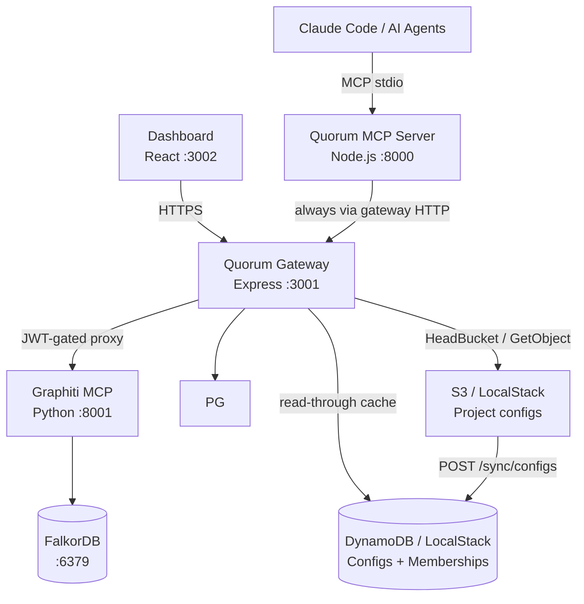

# Quorum
## Persistent Engineering and Business Memory for Claude Code and AI Agents

Quorum is an open-source **governance layer** for engineering and business knowledge built on Graphiti's
temporal knowledge graph. It gives Claude Code and multi-agent systems a shared,
self-evolving, human-governed memory of engineering decisions, business requirements, patterns, and institutional
knowledge — with conflict detection, authority weighting, and a full audit trail.

---

## Design Philosophy

1. **Governance is Architecture** — conflict detection, authority weighting, and audit are first-class primitives, not afterthoughts
2. **Constitution over Rules** — Quorum bakes values into how knowledge is reasoned about; it does not maintain a blocklist
3. **Provenance Always** — every node carries author, timestamp, confidence, source, and conflict history
4. **Human at the Fork** — agents operate autonomously on established knowledge; humans decide at genuine ambiguity
5. **Silent Automatic ≠ Safe** — a junior engineer's addition must not silently overwrite a senior architect's ADR

---

## Architecture



**Key flows:**
- Engineers connect the MCP server via `claude mcp add quorum`; it always talks to the gateway over HTTP (default: `http://localhost:3001`)
- The dashboard connects through the gateway (GitHub OAuth → ES256 JWT → BFF API)
- The MCP server routes all Graphiti calls through `/graphiti/*`; the gateway injects `group_id` from the JWT claim
- Identity chain: JWT (gateway) → `QUORUM_AUTHOR` env → git email → anonymous; dashboard uses GitHub OAuth

> Full detail: [ARCHITECTURE.md](docs/ARCHITECTURE.md)

---

## Current State (v0.4)

**Built and working:**
- MCP server (`@as-quorum/mcp`) with 12 tools — maintained in its own repo (`quorum-mcp`), installed via `npm install -g @as-quorum/mcp`
- Quorum Gateway: ES256 slim JWT `{ sub, is_admin }`, GitHub OAuth, S3-backed project config, Redis config+profile+admin cache (pub/sub invalidation), rate limiting, JWKS endpoint
- `X-Quorum-Project` header: per-request project context — identity (who you are) decoupled from project scope (what you access)
- `GET /user/profile/:username`: profile endpoint (Redis → DDB) with role, projects, base_confidence
- Governance ownership: `POST /config/transfer-ownership`, `POST /config/update-role`, `GET /admin/config`, `POST /admin/users`
- Dashboard: Stats, Graph, Pending Decisions, Knowledge Browser, Knowledge Write (PE: create / promote / supersede), Audit Timeline, Config Editor, System Status, Ownership Panel, Role Editor, Admin Panel, Deviations (v0.4), Portfolio (v0.4)
- Project selector: search + pagination (10/page), full light/dark theme, cancel-back-to-project support
- `GET /schema/config`: public JSON Schema endpoint for editor validation and IDE autocomplete
- DynamoDB layer: `quorum-user-projects` table (membership index with GSI) — config cache retired to Redis
- `POST /sync/configs`: EventBridge-compatible S3→DDB full sync (dual auth: sync token or `principal_architect` JWT)
- Dual-store audit pipeline (PostgreSQL + Graphiti) with SHA256 tamper-evident chain
- Governance: conflict detection (semantic + LLM), authority weighting, confidence decay, human-in-the-loop
- Versioning: append-only, bidirectional audit↔version references, `triggered_by` on every write
- Multi-project isolation via `group_id` scoping in every graph operation; `summary` column is the durable content store (survives FalkorDB volume wipes)
- Config: `group_id` required (canonical ID); `owner` required (project owner GitHub username); `project` optional (display name only)
- Config file naming: `<group_id>.quorum.json`; S3 key: `<group_id>.quorum.json` (flat bucket, no subdirectories)
- Local dev: Docker Compose + LocalStack (S3 + DynamoDB) + Redis (:6380 on host); `setup.sh docker clean --volumes` reliably wipes all data
- OpenAPI 3.1 spec for the gateway: `gateway/openapi.yaml`
- Ops audit CLI: `scripts/audit-cli.js` — verify/lineage/export/stats via gateway HTTP (no direct pg)
- `GET /pg/audit/lineage/:topic/:key` — audit lineage endpoint for compliance queries
- `POST /api/bump/:topic/:key` — confidence endorsement with 7-day cooldown, role-weighted delta, capped at `starting_confidence`
- PostgreSQL ILIKE fallback in `GET /api/search` when Graphiti/FalkorDB returns empty results
- Agent identity tracking: `knowledge_versions` carries `agent_id`, `session_id`, `author_type` columns — written by `set_agent_context` gate in the MCP; `author_type` always `'agent'` for MCP writes (foundation for future human dashboard writes)
- Dashboard knowledge write: all authenticated users can create entries from the Knowledge browser — `principal_architect` writes land as `ACTIVE`; all other roles land as `DRAFT`. `principal_architect` can also promote DRAFTs, supersede ACTIVE entries, and deprecate ACTIVE entries (single or bulk). All writes go through `validateKnowledgeInput` + audit chain. `author_type: 'human'`, `triggered_by: 'dashboard'`.
- Knowledge deprecation: `POST /api/knowledge/:topic/:key/deprecate` (single) and `POST /api/knowledge/deprecate/bulk` — both PE-only, require reason ≥10 chars (`enforceReasonRequired`), transition ACTIVE→DEPRECATED atomically. Dashboard surfaces: per-row Trash2 icon, bulk checkbox + BulkActionBar, "Deprecate this entry instead" link inside the edit modal. Shared `DeprecateDialog` component used by all three. Route ordering: bulk must be registered before `:topic/:key` to prevent Express param collision.
- Deprecation request workflow: non-PE engineers can call `forget()` on an ACTIVE entry — instead of `forbidden`, the request is queued in `pending_decisions` with `decision_type='deprecation_request'`. `pending()` MCP tool returns a `deprecation_requests` section alongside `decisions`. `review()` accepts `request_id` to approve (runs full ACTIVE→DEPRECATED transition atomically) or reject. Dashboard Pending page shows a "Deprecation requests" table section with PE-only Approve/Reject buttons and stale_warning badges. Deduplication: one pending request per author per key. Staleness detection: if active version advances after the request was created, the row is marked stale automatically.

**v0.4 Wave A (complete):** Constitutional + DB Foundation
- Three new constitutional functions: `enforceGlobalWriteAuthority(identity, projectId, isGlobalProject)`, `enforceDeviationActionAuthority(actorRole, operation)`, `enforceValidDeferDeadline(deferUntil)` — both repos synced
- `ConstitutionalViolation` rule union extended: `GLOBAL_WRITE_AUTHORITY | DEVIATION_ACTION_AUTHORITY | DEFER_DEADLINE`
- `deviations`, `deviation_actions`, `project_scans` tables in PostgreSQL; `is_global BOOLEAN` on `q_projects`; full RLS + grants; `ALTER TABLE ADD COLUMN IF NOT EXISTS` for idempotency; synced to `helm/quorum/files/init-db.sql`
- `DeviationStatus`, `DeviationActionType`, `VALID_DEFER_DAYS` in `graph/schema.js` — both repos synced
- `QuorumConfigSchema` extended: `HierarchySchema`, `is_global`, `global_scope` (regex-validated), `is_public`, `globals` — both repos synced
- `remember.js` global write guard lifted from soft-return to `enforceGlobalWriteAuthority`; `isGlobal` now config-driven (`getConfig()?.is_global === true`) not hardcoded project id
- Executive roles added to `authority.js`: `director (0.75/tier3)`, `vp_engineering (0.75/tier3)`, `group_executive (0.70/tier3)` — both repos synced; blocked from deviation governance by `enforceDeviationActionAuthority`

**v0.4 Wave B (complete):** Federation — Cross-project reads
- `normalizeGroupId()` exported from `graph/client.js` (both repos); `searchNodes`/`searchFacts` accept `groupIds: string[]` array alongside legacy `groupId: string`
- `detectConflict()` (both repos): added `projectId` + `globals` params; scopes search to `[projectId, ...globals]` — prevents project-local writes from silently contradicting global catalog entries
- `remember.js` (quorum-mcp): passes `getConfig()?.globals ?? []` to `detectConflict`
- `search.js` (quorum-mcp): config-driven globals via `getConfig()`; per-catalog `searchNodes` calls preserve `catalog_id` attribution; results annotated `source: 'project'|'global'`, `catalog_id: string|null`
- `recall.js` (quorum-mcp): config-driven globals fallback loop; XML result annotated `source` + `catalog_id` attributes; includes inline `<!-- ℹ️ Sourced from global catalog '...' -->` comment
- `graphiti.js` (gateway proxy): fixed `group_ids` injection from `body.params` level (ineffective) to `body.params.arguments` level (MCP protocol-authoritative); read ops (`search_nodes`, `search_memory_facts`) inject `[project, ...sanitizedGlobals]`; write ops restricted to `[project]`; loads globals from `loadProjectConfig` at proxy time with graceful fallback
- `GET /api/globals` (gateway): discovers `is_global = TRUE` projects from PostgreSQL; enriches with S3/Redis config metadata (`global_scope`, `display_name`, `entry_count`, `globals[]`); filters by `global_scope` — org-scoped visible to all, division/department-scoped filtered by hierarchy ancestry
- `POST /sync/configs` (gateway): self-reference check (`globals` cannot include own `group_id`); cross-catalog `is_global` validation after full batch sync; `globals_warnings[]` in response for non-global catalog references

**v0.4 Wave C+D (complete):** Deviation Write Path + PE Governance
- `POST /api/deviations` (gateway): validates catalog link (`globals` in project config), resolves catalog entry via `getKeyId`/`getCurrentVersion`, derives `severity = confidence × DEFAULT_ROLE_SCORES[author_role]` with `PA_AUTHORED_FLOOR = 0.70` for low-confidence PA entries, upserts on `(q_project_id, catalog_id, topic, key)` — idempotent (`last_seen_at` updated on re-scan, not new row)
- `POST /api/deviations/batch` (gateway): up to 100 records; `Promise.allSettled` for partial success; returns `{ recorded, failed, results }`
- `GET /api/deviations` (gateway): returns deviations with computed status (OPEN/ACCEPTED/DENIED/DEFERRED/OVERDUE/RESOLVED via LATERAL join on `deviation_actions`) — filters: `status`, `catalog_id`, `topic`, `severity_min`, `source`, `limit`, `offset`
- `POST /api/deviations/:id/action` (gateway): `enforceDeviationActionAuthority` + `enforceReasonRequired` + `enforceValidDeferDeadline` (defer only); denial hint returned when global entry `confidence > 0.85` + `author_role = 'principal_architect'` (non-blocking note)
- `DEFAULT_ROLE_SCORES` in `gateway/src/shared/governance/authority.js` is now `export const` (required for severity derivation import)
- `tests/gateway/dashboard-deviations.test.js`: 27 tests covering validation, catalog link checking, severity formula (4 cases: standard, PA floor, missing confidence, unknown role), upsert idempotency, batch partial success, GET filters, action constitutional enforcement, denial hint
- `deviate()` MCP tool (`quorum-mcp/src/tools/deviate.js`): thin proxy to `POST /api/deviations` via `pg.recordDeviation()` — no business logic in MCP layer
- `pending()` MCP tool updated: response now includes `deviations: { open, overdue_deferrals }` + `summary.open_deviations` + `summary.overdue_deferrals`; graceful fallback if gateway lacks `getDeviations` method
- Dashboard `src/api/deviations.js`: `useDeviations(filters)` + `useDeviationAction()` TanStack Query hooks
- Dashboard `src/pages/Deviations.jsx`: deviation table with filter rail (status/topic/source/severity_min), inline action panel per OPEN/OVERDUE row (accept/deny/defer with 30/45/60/90d), reason textarea with <10 char red-border validation, denial hint surfaced inline
- Dashboard `src/pages/Pending.jsx`: added overdue deferrals section — uses `useDeviations({ status: 'OVERDUE' })`, shows catalog/topic/key/description/severity/last_seen with link to Deviations page
- Dashboard nav wired: `/deviations` route (MemberRoute), AlertTriangle icon in Sidebar, "Deviations" in Layout PAGE_TITLES

**v0.4 Wave E+F (complete):** Conformance Scoring + Portfolio Intelligence
- `GET /api/conformance` (gateway): resolves project → globals → calls `getConformanceScore`; batch query for per-catalog entry counts; returns `{ score, status, breakdown, scan_count, last_scan_at, catalogs: [{ catalog_id, entry_count }] }`; returns UNCERTIFIED when no globals / sparse catalog (<10 ACTIVE entries) / no scans run yet
- `GET /api/portfolio` (gateway): `PORTFOLIO_ROLES = Set(['principal_architect', 'director', 'vp_engineering', 'group_executive'])` OR `is_admin` gate; queries all `q_projects`; loads configs in parallel with graceful fallback; applies `node_id` filter (config.hierarchy.parent match); calls `getPortfolioScores`; weighted rollup `Σ(score × criticality) / Σ(criticality)` over CERTIFIED only; UNCERTIFIED counted separately; returns `{ projects, rollup: { score, status, certified_count, uncertified_count } | null }`
- `getConformanceScore(pg, qProjectId, globals)` (gateway + quorum-mcp vendored): SQL scoring via `LATERAL` join on `deviation_actions`; `STATUS_WEIGHT = { OPEN:1.0, OVERDUE:1.0, ACCEPTED:1.0, DEFERRED:0.6, DENIED:0.3, RESOLVED:0.0 }`; UNCERTIFIED when < 10 ACTIVE catalog entries or scan_count=0 or no globals; returns `{ score, status, applicable_entries, scan_count, last_scan_at, breakdown }`
- `getPortfolioScores(pg, projectInfos)` (gateway + quorum-mcp vendored): `Promise.allSettled` so per-project failures degrade to UNCERTIFIED without aborting portfolio; checks for `pg.getPortfolioScores()` override first (enables test injection)
- `GET /api/knowledge` denial_hint_count (gateway): batch query when `projectConfig.is_global === true`; groups by `(topic, key)` denial count from `deviation_actions JOIN deviations`; joined in-memory via `Map`; returned as `denial_hint_count` per row (0 if not denied)
- `conformance()` MCP tool (`quorum-mcp/src/tools/conformance.js`): thin proxy to `GET /api/conformance`; UNCERTIFIED returns contextual message (no scan / no catalogs / sparse coverage); `include_details: true` fetches top 10 OPEN deviations sorted by severity desc
- `GatewayClient.getConformance()` + `getPortfolio(opts)` (quorum-mcp): `_get` wrapper methods added between deviation methods and config section
- Dashboard `src/api/conformance.js`: `useConformance()` (staleTime: 60_000) + `usePortfolio(opts)` (staleTime: 120_000, retry: false — 403 is not transient)
- Dashboard `src/pages/Stats.jsx`: `ConformanceCard` component — score badge (green ≥80, amber 50–80, red <50, grey=UNCERTIFIED), breakdown bar (6 segments), per-catalog list, scan metadata with staleness warning >14 days; `BreakdownBar` helper
- Dashboard `src/pages/Knowledge.jsx`: `denial_hint_count` badge on key column — red pill showing `✕N` with tooltip "N projects have denied this standard"; only shown when count > 0
- `quorum-mcp/skill/references/scan.md`: full `quorum:scan` skill orchestration doc — check conformance → git diff → code-review → security-review → deviate()/remember() → resolve fixed → updated conformance → summary; scheduled scanning via `quorum:schedule`
- Tests: `tests/gateway/dashboard-conformance.test.js` (14 tests — conformance UNCERTIFIED/CERTIFIED/catalogs/404; portfolio 403/admin-bypass/roles/rollup/null-rollup/node_id-filter/UNCERTIFIED-rollup); `quorum-mcp/tests/tools/conformance.test.js` (15 tests — validation, UNCERTIFIED variants, CERTIFIED pass-through, include_details sort+cap, audit pipeline); gateway total: 680 passed; quorum-mcp total: 620 passed

**v0.4 Wave G (complete):** Documentation
- `gateway/openapi.yaml`: bumped to 0.4.0; added schemas (Deviation, ConformanceScore, PortfolioProject, PortfolioRollup); added paths for /api/globals, /api/deviations, /api/deviations/batch, /api/deviations/{id}/action, /api/conformance, /api/portfolio with tags (Federation, Deviations, Conformance, Portfolio)
- `docs/ARCHITECTURE.md`: v0.4 section — global catalogs and federation, organisational hierarchy, deviation data model (LATERAL join pattern for computed status), conformance scoring formula with status weights, self-evolution loop
- `docs/ROADMAP.md`: complete v0.4 wave-by-wave record (Waves A–G) all marked ✅ with success criteria (675 gateway + 620 quorum-mcp tests)
- `docs/FRONTEND.md`: Deviations page (action panel, denial hint, UNCERTIFIED banner), ConformanceCard in Stats (score badge, breakdown bar, scan metadata), overdue deferrals in Pending, denial_hint_count badge in Knowledge, v0.4 BFF routes, updated project structure
- `docs/ONBOARDING.md`: v0.4 config fields table (hierarchy, is_global, global_scope, is_public, globals), Step 5 — global catalog linking with hierarchy config, quorum:scan conformance guidance
- `quorum-mcp/skill/SKILL.md`: Conformance Scanning section (deviate(), conformance(), quorum:scan orchestration, pending() deviation handling), updated quick reference, references/scan.md added
- `quorum-mcp/README.md`: tool count 12→14, test count 559→620, 14-tool table, v0.4 governance rules

**E2E suite infrastructure (complete):** Full test scaffolding ready.
- Helpers: `api.js`, `jwt.js` (`tokens.pe` = test-pe = principal_architect; all tokens include `issuer: 'quorum-gateway'`; `tokens.admin` includes `is_admin: true`), `seed.js`, `graphiti.js`, `data.js`, `setup.js` (globalSetup: T0 probes + fixture upload), `teardown.js` (no-op; uid() isolation)
- Fixtures: `quorum-test-catalog.quorum.json` (is_global:true, members: test-pe + test-architect + test-product + test-compliance), `quorum-test-project.quorum.json` (globals: [quorum-test-catalog], all 8 test users)
- First spec: `01-global-catalog-onboarding.spec.js` (S-01, 13 tests); fresh timestamp-suffixed config IDs guarantee 201 on upload
- `docker-compose.test.yml` overrides gateway with base64-encoded test key pair (so test JWTs are accepted), redirects Graphiti to `mock-openai` service
- `mock-openai/` (server.js + Dockerfile + package.json): zero-dependency Node.js HTTP mock; `POST /v1/embeddings` returns deterministic 1536-dim unit-normalised vectors; `POST /v1/chat/completions` returns stable JSON content; used by Graphiti in test env to avoid real OpenAI calls
- `playwright.config.js` has `globalSetup` + `globalTeardown` registered
- Root `package.json` scripts: `test:e2e`, `test:e2e:headed`, `test:e2e:ui`, `test:e2e:report`, `test:e2e:env:up`, `test:e2e:env:down`, `test:e2e:env:clean`, `test:e2e:full`
- Root `devDependencies` added: `@playwright/test ^1.50.0`, `axios ^1.7.9`, `jsonwebtoken ^9.0.2`
- Search route G-8 fix: `GET /api/search` loads project `globals`, passes `groupIds: [project, ...globals]` to Graphiti, joins `q_projects` in postgres fallback, annotates each result with `source: 'project'|'global'` and `catalog_id`. 675 gateway tests still pass.
- **Fixture note:** `quorum-test-catalog` members: test-pe (PA), test-architect, test-product, test-compliance. test-engineer, test-senior, test-director, test-vp are NOT catalog members → role:null when scoped to catalog → GLOBAL_WRITE_AUTHORITY fires. J01 uses fresh configs — not affected.
- **S-02 E2E (complete):** 54 API tests passing (5 browser-only UI tests skipped — require Playwright chromium). Fixes applied: missing SUPERSEDED transition in conflict-approve path (`dashboard.js`), `Errors.unprocessable` is HTTP 400 not 422, supersede response shape is `{ new_version: <row object>, superseded_version: <number> }`, audit lineage assertion uses `GET /pg/audit?tool=review` (dashboard writes do not populate `version_audit_links`).
- **S-03 E2E (complete):** 23 tests across 5 sub-scenarios (S-03.1–S-03.5) — single deprecation, validation guards, bulk deprecation, deprecation request approve, deprecation request reject. DB fixes: `pending_decisions.decision_type` CHECK constraint extended to include `'deprecation_request'`; `pending_decisions.resolution` CHECK constraint extended to include `'approved'` and `'rejected'`. Seed helper `deprecationRequest()` added to `tests/e2e/helpers/seed.js`.
- **S-04 E2E (complete):** 19 API tests across 6 sub-scenarios (S-04.1–S-04.6) + 7 browser tests across S-04.7–S-04.8. API: deviation recording (idempotent upsert, severity derivation), validation guards (not_linked/not_found/missing fields), PE accept (authority guard + ACCEPTED status), PE deny (reason guard + denial hint for PA-authored high-confidence entries), PE defer (DEFER_DEADLINE constitutional validation + DEFERRED status), batch recording (full success + partial success). Browser: S-04.7 deviations dashboard (filter rail, table display, action panel, reason validation, accept removes row from OPEN filter); S-04.8 knowledge denial badge (✕N badge + "N project has denied this standard" tooltip on global catalog entries). Zero code/DB fixes required — first run clean.
- **S-05 E2E (complete):** 6 sub-scenarios across `05-rbac-boundary.spec.js` — full 8-role RBAC matrix. S-05.1: all 8 roles POST /api/knowledge → DRAFT (non-PA) or ACTIVE (PA); confidence floor applied (submit 0.10 → stored = base_confidence); unknown project → 403 (access_denied fail-safe). S-05.2: all non-PA → 403 on promote/supersede; PA → 200. S-05.3: all non-PA → 403 on single/bulk deprecate; PA → 200 DEPRECATED. S-05.4: all non-PA → 403 on review; PA → 200 approve; engineer/senior/director/vp (non-members of catalog) → 403 (access_denied, before constitutional check); architect/product/compliance (catalog members) → 201 DRAFT; PA → 201 DRAFT (S-11.1 self-approval prevention — global catalog writes always land as DRAFT). S-05.5: engineer/senior/director/vp → 400 DEVIATION_ACTION_AUTHORITY; architect/product/compliance/PA → 200 action; all non-PA → 403 deprecate; PA → 200 DEPRECATED. S-05.6: engineer/senior/architect/product/compliance → 403 portfolio; PA/director/vp → 200; all 8 roles → 403 admin; is_admin JWT → 200; missing X-Quorum-Project → 400. Code fixes: (1) `server.js` global error handler now handles `ConstitutionalViolation` → 400 + `{ rule, message }` (was returning 500); (2) `POST /api/knowledge` in `dashboard.js` now calls `enforceGlobalWriteAuthority` after resolving project config; (3) `quorum-test-catalog` fixture expanded: test-product (product_owner) + test-compliance (compliance_officer) added as catalog members. Gateway unit test mock updated: `enforceGlobalWriteAuthority: vi.fn()` added to constitutional.js mock in `dashboard-write.test.js`.
- **S-05.7, S-05.8, S-05.9 E2E (complete — negative/alternate scenarios, J05 extension):** Three new sub-scenarios extending J05 with multi-user team boundaries. New fixture `tests/e2e/fixtures/quorum-test-peer-project.quorum.json` — roles deliberately inverted from test-project: test-architect=PA, test-pe=engineer. `tests/e2e/helpers/setup.js` updated to upload peer fixture with architect token (T0). S-05.7: same JWT + different X-Quorum-Project header = different role; test-pe writes ACTIVE in test-project (PA) vs DRAFT in peer-project (engineer); test-pe promote denied in peer-project (403); test-architect promote denied in test-project (architect, 403) but succeeds in peer-project (PA, 200). S-05.8: PA and engineer fire promote concurrently via `Promise.all`; engineer always 403, PA always 200, exactly 1 ACTIVE version after race. S-05.9: PA promotes test-engineer from engineer → director via `POST /config/update-role`; test-engineer immediately (no sleep) accesses portfolio → 200; PA resets to engineer; test-engineer denied again → 403. afterAll insurance reset prevents contaminating other runs. TEST-PLAN.md updated: S-05.1 FailureCost 810→950 (correlates S-05.7+S-05.8 added), 3 new scoring rows, suite OwnScore 3187→3402. Bug fix: `POST /config/update-role` in `gateway/src/routes/config.js` line 400 stomped per-member `base_confidence` with `config.roles?.[role]?.base_confidence ?? 0.5` — projects without a `roles` map always wrote `0.5`. Fix: use `memberRecord.base_confidence` as fallback before `0.5`. S-05.9 test also fixed: `update-role` body must use `github_username`/`role`/`reason` fields (not `{ roles: {...} }`). Full suite: **465 passed, 1 skipped, 0 failed**.
- **S-05.10 E2E + GAP-002 security fix (complete — is_public non-member enforcement):** GAP-002 (P0) closed. Security fix: `resolveQProjectId()` in `gateway/src/routes/dashboard.js` now checks `req.user.access_denied` and returns 403 before any DB lookup. Also added inline `access_denied` guard to `POST /api/deviations`, `POST /api/deviations/batch`, and `GET /api/deviations` (3 routes that bypass `resolveQProjectId` with direct `getProjectByGroupId` calls). Non-existent projects now return 403 (not 404) — verify-jwt sets `access_denied=true` as fail-safe when config cannot be loaded, preventing project enumeration. Two existing tests updated: S-05.1 step 2 (unknown project 404→403) and S-07.1 step 3 (non-existent project 404→403). S-05.4 step 3 updated: non-members blocked at access_denied gate (403) before reaching `enforceGlobalWriteAuthority`; constitutional rule is still exercised at unit test level (shared-governance.test.js). S-05.10 (6 new tests): non-member of private catalog denied on 5 `/api/*` routes (GET knowledge/drafts/stats/deviations/conformance → 403) + positive guard (catalog member test-architect → 200). Gateway unit tests: **684 passed** (unchanged). Full E2E suite: **492 passed, 1 skipped, 0 failed**.
- **S-11.4 E2E + GAP-003 (complete — coexist_merge two-PA flow):** GAP-003 (P0) closed. `coexist_merge` action added to `POST /api/review/:conflictId` in `gateway/src/routes/dashboard.js`: (1) `merged_content` required validation (400 `merged_content_required`), (2) self-approval check fires — reviewer must not be the DRAFT/PENDING_CONFLICT_CHECK author (400 `NO_SELF_APPROVAL`), (3) transaction: new ACTIVE entry authored by reviewer, both DRAFT and ACTIVE versions SUPERSEDED via `transitionVersionStatus`, pending_decision resolved with `resolution: 'coexist_merge'`, audit entry written. Three correctness fixes required: (a) `getLatestDraftVersion` query extended to include `PENDING_CONFLICT_CHECK` status (self-approval was bypassed for PA writes that land as PENDING_CONFLICT_CHECK, not DRAFT); (b) `LEGAL_TRANSITIONS` extended with `DRAFT→SUPERSEDED` and `PENDING_CONFLICT_CHECK→SUPERSEDED` (coexist_merge supersedes both sides); (c) `POST /config/upload` converted from create-only to upsert — on 409 (project exists in S3), overwrites S3 + re-syncs DDB + invalidates Redis, returns 200 (updated) instead of 201 (created). `setup.js` updated to accept 200 as valid upload response. Second fixture member `test-pe2` (principal_architect) added to `quorum-test-project.quorum.json` for two-PA scenarios; `pe2Token()` factory and `tokens.pe2` added to `jwt.js`. New unit test for upsert path (200). S-11.4 spec: 6 steps — `merged_content_required` validation, `NO_SELF_APPROVAL` for draft author, 200 merge by non-draft PA, ACTIVE entry authored by reviewer, SUPERSEDED history, pending resolved. Gateway unit tests: **685 passed** (+1). Full E2E suite: **498 passed, 1 skipped, 0 failed**.
- **S-10.9, S-10.10 E2E + GAP-001 UT (complete — J10 negative/alternate):** S-10.9 — Cross-Project Audit Isolation (NEGATIVE): a valid entry_id from project A returns 404 when fetched under project B's context (test-pe is PA in both projects; auth passes, ownership check fails). S-10.10 — Append-Only Enforcement (NEGATIVE): DELETE and PATCH on `/pg/audit/:id` both return 404 (no route registered). GAP-001 closed: added 3 adversarial unit tests to `tests/gateway/audit-chain.test.js`: (1) "throws when a hashed field is silently mutated (stale entry_hash)" — the critical DB-level tampering case where `author` is changed without updating `entry_hash`; (2) same for `tool` field; (3) `ChainIntegrityViolation` carries `position`, `expected` (recomputed hash), and `actual` (stale stored hash). Gateway unit tests: **684 passed**. Full E2E suite: **486 passed, 1 skipped, 0 failed**.
- **S-02.9, S-02.10, S-02.11 E2E (complete — negative/alternate scenarios, J02 extension):** Three new sub-scenarios appended to `02-knowledge-governance.spec.js`. S-02.9 — Authority Fence (NEGATIVE): engineer/senior/architect all get 403 on `/api/review`; only PA can reject a conflict (role enforcement for conflict resolution). S-02.10 — Concurrent Competing DRAFTs (RACE): two engineers write different DRAFTs for the same key via `Promise.all` in `beforeAll`; both succeed as DRAFT (race-safe); both appear in `/api/drafts`; history has ACTIVE + ≥2 DRAFTs with distinct version numbers (no collision); PA promotes one, the other DRAFT persists (promote is not bulk). Race assertion pattern: assert count invariant ("≥1 DRAFT remains") not identity ("senior's DRAFT"), since which DRAFT has the higher version is non-deterministic under concurrency. S-02.11 — Supersede-Under-Review (ALTERNATE): PA supersedes v1 with v3 while engineer's conflict is pending; conflict persists in `/pg/pending` after supersede (supersede does not auto-clear it); PA rejects stale conflict → 200; v3 ACTIVE unchanged after rejection. Gateway code fix: `POST /api/knowledge` DRAFT write path was not in a transaction — two concurrent writers both read `MAX(version)=N`, computed `nextVer=N+1`, and collided on `version_id` (PRIMARY KEY violation → 500). Fix: wrap `getNextVersionNumber` + `insertVersion` in a transaction with `SELECT ... FOR UPDATE` on the `q_keys` row, serializing writers for the same key at the row level. Test fix: supersede call in S-02.11 was missing `entity_type` (always required by `validateKnowledgeInput`). Unit test mock updated: `insertVersion` assertion in `dashboard-write.test.js` changed from `fakePool` to `fakeClient` (now called with transaction client). Full suite: **481 passed, 1 skipped, 0 failed**.
- **S-07 E2E (complete):** 15 API tests across 4 sub-scenarios (S-07.1–S-07.4) + 7 browser tests across S-07.5–S-07.8. API: UNCERTIFIED gates (structural: `quorum-test-isolated-project` fixture with no `globals` — permanently UNCERTIFIED regardless of database state), CERTIFIED baseline (10-entry seed + `POST /pg/scans` records scan, asserts score/catalogs/scan metadata/breakdown), score formula (OPEN→DENIED weight shift), portfolio role gate (engineer/architect 403; PA/director 200; response shape + rollup). Fixes: `POST /pg/scans` endpoint added to `routes/pg.js` (was missing — project_scans table had no HTTP insertion path); `test.describe.configure({ mode: 'serial' })` at file level fixes parallel-worker race between S-07.2/S-07.3 `beforeAll`; isolated fixture avoids count-threshold fragility for UNCERTIFIED assertions. Browser: S-07.5 stats page 4 stat cards + tab switcher; S-07.6 ConformanceCard label + catalog name; S-07.7 UNCERTIFIED isolated project; S-07.8 score badge UNCERTIFIED text + breakdown bar absent.
- **S-08 E2E (complete):** 11 tests across 5 sub-scenarios (S-08.1–S-08.5) — happy path (PA bump returns 200 + all 11 response fields), role-weighted delta (engineer 0.025 < architect 0.0425 < PA 0.05 via BASE_DELTA × ROLE_WEIGHT formula), confidence cap invariant (confidence_after ≤ starting_confidence always; Math.min cap verified), cooldown enforcement (same user 429 on re-bump within 7 days; next_bump_allowed field; different user unaffected — cooldown is per-author), validation guards (404 on non-existent key; 404 when only DRAFT exists — getVersionForBump queries ACTIVE only). Zero code/DB fixes — first run clean. E2E traceability annotations added to `dashboard.js` bump route (cap formula + cooldown gate). Full E2E suite: **149 passed, 5 skipped (browser), 0 failed**.
- **S-10 E2E (complete):** 11 tests across 8 sub-scenarios (S-10.1–S-10.8) — write creates audit entries (dashboard-create tool, /pg/audit/count > 0), entry shape (all chain + metadata fields present; field types correct — chain_position is BIGINT serialised as string by pg driver), hash field structural integrity (entry_hash = 64-char lowercase hex; chain_position = non-negative integer via Number() coercion; previous_hash = 64-char hex or null), author filter (exact match — ?author=test-pe), tool filter (exact match — ?tool=dashboard-create), limit parameter (≤ 2 entries), fetch by ID (valid UUID → 200+entry; nonexistent UUID → 200+null, not 404 — cross-project enumeration prevention), lineage returns empty for dashboard-created entries (version_audit_links only populated by MCP writes). One code fix: chain_position is BIGINT→string from pg driver, not number. E2E traceability annotations added to `pg.js` audit routes (GET /pg/audit, /count, /lineage/:topic/:key, /:id). Full E2E suite: **160 passed, 5 skipped (browser), 0 failed**.
- **S-13 E2E (complete):** 16 tests across 5 sub-scenarios (S-13.1–S-13.5) — sync auth (engineer/architect 403, PA 200), sync response shape (synced≥3, typed failed[]/globals_warnings[]/duration_ms), self-reference guard (207 on upload, appears in failed[] on re-sync), global catalog discovery (GET /api/globals shape + non-global projects absent + global_scope defaults + role access), config schema validation (invalid global_scope→400 Zod error; valid is_global/hierarchy→201; globals:[catalog] reference accepted). Fix: 201 upload response uses `project_id` not `group_id`. Full E2E suite: **122 passed, 5 skipped (browser), 0 failed**.
- **S-20 E2E (complete):** 16 tests across 7 sub-scenarios (S-20.1–S-20.7) — query validation (missing/empty/single-char → 400), result field shape (all 11 fields + top-level source indicator), cross-catalog scope (project with globals finds global entries, annotated source:'global'+catalog_id), scope isolation (isolated project with no globals cannot find global catalog entries), DRAFT exclusion (status filter excludes DRAFT from search results, confirmed via /api/drafts), domain filter (?domain=topic narrows results to exact topic match), mixed sources (result set contains both source:'project' and source:'global' entries in one response). Zero code/DB fixes required — first run clean. E2E traceability annotations added to `dashboard.js` search route (allGroupIds scope line + status filter). Full E2E suite: **138 passed, 5 skipped (browser), 0 failed**.
- **Browser UI test infrastructure (complete):** Full browser automation wired for dashboard tests. `tests/e2e/helpers/browser.js` — `injectSession(page, opts)` bypasses GitHub OAuth by writing the three `sessionStorage` keys (`quorum_session`, `quorum_active_project`, `quorum_projects`) that `AuthContext.jsx` reads during `useState()` init; uses `page.addInitScript()` to fire before React boots; mints a 1-hour ES256 JWT signed with the committed test private key so expiry checks pass. `Dockerfile.e2e` — installs system Chromium via `apk add chromium nss freetype harfbuzz ca-certificates ttf-freefont font-liberation`; sets `PLAYWRIGHT_CHROMIUM_EXECUTABLE_PATH=/usr/bin/chromium-browser` so Playwright uses the system binary (no bundled download). `docker-compose.e2e.yml` — adds `dashboard` service (nginx:alpine, built from `./dashboard/Dockerfile`); adds `QUORUM_DASHBOARD_URL=http://dashboard` to test-runner env; adds `dashboard: condition: service_healthy` to test-runner `depends_on`. `playwright.config.js` — adds `launchOptions: { args: ['--no-sandbox', '--disable-dev-shm-usage', '--disable-gpu'] }` (required in Docker containers where kernel namespacing and /dev/shm are restricted). **S-02.8 E2E (complete — runs in Docker mode):** 5 browser tests implemented: step 1 (pending page shows conflict card with topic:key + diff panels), step 2 (submit blocked when note < 10 chars), step 3 (request_changes keeps conflict in pending), step 4 (approve removes card + verifies ACTIVE via API), step 5 (audit timeline shows 'review' tool entries).
- **Browser tests run without Docker (complete):** `playwright.config.js` — `process.env.QUORUM_DASHBOARD_URL ??= 'http://localhost:3002'` defaults the env var so `test.skip(!process.env.QUORUM_DASHBOARD_URL)` guards never trigger in any environment. Conditional `webServer` config auto-starts the Vite dev server (`npm --prefix dashboard run dev -- --port 3002 --strictPort`) when `QUORUM_DASHBOARD_URL` is a localhost URL; passes `VITE_GATEWAY_URL=http://localhost:3001` so the Vite proxy forwards API calls to the test gateway. `reuseExistingServer: true` skips re-start when Vite is already hot. `dashboard/vite.config.js` — proxy target now reads `process.env.VITE_GATEWAY_URL ?? 'http://localhost:8002'` (default unchanged for manual dev); `preview` section added with same proxy rules. Docker mode (`QUORUM_DASHBOARD_URL=http://dashboard`) skips `webServer` entirely — the nginx container is already running. Local dev workflow: `npm run test:e2e:env:setup` (starts test-keyed gateway + infra) + `npm run test:e2e` (Playwright auto-starts Vite, runs all tests including browser).

**E2E fully-isolated Docker environment (complete):** Zero host-port-binding test infrastructure.
- `docker-compose.e2e.yml` — standalone (not extending base compose) with `name: quorum-e2e`; all 7 services (localstack, falkordb, postgresql, redis, mock-openai, graphiti, gateway) + test-runner on internal `e2e` bridge network; no host port bindings; no conflict with dev stack
- `Dockerfile.e2e` — `node:24-alpine` test runner; `PLAYWRIGHT_SKIP_BROWSER_DOWNLOAD=1` (API-only tests); source code bind-mounted at `/workspace` (NOT baked in); anonymous volume at `/workspace/node_modules` provides Alpine-compiled binaries even when host has macOS ones
- `scripts/init-localstack-e2e.sh` — mounted into LocalStack's `/etc/localstack/init/ready.d/`; runs `awslocal` inside LocalStack container to create `quorum-configs-test` bucket, `quorum-user-projects-test` DDB table, and seed admin config; runs before healthcheck passes so gateway is guaranteed to see resources on startup
- `scripts/e2e-docker.sh` — orchestration helper: `up` (build + start + `--wait` for gateway health), `run` (test-runner via `docker compose run --rm`), `down`, `clean` (removes volumes for fresh state), `full` (up → run → down, returns Playwright exit code)
- New npm scripts: `test:e2e:docker` (full run), `test:e2e:docker:up`, `test:e2e:docker:run`, `test:e2e:docker:down`, `test:e2e:docker:clean`, `test:e2e:docker:logs`
- **Usage**: `npm run test:e2e:docker` for fully isolated run; `npm run test:e2e:docker:up` + `npm run test:e2e:docker:run` for iterative dev
- **Dev vs isolated**: `test:e2e:env:*` scripts still work (overlay approach, reuses host LocalStack); `test:e2e:docker:*` is fully self-contained
- **Full suite clean (452 passed, 0 failed, 1 skipped — browser tests fully active):** All browser tests now run in local dev (not just Docker E2E) after `playwright.config.js` webServer fix + `QUORUM_DASHBOARD_URL` default. Fixes applied to reach 452 clean: (1) `dashboard/nginx.conf` — `config/` and `admin/` trailing slash prevents nginx from proxying React routes to gateway; (2) `dashboard/src/components/layout/Layout.jsx` — added `'/admin': 'Admin'` to PAGE_TITLES so S-09 heading test passes; (3) `14-dashboard-visual.spec.js` S-14.1 — added `.first()` to strict select option locator; S-14.5 step 1 added `fill('quorum-test')` before asserting card visibility; step 2 changed `fill('catalog')` to `fill('quorum-test-catalog')` to avoid accumulated j01-catalog-* entries; (4) `gateway/src/routes/config.js` — `POST /config/upload` 409 path now re-registers in `q_projects` when PostgreSQL was wiped (Docker volume reset) but S3 still has the config; prevents T0.2 "project_not_found" after env:clean. Previous 420-passed baseline fixes: React error #310 on Stats page, engineerLimit rate limiter NODE_ENV=test bypass, playwright.config.js PLAYWRIGHT_CHROMIUM_EXECUTABLE_PATH, docker-compose.e2e.yml dashboard healthcheck 127.0.0.1, 05-rbac-boundary corrected confidence/shapes, 07-conformance-portfolio exact:true locator, 04-deviation-governance select element fix.
- **S-16 E2E (complete):** 13 tests across 5 sub-scenarios (S-16.1–S-16.5) — GET /pg/versions/:t/:k/history and /at point-in-time. S-16.1: single-version history (1 entry, correct fields, triggered_by non-null). S-16.2: after supersede — 2 entries newest-first, v2 ACTIVE, v1 SUPERSEDED, supersedes_reason preserved. S-16.3: after deprecation — highest version DEPRECATED. S-16.4: nonexistent key → 200 []. S-16.5: point-in-time — tBefore → null/404, tAfterV1 → v1 content, missing date → 400 { error: 'date query param required' }.
- **S-17 E2E (complete):** 10 tests across 4 sub-scenarios (S-17.1–S-17.4) — conflict edge cases. S-17.1: auto-supersede end-state verified via POST /pg/versions/supersede (auto-supersede itself is MCP-path only — MT-07). S-17.2: PENDING_CONFLICT_CHECK via PATCH; docker-pause test skips without QUORUM_DOCKER_E2E=true. S-17.3: cross-catalog pending_decision seeded manually via POST /pg/pending. S-17.4: POST /governance/enrich returns correct shape (analysis + risks_if_approved + questions_for_reviewer).
- **S-18 E2E (complete):** 20 tests across 4 sub-scenarios (S-18.1–S-18.4) — direct HTTP coverage of routes/governance.js. Key findings: Errors.unprocessable → 400 (not 422); detect-conflict returns { contradicts, reason, possible_split, split_suggestion } (not conflict_detected/conflict_brief); extract mode values are "echoing"|"extracting"|"generalising" (not remember/update/deprecate). mock-openai updated to return 2 populated items for extract (was returning empty []). expiredToken(sub) helper added to tests/e2e/helpers/jwt.js.
- **S-19 E2E (complete):** 22 tests across 5 sub-scenarios (S-19.1–S-19.5) — complete auth surface. JWT boundary enforcement (missing/expired/tampered/HS256 → 401 with precise error codes); JWKS structure (EC/P-256, use:sig, kid, no RSA/HS256); project scope (member→200, non-member private project→403 via is_public enforcement, missing header→400); token refresh sliding window (valid→200 new JWT, expired→401); PAT as pre-minted JWT (valid→200/404, bogus string→401). S-19.1 step 6: non-member of private project now returns 403 (is_public enforcement lifted from "unknown sub → [200, 404]" to 403 on private project). Fix: `buildTamperedToken` in `tests/e2e/helpers/jwt.js` now corrupts position 40 (middle of 86-char P-256 signature) instead of the last char — the last char's low 4 bits are zero-padding and flipping them leaves the signature valid; position 40 has all 6 bits encoding real ECDSA data.
- **S-14 E2E (complete — runs in Docker mode):** 11 tests across 5 sub-scenarios (S-14.1–S-14.5). S-14.1: domain select triggers canvas render, legend labels (Decision/Pattern/CONFLICTS), node-click grid sweep → NodePanel structure if hit (API guard test has no shouldSkip — runs everywhere). S-14.2: config textarea + schema-invalid JSON (missing owner → Zod 400) triggers error div + disabled Save. S-14.3: "Service health" heading + service names + ≥3 Healthy badges + 0 Unavailable. S-14.4: "No audit entries found." absent + test-pe author text present; author filter → entries narrow correctly. S-14.5: two-project session injection → switch button renders in header → /select-project with search + both cards; "catalog" filter → catalog only; "Back to current project" → navigates to /. All two no-op assertions (`expect(panelVisible || true).toBe(true)`) removed. Three structural fixes: (1) graph domain selected via `<select>`, not URL param; (2) AuditEntry has no click handler — replaced with filter test; (3) project selector requires `availableProjects.length > 1` — second `addInitScript` overrides `quorum_projects` with two entries.

**Status authority fix + is_public enforcement (complete):** Gateway is now the single authority on knowledge version status. Non-members of private projects are denied at the middleware level.
- `gateway/src/routes/pg.js` — `POST /pg/versions`: queries `is_global` from `q_projects` table; derives `status` server-side (`PA or is_admin + non-global + non-reflect → ACTIVE`; all others → `DRAFT`; `pending_conflict_check: true` flag → `PENDING_CONFLICT_CHECK`). `status` never accepted from client body.
- `gateway/src/middleware/verify-jwt.js` — `is_public` enforcement: when non-member (non-admin) accesses a project-scoped route, loads project config via Redis/S3 cache; if `is_public !== true` → `req.user.access_denied = true`. Fail-safe: if config unavailable, deny by default.
- `gateway/src/routes/pg.js` middleware — `access_denied` check: returns 403 before qProjectId resolution. All pg/* routes now block non-members of private projects.
- `quorum-mcp/src/tools/remember.js` — `storeFirst()`: return value uses `inserted?.status` (gateway-determined) as authority for `knowledge_status` (was using locally computed status). `storePendingConflictCheck()`: sends `pending_conflict_check: true` flag in body; gateway maps this to `PENDING_CONFLICT_CHECK` status (MCP no longer sends literal status value).
- Unit tests updated: `verify-jwt.test.js` mock adds `loadProjectConfig: vi.fn().mockResolvedValue(null)`; new test for public project (`access_denied: false`). `pg-routes.test.js` + `pg-extended.test.js`: `fakePool.query.mockResolvedValue({ rows: [] })` added as default after `mockReset()`. Gateway: **681 tests passed** (+1 new). quorum-mcp: 620 unchanged.

**S-11.1 Global catalog self-approval prevention (complete):** PA writes to `is_global: true` projects via `POST /api/knowledge` (dashboard route) now always land as `DRAFT`. Condition in `dashboard.js`: `(req.user.role === 'principal_architect' && projectConfig?.is_global !== true) ? 'ACTIVE' : 'DRAFT'` — global catalog entries require a second PA to promote, enforcing multi-party governance for org-wide standards. The `POST /pg/versions` admin path is unaffected and continues to bypass this for test infrastructure seeding (admin JWT or explicit `is_admin`). `GET /api/drafts` SELECT now includes the `version` column (required for promote/supersede to chain correctly). `POST /api/knowledge/:topic/:key/promote` response now includes `status: 'ACTIVE'`. `POST /api/review/:conflictId` `enforceReasonRequired` error now goes through `next(err)` global handler → `{ rule: 'REASON_REQUIRED', message }` (not `{ error: 'note_required', ... }`). Seed helper `activeEntry()` in `tests/e2e/helpers/seed.js` now accepts `globalCatalog: true` — uses admin token + `POST /pg/versions` to write ACTIVE entries to global catalogs directly (bypassing self-approval guard for test data setup). All affected specs updated: S-01 (steps 5/6/12), S-04, S-05.4, S-07, S-15, S-20.

**Cross-spec correctness fixes (full suite clean at 420 passed):** Five targeted fixes required to reach clean suite after the global catalog DRAFT enforcement and prior spec changes:
- **S-01 steps 5/6/12:** Step 5 assertion changed from ACTIVE → DRAFT; step 6 changed from `/api/knowledge` ACTIVE filter → `/api/drafts` check; step 12 cross-catalog search uses `tokenKey` (promoted ACTIVE in step 10) instead of `tlsKey` (remains DRAFT — self-approval prevention).
- **S-03.2 error format:** `enforceReasonRequired` violations now propagate as `{ rule: 'REASON_REQUIRED', message }` (not `{ error: 'reason_required' }`); tests updated to check `res.data.rule === 'REASON_REQUIRED'`.
- **S-15.8a placeholder pattern fix:** `PLACEHOLDER_PATTERNS` in `gateway/src/shared/governance/constitutional.js` + `quorum-mcp/src/governance/constitutional.js`: `/^na$/i` → `/^(na\s*)+$/i` to match "na na na na" (and any repetition of "na") as a placeholder. The original pattern only matched exact "na".
- **S-15.10b Zod `.default({})` footgun:** `POST /config/update-role` in `config.js` role validation now checks `Object.keys(config.roles).length > 0` before rejecting an unknown role — `roles: z.record(...).default({})` transforms `null` → `{}` (truthy empty object), and `{}['architect'] === undefined` was incorrectly firing the invalid-role guard for projects with no explicit `roles` map.
- **S-19.1 tampered JWT reliability:** `buildTamperedToken` in `tests/e2e/helpers/jwt.js` now corrupts position 40 (well within the 86-char P-256 signature, all 6 bits real data) instead of the last char. P-256 ECDSA sigs are 64 bytes → 86 base64url chars; the last char encodes only 2 bits of real signature data + 4 bits of zero-padding — flipping 'A'↔'B' on the padding bits left the signature cryptographically valid.
- **Unit test mocks updated:** `tests/gateway/user-routes.test.js` — 4 mock profiles updated from `projects: []` to include a project entry. The `user.js` route change treats `projects.length === 0` as "not onboarded" → 404; mocks with `[]` triggered 404 where tests expected 200/403. Gateway unit tests: **681 passed**.

**MCP integration gap fixes (complete):** TDD-first fixes for quorum-mcp → gateway integration divergences. All 629 quorum-mcp unit tests pass. All 54 MCP integration tests pass (54/54) against live Docker e2e gateway stack — run via `docker compose -f quorum/docker-compose.e2e.yml -p quorum-e2e run --rm mcp-test-runner npm run test:integration`. Combined: ~1,987 total tests across all layers (704 gateway unit + ~600 E2E + 629 quorum-mcp unit + 54 MCP integration).
- `src/config/schema.js`: added `owner: z.string().min(1)` to `QuorumConfigSchema` — was missing from MCP but required by gateway; closes `/config/validate` divergence (S-21.4)
- `src/tools/forget.js`: raised `reason` min from 1 → 10 chars in Zod schema — Zod rejects placeholder values before reaching constitutional layer; 3 TDD tests added
- `src/tools/review.js`: raised `note` min from 1 → 10 chars in Zod schema; 3 TDD tests added
- `src/tools/reflect.js`: forward `constraints[]` to `POST /governance/extract` request body — was silently dropped; 3 TDD tests added
- `src/gateway/client.js`: added 4 typed methods — `detectConflict()`, `enrichConflict()`, `extractKnowledge()`, `uploadConfig()` — as typed wrappers around `_post()`
- `src/governance/conflict.js`: updated `checkContradiction()` and `generateEnrichment()` to use typed gateway methods with `typeof === 'function'` duck-typing fallback
- `src/tools/config-upload.js`: updated to use typed `uploadConfig()` with duck-typing fallback
- `gateway/src/shared/graph/schema.js`: synced `Requirement` entity type description and `business_owner` property with quorum-mcp canonical version (S-21.2)
- `tests/e2e/scenarios/21-mcp-layer-contracts.spec.js`: new S-21 spec (5 sub-scenarios, 20 tests) covering MCP-layer HTTP contracts — `/pg/pending` topic filter, `Requirement` entity round-trip, `/governance/extract` constraints forwarding, `/config/validate` owner requirement, server-side status derivation
- `docs/e2e/journeys/J20-cross-catalog-search.md` + `J21-mcp-layer-contracts.md`: journey docs for both new specs — J01–J21 now complete, matching all 21 scenario specs 1:1. Metrics corrected: J20 F4 (search=F4 per tier table), 16 leaves, W=64, Federation C=1.0 D=1.5 OwnScore=96; J21 F3 (pending=F3), 20 leaves, W=60, Operational C=1.5 D=1.0 OwnScore=90; J21 correlates S-01 (config/validate shared Zod path), FailureCost=124. Suite totals updated: W 1107→1231, OwnScore 3001→3187, 10% gate 300→319.
- **quorum-mcp skill docs**: fixed `reflect()` param names (`decisions_made`/`patterns_used`); removed non-existent `requirements` param; added Portfolio Intelligence section; fixed Quick Reference code block formatting; added Phase 3b federation setup guidance to `onboarding.md`; added v0.4 tools to `tool-reference.md`

**MCP integration suite completion (2026-06-05):** Final bug fixes to make all 54/54 MCP integration tests green. Key fixes committed:
- `quorum-mcp/src/gateway/client.js` `insertPendingDecision()`: was returning the full row object from `POST /pg/pending` instead of the `conflict_id` string — violating the duck-type contract with `queries.js`'s raw-pg path. Fix: `return row?.conflict_id ?? row`. This caused M-04.4 (PA review approves deprecation) to fail with `-32602 Input validation error: expected string, received object` because the downstream `review()` call received an object as `request_id`.
- `quorum-mcp/tests/gateway/gateway-client-extended.test.js`: unit test asserting `result.conflict_id` updated to `result` (now the string directly).
- `quorum-mcp/tests/tools/forget.test.js`: two fixes — (1) enrichment assertion updated to `expect.objectContaining({ requestor })` since `forget.js` now includes `topic`/`key` in enrichment; (2) `already_requested` mock now includes `conflict_key` field for key-scoped dedup check.
- `docs/e2e/journey-story-04-06-2026.md` updated: MCP stdio protocol gap upgraded from `🔶 MT-01–MT-06 only` to `✅ Automated (54/54)`; cross-reference to `quorum-mcp/docs/journey-story-04-06-2026-mcp.md` added.

**Gap analysis complete (2026-05-28):** `docs/e2e/journey-story-28-05-2026.md` + `docs/e2e/GAP-ANALYSIS.md` — 38 prioritised gaps across P0–P6. Three-layer test architecture: UT (pure function) | GIT (gateway integration, mocked DB) | E2E-API (running stack) | E2E-UI (Playwright browser). P0 gaps: GAP-001 ✅, GAP-002 ✅, GAP-003 ✅. P1 gap: GAP-004 ✅ — `constraints` silently dropped from `buildExtractPrompt`; fixed: `buildExtractPrompt` now takes a 4th `constraintsToAvoid` param, `/extract` handler destructures `constraints` from req.body and forwards it; 2 new GIT tests; S-21.3 step 2 comment updated; 687 gateway tests. GAP-005 deferred to production (no EventBridge in dev stack; production smoke test documented in GAP-ANALYSIS.md). GAP-006 ✅ — S-21.6 (4 tests): `deviate()` contract — full body/severity/idempotent/not_linked/missing-field; `deviation_id` is UUID not BIGINT. GAP-007 ✅ — S-21.7 (3 tests): `conformance()` contract — all 7 fields, breakdown 6 keys, UNCERTIFIED shape. GAP-008 ✅ (CODE-FIRST) — `PUT /config/:projectId` added to `gateway/src/routes/config.js` (PA-only, schema-validated, S3 write + Redis invalidate + DDB sync); S-13.6 (5 tests): write/read-back/403/400-mismatch/restore. E2E suite: 510 passed, 1 skipped.

**Documentation synced (2026-05-29):** All docs updated to reflect 685 gateway tests, 498 E2E, all P0 gaps closed. Updated: `README.md` (test counts, coexist_merge, config upsert), `docs/ROADMAP.md` (Wave H section), `docs/TESTING.md` (v0.4 snapshot, e2e suite metrics), `docs/e2e/GAP-ANALYSIS.md` (P0 closure notes), `docs/e2e/README.md` + `TEST-PLAN.md` (S-11 OwnScore 180→288, suite total 3422→3530, pillar table corrected), `docs/e2e/journeys/J11-self-approval.md` (S-11.4 Case 4 added), `docs/ARCHITECTURE.md` (config/upload upsert, coexist_merge in /api/review).

**P2 gaps closed (2026-05-29):** All 5 P2 gaps resolved. GAP-009 ✅ — division-scoped catalog hierarchy ancestry filtering: 2 new fixtures (`quorum-test-division-catalog.quorum.json` + `quorum-test-division-project.quorum.json`), S-13.7 (4 tests). GAP-010 ✅ (CODE-FIRST) — `GET /api/endorsements/:topic/:key` added to `gateway/src/routes/dashboard.js` (queries `bump_log` by key, returns `{ topic, key, endorsements: [{ author, role, delta, bumped_at }] }`, 404 on non-existent key); S-08.6 (4 tests). GAP-011 ✅ — concurrent token refresh GIT test in `tests/gateway/auth-lifecycle.test.js` documents stateless sliding-window design (both concurrent calls succeed, return distinct tokens); 688 gateway tests. GAP-012 ✅ — `PENDING_CONFLICT_CHECK → DRAFT` lifecycle: S-17.5 (3 tests) added to `17-conflict-edge-cases.spec.js` as sibling of S-17.4; fix required: original file's `}) // S-17 — Conflict Edge Cases` was closing S-17.4 (misleading comment), `}) // outer describe` was closing S-17; adding explicit S-17.4 close made the trailing `})` orphaned — removed it. GAP-013 ✅ — three-way conflict: S-06.6 (4 tests) confirms multiple `pending_decisions` rows per topic:key (one per writer), PATCH sets `more_pending_same_key`, all distinct `incoming_content`. E2E suite: 525 passed, 1 skipped.

**P3 gaps closed (2026-05-29):** All 4 P3 gaps resolved. GAP-014 ✅ — REJECTED key re-submission: S-12.6 (3 tests) confirms `getCurrentVersion()` queries ACTIVE only so REJECTED history never blocks new DRAFTs; no code change needed. GAP-015 ✅ (CODE-FIRST) — stale DRAFT cleanup: `GET /api/drafts?max_age_days=N` filter + `GET /api/drafts/stale?threshold_days=N` endpoint added to `gateway/src/routes/dashboard.js`; uses `make_interval(days => $2)` for safe parameterized age filter; 9 GIT tests in `tests/gateway/dashboard-drafts.test.js` + S-12.7 (5 E2E tests). GAP-016 ✅ (CODE-FIRST) — AI enrichment persistence: `POST /governance/enrich` accepts optional `conflict_id`; persists enrichment JSONB to `pending_decisions.enrichment` column when provided; S-18.5 (3 E2E tests). GAP-017 ✅ — stale-warning badge browser test: `data-testid="stale-warning-badge"` added to `DecisionCard.jsx` (expanded conflict body) and `Pending.jsx` (deprecation request row); S-02.12 (2 tests: API + browser). Also fixed pagination fragility: `GET /api/knowledge` pagination test assertions in S-02.1 step 7 and S-03.5 step 4 now use `?domain=${topic}&limit=100` to avoid LIMIT 20 page-1 misses with 1500+ accumulated ACTIVE entries. E2E suite: 538 passed, 1 skipped.

**P4 gaps closed (2026-05-29):** All 5 P4 gaps (GAP-018 through GAP-022) resolved. GAP-018 ✅ — Server-side chain verification: `GET /pg/audit/verify` added to `gateway/src/routes/pg.js` (admin-only, registered before project-scope middleware so it queries the full global chain); returns `{ verified, entries, broken_at? }`. S-10.11 (2 E2E tests). GAP-019 ✅ (CODE-FIRST) — Compliance audit export: `GET /pg/audit/export?format=ndjson` added (admin-only, NDJSON format with chain fields); S-10.12 (3 E2E tests). GAP-020 ✅ — Confidence decay unit tests: exported `decayFloor()` and `computeDecay()` from `scripts/decay-confidence.js`; new `tests/scripts/decay.test.js` (7 tests); updated `vitest.config.js` include pattern to cover `tests/scripts/**/*.test.js`. GAP-021 ✅ — Admin filtered audit log: `writeGovernanceAudit` resolves `project` (group_id) → `q_project_id` via `getProjectByGroupId`; S-09.7 (3 E2E tests). GAP-022 ✅ (CODE-FIRST) — Project archive: `DELETE /admin/projects/:groupId` added to `gateway/src/routes/admin.js` (admin-only; validates reason via `enforceReasonRequired`; bulk-deprecates ACTIVE `knowledge_versions`; sets `is_archived=TRUE/archived_at/archived_by` on `q_projects`; invalidates Redis cache; writes `project_archive` governance audit); `is_archived/archived_at/archived_by` columns + partial index added to `q_projects` in `helm/quorum/files/init-db.sql`; S-09.8 (4 E2E tests: reason guard 400, non-admin 403, archive 200, re-archive 404). Gateway unit tests: 704 passed. E2E suite: 550 passed, 1 skipped.

**P5 gaps closed (2026-06-02):** All 5 P5 UI/UX browser test gaps resolved. GAP-023 ✅ — Config save success path: `data-testid="save-config-btn"` + `data-testid="save-success"` added to `Config.jsx`; S-14.2 step 3 browser test. GAP-024 ✅ — Knowledge history drawer: testids added to `KnowledgeDetail.jsx` (`knowledge-detail-panel`, `version-timeline`) and `VersionTimeline.jsx` (`version-row`); S-16.6 browser test (row click → drawer → 2 version-rows → close). GAP-025 ✅ — Search UI interaction: `data-testid="knowledge-search"` + `source-global-badge` span added to `Knowledge.jsx`; S-20.8 browser test (3 steps). GAP-026 ✅ (CODE-FIRST) — Pending page overdue deferrals: `data-testid="overdue-deferrals-section"` added to `Pending.jsx`; new `POST /pg/deviation-actions` admin seeding endpoint added to `pg.js` (bypasses `enforceValidDeferDeadline` for past-dated test seeding); S-04.9 browser test (2 steps). GAP-027 ✅ — Dark mode toggle: `data-testid="theme-toggle"` added to `Header.jsx`; S-14.6 browser test (2 steps: default dark, toggle + navigate + persist). `playwright.config.js` updated: `screenshot: { mode: 'on', fullPage: true }` — full-page screenshots after every test, pass or fail (was `'only-on-failure'`). E2E suite: **560 passed**, 1 skipped, 0 failed.

**P6 design decisions (2026-06-02):** GAP-030 ✅ closed as accepted risk — 1h JWT TTL with no refresh tokens; PKCE re-auth is automatic on expiry; compromise window bounded; JTI blacklist not warranted. GAP-032 ✅ closed as on-demand by design — conformance scans are human-triggered (leadership/change gate); `quorum:scan` MCP skill + `POST /pg/scans` is the correct interface; no scheduler will be built. GAP-029 deferred — no external notifications (email/Slack) required at current stage; governance surfaces visible via dashboard Pending page and `pending()` MCP tool. Remaining open P6 (v0.5+): GAP-028 portfolio full-page UI, GAP-033 config editor diff view. GAP-031 (knowledge history bulk export) deferred — per-key history available via GET /pg/versions/:t/:k/history; bulk not needed until external compliance tool integration required.

**Post-Wave-G additions (complete):**
- Entity types `Standard` + `Guideline` added to `gateway/src/shared/graph/schema.js` and `quorum-mcp/src/graph/schema.js` (both repos synced); `Standard` is the preferred type for global catalog entries measured by conformance scoring; `Guideline` is advisory (softer than Constraint or Standard)
- Hierarchy `org` tier added — valid levels now `org → group → division → department → service` (5 levels); `scripts/seed-global-catalogs.js` seeds hierarchy nodes + catalog projects for conformance testing
- Dashboard Portfolio page (`dashboard/src/pages/Portfolio.jsx`): rollup banner (org score, certified/uncertified counts), 4-level cascading org filters, status filter, text search, project table (score bar, owner, last scan, GLOBAL badge). Route: `/portfolio`. GAP-028 ✅ closed.
- S-22 E2E: 25 tests across 8 sub-scenarios (S-22.1–S-22.8) — role gate, response shape, UNCERTIFIED rollup, node_id filter, browser render/table/search/status-filter. Suite W=1352, OwnScore=3605.
- Admin archive DDB flush: `DELETE /admin/projects/:groupId` now calls `syncProjectMembers(groupId, '', '', [])` so archived projects vanish from project selector immediately without waiting for DDB TTL
- S-01 `afterAll` cleanup: archives timestamp-suffixed j01 configs after each run to prevent project selector accumulation for test-pe
- Config page Global Catalogs card: linked catalog details and entry counts shown inline in Config.jsx

**Not yet built (v0.5+):** PR ingestion, Atlassian integration, self-evolving graph (PACE framework, decision quality feedback loop), config diff view (GAP-033)

> [ROADMAP.md](docs/ROADMAP.md)

---

## Knowledge Domains

Quorum stores two complementary types of knowledge:

**Engineering knowledge** — the technical *why* and *how*: architectural decisions (ADRs), code patterns, infrastructure constraints, runbooks, and the reasoning behind implementation choices.

**Business knowledge** — the product *why* and *when*: feature requirements, business rules, compliance constraints, and the rationale that explains why a capability exists and under what conditions it applies.

Both types are governed identically: authored, versioned, conflict-detected, authority-weighted, and audited. Use the `Requirement` entity type for business knowledge. Suggested domains: `product`, `compliance`, `legal`.

```
remember("product", "guest-checkout-requirement",
  "Guest checkout must remain available. Conversion data shows 40% abandonment on mandatory registration.",
  { entity_type: "Requirement" })

remember("compliance", "gdpr-data-residency",
  "All EU user data must remain in eu-west-1. Required for GDPR compliance with enterprise customers.",
  { entity_type: "Requirement" })
```

---

## Project Structure

```
gateway/                ← @as-quorum/gateway (private, enterprise self-hosted)
  src/
    server.js           ← Gateway entry point (Express :3001)
    routes/             ← auth · config · dashboard · graphiti · jwks · oauth · pg · projects · schema · sync · bump · governance · user · admin
    middleware/         ← verify-jwt (async, two-step: JWT → profile cache) · project · rate-limit
    shared/             ← vendored copies of quorum-mcp shared modules (no npm dep)
                           config/ · graph/ · audit/ · governance/
    redis.js · keys.js · config-cache.js · ddb.js · errors.js

tests/
  gateway/              ← gateway route tests (auth · graphiti · governance)
  e2e/                  ← API-level E2E scenarios (Playwright); browser @ui tests live in quorum-dash

scripts/                ← seed · audit-scan · decay · archive · recheck
  audit-cli.js          ← ops audit CLI (verify · lineage · export · stats) via gateway HTTP
```

> Dashboard source: `github.com/ayansasmal/Quorum-dash` — the React SPA (`:3002`) moved to its
> own repo and consumes the gateway's BFF (`/api/*`) over HTTP. The gateway's `routes/dashboard.js`
> BFF handlers stay here.
>
> MCP server source: `github.com/as-quorum/quorum-mcp` (canonical) — installed as `@as-quorum/mcp`

---

## Non-Negotiable Implementation Rules

The constitutional test suite enforces all of these at 100% coverage:

| Rule | Enforced in |
|------|-------------|
| No hard delete | `BLOCKED_METHODS` in `gateway/src/shared/graph/client.js` + `quorum-mcp/src/graph/client.js` |
| Audit append-only | `updateEntry()` / `deleteEntry()` always throw in `gateway/src/shared/audit/secondary.js` |
| Reason required (≥10 chars) | `gateway/src/shared/governance/constitutional.js` + MCP tool layer (`quorum-mcp`) |
| No self-approval | `enforceNoSelfApproval()` in `gateway/src/shared/governance/constitutional.js` |
| Claude writes always DRAFT | `author === 'claude'` forces DRAFT in `storeFirst()` — in `quorum-mcp` |
| `triggered_by` always set | Schema enforcement — never null |
| Atomic ACTIVE transition | Old version → SUPERSEDED and new → ACTIVE in one transaction |
| Bidirectional audit↔version | Every version record carries `created_by_audit`; every audit entry carries `version_id` |
| No project offboarding via MCP | `DELETE /projects/:id` is dashboard-only; MCP must never expose an archive/offboard tool — project lifecycle decisions require a human in the loop |
| Login is identity-only | `POST /auth/token` verifies GitHub identity and issues a slim JWT even without project membership; request middleware enforces project access |
| Zero-project OAuth remains authenticated | Dashboard OAuth issues a 15-minute JWT with null project context instead of redirecting with `no_projects` |
| Public projects are read-only for non-members | `requireMembership` rejects roleless mutations across `/pg/*` and `/api/*`; authenticated reads remain available |
| The platform must retain an admin | `POST /admin/users` returns `409 last_admin` before removing the final configured administrator |
| Bootstrap cannot reclaim an existing namespace | `POST /config/upload` returns `409 already_onboarded`; existing projects update through authenticated `PUT /config/:projectId` |

**Self-serve onboarding (2026-06-13):** S-23 covers projectless JWT issuance,
bootstrap config creation, duplicate namespace rejection, public-project
read-only enforcement, and the dashboard welcome state. Playwright discovery is
verified; the live Docker/browser run remains pending because command approval
was unavailable during implementation. Two follow-up fixes (2026-06-13): (1)
`GET /user/profile/:username` for **self** with zero projects returns
`200 { projects: [] }` (not 404) so the dashboard reaches the welcome state; (2)
`POST /config/upload` + `PUT /config/:projectId` now call
`invalidateMemberProfiles(config)` to bust each member's Redis `profile:{sub}`
cache — without it a stale zero-project profile (TTL 300s) made the onboarding
owner 403 on their own project for up to 5 minutes. `config-routes.test.js`
asserts both `/upload` and `PUT` invalidate owner + member profiles.

> Test strategy: [TESTING.md](docs/TESTING.md)

---

## E2E Test Traceability

**Rule: when writing any new E2E journey spec (`tests/e2e/scenarios/`), annotate the production code it exercises in three categories. Apply to the code being added or changed in the same commit.**

This lets a future developer know immediately which E2E tests will break if they modify a specific code path — without having to grep across the test suite.

### Annotation format

```javascript
// E2E: tests/e2e/scenarios/<spec-file>.spec.js — <S-XX.Y> <short description>
```

### Where to annotate (selective — not every line)

| Category | Example | Why |
|----------|---------|-----|
| **Constitutional enforcement functions** | `enforceDeviationActionAuthority`, `enforceValidDeferDeadline`, `enforceGlobalWriteAuthority` | High-consequence, brittle boundaries; coverage required at 100% |
| **Non-obvious infrastructure endpoints** | `POST /pg/scans`, `POST /pg/pending` | Routes that exist only for E2E/skill infrastructure — purpose not obvious from code alone |
| **Scoring / status gate logic** | UNCERTIFIED conditions in `getConformanceScore`, deviation status weights | Multi-condition logic where a misread of the formula breaks E2E assertions |
| **Cross-repo vendored shared logic** | Shared queries or constitutional functions vendored between gateway and quorum-mcp | Both copies need annotation when both are tested |

### Where NOT to annotate

- Standard CRUD route handlers (too broad — dozens of tests cover each one)
- Boilerplate auth guards (pattern is uniform; any spec that calls a guarded route tests them)
- Config/env wiring code

---

## Environment Variables

```bash
# MCP server (set in shell or .env)
QUORUM_GATEWAY_URL=http://localhost:3001   # optional — defaults to this; set to your central Quorum instance
QUORUM_AUTHOR=username                    # identity override (CI contexts; default: git email)

# Gateway (set in docker-compose or deployment env)
QUORUM_GATEWAY_PORT=3001
POSTGRES_HOST · POSTGRES_PORT · POSTGRES_DB · POSTGRES_USER · POSTGRES_PASSWORD
GRAPHITI_URL=http://graphiti:8000
FALKORDB_HOST=falkordb  FALKORDB_PORT=6379
QUORUM_CONFIG_BUCKET=quorum-configs
QUORUM_DDB_CONFIGS_TABLE=quorum-configs          # default: quorum-configs
QUORUM_DDB_USER_PROJECTS_TABLE=quorum-user-projects  # default: quorum-user-projects
QUORUM_SYNC_SECRET=<static-secret>               # EventBridge sync token (optional)
REDIS_URL=redis://redis:6379                      # Redis for config + profile cache (v0.3)
QUORUM_CONFIG_CACHE_TTL=300                       # Config cache TTL in seconds
QUORUM_PROFILE_CACHE_TTL=300                      # Profile cache TTL in seconds
QUORUM_ADMIN_CACHE_TTL=300                        # Admin config cache TTL in seconds
QUORUM_FIRST_ADMIN=                               # GitHub username(s), comma-separated — atomically seeded into configs/.quorum at gateway startup
AWS_REGION · AWS_ENDPOINT_URL · AWS_ACCESS_KEY_ID · AWS_SECRET_ACCESS_KEY

# Graphiti sidecar (Python container — local dev uses OpenAI)
OPENAI_API_KEY=sk-...
LLM_MODEL_NAME=gpt-4o-mini
EMBEDDER_MODEL_NAME=text-embedding-3-small
FALKORDB_URI=redis://falkordb:6379
```

Full defaults: [.env.example](.env.example)

---

## Getting Started

```bash
./scripts/setup.sh docker      # start full stack + upload configs to S3
npm run dev:gateway            # run gateway in dev mode
npm test                       # run gateway tests
node scripts/audit-cli.js stats  # ops audit CLI (requires QUORUM_GATEWAY_URL + QUORUM_GITHUB_TOKEN)
```

> [QUICKSTART.md](docs/QUICKSTART.md) · [ONBOARDING.md](docs/ONBOARDING.md) · [DEPLOYMENT.md](docs/DEPLOYMENT.md)

---

## Reference Documents

| Document | Contents |
|----------|----------|
| [ARCHITECTURE.md](docs/ARCHITECTURE.md) | Component design, Graphiti integration, versioning model, governance flows, entity schema |
| [TESTING.md](docs/TESTING.md) | Constitutional coverage, unit test strategy, mocking, CI enforcement |
| [docs/e2e/TEST-PLAN.md](docs/e2e/TEST-PLAN.md) | E2E risk-weighted test plan — OwnScore/FailureCost model, dependency graph, fix priority |
| [quorum-mcp/docs/MCP-TEST-PLAN.md](../quorum-mcp/docs/MCP-TEST-PLAN.md) | MCP integration test plan — 6 journeys (M-01–M-06), 54 leaves, OwnScore 655; tests MCP JSON-RPC → tool handler → real gateway |
| [docs/e2e/README.md](docs/e2e/README.md) | E2E journey index, scenario IDs, running tests, graph reporter |
| [docs/e2e/MANUAL-TESTS.md](docs/e2e/MANUAL-TESTS.md) | Manual test scenarios not automatable via HTTP (LLM quality, MCP client, OAuth browser) |
| [docs/e2e/TOKENS.md](docs/e2e/TOKENS.md) | JWT developer tooling — minting test tokens, token contents, CLI examples |
| [DEPLOYMENT.md](docs/DEPLOYMENT.md) | Helm chart, Crossplane IaC, LocalStack, production config |
| [DEPLOYMENT-AWS.md](docs/DEPLOYMENT-AWS.md) | Crossplane v2 AWS demo deployment, validation, operations, and teardown |
| [QUICKSTART.md](docs/QUICKSTART.md) | Local setup walkthrough with troubleshooting |
| [ONBOARDING.md](docs/ONBOARDING.md) | Connect an existing project to a running Quorum stack |
| [CONTRIBUTING.md](docs/CONTRIBUTING.md) | Contribution guidelines, PR process |
| [ROADMAP.md](docs/ROADMAP.md) | v0.2 → v1.0 feature roadmap |
| [skill/references/](skill/references/) | Tool schemas, conflict guide, knowledge guidelines, onboarding protocol |
| [docs/e2e/journey-story-04-06-2026.md](docs/e2e/journey-story-04-06-2026.md) | Journey narratives for all 22 E2E journeys — product story, validated sub-scenarios, gap analysis (2026-06-04) — includes 10 new negative/cross-boundary sub-scenarios; updated 2026-06-05 to reflect MCP integration suite (54/54 automated) |
| [quorum-mcp/docs/journey-story-04-06-2026-mcp.md](../quorum-mcp/docs/journey-story-04-06-2026-mcp.md) | MCP integration journey stories — J-MCP-01 through J-MCP-06, all 54 tests passing against live gateway via InMemoryTransport |
| [docs/e2e/journey-story-28-05-2026.md](docs/e2e/journey-story-28-05-2026.md) | Journey narratives for all 21 E2E journeys — product story, validated sub-scenarios, gap analysis (2026-05-28) |
| [docs/e2e/GAP-ANALYSIS.md](docs/e2e/GAP-ANALYSIS.md) | 38 prioritised coverage gaps (P0–P6) — each with context, test type, exact code change, and effort estimate |
