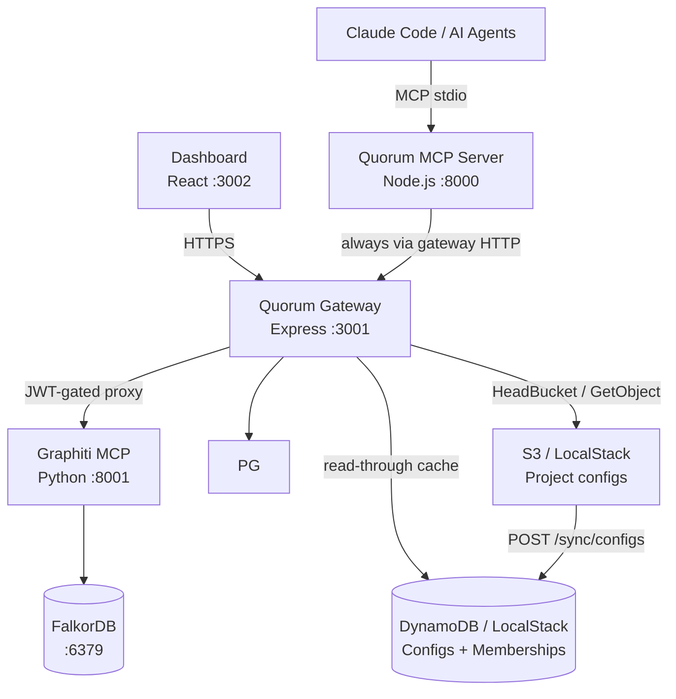

# Quorum
## Persistent Engineering and Business Memory for Claude Code and AI Agents

Quorum is an open-source **governance layer** for engineering and business knowledge built on Graphiti's
temporal knowledge graph. It gives Claude Code and multi-agent systems a shared,
self-evolving, human-governed memory of engineering decisions, business requirements, patterns, and institutional
knowledge — with conflict detection, authority weighting, and a full audit trail.

---

## Design Philosophy

1. **Governance is Architecture** — conflict detection, authority weighting, and audit are first-class primitives, not afterthoughts
2. **Constitution over Rules** — Quorum bakes values into how knowledge is reasoned about; it does not maintain a blocklist
3. **Provenance Always** — every node carries author, timestamp, confidence, source, and conflict history
4. **Human at the Fork** — agents operate autonomously on established knowledge; humans decide at genuine ambiguity
5. **Silent Automatic ≠ Safe** — a junior engineer's addition must not silently overwrite a senior architect's ADR

---

## Architecture



**Key flows:**
- Engineers connect the MCP server via `claude mcp add quorum`; it always talks to the gateway over HTTP (default: `http://localhost:3001`)
- The dashboard connects through the gateway (GitHub OAuth → ES256 JWT → BFF API)
- The MCP server routes all Graphiti calls through `/graphiti/*`; the gateway injects `group_id` from the JWT claim
- Identity chain: JWT (gateway) → `QUORUM_AUTHOR` env → git email → anonymous; dashboard uses GitHub OAuth

> Full detail: [ARCHITECTURE.md](docs/ARCHITECTURE.md)

---

## Current State (v0.4)

**Built and working:**
- MCP server (`@as-quorum/mcp`) with 12 tools — maintained in its own repo (`quorum-mcp`), installed via `npm install -g @as-quorum/mcp`
- Quorum Gateway: ES256 slim JWT `{ sub, is_admin }`, GitHub OAuth, S3-backed project config, Redis config+profile+admin cache (pub/sub invalidation), rate limiting, JWKS endpoint
- `X-Quorum-Project` header: per-request project context — identity (who you are) decoupled from project scope (what you access)
- `GET /user/profile/:username`: profile endpoint (Redis → DDB) with role, projects, base_confidence
- Governance ownership: `POST /config/transfer-ownership`, `POST /config/update-role`, `GET /admin/config`, `POST /admin/users`
- Dashboard: Stats, Graph, Pending Decisions, Knowledge Browser, Knowledge Write (PE: create / promote / supersede), Audit Timeline, Config Editor, System Status, Ownership Panel, Role Editor, Admin Panel, Deviations (v0.4), Portfolio (v0.4)
- Project selector: search + pagination (10/page), full light/dark theme, cancel-back-to-project support
- `GET /schema/config`: public JSON Schema endpoint for editor validation and IDE autocomplete
- DynamoDB layer: `quorum-user-projects` table (membership index with GSI) — config cache retired to Redis
- `POST /sync/configs`: EventBridge-compatible S3→DDB full sync (dual auth: sync token or `principal_architect` JWT)
- Dual-store audit pipeline (PostgreSQL + Graphiti) with SHA256 tamper-evident chain
- Governance: conflict detection (semantic + LLM), authority weighting, confidence decay, human-in-the-loop
- Versioning: append-only, bidirectional audit↔version references, `triggered_by` on every write
- Multi-project isolation via `group_id` scoping in every graph operation; `summary` column is the durable content store (survives FalkorDB volume wipes)
- Config: `group_id` required (canonical ID); `owner` required (project owner GitHub username); `project` optional (display name only)
- Config file naming: `<group_id>.quorum.json`; S3 key: `<group_id>.quorum.json` (flat bucket, no subdirectories)
- Local dev: Docker Compose + LocalStack (S3 + DynamoDB) + Redis (:6380 on host); `setup.sh docker clean --volumes` reliably wipes all data
- LocalStack service is gated behind the `internal-localstack` compose profile, enabled by default via `COMPOSE_PROFILES=internal-localstack` in `.env.example`; engineers who run an external LocalStack on the host (e.g. for Crossplane/k8s tooling) can override in their own `.env` (`COMPOSE_PROFILES=` empty + `AWS_ENDPOINT_URL=http://host.docker.internal:4566`) to avoid a port 4566 clash
- GHCR pull mode: `npm run docker:start:pull` starts the stack with published gateway + graphiti images via `docker-compose.pull.yml` instead of local builds
- Unified E2E ownership: the shared Playwright suite now lives in `e2e/` with API specs in `e2e/scenarios/api/`, browser specs in `e2e/scenarios/ui/`, shared helpers in `e2e/helpers/`, and the Docker lifecycle in `e2e/scripts/run.sh`
- OpenAPI 3.1 spec for the gateway: `gateway/openapi.yaml`
- Ops audit CLI: `scripts/audit-cli.js` — verify/lineage/export/stats via gateway HTTP (no direct pg)
- `GET /pg/audit/lineage/:topic/:key` — audit lineage endpoint for compliance queries
- `POST /api/bump/:topic/:key` — confidence endorsement with 7-day cooldown, role-weighted delta, capped at `starting_confidence`
- PostgreSQL ILIKE fallback in `GET /api/search` when Graphiti/FalkorDB returns empty results
- Agent identity tracking: `knowledge_versions` carries `agent_id`, `session_id`, `author_type` columns — written by `set_agent_context` gate in the MCP; `author_type` always `'agent'` for MCP writes (foundation for future human dashboard writes)
- Dashboard knowledge write: all authenticated users can create entries from the Knowledge browser — `principal_architect` writes land as `ACTIVE`; all other roles land as `DRAFT`. `principal_architect` can also promote DRAFTs, supersede ACTIVE entries, and deprecate ACTIVE entries (single or bulk). All writes go through `validateKnowledgeInput` + audit chain. `author_type: 'human'`, `triggered_by: 'dashboard'`.
- Knowledge deprecation: `POST /api/knowledge/:topic/:key/deprecate` (single) and `POST /api/knowledge/deprecate/bulk` — both PE-only, require reason ≥10 chars (`enforceReasonRequired`), transition ACTIVE→DEPRECATED atomically. Dashboard surfaces: per-row Trash2 icon, bulk checkbox + BulkActionBar, "Deprecate this entry instead" link inside the edit modal. Shared `DeprecateDialog` component used by all three. Route ordering: bulk must be registered before `:topic/:key` to prevent Express param collision.
- Deprecation request workflow: non-PE engineers can call `forget()` on an ACTIVE entry — instead of `forbidden`, the request is queued in `pending_decisions` with `decision_type='deprecation_request'`. `pending()` MCP tool returns a `deprecation_requests` section alongside `decisions`. `review()` accepts `request_id` to approve (runs full ACTIVE→DEPRECATED transition atomically) or reject. Dashboard Pending page shows a "Deprecation requests" table section with PE-only Approve/Reject buttons and stale_warning badges. Deduplication: one pending request per author per key. Staleness detection: if active version advances after the request was created, the row is marked stale automatically.

**Not yet built (v0.5+):** PR ingestion, Atlassian integration, self-evolving graph (PACE framework, decision quality feedback loop), config diff view (GAP-033)

> Full history of every wave, gap closure, and dated fix: [docs/CHANGELOG.md](docs/CHANGELOG.md) · Roadmap: [ROADMAP.md](docs/ROADMAP.md)

---

## Knowledge Domains

Quorum stores two complementary types of knowledge:

**Engineering knowledge** — the technical *why* and *how*: architectural decisions (ADRs), code patterns, infrastructure constraints, runbooks, and the reasoning behind implementation choices.

**Business knowledge** — the product *why* and *when*: feature requirements, business rules, compliance constraints, and the rationale that explains why a capability exists and under what conditions it applies.

Both types are governed identically: authored, versioned, conflict-detected, authority-weighted, and audited. Use the `Requirement` entity type for business knowledge. Suggested domains: `product`, `compliance`, `legal`.

```
remember("product", "guest-checkout-requirement",
  "Guest checkout must remain available. Conversion data shows 40% abandonment on mandatory registration.",
  { entity_type: "Requirement" })

remember("compliance", "gdpr-data-residency",
  "All EU user data must remain in eu-west-1. Required for GDPR compliance with enterprise customers.",
  { entity_type: "Requirement" })
```

---

## Project Structure

```
gateway/                ← @as-quorum/gateway (private, enterprise self-hosted)
  src/
    server.js           ← Gateway entry point (Express :3001)
    routes/             ← auth · config · dashboard · graphiti · jwks · oauth · pg · projects · schema · sync · bump · governance · user · admin
    middleware/         ← verify-jwt (async, two-step: JWT → profile cache) · project · rate-limit
    shared/             ← vendored copies of quorum-mcp shared modules (no npm dep)
                           config/ · graph/ · audit/ · governance/
    redis.js · keys.js · config-cache.js · ddb.js · errors.js

tests/
  gateway/              ← gateway route tests (auth · graphiti · governance)
  e2e/                  ← API-level E2E scenarios (Playwright); browser @ui tests live in quorum-dash

scripts/                ← seed · audit-scan · decay · archive · recheck
  audit-cli.js          ← ops audit CLI (verify · lineage · export · stats) via gateway HTTP
```

> Dashboard source: `github.com/ayansasmal/Quorum-dash` — the React SPA (`:3002`) moved to its
> own repo and consumes the gateway's BFF (`/api/*`) over HTTP. The gateway's `routes/dashboard.js`
> BFF handlers stay here.
>
> MCP server source: `github.com/as-quorum/quorum-mcp` (canonical) — installed as `@as-quorum/mcp`

---

## Non-Negotiable Implementation Rules

The constitutional test suite enforces all of these at 100% coverage:

| Rule | Enforced in |
|------|-------------|
| No hard delete | `BLOCKED_METHODS` in `gateway/src/shared/graph/client.js` + `quorum-mcp/src/graph/client.js` |
| Audit append-only | `updateEntry()` / `deleteEntry()` always throw in `gateway/src/shared/audit/secondary.js` |
| Reason required (≥10 chars) | `gateway/src/shared/governance/constitutional.js` + MCP tool layer (`quorum-mcp`) |
| No self-approval | `enforceNoSelfApproval()` in `gateway/src/shared/governance/constitutional.js` |
| Claude writes always DRAFT | `author === 'claude'` forces DRAFT in `storeFirst()` — in `quorum-mcp` |
| `triggered_by` always set | Schema enforcement — never null |
| Atomic ACTIVE transition | Old version → SUPERSEDED and new → ACTIVE in one transaction |
| Bidirectional audit↔version | Every version record carries `created_by_audit`; every audit entry carries `version_id` |
| No project offboarding via MCP | `DELETE /projects/:id` is dashboard-only; MCP must never expose an archive/offboard tool — project lifecycle decisions require a human in the loop |
| Login is identity-only | `POST /auth/token` verifies GitHub identity and issues a slim JWT even without project membership; request middleware enforces project access |
| Zero-project OAuth remains authenticated | Dashboard OAuth issues a 15-minute JWT with null project context instead of redirecting with `no_projects` |
| Public projects are read-only for non-members | `requireMembership` rejects roleless mutations across `/pg/*` and `/api/*`; authenticated reads remain available |
| The platform must retain an admin | `POST /admin/users` returns `409 last_admin` before removing the final configured administrator |
| Bootstrap cannot reclaim an existing namespace | `POST /config/upload` returns `409 already_onboarded`; existing projects update through authenticated `PUT /config/:projectId` |

**Self-serve onboarding (2026-06-13):** S-23 covers projectless JWT issuance,
bootstrap config creation, duplicate namespace rejection, public-project
read-only enforcement, and the dashboard welcome state. Two follow-up fixes:
(1) `GET /user/profile/:username` for **self** with zero projects returns
`200 { projects: [] }` (not 404) so the dashboard reaches the welcome state; (2)
`POST /config/upload` + `PUT /config/:projectId` now call
`invalidateMemberProfiles(config)` to bust each member's Redis `profile:{sub}`
cache — without it a stale zero-project profile (TTL 300s) made the onboarding
owner 403 on their own project for up to 5 minutes. Full detail: [docs/CHANGELOG.md](docs/CHANGELOG.md).

> Test strategy: [TESTING.md](docs/TESTING.md)

---

## E2E Test Traceability

**Rule: when writing any new E2E journey spec (`tests/e2e/scenarios/`), annotate the production code it exercises in three categories. Apply to the code being added or changed in the same commit.**

This lets a future developer know immediately which E2E tests will break if they modify a specific code path — without having to grep across the test suite.

### Annotation format

```javascript
// E2E: tests/e2e/scenarios/<spec-file>.spec.js — <S-XX.Y> <short description>
```

### Where to annotate (selective — not every line)

| Category | Example | Why |
|----------|---------|-----|
| **Constitutional enforcement functions** | `enforceDeviationActionAuthority`, `enforceValidDeferDeadline`, `enforceGlobalWriteAuthority` | High-consequence, brittle boundaries; coverage required at 100% |
| **Non-obvious infrastructure endpoints** | `POST /pg/scans`, `POST /pg/pending` | Routes that exist only for E2E/skill infrastructure — purpose not obvious from code alone |
| **Scoring / status gate logic** | UNCERTIFIED conditions in `getConformanceScore`, deviation status weights | Multi-condition logic where a misread of the formula breaks E2E assertions |
| **Cross-repo vendored shared logic** | Shared queries or constitutional functions vendored between gateway and quorum-mcp | Both copies need annotation when both are tested |

### Where NOT to annotate

- Standard CRUD route handlers (too broad — dozens of tests cover each one)
- Boilerplate auth guards (pattern is uniform; any spec that calls a guarded route tests them)
- Config/env wiring code

---

## Environment Variables

```bash
# MCP server (set in shell or .env)
QUORUM_GATEWAY_URL=http://localhost:3001   # optional — defaults to this; set to your central Quorum instance
QUORUM_AUTHOR=username                    # identity override (CI contexts; default: git email)

# Gateway (set in docker-compose or deployment env)
QUORUM_GATEWAY_PORT=3001
POSTGRES_HOST · POSTGRES_PORT · POSTGRES_DB · POSTGRES_USER · POSTGRES_PASSWORD
GRAPHITI_URL=http://graphiti:8000
FALKORDB_HOST=falkordb  FALKORDB_PORT=6379
QUORUM_CONFIG_BUCKET=quorum-configs
QUORUM_DDB_CONFIGS_TABLE=quorum-configs          # default: quorum-configs
QUORUM_DDB_USER_PROJECTS_TABLE=quorum-user-projects  # default: quorum-user-projects
QUORUM_SYNC_SECRET=<static-secret>               # EventBridge sync token (optional)
REDIS_URL=redis://redis:6379                      # Redis for config + profile cache (v0.3)
QUORUM_CONFIG_CACHE_TTL=300                       # Config cache TTL in seconds
QUORUM_PROFILE_CACHE_TTL=300                      # Profile cache TTL in seconds
QUORUM_ADMIN_CACHE_TTL=300                        # Admin config cache TTL in seconds
QUORUM_FIRST_ADMIN=                               # GitHub username(s), comma-separated — atomically seeded into configs/.quorum at gateway startup
AWS_REGION · AWS_ENDPOINT_URL · AWS_ACCESS_KEY_ID · AWS_SECRET_ACCESS_KEY

# Graphiti sidecar (Python container — local dev uses OpenAI)
OPENAI_API_KEY=sk-...
LLM_MODEL_NAME=gpt-4o-mini
EMBEDDER_MODEL_NAME=text-embedding-3-small
FALKORDB_URI=redis://falkordb:6379
```

Full defaults: [.env.example](.env.example)

---

## Getting Started

```bash
./scripts/setup.sh docker      # start full stack + upload configs to S3
npm run dev:gateway            # run gateway in dev mode
npm test                       # run gateway tests
node scripts/audit-cli.js stats  # ops audit CLI (requires QUORUM_GATEWAY_URL + QUORUM_GITHUB_TOKEN)
```

> [QUICKSTART.md](docs/QUICKSTART.md) · [ONBOARDING.md](docs/ONBOARDING.md) · [DEPLOYMENT.md](docs/DEPLOYMENT.md)

---

## Reference Documents

| Document | Contents |
|----------|----------|
| [docs/CHANGELOG.md](docs/CHANGELOG.md) | Full chronological history — every wave, gap closure (GAP-001–033), and dated fix that used to live in this file |
| [ARCHITECTURE.md](docs/ARCHITECTURE.md) | Component design, Graphiti integration, versioning model, governance flows, entity schema |
| [TESTING.md](docs/TESTING.md) | Constitutional coverage, unit test strategy, mocking, CI enforcement |
| [docs/e2e/TEST-PLAN.md](docs/e2e/TEST-PLAN.md) | E2E risk-weighted test plan — OwnScore/FailureCost model, dependency graph, fix priority |
| [quorum-mcp/docs/MCP-TEST-PLAN.md](../quorum-mcp/docs/MCP-TEST-PLAN.md) | MCP integration test plan — 6 journeys (M-01–M-06), 54 leaves, OwnScore 655; tests MCP JSON-RPC → tool handler → real gateway |
| [docs/e2e/README.md](docs/e2e/README.md) | E2E journey index, scenario IDs, running tests, graph reporter |
| [docs/e2e/MANUAL-TESTS.md](docs/e2e/MANUAL-TESTS.md) | Manual test scenarios not automatable via HTTP (LLM quality, MCP client, OAuth browser) |
| [docs/e2e/TOKENS.md](docs/e2e/TOKENS.md) | JWT developer tooling — minting test tokens, token contents, CLI examples |
| [DEPLOYMENT.md](docs/DEPLOYMENT.md) | Helm chart, Crossplane IaC, LocalStack, production config |
| [DEPLOYMENT-AWS.md](docs/DEPLOYMENT-AWS.md) | Crossplane v2 AWS demo deployment, validation, operations, and teardown |
| [QUICKSTART.md](docs/QUICKSTART.md) | Local setup walkthrough with troubleshooting |
| [ONBOARDING.md](docs/ONBOARDING.md) | Connect an existing project to a running Quorum stack |
| [CONTRIBUTING.md](docs/CONTRIBUTING.md) | Contribution guidelines, PR process |
| [ROADMAP.md](docs/ROADMAP.md) | v0.2 → v1.0 feature roadmap |
| [skill/references/](skill/references/) | Tool schemas, conflict guide, knowledge guidelines, onboarding protocol |
| [docs/e2e/journey-story-04-06-2026.md](docs/e2e/journey-story-04-06-2026.md) | Journey narratives for all 22 E2E journeys — product story, validated sub-scenarios, gap analysis (2026-06-04) — includes 10 new negative/cross-boundary sub-scenarios; updated 2026-06-05 to reflect MCP integration suite (54/54 automated) |
| [quorum-mcp/docs/journey-story-04-06-2026-mcp.md](../quorum-mcp/docs/journey-story-04-06-2026-mcp.md) | MCP integration journey stories — J-MCP-01 through J-MCP-06, all 54 tests passing against live gateway via InMemoryTransport |
| [docs/e2e/journey-story-28-05-2026.md](docs/e2e/journey-story-28-05-2026.md) | Journey narratives for all 21 E2E journeys — product story, validated sub-scenarios, gap analysis (2026-05-28) |
| [docs/e2e/GAP-ANALYSIS.md](docs/e2e/GAP-ANALYSIS.md) | 38 prioritised coverage gaps (P0–P6) — each with context, test type, exact code change, and effort estimate |
