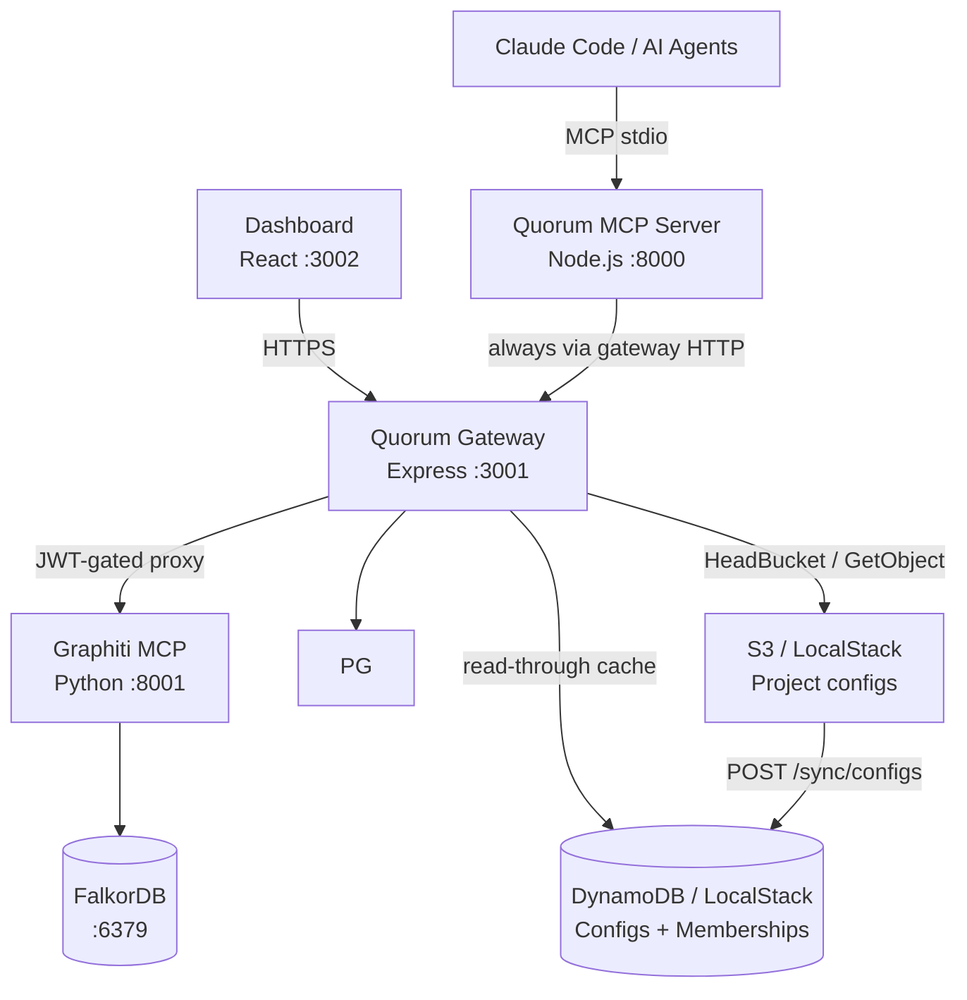

# Quorum
## Persistent Engineering Memory for Claude Code and AI Agents

Quorum is an open-source **governance layer** for engineering knowledge built on Graphiti's
temporal knowledge graph. It gives Claude Code and multi-agent systems a shared,
self-evolving, human-governed memory of engineering decisions, patterns, and institutional
knowledge — with conflict detection, authority weighting, and a full audit trail.

---

## Design Philosophy

1. **Governance is Architecture** — conflict detection, authority weighting, and audit are first-class primitives, not afterthoughts
2. **Constitution over Rules** — Quorum bakes values into how knowledge is reasoned about; it does not maintain a blocklist
3. **Provenance Always** — every node carries author, timestamp, confidence, source, and conflict history
4. **Human at the Fork** — agents operate autonomously on established knowledge; humans decide at genuine ambiguity
5. **Silent Automatic ≠ Safe** — a junior engineer's addition must not silently overwrite a senior architect's ADR

---

## Architecture



**Key flows:**
- Engineers connect the MCP server via `claude mcp add quorum`; it always talks to the gateway over HTTP (default: `http://localhost:3001`)
- The dashboard connects through the gateway (GitHub OAuth → ES256 JWT → BFF API)
- The MCP server routes all Graphiti calls through `/graphiti/*`; the gateway injects `group_id` from the JWT claim
- Identity chain: JWT (gateway) → `QUORUM_AUTHOR` env → git email → anonymous; dashboard uses GitHub OAuth

> Full detail: [ARCHITECTURE.md](docs/ARCHITECTURE.md)

---

## Current State (v0.2)

**Built and working:**
- MCP server with 10 tools: `remember`, `recall`, `search`, `reflect`, `history`, `export`, `forget`, `review`, `pending`, `authenticate`
- Quorum Gateway: ES256 JWT, GitHub OAuth, S3-backed project config, DynamoDB read-through cache, rate limiting, JWKS endpoint
- Dashboard: Stats, Graph, Pending Decisions, Knowledge Browser, Audit Timeline, Config Editor, System Status
- Project selector: search + pagination (10/page), full light/dark theme, cancel-back-to-project support
- `GET /auth/projects` (JWT): refresh project list without re-OAuth; `POST /auth/switch`: JWT-based project switch
- `GET /schema/config`: public JSON Schema endpoint for editor validation and IDE autocomplete
- DynamoDB layer: `quorum-configs` table (config cache with TTL) + `quorum-user-projects` table (membership index with GSI)
- `POST /sync/configs`: EventBridge-compatible S3→DDB full sync (dual auth: sync token or `principal_architect` JWT)
- Dual-store audit pipeline (PostgreSQL + Graphiti) with SHA256 tamper-evident chain
- Governance: conflict detection (semantic + LLM), authority weighting, confidence decay, human-in-the-loop
- Versioning: append-only, bidirectional audit↔version references, `triggered_by` on every write
- Multi-project isolation via `group_id` scoping in every graph operation
- Config: `group_id` required (canonical ID); `project` optional (display name only); JSON Schema at `src/config/quorum.schema.json`
- Config file naming: `<group_id>.quorum.json`; S3 key: `<group_id>.quorum.json` (flat bucket, no subdirectories)
- Self-evolving skill: `mcp/skill/SKILL.md` (user-level install at `~/.claude/skills/quorum/`) + `mcp/skill/references/`
- Local dev: Docker Compose + LocalStack (S3 + DynamoDB); `setup.sh docker clean --volumes` reliably wipes all data
- Monorepo: `mcp/` (`@as-quorum/mcp`, npm-published), `gateway/` (self-hosted), `dashboard/` (self-hosted)
- `@as-quorum/mcp` has no `pg` dependency — all DB access goes through the gateway's `/pg/*` REST API
- OpenAPI 3.1 spec for the gateway: `gateway/openapi.yaml`
- Per-package CLAUDE.md: `mcp/CLAUDE.md`, `gateway/CLAUDE.md`, `dashboard/CLAUDE.md`

**Not yet built (v0.3+):** PR ingestion, Atlassian integration

> [ROADMAP.md](docs/ROADMAP.md)

---

## Project Structure

```
mcp/                    ← @as-quorum/mcp (published to npm)
  src/
    server.js           ← MCP server entry point + .quorum auto-discovery
    quorum-file.js      ← .quorum project file loader
    tools/              ← MCP tool implementations (one file per tool)
    governance/         ← conflict.js · authority.js · confidence.js · provenance.js
    audit/              ← pipeline.js · chain.js · primary.js · secondary.js
    graph/              ← client.js · schema.js · queries.js
    config/             ← schema.js · quorum.schema.json · loader.js
    identity/           ← resolver.js (4-layer identity chain)
    gateway/
      client.js         ← MCP's outbound HTTP client (gateway mode only)
    export/             ← markdown.js · confluence.js
    prompts/            ← loader.js
  dist/                 ← compiled output (esbuild, gitignored)
  cli.js                ← CLI entry point (quorum init, quorum install)
  skill/                ← SKILL.md + references/ (bundled with npm package)

gateway/                ← @as-quorum/gateway (private, enterprise self-hosted)
  src/
    server.js           ← Gateway entry point (Express :3001)
    routes/             ← auth · config · dashboard · graphiti · jwks · oauth · pg · projects · schema · sync · bump
    middleware/         ← verify-jwt · project · rate-limit
    keys.js · config-cache.js · ddb.js · errors.js

dashboard/src/          ← React dashboard (private, enterprise self-hosted)
  pages/                ← Stats · Graph · Pending · Knowledge · Audit · Config · Status
  components/           ← layout/ · session/ · status/
  context/              ← AuthContext.jsx · ThemeContext.jsx
  api/                  ← typed API clients

tests/
  constitutional/       ← 100% coverage required, blocks CI
  governance/ · tools/ · gateway/

scripts/                ← seed · audit-scan · decay · archive · recheck
```

---

## Non-Negotiable Implementation Rules

The constitutional test suite enforces all of these at 100% coverage:

| Rule | Enforced in |
|------|-------------|
| No hard delete | `BLOCKED_METHODS` in `src/graph/client.js` |
| Audit append-only | `updateEntry()` / `deleteEntry()` always throw in `src/audit/pipeline.js` |
| Reason required (≥10 chars) | Tool layer validation in `src/tools/remember.js` and `src/tools/forget.js` |
| No self-approval | `reviewer !== author` check in `src/tools/review.js` |
| Claude writes always DRAFT | `author === 'claude'` forces DRAFT in `storeFirst()` |
| `triggered_by` always set | Schema enforcement — never null |
| Atomic ACTIVE transition | Old version → SUPERSEDED and new → ACTIVE in one transaction |
| Bidirectional audit↔version | Every version record carries `created_by_audit`; every audit entry carries `version_id` |

> Test strategy: [TESTING.md](docs/TESTING.md)

---

## Environment Variables

```bash
# MCP server (set in shell or .env)
QUORUM_GATEWAY_URL=http://localhost:3001   # optional — defaults to this; set to your central Quorum instance
QUORUM_AUTHOR=username                    # identity override (CI contexts; default: git email)

# Gateway (set in docker-compose or deployment env)
QUORUM_GATEWAY_PORT=3001
POSTGRES_HOST · POSTGRES_PORT · POSTGRES_DB · POSTGRES_USER · POSTGRES_PASSWORD
GRAPHITI_URL=http://graphiti:8000
FALKORDB_HOST=falkordb  FALKORDB_PORT=6379
QUORUM_CONFIG_BUCKET=quorum-configs
QUORUM_DDB_CONFIGS_TABLE=quorum-configs          # default: quorum-configs
QUORUM_DDB_USER_PROJECTS_TABLE=quorum-user-projects  # default: quorum-user-projects
QUORUM_SYNC_SECRET=<static-secret>               # EventBridge sync token (optional)
AWS_REGION · AWS_ENDPOINT_URL · AWS_ACCESS_KEY_ID · AWS_SECRET_ACCESS_KEY

# Graphiti sidecar (Python container — local dev uses OpenAI)
OPENAI_API_KEY=sk-...
LLM_MODEL_NAME=gpt-4o-mini
EMBEDDER_MODEL_NAME=text-embedding-3-small
FALKORDB_URI=redis://falkordb:6379
```

Full defaults: [.env.example](.env.example)

---

## Getting Started

```bash
./scripts/setup.sh docker            # start full stack + upload configs to S3
npm run mcp:install   # from repo root
cp skill/SKILL.md ~/.claude/skills/quorum.md   # user-level — active in all projects
npm test
```

> [QUICKSTART.md](docs/QUICKSTART.md) · [ONBOARDING.md](docs/ONBOARDING.md) · [DEPLOYMENT.md](docs/DEPLOYMENT.md)

---

## Reference Documents

| Document | Contents |
|----------|----------|
| [ARCHITECTURE.md](docs/ARCHITECTURE.md) | Component design, Graphiti integration, versioning model, governance flows, entity schema |
| [TESTING.md](docs/TESTING.md) | Constitutional coverage, test strategy, mocking, CI enforcement |
| [DEPLOYMENT.md](docs/DEPLOYMENT.md) | Helm chart, Crossplane IaC, LocalStack, production config |
| [QUICKSTART.md](docs/QUICKSTART.md) | Local setup walkthrough with troubleshooting |
| [ONBOARDING.md](docs/ONBOARDING.md) | Connect an existing project to a running Quorum stack |
| [CONTRIBUTING.md](docs/CONTRIBUTING.md) | Contribution guidelines, PR process |
| [ROADMAP.md](docs/ROADMAP.md) | v0.2 → v1.0 feature roadmap |
| [skill/references/](skill/references/) | Tool schemas, conflict guide, knowledge guidelines, onboarding protocol |
