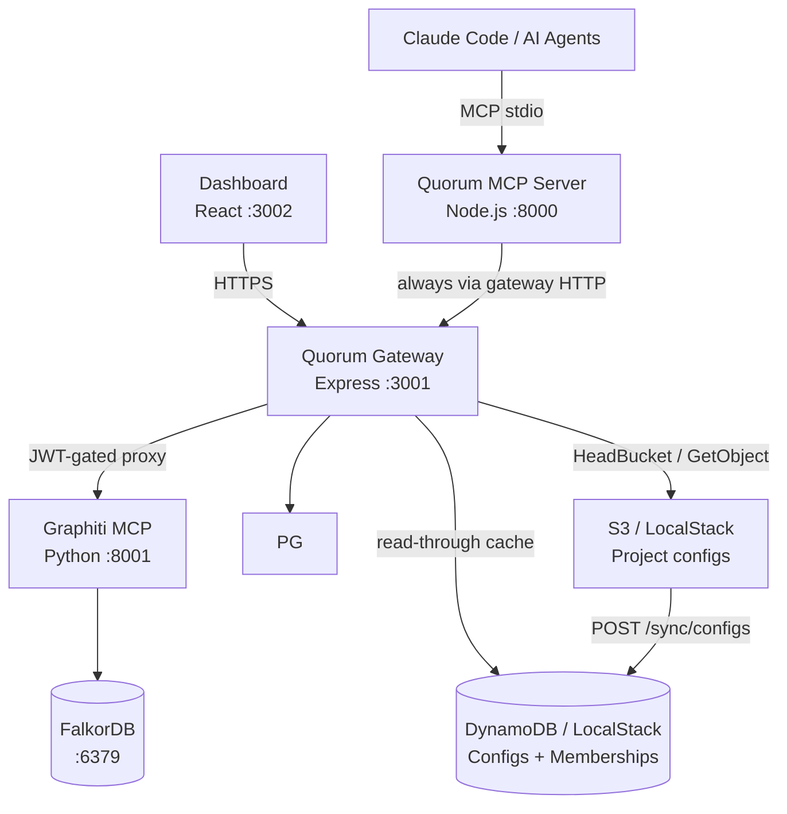

# Quorum
## Persistent Engineering and Business Memory for Claude Code and AI Agents

Quorum is an open-source **governance layer** for engineering and business knowledge built on Graphiti's
temporal knowledge graph. It gives Claude Code and multi-agent systems a shared,
self-evolving, human-governed memory of engineering decisions, business requirements, patterns, and institutional
knowledge — with conflict detection, authority weighting, and a full audit trail.

---

## Design Philosophy

1. **Governance is Architecture** — conflict detection, authority weighting, and audit are first-class primitives, not afterthoughts
2. **Constitution over Rules** — Quorum bakes values into how knowledge is reasoned about; it does not maintain a blocklist
3. **Provenance Always** — every node carries author, timestamp, confidence, source, and conflict history
4. **Human at the Fork** — agents operate autonomously on established knowledge; humans decide at genuine ambiguity
5. **Silent Automatic ≠ Safe** — a junior engineer's addition must not silently overwrite a senior architect's ADR

---

## Architecture



**Key flows:**
- Engineers connect the MCP server via `claude mcp add quorum`; it always talks to the gateway over HTTP (default: `http://localhost:3001`)
- The dashboard connects through the gateway (GitHub OAuth → ES256 JWT → BFF API)
- The MCP server routes all Graphiti calls through `/graphiti/*`; the gateway injects `group_id` from the JWT claim
- Identity chain: JWT (gateway) → `QUORUM_AUTHOR` env → git email → anonymous; dashboard uses GitHub OAuth

> Full detail: [ARCHITECTURE.md](docs/ARCHITECTURE.md)

---

## Current State (v0.3)

**Built and working:**
- MCP server (`@as-quorum/mcp`) with 12 tools — maintained in its own repo (`quorum-mcp`), installed via `npm install -g @as-quorum/mcp`
- Quorum Gateway: ES256 slim JWT `{ sub, is_admin }`, GitHub OAuth, S3-backed project config, Redis config+profile+admin cache (pub/sub invalidation), rate limiting, JWKS endpoint
- `X-Quorum-Project` header: per-request project context — identity (who you are) decoupled from project scope (what you access)
- `GET /user/profile/:username`: profile endpoint (Redis → DDB) with role, projects, base_confidence
- Governance ownership: `POST /config/transfer-ownership`, `POST /config/update-role`, `GET /admin/config`, `POST /admin/users`
- Dashboard: Stats, Graph, Pending Decisions, Knowledge Browser, Knowledge Write (PE: create / promote / supersede), Audit Timeline, Config Editor, System Status, Ownership Panel, Role Editor, Admin Panel
- Project selector: search + pagination (10/page), full light/dark theme, cancel-back-to-project support
- `GET /schema/config`: public JSON Schema endpoint for editor validation and IDE autocomplete
- DynamoDB layer: `quorum-user-projects` table (membership index with GSI) — config cache retired to Redis
- `POST /sync/configs`: EventBridge-compatible S3→DDB full sync (dual auth: sync token or `principal_architect` JWT)
- Dual-store audit pipeline (PostgreSQL + Graphiti) with SHA256 tamper-evident chain
- Governance: conflict detection (semantic + LLM), authority weighting, confidence decay, human-in-the-loop
- Versioning: append-only, bidirectional audit↔version references, `triggered_by` on every write
- Multi-project isolation via `group_id` scoping in every graph operation; `summary` column is the durable content store (survives FalkorDB volume wipes)
- Config: `group_id` required (canonical ID); `owner` required (project owner GitHub username); `project` optional (display name only)
- Config file naming: `<group_id>.quorum.json`; S3 key: `<group_id>.quorum.json` (flat bucket, no subdirectories)
- Local dev: Docker Compose + LocalStack (S3 + DynamoDB) + Redis (:6380 on host); `setup.sh docker clean --volumes` reliably wipes all data
- OpenAPI 3.1 spec for the gateway: `gateway/openapi.yaml`
- Ops audit CLI: `scripts/audit-cli.js` — verify/lineage/export/stats via gateway HTTP (no direct pg)
- `GET /pg/audit/lineage/:topic/:key` — audit lineage endpoint for compliance queries
- `POST /api/bump/:topic/:key` — confidence endorsement with 7-day cooldown, role-weighted delta, capped at `starting_confidence`
- PostgreSQL ILIKE fallback in `GET /api/search` when Graphiti/FalkorDB returns empty results
- Agent identity tracking: `knowledge_versions` carries `agent_id`, `session_id`, `author_type` columns — written by `set_agent_context` gate in the MCP; `author_type` always `'agent'` for MCP writes (foundation for future human dashboard writes)
- Dashboard knowledge write: all authenticated users can create entries from the Knowledge browser — `principal_architect` writes land as `ACTIVE`; all other roles land as `DRAFT`. `principal_architect` can also promote DRAFTs, supersede ACTIVE entries, and deprecate ACTIVE entries (single or bulk). All writes go through `validateKnowledgeInput` + audit chain. `author_type: 'human'`, `triggered_by: 'dashboard'`.
- Knowledge deprecation: `POST /api/knowledge/:topic/:key/deprecate` (single) and `POST /api/knowledge/deprecate/bulk` — both PE-only, require reason ≥10 chars (`enforceReasonRequired`), transition ACTIVE→DEPRECATED atomically. Dashboard surfaces: per-row Trash2 icon, bulk checkbox + BulkActionBar, "Deprecate this entry instead" link inside the edit modal. Shared `DeprecateDialog` component used by all three. Route ordering: bulk must be registered before `:topic/:key` to prevent Express param collision.
- Deprecation request workflow: non-PE engineers can call `forget()` on an ACTIVE entry — instead of `forbidden`, the request is queued in `pending_decisions` with `decision_type='deprecation_request'`. `pending()` MCP tool returns a `deprecation_requests` section alongside `decisions`. `review()` accepts `request_id` to approve (runs full ACTIVE→DEPRECATED transition atomically) or reject. Dashboard Pending page shows a "Deprecation requests" table section with PE-only Approve/Reject buttons and stale_warning badges. Deduplication: one pending request per author per key. Staleness detection: if active version advances after the request was created, the row is marked stale automatically.

**v0.4 Wave A (complete):** Constitutional + DB Foundation
- Three new constitutional functions: `enforceGlobalWriteAuthority(identity, projectId, isGlobalProject)`, `enforceDeviationActionAuthority(actorRole, operation)`, `enforceValidDeferDeadline(deferUntil)` — both repos synced
- `ConstitutionalViolation` rule union extended: `GLOBAL_WRITE_AUTHORITY | DEVIATION_ACTION_AUTHORITY | DEFER_DEADLINE`
- `deviations`, `deviation_actions`, `project_scans` tables in PostgreSQL; `is_global BOOLEAN` on `q_projects`; full RLS + grants; `ALTER TABLE ADD COLUMN IF NOT EXISTS` for idempotency; synced to `helm/quorum/files/init-db.sql`
- `DeviationStatus`, `DeviationActionType`, `VALID_DEFER_DAYS` in `graph/schema.js` — both repos synced
- `QuorumConfigSchema` extended: `HierarchySchema`, `is_global`, `global_scope` (regex-validated), `is_public`, `globals` — both repos synced
- `remember.js` global write guard lifted from soft-return to `enforceGlobalWriteAuthority`; `isGlobal` now config-driven (`getConfig()?.is_global === true`) not hardcoded project id
- Executive roles added to `authority.js`: `director (0.75/tier3)`, `vp_engineering (0.75/tier3)`, `group_executive (0.70/tier3)` — both repos synced; blocked from deviation governance by `enforceDeviationActionAuthority`

**v0.4 Wave B (complete):** Federation — Cross-project reads
- `normalizeGroupId()` exported from `graph/client.js` (both repos); `searchNodes`/`searchFacts` accept `groupIds: string[]` array alongside legacy `groupId: string`
- `detectConflict()` (both repos): added `projectId` + `globals` params; scopes search to `[projectId, ...globals]` — prevents project-local writes from silently contradicting global catalog entries
- `remember.js` (quorum-mcp): passes `getConfig()?.globals ?? []` to `detectConflict`
- `search.js` (quorum-mcp): config-driven globals via `getConfig()`; per-catalog `searchNodes` calls preserve `catalog_id` attribution; results annotated `source: 'project'|'global'`, `catalog_id: string|null`
- `recall.js` (quorum-mcp): config-driven globals fallback loop; XML result annotated `source` + `catalog_id` attributes; includes inline `<!-- ℹ️ Sourced from global catalog '...' -->` comment
- `graphiti.js` (gateway proxy): fixed `group_ids` injection from `body.params` level (ineffective) to `body.params.arguments` level (MCP protocol-authoritative); read ops (`search_nodes`, `search_memory_facts`) inject `[project, ...sanitizedGlobals]`; write ops restricted to `[project]`; loads globals from `loadProjectConfig` at proxy time with graceful fallback
- `GET /api/globals` (gateway): discovers `is_global = TRUE` projects from PostgreSQL; enriches with S3/Redis config metadata (`global_scope`, `display_name`, `entry_count`, `globals[]`); filters by `global_scope` — org-scoped visible to all, division/department-scoped filtered by hierarchy ancestry
- `POST /sync/configs` (gateway): self-reference check (`globals` cannot include own `group_id`); cross-catalog `is_global` validation after full batch sync; `globals_warnings[]` in response for non-global catalog references

**v0.4 Wave C+D (complete):** Deviation Write Path + PE Governance
- `POST /api/deviations` (gateway): validates catalog link (`globals` in project config), resolves catalog entry via `getKeyId`/`getCurrentVersion`, derives `severity = confidence × DEFAULT_ROLE_SCORES[author_role]` with `PA_AUTHORED_FLOOR = 0.70` for low-confidence PA entries, upserts on `(q_project_id, catalog_id, topic, key)` — idempotent (`last_seen_at` updated on re-scan, not new row)
- `POST /api/deviations/batch` (gateway): up to 100 records; `Promise.allSettled` for partial success; returns `{ recorded, failed, results }`
- `GET /api/deviations` (gateway): returns deviations with computed status (OPEN/ACCEPTED/DENIED/DEFERRED/OVERDUE/RESOLVED via LATERAL join on `deviation_actions`) — filters: `status`, `catalog_id`, `topic`, `severity_min`, `source`, `limit`, `offset`
- `POST /api/deviations/:id/action` (gateway): `enforceDeviationActionAuthority` + `enforceReasonRequired` + `enforceValidDeferDeadline` (defer only); denial hint returned when global entry `confidence > 0.85` + `author_role = 'principal_architect'` (non-blocking note)
- `DEFAULT_ROLE_SCORES` in `gateway/src/shared/governance/authority.js` is now `export const` (required for severity derivation import)
- `tests/gateway/dashboard-deviations.test.js`: 27 tests covering validation, catalog link checking, severity formula (4 cases: standard, PA floor, missing confidence, unknown role), upsert idempotency, batch partial success, GET filters, action constitutional enforcement, denial hint
- `deviate()` MCP tool (`quorum-mcp/src/tools/deviate.js`): thin proxy to `POST /api/deviations` via `pg.recordDeviation()` — no business logic in MCP layer
- `pending()` MCP tool updated: response now includes `deviations: { open, overdue_deferrals }` + `summary.open_deviations` + `summary.overdue_deferrals`; graceful fallback if gateway lacks `getDeviations` method
- Dashboard `src/api/deviations.js`: `useDeviations(filters)` + `useDeviationAction()` TanStack Query hooks
- Dashboard `src/pages/Deviations.jsx`: deviation table with filter rail (status/topic/source/severity_min), inline action panel per OPEN/OVERDUE row (accept/deny/defer with 30/45/60/90d), reason textarea with <10 char red-border validation, denial hint surfaced inline
- Dashboard `src/pages/Pending.jsx`: added overdue deferrals section — uses `useDeviations({ status: 'OVERDUE' })`, shows catalog/topic/key/description/severity/last_seen with link to Deviations page
- Dashboard nav wired: `/deviations` route (MemberRoute), AlertTriangle icon in Sidebar, "Deviations" in Layout PAGE_TITLES

**v0.4 Wave E+F (complete):** Conformance Scoring + Portfolio Intelligence
- `GET /api/conformance` (gateway): resolves project → globals → calls `getConformanceScore`; batch query for per-catalog entry counts; returns `{ score, status, breakdown, scan_count, last_scan_at, catalogs: [{ catalog_id, entry_count }] }`; returns UNCERTIFIED when no globals / sparse catalog (<10 ACTIVE entries) / no scans run yet
- `GET /api/portfolio` (gateway): `PORTFOLIO_ROLES = Set(['principal_architect', 'director', 'vp_engineering', 'group_executive'])` OR `is_admin` gate; queries all `q_projects`; loads configs in parallel with graceful fallback; applies `node_id` filter (config.hierarchy.parent match); calls `getPortfolioScores`; weighted rollup `Σ(score × criticality) / Σ(criticality)` over CERTIFIED only; UNCERTIFIED counted separately; returns `{ projects, rollup: { score, status, certified_count, uncertified_count } | null }`
- `getConformanceScore(pg, qProjectId, globals)` (gateway + quorum-mcp vendored): SQL scoring via `LATERAL` join on `deviation_actions`; `STATUS_WEIGHT = { OPEN:1.0, OVERDUE:1.0, ACCEPTED:1.0, DEFERRED:0.6, DENIED:0.3, RESOLVED:0.0 }`; UNCERTIFIED when < 10 ACTIVE catalog entries or scan_count=0 or no globals; returns `{ score, status, applicable_entries, scan_count, last_scan_at, breakdown }`
- `getPortfolioScores(pg, projectInfos)` (gateway + quorum-mcp vendored): `Promise.allSettled` so per-project failures degrade to UNCERTIFIED without aborting portfolio; checks for `pg.getPortfolioScores()` override first (enables test injection)
- `GET /api/knowledge` denial_hint_count (gateway): batch query when `projectConfig.is_global === true`; groups by `(topic, key)` denial count from `deviation_actions JOIN deviations`; joined in-memory via `Map`; returned as `denial_hint_count` per row (0 if not denied)
- `conformance()` MCP tool (`quorum-mcp/src/tools/conformance.js`): thin proxy to `GET /api/conformance`; UNCERTIFIED returns contextual message (no scan / no catalogs / sparse coverage); `include_details: true` fetches top 10 OPEN deviations sorted by severity desc
- `GatewayClient.getConformance()` + `getPortfolio(opts)` (quorum-mcp): `_get` wrapper methods added between deviation methods and config section
- Dashboard `src/api/conformance.js`: `useConformance()` (staleTime: 60_000) + `usePortfolio(opts)` (staleTime: 120_000, retry: false — 403 is not transient)
- Dashboard `src/pages/Stats.jsx`: `ConformanceCard` component — score badge (green ≥80, amber 50–80, red <50, grey=UNCERTIFIED), breakdown bar (6 segments), per-catalog list, scan metadata with staleness warning >14 days; `BreakdownBar` helper
- Dashboard `src/pages/Knowledge.jsx`: `denial_hint_count` badge on key column — red pill showing `✕N` with tooltip "N projects have denied this standard"; only shown when count > 0
- `quorum-mcp/skill/references/scan.md`: full `quorum:scan` skill orchestration doc — check conformance → git diff → code-review → security-review → deviate()/remember() → resolve fixed → updated conformance → summary; scheduled scanning via `quorum:schedule`
- Tests: `tests/gateway/dashboard-conformance.test.js` (14 tests — conformance UNCERTIFIED/CERTIFIED/catalogs/404; portfolio 403/admin-bypass/roles/rollup/null-rollup/node_id-filter/UNCERTIFIED-rollup); `quorum-mcp/tests/tools/conformance.test.js` (15 tests — validation, UNCERTIFIED variants, CERTIFIED pass-through, include_details sort+cap, audit pipeline); gateway total: 675 passed; quorum-mcp total: 620 passed

**v0.4 Wave G (complete):** Documentation
- `gateway/openapi.yaml`: bumped to 0.4.0; added schemas (Deviation, ConformanceScore, PortfolioProject, PortfolioRollup); added paths for /api/globals, /api/deviations, /api/deviations/batch, /api/deviations/{id}/action, /api/conformance, /api/portfolio with tags (Federation, Deviations, Conformance, Portfolio)
- `docs/ARCHITECTURE.md`: v0.4 section — global catalogs and federation, organisational hierarchy, deviation data model (LATERAL join pattern for computed status), conformance scoring formula with status weights, self-evolution loop
- `docs/ROADMAP.md`: complete v0.4 wave-by-wave record (Waves A–G) all marked ✅ with success criteria (675 gateway + 620 quorum-mcp tests)
- `docs/FRONTEND.md`: Deviations page (action panel, denial hint, UNCERTIFIED banner), ConformanceCard in Stats (score badge, breakdown bar, scan metadata), overdue deferrals in Pending, denial_hint_count badge in Knowledge, v0.4 BFF routes, updated project structure
- `docs/ONBOARDING.md`: v0.4 config fields table (hierarchy, is_global, global_scope, is_public, globals), Step 5 — global catalog linking with hierarchy config, quorum:scan conformance guidance
- `quorum-mcp/skill/SKILL.md`: Conformance Scanning section (deviate(), conformance(), quorum:scan orchestration, pending() deviation handling), updated quick reference, references/scan.md added
- `quorum-mcp/README.md`: tool count 12→14, test count 559→620, 14-tool table, v0.4 governance rules

**E2E suite infrastructure (complete):** Full test scaffolding ready.
- Helpers: `api.js`, `jwt.js` (`tokens.pe` = test-pe = principal_architect; all tokens include `issuer: 'quorum-gateway'`; `tokens.admin` includes `is_admin: true`), `seed.js`, `graphiti.js`, `data.js`, `setup.js` (globalSetup: T0 probes + fixture upload), `teardown.js` (no-op; uid() isolation)
- Fixtures: `quorum-test-catalog.quorum.json` (is_global:true, members: test-pe + test-architect), `quorum-test-project.quorum.json` (globals: [quorum-test-catalog], all 8 test users)
- First spec: `01-global-catalog-onboarding.spec.js` (S-01, 13 tests); fresh timestamp-suffixed config IDs guarantee 201 on upload
- `docker-compose.test.yml` overrides gateway with base64-encoded test key pair (so test JWTs are accepted), redirects Graphiti to `mock-openai` service
- `mock-openai/` (server.js + Dockerfile + package.json): zero-dependency Node.js HTTP mock; `POST /v1/embeddings` returns deterministic 1536-dim unit-normalised vectors; `POST /v1/chat/completions` returns stable JSON content; used by Graphiti in test env to avoid real OpenAI calls
- `playwright.config.js` has `globalSetup` + `globalTeardown` registered
- Root `package.json` scripts: `test:e2e`, `test:e2e:headed`, `test:e2e:ui`, `test:e2e:report`, `test:e2e:env:up`, `test:e2e:env:down`, `test:e2e:env:clean`, `test:e2e:full`
- Root `devDependencies` added: `@playwright/test ^1.50.0`, `axios ^1.7.9`, `jsonwebtoken ^9.0.2`
- Search route G-8 fix: `GET /api/search` loads project `globals`, passes `groupIds: [project, ...globals]` to Graphiti, joins `q_projects` in postgres fallback, annotates each result with `source: 'project'|'global'` and `catalog_id`. 675 gateway tests still pass.
- **Known gap:** `quorum-test-catalog` fixture only has test-pe + test-architect as members (not test-engineer). Scenarios using `tokens.engineer` scoped to `quorum-test-catalog` directly will get `role: null`. J01 uses fresh configs (which include test-engineer) — not affected.
- **S-02 E2E (complete):** 54 API tests passing (5 browser-only UI tests skipped — require Playwright chromium). Fixes applied: missing SUPERSEDED transition in conflict-approve path (`dashboard.js`), `Errors.unprocessable` is HTTP 400 not 422, supersede response shape is `{ new_version: <row object>, superseded_version: <number> }`, audit lineage assertion uses `GET /pg/audit?tool=review` (dashboard writes do not populate `version_audit_links`).
- **S-03 E2E (complete):** 23 tests across 5 sub-scenarios (S-03.1–S-03.5) — single deprecation, validation guards, bulk deprecation, deprecation request approve, deprecation request reject. DB fixes: `pending_decisions.decision_type` CHECK constraint extended to include `'deprecation_request'`; `pending_decisions.resolution` CHECK constraint extended to include `'approved'` and `'rejected'`. Seed helper `deprecationRequest()` added to `tests/e2e/helpers/seed.js`.
- **S-04 E2E (complete):** 19 tests across 6 sub-scenarios (S-04.1–S-04.6) — deviation recording (idempotent upsert, severity derivation), validation guards (not_linked/not_found/missing fields), PE accept (authority guard + ACCEPTED status), PE deny (reason guard + denial hint for PA-authored high-confidence entries), PE defer (DEFER_DEADLINE constitutional validation + DEFERRED status), batch recording (full success + partial success). Zero code/DB fixes required — first run clean. Full E2E suite: **91 passed, 5 skipped (browser), 0 failed**.

**E2E fully-isolated Docker environment (complete):** Zero host-port-binding test infrastructure.
- `docker-compose.e2e.yml` — standalone (not extending base compose) with `name: quorum-e2e`; all 7 services (localstack, falkordb, postgresql, redis, mock-openai, graphiti, gateway) + test-runner on internal `e2e` bridge network; no host port bindings; no conflict with dev stack
- `Dockerfile.e2e` — `node:24-alpine` test runner; `PLAYWRIGHT_SKIP_BROWSER_DOWNLOAD=1` (API-only tests); source code bind-mounted at `/workspace` (NOT baked in); anonymous volume at `/workspace/node_modules` provides Alpine-compiled binaries even when host has macOS ones
- `scripts/init-localstack-e2e.sh` — mounted into LocalStack's `/etc/localstack/init/ready.d/`; runs `awslocal` inside LocalStack container to create `quorum-configs-test` bucket, `quorum-user-projects-test` DDB table, and seed admin config; runs before healthcheck passes so gateway is guaranteed to see resources on startup
- `scripts/e2e-docker.sh` — orchestration helper: `up` (build + start + `--wait` for gateway health), `run` (test-runner via `docker compose run --rm`), `down`, `clean` (removes volumes for fresh state), `full` (up → run → down, returns Playwright exit code)
- New npm scripts: `test:e2e:docker` (full run), `test:e2e:docker:up`, `test:e2e:docker:run`, `test:e2e:docker:down`, `test:e2e:docker:clean`, `test:e2e:docker:logs`
- **Usage**: `npm run test:e2e:docker` for fully isolated run; `npm run test:e2e:docker:up` + `npm run test:e2e:docker:run` for iterative dev
- **Dev vs isolated**: `test:e2e:env:*` scripts still work (overlay approach, reuses host LocalStack); `test:e2e:docker:*` is fully self-contained

**Not yet built (v0.5+):** PR ingestion, Atlassian integration, self-evolving graph (PACE framework, decision quality feedback loop), portfolio UI (full page with sorting/filtering/drill-down)

> [ROADMAP.md](docs/ROADMAP.md)

---

## Knowledge Domains

Quorum stores two complementary types of knowledge:

**Engineering knowledge** — the technical *why* and *how*: architectural decisions (ADRs), code patterns, infrastructure constraints, runbooks, and the reasoning behind implementation choices.

**Business knowledge** — the product *why* and *when*: feature requirements, business rules, compliance constraints, and the rationale that explains why a capability exists and under what conditions it applies.

Both types are governed identically: authored, versioned, conflict-detected, authority-weighted, and audited. Use the `Requirement` entity type for business knowledge. Suggested domains: `product`, `compliance`, `legal`.

```
remember("product", "guest-checkout-requirement",
  "Guest checkout must remain available. Conversion data shows 40% abandonment on mandatory registration.",
  { entity_type: "Requirement" })

remember("compliance", "gdpr-data-residency",
  "All EU user data must remain in eu-west-1. Required for GDPR compliance with enterprise customers.",
  { entity_type: "Requirement" })
```

---

## Project Structure

```
gateway/                ← @as-quorum/gateway (private, enterprise self-hosted)
  src/
    server.js           ← Gateway entry point (Express :3001)
    routes/             ← auth · config · dashboard · graphiti · jwks · oauth · pg · projects · schema · sync · bump · governance · user · admin
    middleware/         ← verify-jwt (async, two-step: JWT → profile cache) · project · rate-limit
    shared/             ← vendored copies of quorum-mcp shared modules (no npm dep)
                           config/ · graph/ · audit/ · governance/
    redis.js · keys.js · config-cache.js · ddb.js · errors.js

dashboard/src/          ← React dashboard (private, enterprise self-hosted)
  pages/                ← Stats · Graph · Pending · Knowledge · Audit · Config · Status · Admin
  components/           ← layout/ · session/ · status/
  context/              ← AuthContext.jsx · ThemeContext.jsx
  api/                  ← typed API clients (incl. governance.js for v0.3 endpoints)

tests/
  gateway/              ← gateway route tests (auth · graphiti · governance)

scripts/                ← seed · audit-scan · decay · archive · recheck
  audit-cli.js          ← ops audit CLI (verify · lineage · export · stats) via gateway HTTP
```

> MCP server source: `github.com/as-quorum/quorum-mcp` (canonical) — installed as `@as-quorum/mcp`

---

## Non-Negotiable Implementation Rules

The constitutional test suite enforces all of these at 100% coverage:

| Rule | Enforced in |
|------|-------------|
| No hard delete | `BLOCKED_METHODS` in `gateway/src/shared/graph/client.js` + `quorum-mcp/src/graph/client.js` |
| Audit append-only | `updateEntry()` / `deleteEntry()` always throw in `gateway/src/shared/audit/secondary.js` |
| Reason required (≥10 chars) | `gateway/src/shared/governance/constitutional.js` + MCP tool layer (`quorum-mcp`) |
| No self-approval | `enforceNoSelfApproval()` in `gateway/src/shared/governance/constitutional.js` |
| Claude writes always DRAFT | `author === 'claude'` forces DRAFT in `storeFirst()` — in `quorum-mcp` |
| `triggered_by` always set | Schema enforcement — never null |
| Atomic ACTIVE transition | Old version → SUPERSEDED and new → ACTIVE in one transaction |
| Bidirectional audit↔version | Every version record carries `created_by_audit`; every audit entry carries `version_id` |
| No project offboarding via MCP | `DELETE /projects/:id` is dashboard-only; MCP must never expose an archive/offboard tool — project lifecycle decisions require a human in the loop |

> Test strategy: [TESTING.md](docs/TESTING.md)

---

## Environment Variables

```bash
# MCP server (set in shell or .env)
QUORUM_GATEWAY_URL=http://localhost:3001   # optional — defaults to this; set to your central Quorum instance
QUORUM_AUTHOR=username                    # identity override (CI contexts; default: git email)

# Gateway (set in docker-compose or deployment env)
QUORUM_GATEWAY_PORT=3001
POSTGRES_HOST · POSTGRES_PORT · POSTGRES_DB · POSTGRES_USER · POSTGRES_PASSWORD
GRAPHITI_URL=http://graphiti:8000
FALKORDB_HOST=falkordb  FALKORDB_PORT=6379
QUORUM_CONFIG_BUCKET=quorum-configs
QUORUM_DDB_CONFIGS_TABLE=quorum-configs          # default: quorum-configs
QUORUM_DDB_USER_PROJECTS_TABLE=quorum-user-projects  # default: quorum-user-projects
QUORUM_SYNC_SECRET=<static-secret>               # EventBridge sync token (optional)
REDIS_URL=redis://redis:6379                      # Redis for config + profile cache (v0.3)
QUORUM_CONFIG_CACHE_TTL=300                       # Config cache TTL in seconds
QUORUM_PROFILE_CACHE_TTL=300                      # Profile cache TTL in seconds
QUORUM_ADMIN_CACHE_TTL=300                        # Admin config cache TTL in seconds
QUORUM_FIRST_ADMIN=                               # GitHub username — seeded into configs/.quorum on setup
AWS_REGION · AWS_ENDPOINT_URL · AWS_ACCESS_KEY_ID · AWS_SECRET_ACCESS_KEY

# Graphiti sidecar (Python container — local dev uses OpenAI)
OPENAI_API_KEY=sk-...
LLM_MODEL_NAME=gpt-4o-mini
EMBEDDER_MODEL_NAME=text-embedding-3-small
FALKORDB_URI=redis://falkordb:6379
```

Full defaults: [.env.example](.env.example)

---

## Getting Started

```bash
./scripts/setup.sh docker      # start full stack + upload configs to S3
npm run dev:gateway            # run gateway in dev mode
npm test                       # run gateway tests
node scripts/audit-cli.js stats  # ops audit CLI (requires QUORUM_GATEWAY_URL + QUORUM_GITHUB_TOKEN)
```

> [QUICKSTART.md](docs/QUICKSTART.md) · [ONBOARDING.md](docs/ONBOARDING.md) · [DEPLOYMENT.md](docs/DEPLOYMENT.md)

---

## Reference Documents

| Document | Contents |
|----------|----------|
| [ARCHITECTURE.md](docs/ARCHITECTURE.md) | Component design, Graphiti integration, versioning model, governance flows, entity schema |
| [TESTING.md](docs/TESTING.md) | Constitutional coverage, test strategy, mocking, CI enforcement |
| [DEPLOYMENT.md](docs/DEPLOYMENT.md) | Helm chart, Crossplane IaC, LocalStack, production config |
| [QUICKSTART.md](docs/QUICKSTART.md) | Local setup walkthrough with troubleshooting |
| [ONBOARDING.md](docs/ONBOARDING.md) | Connect an existing project to a running Quorum stack |
| [CONTRIBUTING.md](docs/CONTRIBUTING.md) | Contribution guidelines, PR process |
| [ROADMAP.md](docs/ROADMAP.md) | v0.2 → v1.0 feature roadmap |
| [skill/references/](skill/references/) | Tool schemas, conflict guide, knowledge guidelines, onboarding protocol |
