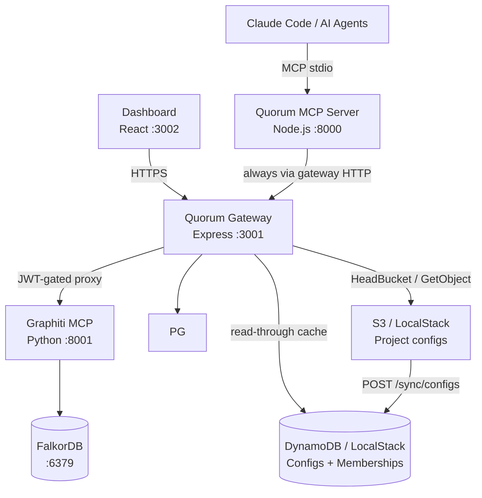

# Quorum
## Persistent Engineering Memory for Claude Code and AI Agents

Quorum is an open-source **governance layer** for engineering knowledge built on Graphiti's
temporal knowledge graph. It gives Claude Code and multi-agent systems a shared,
self-evolving, human-governed memory of engineering decisions, patterns, and institutional
knowledge — with conflict detection, authority weighting, and a full audit trail.

---

## Design Philosophy

1. **Governance is Architecture** — conflict detection, authority weighting, and audit are first-class primitives, not afterthoughts
2. **Constitution over Rules** — Quorum bakes values into how knowledge is reasoned about; it does not maintain a blocklist
3. **Provenance Always** — every node carries author, timestamp, confidence, source, and conflict history
4. **Human at the Fork** — agents operate autonomously on established knowledge; humans decide at genuine ambiguity
5. **Silent Automatic ≠ Safe** — a junior engineer's addition must not silently overwrite a senior architect's ADR

---

## Architecture



**Key flows:**
- Engineers connect the MCP server via `claude mcp add quorum`; it always talks to the gateway over HTTP (default: `http://localhost:3001`)
- The dashboard connects through the gateway (GitHub OAuth → ES256 JWT → BFF API)
- The MCP server routes all Graphiti calls through `/graphiti/*`; the gateway injects `group_id` from the JWT claim
- Identity chain: JWT (gateway) → `QUORUM_AUTHOR` env → git email → anonymous; dashboard uses GitHub OAuth

> Full detail: [ARCHITECTURE.md](docs/ARCHITECTURE.md)

---

## Current State (v0.3)

**Built and working:**
- MCP server (`@as-quorum/mcp`) with 12 tools — maintained in its own repo (`quorum-mcp`), installed via `npm install -g @as-quorum/mcp`
- Quorum Gateway: ES256 slim JWT `{ sub, is_admin }`, GitHub OAuth, S3-backed project config, Redis config+profile+admin cache (pub/sub invalidation), rate limiting, JWKS endpoint
- `X-Quorum-Project` header: per-request project context — identity (who you are) decoupled from project scope (what you access)
- `GET /user/profile/:username`: profile endpoint (Redis → DDB) with role, projects, base_confidence
- Governance ownership: `POST /config/transfer-ownership`, `POST /config/update-role`, `GET /admin/config`, `POST /admin/users`
- Dashboard: Stats, Graph, Pending Decisions, Knowledge Browser, Knowledge Write (PE: create / promote / supersede), Audit Timeline, Config Editor, System Status, Ownership Panel, Role Editor, Admin Panel
- Project selector: search + pagination (10/page), full light/dark theme, cancel-back-to-project support
- `GET /schema/config`: public JSON Schema endpoint for editor validation and IDE autocomplete
- DynamoDB layer: `quorum-user-projects` table (membership index with GSI) — config cache retired to Redis
- `POST /sync/configs`: EventBridge-compatible S3→DDB full sync (dual auth: sync token or `principal_architect` JWT)
- Dual-store audit pipeline (PostgreSQL + Graphiti) with SHA256 tamper-evident chain
- Governance: conflict detection (semantic + LLM), authority weighting, confidence decay, human-in-the-loop
- Versioning: append-only, bidirectional audit↔version references, `triggered_by` on every write
- Multi-project isolation via `group_id` scoping in every graph operation; `summary` column is the durable content store (survives FalkorDB volume wipes)
- Config: `group_id` required (canonical ID); `owner` required (project owner GitHub username); `project` optional (display name only)
- Config file naming: `<group_id>.quorum.json`; S3 key: `<group_id>.quorum.json` (flat bucket, no subdirectories)
- Local dev: Docker Compose + LocalStack (S3 + DynamoDB) + Redis (:6380 on host); `setup.sh docker clean --volumes` reliably wipes all data
- OpenAPI 3.1 spec for the gateway: `gateway/openapi.yaml`
- Ops audit CLI: `scripts/audit-cli.js` — verify/lineage/export/stats via gateway HTTP (no direct pg)
- `GET /pg/audit/lineage/:topic/:key` — audit lineage endpoint for compliance queries
- `POST /api/bump/:topic/:key` — confidence endorsement with 7-day cooldown, role-weighted delta, capped at `starting_confidence`
- PostgreSQL ILIKE fallback in `GET /api/search` when Graphiti/FalkorDB returns empty results
- Agent identity tracking: `knowledge_versions` carries `agent_id`, `session_id`, `author_type` columns — written by `set_agent_context` gate in the MCP; `author_type` always `'agent'` for MCP writes (foundation for future human dashboard writes)
- Dashboard knowledge write: all authenticated users can create entries from the Knowledge browser — `principal_architect` writes land as `ACTIVE`; all other roles land as `DRAFT`. `principal_architect` can also promote DRAFTs, supersede ACTIVE entries, and deprecate ACTIVE entries (single or bulk). All writes go through `validateKnowledgeInput` + audit chain. `author_type: 'human'`, `triggered_by: 'dashboard'`.
- Knowledge deprecation: `POST /api/knowledge/:topic/:key/deprecate` (single) and `POST /api/knowledge/deprecate/bulk` — both PE-only, require reason ≥10 chars (`enforceReasonRequired`), transition ACTIVE→DEPRECATED atomically. Dashboard surfaces: per-row Trash2 icon, bulk checkbox + BulkActionBar, "Deprecate this entry instead" link inside the edit modal. Shared `DeprecateDialog` component used by all three. Route ordering: bulk must be registered before `:topic/:key` to prevent Express param collision.

**Not yet built (v0.4+):** PR ingestion, Atlassian integration, self-evolving graph (PACE framework, decision quality feedback loop)

> [ROADMAP.md](docs/ROADMAP.md)

---

## Project Structure

```
gateway/                ← @as-quorum/gateway (private, enterprise self-hosted)
  src/
    server.js           ← Gateway entry point (Express :3001)
    routes/             ← auth · config · dashboard · graphiti · jwks · oauth · pg · projects · schema · sync · bump · governance · user · admin
    middleware/         ← verify-jwt (async, two-step: JWT → profile cache) · project · rate-limit
    shared/             ← vendored copies of quorum-mcp shared modules (no npm dep)
                           config/ · graph/ · audit/ · governance/
    redis.js · keys.js · config-cache.js · ddb.js · errors.js

dashboard/src/          ← React dashboard (private, enterprise self-hosted)
  pages/                ← Stats · Graph · Pending · Knowledge · Audit · Config · Status · Admin
  components/           ← layout/ · session/ · status/
  context/              ← AuthContext.jsx · ThemeContext.jsx
  api/                  ← typed API clients (incl. governance.js for v0.3 endpoints)

tests/
  gateway/              ← gateway route tests (auth · graphiti · governance)

scripts/                ← seed · audit-scan · decay · archive · recheck
  audit-cli.js          ← ops audit CLI (verify · lineage · export · stats) via gateway HTTP
```

> MCP server source: `github.com/as-quorum/quorum-mcp` (canonical) — installed as `@as-quorum/mcp`

---

## Non-Negotiable Implementation Rules

The constitutional test suite enforces all of these at 100% coverage:

| Rule | Enforced in |
|------|-------------|
| No hard delete | `BLOCKED_METHODS` in `gateway/src/shared/graph/client.js` + `quorum-mcp/src/graph/client.js` |
| Audit append-only | `updateEntry()` / `deleteEntry()` always throw in `gateway/src/shared/audit/secondary.js` |
| Reason required (≥10 chars) | `gateway/src/shared/governance/constitutional.js` + MCP tool layer (`quorum-mcp`) |
| No self-approval | `enforceNoSelfApproval()` in `gateway/src/shared/governance/constitutional.js` |
| Claude writes always DRAFT | `author === 'claude'` forces DRAFT in `storeFirst()` — in `quorum-mcp` |
| `triggered_by` always set | Schema enforcement — never null |
| Atomic ACTIVE transition | Old version → SUPERSEDED and new → ACTIVE in one transaction |
| Bidirectional audit↔version | Every version record carries `created_by_audit`; every audit entry carries `version_id` |

> Test strategy: [TESTING.md](docs/TESTING.md)

---

## Environment Variables

```bash
# MCP server (set in shell or .env)
QUORUM_GATEWAY_URL=http://localhost:3001   # optional — defaults to this; set to your central Quorum instance
QUORUM_AUTHOR=username                    # identity override (CI contexts; default: git email)

# Gateway (set in docker-compose or deployment env)
QUORUM_GATEWAY_PORT=3001
POSTGRES_HOST · POSTGRES_PORT · POSTGRES_DB · POSTGRES_USER · POSTGRES_PASSWORD
GRAPHITI_URL=http://graphiti:8000
FALKORDB_HOST=falkordb  FALKORDB_PORT=6379
QUORUM_CONFIG_BUCKET=quorum-configs
QUORUM_DDB_CONFIGS_TABLE=quorum-configs          # default: quorum-configs
QUORUM_DDB_USER_PROJECTS_TABLE=quorum-user-projects  # default: quorum-user-projects
QUORUM_SYNC_SECRET=<static-secret>               # EventBridge sync token (optional)
REDIS_URL=redis://redis:6379                      # Redis for config + profile cache (v0.3)
QUORUM_CONFIG_CACHE_TTL=300                       # Config cache TTL in seconds
QUORUM_PROFILE_CACHE_TTL=300                      # Profile cache TTL in seconds
QUORUM_ADMIN_CACHE_TTL=300                        # Admin config cache TTL in seconds
QUORUM_FIRST_ADMIN=                               # GitHub username — seeded into configs/.quorum on setup
AWS_REGION · AWS_ENDPOINT_URL · AWS_ACCESS_KEY_ID · AWS_SECRET_ACCESS_KEY

# Graphiti sidecar (Python container — local dev uses OpenAI)
OPENAI_API_KEY=sk-...
LLM_MODEL_NAME=gpt-4o-mini
EMBEDDER_MODEL_NAME=text-embedding-3-small
FALKORDB_URI=redis://falkordb:6379
```

Full defaults: [.env.example](.env.example)

---

## Getting Started

```bash
./scripts/setup.sh docker      # start full stack + upload configs to S3
npm run dev:gateway            # run gateway in dev mode
npm test                       # run gateway tests
node scripts/audit-cli.js stats  # ops audit CLI (requires QUORUM_GATEWAY_URL + QUORUM_GITHUB_TOKEN)
```

> [QUICKSTART.md](docs/QUICKSTART.md) · [ONBOARDING.md](docs/ONBOARDING.md) · [DEPLOYMENT.md](docs/DEPLOYMENT.md)

---

## Reference Documents

| Document | Contents |
|----------|----------|
| [ARCHITECTURE.md](docs/ARCHITECTURE.md) | Component design, Graphiti integration, versioning model, governance flows, entity schema |
| [TESTING.md](docs/TESTING.md) | Constitutional coverage, test strategy, mocking, CI enforcement |
| [DEPLOYMENT.md](docs/DEPLOYMENT.md) | Helm chart, Crossplane IaC, LocalStack, production config |
| [QUICKSTART.md](docs/QUICKSTART.md) | Local setup walkthrough with troubleshooting |
| [ONBOARDING.md](docs/ONBOARDING.md) | Connect an existing project to a running Quorum stack |
| [CONTRIBUTING.md](docs/CONTRIBUTING.md) | Contribution guidelines, PR process |
| [ROADMAP.md](docs/ROADMAP.md) | v0.2 → v1.0 feature roadmap |
| [skill/references/](skill/references/) | Tool schemas, conflict guide, knowledge guidelines, onboarding protocol |
