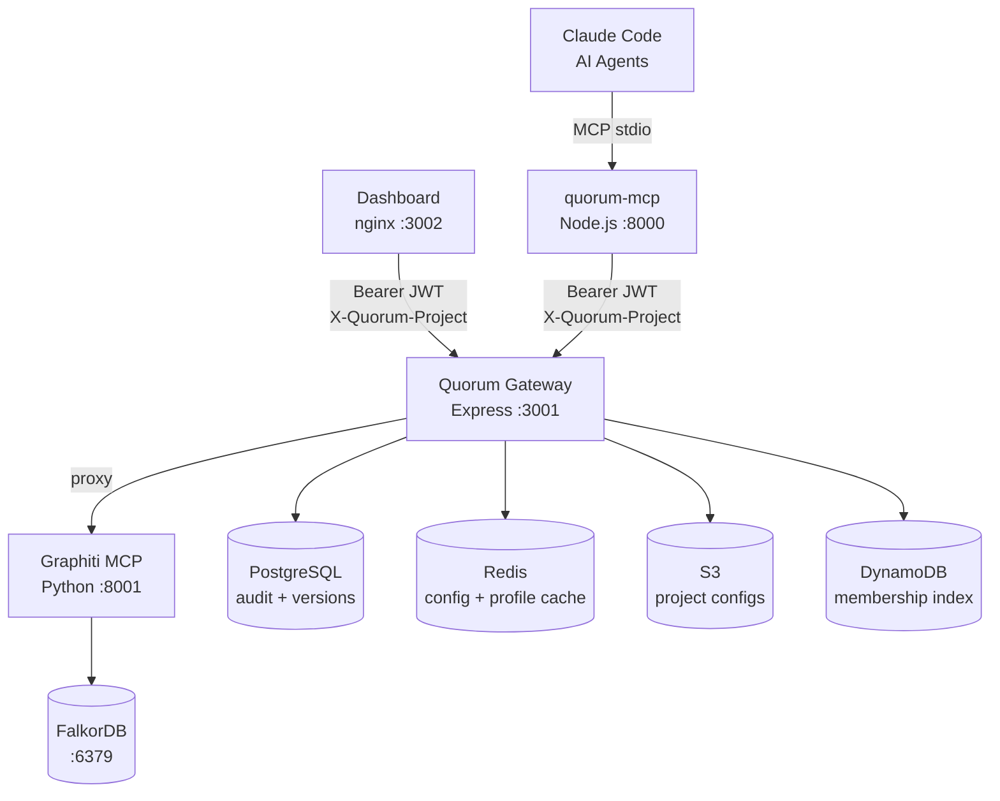

# Quorum

> *Every AI dystopia film has the same root cause — humans removed themselves from the decision loop. Quorum puts them back in.*

**Quorum** is an open-source governance layer for engineering knowledge — built on [Graphiti](https://github.com/getzep/graphiti)'s temporal knowledge graph — that gives Claude Code and multi-agent systems a shared, self-evolving, human-governed memory of engineering decisions, patterns, and institutional knowledge.

---

## The Problem

Multi-agent systems and AI coding assistants like Claude Code are brilliant — but they start from zero every session. Worse, when teams try to share knowledge between agents, they hit a deeper problem: **knowledge without governance.**

```
Agent A writes: "Use JWT for all internal services"
Agent B writes: "Use session tokens for internal services"
Result:         Both stored. No conflict flagged.
                Claude now confidently gives contradictory advice.
```

Existing solutions — Graphiti, Mem0, vector stores — handle storage and retrieval well. None handle the harder problem: **what happens when knowledge conflicts, who decides, and how do you audit it?**

---

## What Quorum Does

Quorum sits on top of Graphiti and adds a constitutional governance layer:

```
Engineer calls remember("auth", "token-strategy", "Use JWT for external")
        ↓
Quorum checks existing knowledge graph
        ↓
⚠️  Conflict detected with existing entry by @senior-architect (6 months ago)
    Existing: "Use session tokens always"
    Incoming: "Use JWT for external, sessions for internal"

    Options:
    A) Supersede existing — requires reason
    B) Coexist — different contexts, specify
    C) Reject new addition

→ Human decides. Resolution + reason stored with full audit trail.
```

---

## Key Features

- **Governance first** — conflict detection with human-in-the-loop resolution. Not silent. Not automatic. Governed.
- **Provenance always** — every node carries author, timestamp, confidence, source, conflict history
- **Authority-weighted writes** — a junior engineer's addition does not silently overwrite a senior architect's ADR
- **Human at the fork** — agents operate autonomously on established knowledge; humans only intervene at genuine ambiguity
- **Quorum Gateway** — Express service fronting Graphiti and PostgreSQL with slim ES256 JWT (`{ sub, is_admin }` only), GitHub OAuth, Redis config/profile cache, and S3-backed per-project configuration
- **Quorum Dashboard** — React SPA for browsing the knowledge graph, resolving conflicts, reviewing drafts, editing project config, and managing ownership + roles
- **Export to human** — everything Quorum knows, exportable as Markdown or Confluence markup

---

## Architecture



**Identity model (v0.3):** JWT carries only `{ sub, is_admin }`. Active project is set via `X-Quorum-Project` request header. Role, ownership, and base_confidence are resolved per-request from the Redis profile cache (`profile:{sub}` → DynamoDB on miss). This separates "who you are" from "what project you're working in."

**Content durability:** all knowledge text is stored in the PostgreSQL `knowledge_versions.summary` column on every write. Graphiti/FalkorDB holds semantic graph embeddings and is the fallback — it is treated as eventually consistent and can be wiped without permanent content loss.

---

## Quick Start

> **Full step-by-step guide:** [docs/QUICKSTART.md](docs/QUICKSTART.md)

**Prerequisites:** Node.js 20+, Docker Desktop, `pip install awscli-local`, OpenAI API key

```bash
git clone https://github.com/ayansasmal/quorum.git
cd quorum
cp .env.example .env          # set OPENAI_API_KEY — the only required change

./scripts/setup.sh docker     # start stack, upload configs to S3, seed knowledge graph

# Install the Quorum MCP server (separate package — installs skill + registers with Claude Code)
npm install -g @as-quorum/mcp
quorum install
```

After setup: **Dashboard** → http://localhost:3002 · **Gateway** → http://localhost:3001/health

```bash
node scripts/audit-cli.js stats    # ops audit CLI (requires QUORUM_GATEWAY_URL + QUORUM_GITHUB_TOKEN)
```

---

## MCP Tools

**Core knowledge tools:**

| Tool | Description |
|------|-------------|
| `remember(topic, key, content, opts?)` | Store knowledge — creates new version, never edits in place |
| `recall(topic, key, opts?)` | Retrieve — default ACTIVE; `{history}` `{at}` `{version}` options |
| `history(topic, key)` | Full version timeline with triggered_by and audit links |
| `search(query, domain?)` | Semantic search across graph; falls back to PG ILIKE if Graphiti empty |
| `reflect(task_summary, opts?)` | Post-task extraction — stores as DRAFT for human review |
| `export(topic?, format)` | Export to Markdown or Confluence-ready format |
| `forget(topic, key, reason)` | Deprecate — creates DEPRECATED version, never hard delete |

**Governance tools:**

| Tool | Description |
|------|-------------|
| `review(action, topic, key, note)` | Approve / reject / request changes on DRAFT knowledge |
| `pending()` | Surface unresolved conflicts and DRAFTs awaiting review |
| `authenticate()` | PKCE OAuth flow — opens browser to GitHub login, stores JWT in-memory |
| `config_upload(opts)` | Upload project config to S3 and sync DynamoDB membership index |

**Integrations (v0.4+):**

| Tool | Description |
|------|-------------|
| `ingest_pr(pr_url, opts?)` | Extract knowledge from merged GitHub PR |
| `enrich_from_jira(issue_key)` | Fetch Jira issue via Atlassian MCP, extract knowledge |
| `enrich_from_confluence(page_id)` | Fetch Confluence page, extract ADRs / runbooks / designs |

---

## How It Differs from Graphiti Alone

| Capability | Graphiti | Quorum |
|---|---|---|
| Temporal knowledge graph | ✅ | ✅ inherited |
| Conflict detection | ✅ silent/auto | ✅ + human governance |
| Conflict resolution | ✅ recency wins | ✅ + authority weighting |
| Reason capture | ❌ | ✅ required field |
| Full audit trail | ⚠️ timestamps only | ✅ decision history + SHA256 chain |
| Provenance | ⚠️ source episode | ✅ author + confidence + lineage |
| Human-in-the-loop | ❌ | ✅ at conflict forks |
| Versioning | ⚠️ bi-temporal edges | ✅ explicit vN chain, triggered_by, history() |
| Point-in-time recall | ⚠️ partial | ✅ recall({ at: date }) deterministic |
| Draft approval workflow | ❌ | ✅ review() tool |
| Self-evolving skill | ❌ | ✅ Claude Code SKILL.md |
| Export to human | ❌ | ✅ Markdown + Confluence |
| Durable content store | ⚠️ graph only | ✅ PostgreSQL summary column (survives FalkorDB wipes) |
| PR knowledge ingestion | ❌ | ✅ ingest_pr() (v0.4) |
| Atlassian integration | ❌ | ✅ Jira + Confluence via MCP (v0.4) |
| Engineering entity types | ❌ | ✅ Decision, Pattern, Constraint, Runbook |

---

## Philosophy

Anthropic builds Claude around a model spec — values baked into how Claude reasons, not rules bolted on top. Governance is architecture, not afterthought.

Quorum applies the same principle to engineering knowledge. Not a system that *prevents* bad knowledge from entering. A system that *naturally tends toward* accurate, governed, trustworthy knowledge because that's how it's built.

---

## Roadmap

- **v0.1** (shipped) — Core MCP server, Graphiti integration, conflict detection, provenance tracking, dual-store audit pipeline, FalkorDB docker stack
- **v0.2** (shipped) — Quorum Gateway (ES256 JWT, GitHub OAuth, S3-backed project config), multi-project scoping, authority weighting, confidence decay, human-in-the-loop conflict resolution, Quorum Dashboard, self-evolving SKILL.md
- **v0.3** (shipped) — Slim JWT `{ sub, is_admin }`, Redis config/profile/admin cache with pub/sub invalidation, `X-Quorum-Project` header, `GET /user/profile/:username`, ownership governance (transfer, role update, admin management), PostgreSQL `summary` as durable content store, PG ILIKE fallback in search
- **v0.4** — Self-evolving graph: PACE framework, decision quality feedback loop, governance health dashboard, PR ingestion (`ingest_pr`)
- **v0.5** — Multi-team namespacing, Atlassian integration (`enrich_from_jira`, `enrich_from_confluence`), cross-team promotion workflow
- **v1.0** — Production hardening, external security audit, hosted docs

> Full detail: [docs/ROADMAP.md](docs/ROADMAP.md)

---

## Repository Structure

```
gateway/          ← @as-quorum/gateway — Express :3001 (private, self-hosted)
dashboard/        ← React SPA served via nginx :3002 (private, self-hosted)
tests/            ← Gateway integration tests (vitest)
scripts/          ← setup.sh · audit-cli.js · seed · decay · archive
docs/             ← ARCHITECTURE · TESTING · DEPLOYMENT · QUICKSTART · DIAGRAMS
```

> MCP server source: [github.com/as-quorum/quorum-mcp](https://github.com/as-quorum/quorum-mcp) — installed as `@as-quorum/mcp`

---

## Contributing

See [CONTRIBUTING.md](docs/CONTRIBUTING.md). Apache 2.0 licensed.
