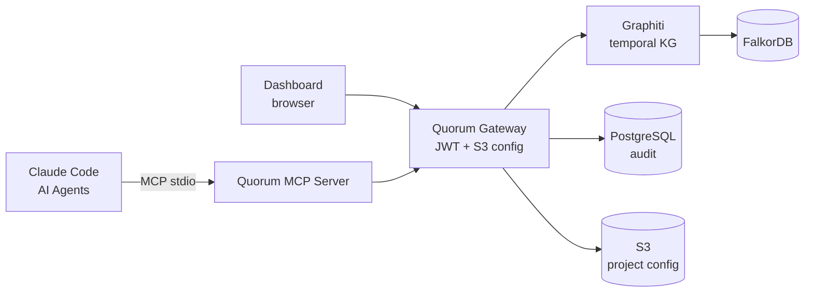

# Quorum

> *Every AI dystopia film has the same root cause — humans removed themselves from the decision loop. Quorum puts them back in.*

**Quorum** is an open-source governance layer for engineering knowledge — built on [Graphiti](https://github.com/getzep/graphiti)'s temporal knowledge graph — that gives Claude Code and multi-agent systems a shared, self-evolving, human-governed memory of engineering decisions, patterns, and institutional knowledge.

---

## The Problem

Multi-agent systems and AI coding assistants like Claude Code are brilliant — but they start from zero every session. Worse, when teams try to share knowledge between agents, they hit a deeper problem: **knowledge without governance.**

```
Agent A writes: "Use JWT for all internal services"
Agent B writes: "Use session tokens for internal services"
Result:         Both stored. No conflict flagged.
                Claude now confidently gives contradictory advice.
```

Existing solutions — Graphiti, Mem0, vector stores — handle storage and retrieval well. None handle the harder problem: **what happens when knowledge conflicts, who decides, and how do you audit it?**

---

## What Quorum Does

Quorum sits on top of Graphiti and adds a constitutional governance layer:

```
Engineer calls remember("auth", "token-strategy", "Use JWT for external")
        ↓
Quorum checks existing knowledge graph
        ↓
⚠️  Conflict detected with existing entry by @senior-architect (6 months ago)
    Existing: "Use session tokens always"
    Incoming: "Use JWT for external, sessions for internal"

    Options:
    A) Supersede existing — requires reason
    B) Coexist — different contexts, specify
    C) Reject new addition

→ Human decides. Resolution + reason stored with full audit trail.
```

---

## Key Features

- **Governance first** — conflict detection with human-in-the-loop resolution. Not silent. Not automatic. Governed.
- **Provenance always** — every node carries author, timestamp, confidence, source, conflict history
- **Authority-weighted writes** — a junior engineer's addition does not silently overwrite a senior architect's ADR
- **Self-evolving** — Claude Code skill reflects after every task and adds learnings automatically
- **Human at the fork** — agents operate autonomously on established knowledge; humans only intervene at genuine ambiguity
- **Quorum Gateway** — Express service that fronts Graphiti and PostgreSQL with ES256 JWT, GitHub OAuth, and S3-backed per-project configuration
- **Quorum Dashboard** — React SPA for browsing the knowledge graph, resolving conflicts, reviewing drafts, and editing project config — with session expiry handling and re-auth flows built in
- **Export to human** — everything Quorum knows, exportable as Markdown or Confluence markup

---

## Architecture



The **Quorum MCP Server** speaks MCP stdio with Claude Code and AI agents. The **Quorum Gateway** (Express :3001) handles GitHub OAuth, issues ES256 JWTs, serves project config from S3, and proxies authenticated traffic to Graphiti and PostgreSQL. The **Quorum Dashboard** (React :3002, served via Nginx) is the human-facing surface for graph exploration, conflict resolution, draft review, audit timelines, and project configuration.

---

## Quick Start

> **Full step-by-step guide:** [QUICKSTART.md](docs/QUICKSTART.md)

**Prerequisites:** Node.js 20+, Docker Desktop, `pip install awscli-local`, OpenAI API key

```bash
git clone https://github.com/ayansasmal/quorum.git
cd quorum
cp .env.example .env          # set OPENAI_API_KEY — the only required change

./scripts/setup.sh docker     # start stack, upload configs to S3, seed knowledge graph

# Connect to Claude Code (replace path with your clone location)
claude mcp add quorum -- node /path/to/quorum/src/server.js

# Install the Quorum skill at user level — active in every project on your machine
cp skill/SKILL.md ~/.claude/skills/quorum.md
```

After setup: **Dashboard** → http://localhost:3002 · **Gateway** → http://localhost:3001/health

```bash
node cli.js audit verify      # verify audit chain integrity
node cli.js history auth:token-strategy   # inspect seeded knowledge
```

---

## MCP Tools

**Core knowledge tools:**

| Tool | Description |
|---|---|
| `remember(topic, key, content, author)` | Store knowledge — creates new version, never edits |
| `recall(topic, key, options?)` | Retrieve — default ACTIVE, `{history}` `{at}` `{version}` options |
| `history(topic, key)` | Full version timeline with triggered_by and audit links |
| `search(query, domain?)` | Semantic search across graph |
| `reflect(task_summary)` | Post-task self-evolving extraction |
| `export(topic?, format)` | Export to markdown or Confluence |
| `forget(topic, key, reason)` | Deprecate — creates DEPRECATED version, never hard delete |

**Governance tools:**

| Tool | Description |
|---|---|
| `review(action, topic, key, reviewer, note)` | Approve / reject / request changes on DRAFT knowledge |

**Integrations (v0.4):**

| Tool | Description |
|---|---|
| `ingest_pr(pr_url, options?)` | Extract knowledge from merged GitHub PR |
| `enrich_from_jira(issue_key)` | Fetch Jira issue via Atlassian MCP, extract knowledge |
| `enrich_from_confluence(page_id)` | Fetch Confluence page, extract ADRs / runbooks / designs |
| `search_atlassian(query, sources?)` | Unified search across Jira + Confluence + graph |
| `sync_atlassian(domain?)` | Proactive staleness detection for Atlassian-linked knowledge |

---

## How It Differs from Graphiti Alone

| Capability | Graphiti | Quorum |
|---|---|---|
| Temporal knowledge graph | ✅ | ✅ inherited |
| Conflict detection | ✅ silent/auto | ✅ + human governance |
| Conflict resolution | ✅ recency wins | ✅ + authority weighting |
| Reason capture | ❌ | ✅ required field |
| Full audit trail | ⚠️ timestamps only | ✅ decision history + SHA256 chain |
| Provenance | ⚠️ source episode | ✅ author + confidence + lineage |
| Human-in-the-loop | ❌ | ✅ at conflict forks |
| Versioning | ⚠️ bi-temporal edges | ✅ explicit vN chain, triggered_by, history() |
| Point-in-time recall | ⚠️ partial | ✅ recall({ at: date }) deterministic |
| Draft approval workflow | ❌ | ✅ review() tool |
| Self-evolving skill | ❌ | ✅ Claude Code SKILL.md |
| Export to human | ❌ | ✅ markdown + confluence |
| PR knowledge ingestion | ❌ | ✅ ingest_pr() (v0.4) |
| Atlassian integration | ❌ | ✅ Jira + Confluence via MCP (v0.4) |
| Engineering entity types | ❌ | ✅ Decision, Pattern, Constraint, Runbook |

---

## Philosophy

Anthropic builds Claude around a model spec — values baked into how Claude reasons, not rules bolted on top. Governance is architecture, not afterthought.

Quorum applies the same principle to engineering knowledge. Not a system that *prevents* bad knowledge from entering. A system that *naturally tends toward* accurate, governed, trustworthy knowledge because that's how it's built.

---

## Roadmap

- **v0.1** (shipped) — Core MCP server, Graphiti integration, conflict detection, provenance tracking, dual-store audit pipeline, FalkorDB docker stack, seed data with contradictions
- **v0.2** (current) — Quorum Gateway (ES256 JWT, S3-backed project config), `.quorum` project files, multi-project scoping, authority weighting, confidence decay, human-in-the-loop conflict resolution, self-evolving `skill/SKILL.md`, project selector with search + pagination, `<group_id>.quorum.json` config naming, flat S3 bucket, JSON Schema endpoint (`GET /schema/config`), Crossplane-based IaC, LocalStack for local dev, Express gateway + React dashboard
- **v0.3** — PR knowledge ingestion (`ingest_pr`), post-merge confidence feedback loop
- **v0.4** — Atlassian integration (`enrich_from_jira`, `enrich_from_confluence`, `search_atlassian`, `sync_atlassian`), Markdown + Confluence export
- **v1.0** — Production hardening, AWS Neptune support, hosted docs
- **Future** — Diagram ingestion (image → Mermaid), cross-org federation, analytics dashboard

---

## Contributing

See [CONTRIBUTING.md](docs/CONTRIBUTING.md). Apache 2.0 licensed.
