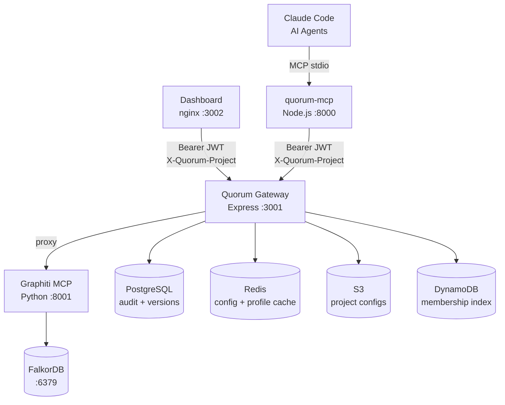

# Quorum

> *Every AI dystopia film has the same root cause — humans removed themselves from the decision loop. Quorum puts them back in.*

[](https://github.com/ayansasmal/quorum/actions/workflows/test-gateway.yml) [](https://github.com/ayansasmal/quorum/actions/workflows/test-gateway.yml) [](https://nodejs.org) [](LICENSE) [](https://github.com/ayansasmal/quorum-mcp) [](gateway/openapi.yaml)

**Quorum** is a governance layer for engineering and business knowledge — built on [Graphiti](https://github.com/getzep/graphiti)'s temporal knowledge graph — that gives Claude Code and multi-agent systems a shared, self-evolving, human-governed memory of engineering decisions, business requirements, patterns, and institutional knowledge.

---

## Who is this for?

**Engineering organisations where AI agents make decisions that need to stay consistent, auditable, and human-governed — across teams, not just within one.**

| Role | What Quorum solves for them |
|------|-----------------------------|
| **Engineering managers** | Confidence that Claude Code follows *your team's* actual standards, not generic internet advice |
| **Platform engineers** | Publish standards once as a global catalog; every product team's agents check against them automatically |
| **Principal architects** | Critical decisions can't be quietly overridden; global contradictions surface at write time |
| **VPs of Engineering / Directors** | Portfolio-level conformance score across all teams; governed deviations visible without status meetings |
| **CTOs** | Org-wide alignment to data residency, auth, and compliance constraints — provable, not asserted |
| **Product managers** | Feature requirements and business rules survive refactors, team changes, and agent turnover |

See [docs/WHY.md](docs/WHY.md) for detailed narratives — including three new v0.4 scenarios on cross-team standards, conformance scoring, and portfolio visibility.

---

## The Problem

Multi-agent systems and AI coding assistants like Claude Code are brilliant — but they start from zero every session. Worse, when teams try to share knowledge between agents, they hit a deeper problem: **knowledge without governance.**

```
Agent A writes: "Use JWT for all internal services"
Agent B writes: "Use session tokens for internal services"
Result:         Both stored. No conflict flagged.
                Claude now confidently gives contradictory advice.
```

Existing solutions — Graphiti, Mem0, vector stores — handle storage and retrieval well. None handle the harder problem: **what happens when knowledge conflicts, who decides, and how do you audit it?**

---

## What Quorum Does

Quorum sits on top of Graphiti and adds a constitutional governance layer:

```
Engineer calls remember("auth", "token-strategy", "Use JWT for external")
        ↓
Quorum checks existing knowledge graph
        ↓
⚠️  Conflict detected with existing entry by @senior-architect (6 months ago)
    Existing: "Use session tokens always"
    Incoming: "Use JWT for external, sessions for internal"

    Options:
    A) Supersede existing — requires reason
    B) Coexist — different contexts, specify
    C) Reject new addition

→ Human decides. Resolution + reason stored with full audit trail.
```

---

## Key Features

- **Governance first** — conflict detection with human-in-the-loop resolution. Not silent. Not automatic. Governed.
- **Provenance always** — every node carries author, timestamp, confidence, source, conflict history
- **Authority-weighted writes** — a junior engineer's addition does not silently overwrite a senior architect's ADR
- **Human at the fork** — agents operate autonomously on established knowledge; humans only intervene at genuine ambiguity
- **Federation** — link projects to global catalogs; `search()` and `recall()` traverse them transparently; global contradictions are always caught at write time
- **Deviation governance** — when a project deviates from a global standard, agents record it via `deviate()`; PEs accept, deny, or defer with full constitutional enforcement
- **Conformance scoring** — every project gets a weighted conformance score against its linked global catalogs; `quorum:scan` drives incremental CI scanning
- **Portfolio intelligence** — exec-gated org-wide rollup across all projects; denial hint badges surface contested global entries
- **Quorum Gateway** — Express service fronting Graphiti and PostgreSQL with slim ES256 JWT, GitHub OAuth, Redis config/profile cache, and S3-backed per-project configuration
- **Quorum Dashboard** — React SPA for browsing the knowledge graph, resolving conflicts, reviewing drafts, managing deviations, and editing project config
- **Export to human** — everything Quorum knows, exportable as Markdown or Confluence markup

---

## Architecture




**Identity model:** JWT carries only `{ sub, is_admin }`. Active project is set via `X-Quorum-Project` request header. Role, ownership, and `base_confidence` are resolved per-request from the Redis profile cache (`profile:{sub}` → DynamoDB on miss). This separates “who you are” from “what project you’re working in.” Executive roles (`director`, `vp_engineering`, `group_executive`) have tier-3 authority for reads and portfolio views but are blocked from deviation governance actions.

**Content durability:** all knowledge text is stored in the PostgreSQL `knowledge_versions.summary` column on every write. Graphiti/FalkorDB holds semantic graph embeddings and is the fallback — it is treated as eventually consistent and can be wiped without permanent content loss.

---

## Current State (v0.4 shipped)

- **Identity / authz** — ES256 slim JWT `{ sub, is_admin }`; `X-Quorum-Project` header decouples identity from project scope; role and `base_confidence` resolved per-request from Redis profile cache → DynamoDB on miss
- **Storage** — `q_*` id schema; flat S3 layout `<group_id>.quorum.json`; PostgreSQL `summary` column as durable content store (survives FalkorDB wipes)
- **Audit pipeline** — dual-store: PostgreSQL (SHA256 tamper-evident chain) + Graphiti (semantic traversal); append-only; `GET /pg/audit/lineage/:topic/:key` for compliance queries
- **Caching** — Redis for config, user profile, and admin with 300s TTL and pub/sub invalidation on governance writes
- **Federation** — `GET /api/globals` discovers global catalogs; `search()` / `recall()` transparently traverse linked catalogs; results annotated with `source` + `catalog_id`; `detectConflict()` scoped to `[project, ...globals]` so global contradictions are always caught
- **Deviation governance** — `POST /api/deviations` (idempotent upsert, server-side severity with `PA_AUTHORED_FLOOR`); batch endpoint (up to 100 records); `GET /api/deviations` with computed `OPEN / ACCEPTED / DENIED / DEFERRED / OVERDUE / RESOLVED` status via LATERAL join; PE accept/deny/defer with constitutional enforcement
- **Conformance scoring** — `GET /api/conformance` returns weighted score per project; UNCERTIFIED gate when catalog has < 10 ACTIVE entries or no scans; `quorum:scan` skill for incremental CI-driven scanning
- **Portfolio intelligence** — `GET /api/portfolio` (role-gated: exec + `is_admin`); weighted criticality rollup over all projects; `denial_hint_count` badge on global entries in Knowledge browser; full Portfolio page with cascading org filters (org → group → division → department), search, score table (GAP-028 ✅)
- **Dashboard** — Stats (ConformanceCard: score badge, breakdown bar, staleness warning), Deviations (filter rail, inline action panel), Portfolio (rollup banner, cascading org filters, project table), Pending (overdue deferrals), Knowledge (denial hint badges), Graph, Audit, Config, Admin; full light/dark theme
- **Conflict resolution** — `approve` / `reject` / `request_changes` / `coexist_merge`; `coexist_merge` creates a new unified ACTIVE entry authored by the reviewer, superseding both source versions atomically; self-approval constitutional check applies to all four actions
- **Self-serve onboarding** — GitHub identity can receive a projectless JWT, bootstrap one net-new project through `POST /config/upload`, and use the projectless dashboard welcome state; existing namespaces return 409 and update through authenticated `PUT /config/:projectId`
- **Tests** — 713 gateway tests · 631 quorum-mcp tests · 560 previously verified E2E tests plus the new S-23 onboarding scenarios; coverage 86% lines · 77% branches; CI on Node 22; fully-isolated Docker E2E stack (`npm run test:e2e:docker`)
- **Tooling** — OpenAPI 3.1 spec v0.4.0 at [`gateway/openapi.yaml`](gateway/openapi.yaml) (Federation, Deviations, Conformance, Portfolio tags); `GET /schema/config` public JSON Schema; [`scripts/audit-cli.js`](scripts/audit-cli.js) ops CLI

---

## Quick Start

> **Full step-by-step guide:** [docs/QUICKSTART.md](docs/QUICKSTART.md)

**Prerequisites:** Node.js 22+, Docker Desktop, `pip install awscli-local`, OpenAI API key

```bash
git clone https://github.com/ayansasmal/quorum.git
cd quorum
cp .env.example .env          # set OPENAI_API_KEY — the only required change

./scripts/setup.sh docker     # start stack, upload configs to S3, seed knowledge graph

# Install the Quorum MCP server (separate package — installs skill + registers with Claude Code)
npm install -g @as-quorum/mcp
quorum install
```

After setup: **Gateway** → http://localhost:3001/health · **Dashboard** → http://localhost:3002 (runs from the [`quorum-dash`](https://github.com/ayansasmal/Quorum-dash) repo against this stack)

```bash
node scripts/audit-cli.js stats    # ops audit CLI (requires QUORUM_GATEWAY_URL + QUORUM_GITHUB_TOKEN)
```

> For full setup, troubleshooting, and production deployment: [QUICKSTART.md](docs/QUICKSTART.md) · [DEPLOYMENT.md](docs/DEPLOYMENT.md)

---

## MCP Tools

**Core knowledge tools:**

| Tool | Description |
|------|-------------|
| `remember(topic, key, content, opts?)` | Store knowledge — creates new version, never edits in place |
| `recall(topic, key, opts?)` | Retrieve — default ACTIVE; `{history}` `{at}` `{version}` options |
| `history(topic, key)` | Full version timeline with triggered_by and audit links |
| `search(query, domain?)` | Semantic search across graph; falls back to PG ILIKE if Graphiti empty |
| `reflect(task_summary, opts?)` | Post-task extraction — stores as DRAFT for human review |
| `export(topic?, format)` | Export to Markdown or Confluence-ready format |
| `forget(topic, key, reason)` | Deprecate — creates DEPRECATED version, never hard delete |

**Governance tools:**

| Tool | Description |
|------|-------------|
| `review(action, topic, key, note)` | Approve / reject / request changes on DRAFT knowledge |
| `pending()` | Surface unresolved conflicts, DRAFTs, deprecation requests, open deviations |
| `deviate(opts)` | Record a project deviation from a linked global catalog entry |
| `conformance(opts?)` | Get conformance score for the current project; `include_details` returns top-10 open deviations |
| `authenticate()` | PKCE OAuth flow — opens browser to GitHub login, stores JWT in-memory |
| `config_upload(opts)` | Upload project config to S3 and sync DynamoDB membership index |

**Integrations (v0.5+):**

| Tool | Description |
|------|-------------|
| `ingest_pr(pr_url, opts?)` | Extract knowledge from merged GitHub PR |
| `enrich_from_jira(issue_key)` | Fetch Jira issue via Atlassian MCP, extract knowledge |
| `enrich_from_confluence(page_id)` | Fetch Confluence page, extract ADRs / runbooks / designs |

---

## How It Differs from Graphiti Alone

| Capability | Graphiti | Quorum |
|---|---|---|
| Temporal knowledge graph | ✅ | ✅ inherited |
| Conflict detection | ✅ silent/auto | ✅ + human governance |
| Conflict resolution | ✅ recency wins | ✅ + authority weighting |
| Reason capture | ❌ | ✅ required field |
| Full audit trail | ⚠️ timestamps only | ✅ decision history + SHA256 chain |
| Provenance | ⚠️ source episode | ✅ author + confidence + lineage |
| Human-in-the-loop | ❌ | ✅ at conflict forks |
| Versioning | ⚠️ bi-temporal edges | ✅ explicit vN chain, triggered_by, history() |
| Point-in-time recall | ⚠️ partial | ✅ recall({ at: date }) deterministic |
| Draft approval workflow | ❌ | ✅ review() tool |
| Self-evolving skill | ❌ | ✅ Claude Code SKILL.md |
| Export to human | ❌ | ✅ Markdown + Confluence |
| Durable content store | ⚠️ graph only | ✅ PostgreSQL summary column (survives FalkorDB wipes) |
| Cross-project federation | ❌ | ✅ Global catalogs; search/recall traverse linked projects transparently |
| Deviation governance | ❌ | ✅ Record, score severity, accept/deny/defer with constitutional enforcement |
| Conformance scoring | ❌ | ✅ Weighted score per project; UNCERTIFIED gate; quorum:scan CI skill |
| Portfolio intelligence | ❌ | ✅ Org-wide rollup (exec-gated); denial hint badges on global entries |
| PR knowledge ingestion | ❌ | ✅ ingest_pr() (v0.5) |
| Atlassian integration | ❌ | ✅ Jira + Confluence via MCP (v0.5) |
| Knowledge entity types | ❌ | ✅ Decision, Pattern, Constraint, Runbook, Requirement |

---

## Philosophy

Anthropic builds Claude around a model spec — values baked into how Claude reasons, not rules bolted on top. Governance is architecture, not afterthought.

Quorum applies the same principle to knowledge. Not a system that *prevents* bad knowledge from entering. A system that *naturally tends toward* accurate, governed, trustworthy knowledge because that’s how it’s built.

Engineering decisions explain *how* things are built. Business requirements explain *why* they exist and *when* they apply. Quorum governs both.

---

## Roadmap

- **v0.1** (shipped) — Core MCP server, Graphiti integration, conflict detection, provenance tracking, dual-store audit pipeline, FalkorDB docker stack
- **v0.2** (shipped) — Quorum Gateway (ES256 JWT, GitHub OAuth, S3-backed project config), multi-project scoping, authority weighting, confidence decay, human-in-the-loop conflict resolution, Quorum Dashboard, self-evolving SKILL.md
- **v0.3** (shipped) — Slim JWT `{ sub, is_admin }`, Redis config/profile/admin cache with pub/sub invalidation, `X-Quorum-Project` header, ownership governance, PostgreSQL `summary` as durable content store, deprecation request workflow
- **v0.4** (shipped) — Federation (global catalogs, cross-project reads), deviation governance (`deviate()`, accept/deny/defer with constitutional enforcement), conformance scoring (`conformance()`, `quorum:scan` CI skill), portfolio intelligence (exec-gated org rollup, denial hint badges, full Portfolio page with 4-level hierarchy filters), `Standard`+`Guideline` entity types, org hierarchy tier, fully-isolated E2E Docker test suite, `coexist_merge` conflict resolution, config upsert; 685 gateway tests · 629 quorum-mcp tests · 560 E2E tests (22 scenarios)
- **v0.5** — PR ingestion (`ingest_pr`), Atlassian integration (`enrich_from_jira`, `enrich_from_confluence`), multi-team namespacing, cross-team promotion workflow
- **v1.0** — Production hardening, external security audit, hosted docs

> Full detail: [docs/ROADMAP.md](docs/ROADMAP.md)

---

## Repository Structure

```
gateway/             ← @as-quorum/gateway — Express :3001 (private, self-hosted)
tests/               ← Gateway integration tests (vitest) + API-level E2E (Playwright)
mock-openai/         ← Zero-dependency Node.js OpenAI mock for E2E test isolation
scripts/             ← setup.sh · audit-cli.js · seed · decay · archive · e2e-docker.sh
docs/                ← ARCHITECTURE · TESTING · DEPLOYMENT · QUICKSTART · FRONTEND · E2E-JOURNEYS
docker-compose.yml           ← dev stack
docker-compose.e2e.yml       ← fully-isolated E2E stack (no host port bindings)
docker-compose.test.yml      ← gateway test overlay (test key pair + mock-openai)
playwright.config.js         ← E2E test runner config
```

> MCP server source: [github.com/as-quorum/quorum-mcp](https://github.com/as-quorum/quorum-mcp) — installed as `@as-quorum/mcp`

---

## Documentation

A curated index of the docs in this repo. (The MCP server's own docs live in the [`quorum-mcp`](../quorum-mcp/README.md) package; the workspace-level index is at [`../README.md`](../README.md).)

### Start here

| Doc | What's in it |
|-----|--------------|
| [docs/WHY.md](docs/WHY.md) | The case for Quorum — eight narratives from teams who've felt the pain |
| [docs/QUICKSTART.md](docs/QUICKSTART.md) | Local setup walkthrough with troubleshooting |
| [docs/ONBOARDING.md](docs/ONBOARDING.md) | Connect an existing project to a running Quorum stack |

### Design & internals

| Doc | What's in it |
|-----|--------------|
| [docs/ARCHITECTURE.md](docs/ARCHITECTURE.md) | Component design, Graphiti integration, versioning model, governance flows, entity schema |
| [docs/ANALYSIS.md](docs/ANALYSIS.md) | System analysis & end-to-end data-flow reference |
| [docs/DIAGRAMS.md](docs/DIAGRAMS.md) | Architecture, data-flow, and use-case sequence diagrams |
| [docs/AUDIT.md](docs/AUDIT.md) | Audit-by-architecture — dual-store pipeline + SHA256 tamper-evident chain |
| [docs/FRONTEND.md](docs/FRONTEND.md) | Dashboard architecture, pages, and BFF routes |
| [gateway/openapi.yaml](gateway/openapi.yaml) | OpenAPI 3.1 spec for every gateway route |

### Operations & deployment

| Doc | What's in it |
|-----|--------------|
| [docs/DEPLOYMENT.md](docs/DEPLOYMENT.md) | Helm chart, Crossplane IaC, LocalStack, production config |
| [docs/DEPLOYMENT-AWS.md](docs/DEPLOYMENT-AWS.md) | Crossplane v2 AWS demo deployment and operator runbook |
| [crossplane/README.md](crossplane/README.md) | Crossplane infrastructure composition |
| [crossplane/COMPONENTS.md](crossplane/COMPONENTS.md) | Crossplane component reference |

### Testing & quality

| Doc | What's in it |
|-----|--------------|
| [docs/TESTING.md](docs/TESTING.md) | Three-layer test strategy, constitutional coverage, CI enforcement |
| [docs/e2e/README.md](docs/e2e/README.md) | E2E journey index, scenario IDs, running tests, graph reporter |
| [docs/e2e/TEST-PLAN.md](docs/e2e/TEST-PLAN.md) | Risk-weighted E2E plan — OwnScore/FailureCost model, fix priority |
| [docs/e2e/GAP-ANALYSIS.md](docs/e2e/GAP-ANALYSIS.md) | 38 prioritised coverage gaps (P0–P6) |
| [docs/e2e/AGENT-QUALITY-FRAMEWORK-PLAN.md](docs/e2e/AGENT-QUALITY-FRAMEWORK-PLAN.md) | Plan to evolve the test plan into an agent-readable quality framework |
| [docs/e2e/MANUAL-TESTS.md](docs/e2e/MANUAL-TESTS.md) | Manual scenarios not automatable via HTTP (LLM quality, OAuth browser) |
| [docs/e2e/PRODUCT-DIAGRAMS.md](docs/e2e/PRODUCT-DIAGRAMS.md) | Product-level journey diagrams |
| [docs/e2e/TOKENS.md](docs/e2e/TOKENS.md) | JWT developer tooling — minting test tokens |
| [docs/e2e/journeys/](docs/e2e/journeys/) | 22 detailed E2E journey specs (J01–J22) |

### Subsystem READMEs

| Doc | What's in it |
|-----|--------------|
| [gateway/README.md](gateway/README.md) | Gateway service — Express :3001 |
| [github.com/ayansasmal/Quorum-dash](https://github.com/ayansasmal/Quorum-dash) | React dashboard SPA — :3002 (own repo; consumes the gateway BFF over HTTP) |

### Decisions, roadmap & contributing

| Doc | What's in it |
|-----|--------------|
| [docs/adr/README.md](docs/adr/README.md) | Architecture Decision Records index (ADR 0000–0010) |
| [docs/ROADMAP.md](docs/ROADMAP.md) | v0.1 → v1.0 feature roadmap |
| [docs/CONTRIBUTING.md](docs/CONTRIBUTING.md) | Contribution guidelines, PR process |
| [docs/superpowers/](docs/superpowers/) | Design plans & specs (development history) |

---

## Contributing

See [CONTRIBUTING.md](docs/CONTRIBUTING.md). Elastic License 2.0.
