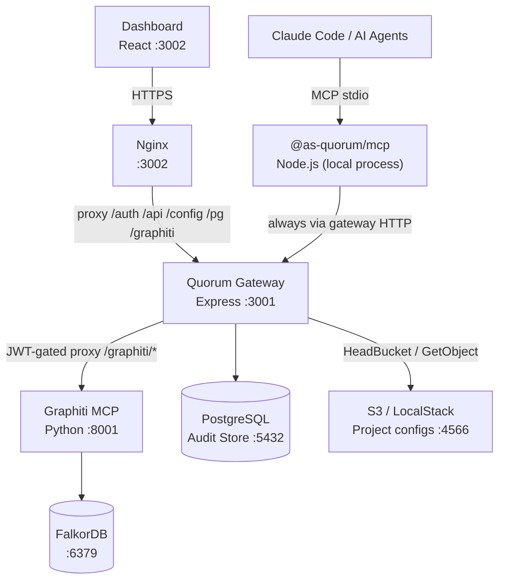
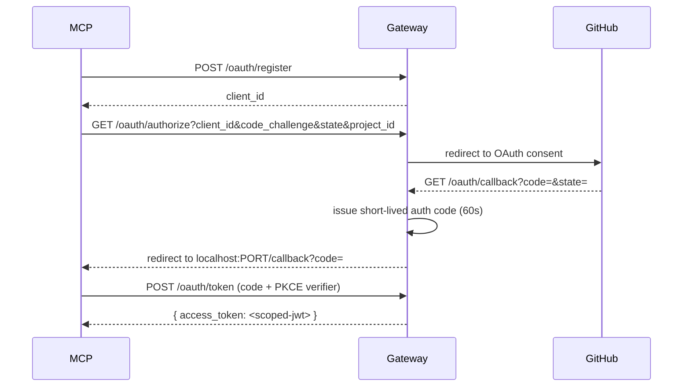
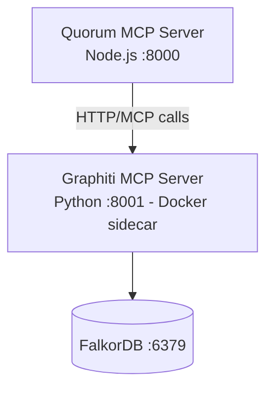
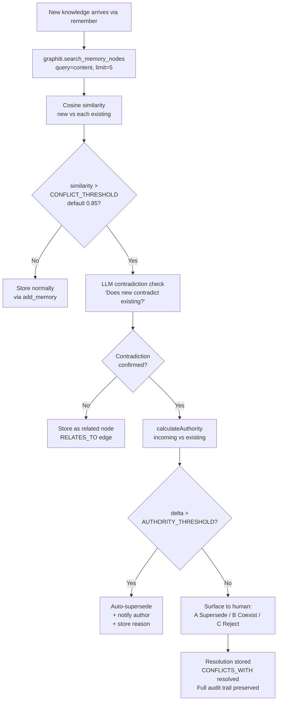
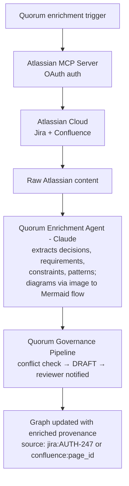

# Quorum — Architecture

## Overview

Quorum is a governance layer that sits between Claude Code / AI agents and Graphiti's temporal knowledge graph. It does not replace Graphiti — it extends it with the one thing Graphiti intentionally omits: human-governed conflict resolution.

---

## Foundational Design Principles

### 1. Governance is Architecture
Every memory operation asks: Who added this? Does it conflict? Should a human be notified? Is this traceable? These are not afterthought checks — they are first-class primitives baked into every tool.

### 2. Constitution over Rules
Quorum does not maintain a blocklist of forbidden knowledge. It maintains a framework for judgment. Like Anthropic's model spec for Claude, Quorum bakes values into how knowledge is reasoned about — not filters applied on top.

### 3. Provenance Always
Every node carries: author, timestamp, confidence, source episode, conflict history. Nothing is anonymous. Nothing is untrackable.

### 4. Human at the Fork
Agents operate autonomously within established knowledge. At genuine ambiguity — a contradiction, a superseded decision, a low-confidence assertion — humans receive a structured decision. Not a wall. A choice.

### 5. Silent Automatic ≠ Safe
Graphiti resolves conflicts automatically by recency. Quorum questions whether recency is the right signal for engineering decisions. A junior engineer's new addition should not silently overwrite a senior architect's 6-month-old ADR.

---

## Component Architecture



The MCP server (`@as-quorum/mcp`, maintained in the `quorum-mcp` repo) hosts the governance layer and audit pipeline. It **always** communicates with the Gateway over HTTP — there is no direct database path. The Gateway enforces JWT auth, injects `group_id` from the JWT claim into every Graphiti call, and exposes the `/pg/*` REST surface for both the MCP server and the Dashboard.

---

## Quorum Gateway

The Gateway (`gateway/src/server.js`) is an Express service on port 3001 that fronts every shared backend. It is the single trust boundary between humans/agents and the data plane (Graphiti, PostgreSQL, S3). The MCP server, the Dashboard, and external automations all authenticate against the Gateway with ES256 JWTs.

### API Surface

| Method | Path | Purpose |
|---|---|---|
| GET | `/auth/github` | Initiate GitHub OAuth for dashboard (redirects to GitHub → `/oauth/callback`) |
| POST | `/auth/token` | Exchange a GitHub PAT for a slim Quorum JWT `{ sub, is_admin }` (CI fallback — no browser required) |
| POST | `/auth/refresh` | Refresh an unexpired JWT — extends `exp` without re-running OAuth |
| GET | `/auth/projects` | **Deprecated (410 Gone)** — use `GET /user/profile/{sub}` instead |
| POST | `/auth/switch` | **Deprecated (410 Gone)** — set `X-Quorum-Project` header instead |
| GET | `/user/profile/:username` | Returns the full profile for a user: all projects, roles, `is_owner` flag. Self/admin/shared-project access rules apply. v0.3 replacement for JWT role claims. |
| POST | `/config/transfer-ownership` | Transfer project `owner` to another member. Actor must be owner or admin (admin cannot self-assign). Audited. |
| POST | `/config/update-role` | Update a member's role in the project config. Actor must be owner or admin. Audited + profile-cache invalidated. |
| GET | `/admin/config` | Platform admin list (`configs/.quorum`). Admin-only. |
| POST | `/admin/users` | Add/remove platform admins. Admin-only. Audited. |
| GET | `/.well-known/jwks.json` | Public JWKS for ES256 verification — consumed by MCP server, Dashboard, and any third-party verifier |
| GET | `/.well-known/oauth-authorization-server` | RFC8414 metadata — MCP clients auto-discover all OAuth endpoints from here |
| POST | `/oauth/register` | RFC7591 dynamic client registration — MCP client self-registers, no manual setup |
| GET | `/oauth/authorize` | Start PKCE S256 flow → redirect to GitHub |
| GET | `/oauth/callback` | Unified GitHub OAuth callback — handles both dashboard and MCP PKCE flows. Issues scoped Quorum JWT (dashboard) or short-lived auth code (MCP) |
| POST | `/oauth/token` | Exchange auth code + PKCE verifier → Gateway-MCP ES256 JWT |
| POST | `/graphiti/*` | JWT-authenticated proxy to Graphiti. `group_id` is injected from the JWT claim (clients cannot spoof project scope) |
| GET\|POST\|PATCH | `/pg/*` | JWT-authenticated REST API over PostgreSQL — used by Dashboard and MCP server for versions, audit, pending decisions |
| GET | `/pg/audit/lineage/:topic/:key` | Ordered audit trail for a knowledge node (JOIN audit_log + version_audit_links) |
| POST | `/config/upload` | Onboard a new project — validate config, upload to S3, sync to DDB. Idempotent-fail: 409 if project already exists. Auth: `X-Quorum-Sync-Token` or `principal_architect` JWT |
| GET | `/config/:projectId` | Fetch a project's `quorum.config.json` from S3 (cached) |
| POST | `/config/validate` | Validate a config payload against the Zod schema before write — no auth required |
| GET | `/schema/config` | Serve `quorum.config.schema.json` for editor validation and autocomplete — no auth required |
| POST | `/bump/:topic/:key` | Confidence bump on recall — `X-Quorum-Token` shared-secret auth, called by the MCP server |
| GET | `/api/stats` | Dashboard BFF — graph counts, confidence distribution, recent activity |
| GET | `/api/graph` | Dashboard BFF — node + edge payload for Cytoscape rendering |
| GET | `/api/knowledge` | Dashboard BFF — paginated knowledge browser |
| GET | `/api/search` | Dashboard BFF — semantic search proxied to Graphiti |
| POST | `/api/review/:id` | Dashboard BFF — approve / reject / request_changes on a DRAFT entry |
| POST | `/api/bump/:topic/:key` | Dashboard BFF — manual confidence bump from a logged-in user |
| GET | `/health` | Composite health probe — checks PostgreSQL, Graphiti, FalkorDB (TCP), and S3 (HeadBucket) |

### Auth Flow

There are two auth paths sharing a single GitHub OAuth callback (`GET /oauth/callback`):

**Dashboard OAuth flow** (`GET /auth/github` → GitHub → `GET /oauth/callback`) — v0.3 slim JWT:

```mermaid
sequenceDiagram
    participant Browser
    participant Gateway
    participant Redis
    participant DDB
    Browser->>Gateway: GET /auth/github (dashboard initiates)
    Gateway->>GitHub: redirect to OAuth consent
    GitHub-->>Browser: authorize
    Browser->>Gateway: GET /oauth/callback?code=&state=
    Gateway->>GitHub: exchange code → GitHub user profile
    Gateway-->>Browser: redirect login#token=<slim-jwt: {sub, is_admin}>
    Browser->>Gateway: GET /user/profile/{sub} (Bearer slim-jwt)
    Gateway->>Redis: profile:{sub} (cache hit or DDB miss)
    Redis-->>Gateway: { projects: [...] }
    Gateway-->>Browser: full profile with projects + roles
    Note over Browser: 1 project → auto-select; n projects → show selector
    Note over Browser: Active project stored in X-Quorum-Project header on all subsequent requests
```

**MCP PKCE flow** (OAuth 2.1, `GET /oauth/authorize` → GitHub → `GET /oauth/callback`):



The gateway discriminates between the two flows using separate in-memory Maps: `pendingStates` (dashboard CSRF states set by `GET /auth/github`) and `pkceStore` (MCP PKCE sessions set by `GET /oauth/authorize`). A callback with a state in `pendingStates` follows the dashboard path; one in `pkceStore` follows the MCP path.

PAT-based exchange (`POST /auth/token`) is a CI fallback: the caller submits a GitHub PAT, the Gateway verifies it against `GET https://api.github.com/user`, then performs the same member lookup and JWT signing.

### Graphiti Proxy Behaviour

Every `/graphiti/*` call is intercepted by JWT middleware. The Gateway:

1. Verifies the ES256 signature against its private key (matching JWKS).
2. Extracts `sub` and `is_admin` from the slim JWT. Reads `X-Quorum-Project` header as active project. Resolves `role`, `base_confidence`, `is_owner` from the Redis profile cache (`profile:{sub}`).
3. Rewrites the request body to inject `group_id` (= active project) — overwriting any client-supplied value. This means even if a caller sends `group_id: "project-B"`, the Gateway substitutes the project from the header/profile. Project isolation is enforced at the gateway regardless of payload manipulation.
4. Forwards the rewritten request to the Graphiti sidecar.
5. Streams the SSE/JSON response back to the caller unchanged.

### S3-Backed Project Config + Redis Cache (v0.3)

Project configs live at `s3://quorum-configs/<group_id>.quorum.json` (flat bucket — no subdirectories). The Gateway caches them in Redis (`config:{group_id}`, TTL from `QUORUM_CONFIG_CACHE_TTL`, default 300s). On cache miss the config is fetched from S3 and written back to Redis. DynamoDB is **no longer** used as a config cache (the `quorum-configs` DDB table is retired).

User profiles are cached in Redis under `profile:{github_username}` (TTL from `QUORUM_PROFILE_CACHE_TTL`, default 300s) — sourced from `quorum-user-projects` DDB on cache miss. Cache invalidation is triggered immediately on every governance write (`POST /config/update-role`, `POST /config/transfer-ownership`, `POST /admin/users`) via `redis.del()` + pub/sub publish to `quorum:invalidate`.

The platform admin list (`configs/.quorum` in S3) is cached under `admin:platform` in Redis (TTL from `QUORUM_ADMIN_CACHE_TTL`, default 300s) and loaded at gateway startup.

Configs are validated against the Zod schema on every load — an invalid config is a hard startup failure for that project.

The canonical JSON Schema is served publicly at `GET /schema/config` for editor tooling:

```json
{
  "$schema": "http://localhost:3001/schema/config",
  "group_id": "macquarie-payments",
  "members": [
    { "name": "Ayan", "team": "platform", "role": "principal_architect",
      "github_username": "ayansasmal", "git_email": "ayan@example.com" }
  ],
  "roles": {
    "principal_architect": { "base_confidence": 0.9 },
    "senior_engineer":     { "base_confidence": 0.75 },
    "engineer":            { "base_confidence": 0.6 }
  },
  "domains": {
    "auth": { "conflict_threshold": 0.85, "required_reviewer_teams": ["platform"] }
  },
  "thresholds": { "conflict_threshold": 0.85, "authority_threshold": 0.20 }
}
```

**Field roles:**

| Field | Type | Role |
|-------|------|------|
| `group_id` | string, required | Canonical identifier — S3 key prefix, DDB primary key, JWT `project` claim, Graphiti namespace. Must be `^[a-z0-9-]+$`. |
| `project` | string, optional | Display name shown in the dashboard project picker. Falls back to `group_id` if absent. Never used as a lookup key. |
| `members` | array | Team roster with identity signals (`github_username`, `git_email`) and role assignment. |
| `roles` | map | Base confidence floors by role name. Missing roles default to `0.5`. |
| `domains` | map | Per-domain `conflict_threshold` and `required_reviewer_teams` overrides. |
| `thresholds` | object | Global `conflict_threshold` (default `0.85`) and `authority_threshold` (default `0.20`). |
| `notifications` | object | Optional webhook URL for conflict review notifications (GAP-17). |
| `guest_access` | boolean | Allow any GitHub-authenticated user read-only access. Default `false`. |

The MCP server discovers its project context by walking up the working-directory tree looking for a `.quorum` file. The file sets `QUORUM_GATEWAY_URL` and `QUORUM_PROJECT_ID` — these together define which Gateway is used and which config governs this session.

---

## Dashboard Architecture

The Dashboard (`dashboard/`) is a React + Vite SPA on port 3002, served via Nginx in production. It is the human surface for everything the MCP server does: browsing the graph, resolving conflicts, approving drafts, walking the audit timeline, and editing project config.

### Pages

| Page | Renders |
|---|---|
| Stats | Aggregate counts (active / superseded / draft / deprecated), confidence histogram, recent activity feed |
| Knowledge Graph | Cytoscape.js-rendered force-directed graph. Click a node for full detail, supersession chain, and outbound edges |
| Pending Decisions | DRAFT entries awaiting review and unresolved CONFLICTS_WITH edges. Approve / reject / request_changes inline |
| Knowledge Browser | Paginated list filterable by topic, domain, status, author. Click through to version history |
| Audit Timeline | Append-only feed from PostgreSQL — every `remember`, `forget`, `review`, and conflict resolution with SHA256 chain link |
| Config Editor | Edit `quorum.config.json` for the current project. Validates against schema before PUT |
| System Status | Live `/health` probe — PostgreSQL, Graphiti, FalkorDB, S3 component breakdown |

### Session Management

The Dashboard uses a dual-timer pattern around the JWT `exp` claim:

- **Warning banner** — appears when `exp - now < 5 min`. Counts down. Clicking "Stay signed in" calls `POST /auth/refresh` and silently extends the session.
- **Expired modal** — appears when `now >= exp`. Blocks the UI. Clicking "Sign in again" opens a popup window to `/auth/github`. On successful re-auth, the popup posts the new JWT back to the parent window and the modal dismisses without losing in-progress state.

Both timers are recalculated whenever a new JWT lands (initial sign-in, refresh, or popup re-auth).

### Nginx Proxy Config

Nginx serves the static SPA bundle and proxies API traffic to the Gateway:

```
location /auth      → http://gateway:3001
location /api       → http://gateway:3001
location /config    → http://gateway:3001
location /health    → http://gateway:3001
location /pg        → http://gateway:3001
location /graphiti  → http://gateway:3001
location /projects  → http://gateway:3001
location /          → static SPA (index.html fallback)
```

The browser never talks to Graphiti, PostgreSQL, or S3 directly — every backend call goes through Nginx → Gateway, which enforces auth and project scope.

---

## Graphiti Integration

### Runtime Architecture

Graphiti is **Python-only** — it has no npm or Node.js package. Quorum (Node.js) calls Graphiti via HTTP. Graphiti runs as a Python Docker sidecar alongside Quorum.



Quorum never imports Graphiti. It calls it like any other HTTP service.

### MCP Transport — Streamable HTTP + Session Handshake

Graphiti's MCP server speaks the **streamable-http** transport: JSON-RPC 2.0 over `POST /mcp`. The first call must be an `initialize` request — Graphiti returns an `Mcp-Session-Id` HTTP header which the client is required to echo back on every subsequent call. The Quorum Graphiti client (`src/graph/client.js`) caches this session ID in-process and reuses it for the lifetime of the connection.

Responses arrive in one of two shapes — the client must handle both:

- **SSE envelope** — `Content-Type: text/event-stream`, body framed as `data: {...json...}\n\n`
- **Plain JSON** — `Content-Type: application/json`, body is the raw JSON-RPC response

The current Graphiti tool names differ from earlier versions of this document:

| Quorum operation | Graphiti tool name |
|---|---|
| Store knowledge | `add_memory` (was `add_episode`) |
| Search facts/edges | `search_memory_facts` (was `search_facts`) |
| Search nodes | `search_memory_nodes` |

The Quorum client also generates UUIDs client-side and passes them as the `uuid` parameter on `add_memory` calls — this lets the audit pipeline reference the Graphiti node ID before the call returns.

### LLM Configuration for Graphiti Sidecar

```
Local dev:    OPENAI_API_KEY + gpt-4o-mini + text-embedding-3-small
              → Proven stable with Graphiti structured output pipeline

Production:   AWS Bedrock Claude Sonnet + Bedrock Titan Embeddings
              → IAM auth, no API keys, enterprise-grade security
              → Fully AWS-native for Macquarie deployment

Note:         Graphiti supports Anthropic direct API but warns structured
              output support varies. OpenAI is the validated default.
              Claude Sonnet 4.5 now supports structured output — verify
              with Graphiti's test suite before switching in production.
```

### What Graphiti Provides (Use As-Is)
- Bi-temporal model — `valid_at`, `invalid_at`, `expired_at` on every edge
- Automatic entity and relationship extraction from text via LLM
- Hybrid search — semantic embeddings + BM25 keyword + graph traversal
- Incremental graph updates without batch recomputation
- `group_id` namespacing for team isolation
- FalkorDB, Neo4j, Amazon Neptune backends

### What Quorum Adds
- Engineering-domain entity types (Decision, Pattern, Constraint, Runbook, Requirement)
- Authority weighting — not all writes are equal
- Human-in-the-loop governance at conflict points
- Reason capture — WHY was this changed, not just WHEN
- Structured conflict resolution workflow with outcome storage
- Confidence scoring beyond recency
- Versioning — immutable nodes, full version chain, triggered_by provenance
- Dual-store audit pipeline with SHA256 tamper-evident chain
- Export to Markdown and Confluence
- Self-evolving Claude Code skill

### HTTP Calls from Quorum to Graphiti

```
remember()  →  POST /mcp {tool: "search_memory_nodes"}  (conflict check)
            →  POST /mcp {tool: "add_memory"}           (store if clear)

recall()    →  POST /mcp {tool: "search_memory_nodes"}  (exact match)
            →  POST /mcp {tool: "search_memory_facts"}  (related edges)

search()    →  POST /mcp {tool: "search_memory_nodes"}  (semantic)
            →  POST /mcp {tool: "search_memory_facts"}  (relationships)

reflect()   →  POST /mcp {tool: "add_memory"}           (batch store learnings)

forget()    →  (soft deprecation — new SUPERSEDED version, no Graphiti delete)
```

Every call carries the `Mcp-Session-Id` header from the `initialize` handshake.


---

## Entity Schema

Quorum extends Graphiti's default entity types with engineering-specific ones:

```
Decision
  Properties: rationale, alternatives_considered, status, domain
  Use for: ADRs, architectural choices, technology selections

Pattern
  Properties: implementation, when_to_use, when_not_to_use, domain
  Use for: reusable code patterns, design patterns, conventions

Constraint
  Properties: type (NFR/compliance/technical), source, impact, domain
  Use for: non-functional requirements, compliance rules, limits

Runbook
  Properties: steps, triggers, rollback, domain
  Use for: operational procedures, incident playbooks, how-tos

Requirement
  Properties: acceptance_criteria, priority, source, domain
  Use for: business rules, feature requirements, acceptance criteria
```

Edge types:

---

## Versioning Model

Every knowledge node is **immutable once written**. Changes create new versions — never edits in place. `topic:key` is the stable identifier. `version` is an incrementing integer. Only one version is ACTIVE at any time. All previous versions are SUPERSEDED — never deleted.

### Version Record Structure

```json
{
  "topic": "auth",
  "key": "token-strategy",
  "version": 3,
  "status": "ACTIVE",
  "content": "JWT for Lambda services, session tokens for non-Lambda internal",
  "content_hash": "sha256:...",
  "author": "ayan",
  "created_at": "2024-12-01T10:28Z",
  "created_by_audit": "audit_entry_1389",

  "supersedes": {
    "version": 2,
    "reason": "ADR-042 nuanced after Lambda constraint discovered",
    "triggered_by": "conflict_resolution",
    "conflict_id": "conflict_abc123"
  }
}
```

### triggered_by Enum

Every version records what workflow produced it:

```
conflict_resolution   → human resolved a conflict, new version created
engineer_decision     → manual update via remember()
pr_merge              → PR ingestion created new version
atlassian_sync        → Confluence/Jira update triggered re-ingestion
confidence_decay      → staleness flagged, knowledge reviewed + updated
reflect               → Claude post-task reflection created new version
```

### Audit ↔ Version Bidirectional Reference

Version records and audit entries reference each other. Nothing exists without a paper trail.

```
audit_entry_1389
  operation: conflict_resolution
  result: superseded v2, created v3
  version_impact:
    versions_superseded: [{ version: 2, status_before: ACTIVE }]
    versions_created:    [{ version: 3, status: ACTIVE }]
        ↕ bidirectional
auth:token-strategy v3
  created_by_audit: audit_entry_1389
```

This means:
- Walk from any version → find the exact audit entry that created it
- Walk from any audit entry → find the version it produced
- Tamper with a version → content hash mismatch detected via audit chain

### Temporal Recall

Versioning enables point-in-time reconstruction:

```javascript
// Default — current version
recall("auth", "token-strategy")
→ v3 (ACTIVE)

// Full version history
recall("auth", "token-strategy", { history: true })
→ v3 + v2 + v1 with lineage

// What was active on a specific date
recall("auth", "token-strategy", { at: "2024-07-01" })
→ v2 (was ACTIVE on that date)

// Specific version
recall("auth", "token-strategy", { version: 1 })
→ v1 with note: "superseded by v2 on Jun 2024"
```

Temporal recall answers: **"What did Quorum know when PR #847 was merged?"** — deterministically, from the audit chain.

### How Claude Surfaces Version Changes

When a node has been recently updated, Claude flags it:

```
[Quorum: auth:token-strategy | v3 ACTIVE | @ayan | Dec 2024]
"JWT for Lambda, session tokens for non-Lambda internal"

ℹ️  Updated 2 weeks ago from v2.
    Previous: "JWT for all services" (@senior-architect, Jun 2024)
    Reason: "ADR-042 nuanced after Lambda constraint discovered"
```

When Claude loads a version that was superseded since last session:

```
⚠️  auth:token-strategy was updated since your last session (2 days ago).
    You had: v2 — "JWT for all services"
    Current: v3 — "JWT for Lambda, sessions for non-Lambda"
    → Reloading before proceeding
```

### Secondary Store — Version Tables

> **v0.3 id schema.** All identifier columns use the `q_*` prefix scheme — `q_projects.q_project_id`, `q_keys.q_key_id`, etc. The legacy UUID-based tables (`projects`, `knowledge_keys`) have been retired. Migration is one-way; new installs receive the `q_*` schema from `gateway/src/shared/config/migrations.js`.

The PostgreSQL secondary store gains two new append-only tables (legacy column names shown for clarity — production schema uses `q_*` id columns):

```sql
-- Knowledge version snapshots (append-only)
CREATE TABLE knowledge_versions (
  id              SERIAL PRIMARY KEY,
  topic           TEXT NOT NULL,
  key             TEXT NOT NULL,
  version         INTEGER NOT NULL,
  status          TEXT NOT NULL,       -- ACTIVE | SUPERSEDED | DEPRECATED
  content_hash    TEXT NOT NULL,
  author          TEXT NOT NULL,
  created_at      TIMESTAMPTZ NOT NULL,
  created_by_audit TEXT NOT NULL,      -- audit entry ID
  supersedes_version INTEGER,
  supersedes_reason  TEXT,
  triggered_by    TEXT NOT NULL,
  conflict_id     TEXT,
  -- Agent identity (v0.3) — written by set_agent_context gate in the MCP
  agent_id        TEXT,                -- kebab-case agent identifier (e.g. "claude-code")
  session_id      TEXT,                -- server-derived: sess_ + 8 hex chars (hash of PID+hrtime)
  author_type     TEXT NOT NULL DEFAULT 'agent', -- 'agent' for all MCP writes; reserved for future 'human' dashboard writes
  UNIQUE(topic, key, version)          -- immutable once written
);

-- Bidirectional version ↔ audit links
CREATE TABLE version_audit_links (
  audit_entry_id  TEXT NOT NULL,
  topic           TEXT NOT NULL,
  key             TEXT NOT NULL,
  version         INTEGER NOT NULL,
  link_type       TEXT NOT NULL,       -- created | superseded
  created_at      TIMESTAMPTZ NOT NULL
);
```

No UPDATE or DELETE ever runs on these tables. Append-only is enforced at the application layer and via PostgreSQL row-level security.

### CLI — Version History

```bash
quorum history auth:token-strategy

# auth:token-strategy — Version History
# ──────────────────────────────────────────────────────
# v3 ● ACTIVE      @ayan               Dec 01 2024
#    "JWT for Lambda, sessions for non-Lambda internal"
#    Triggered by: conflict_resolution
#    Reason: ADR-042 nuanced after Lambda constraint discovered
#    Audit: entry_1389
#
# v2   SUPERSEDED  @senior-architect   Jun 01 2024
#    "Use JWT for all services"
#    Triggered by: engineer_decision
#    Reason: Lambda services don't support sessions
#    Superseded by v3 on Dec 01 2024 | Audit: entry_1389
#
# v1   SUPERSEDED  @junior-dev         Jan 15 2024
#    "Use session tokens for all services"
#    Triggered by: engineer_decision
#    Superseded by v2 on Jun 01 2024 | Audit: entry_1247
```


```
SUPERSEDES      → this knowledge replaces previous knowledge
DEPENDS_ON      → this knowledge requires the other to be true
CONFLICTS_WITH  → contradicts (unresolved conflict marker)
INFORMED_BY     → derived or learned from the other
RELATES_TO      → general semantic relationship
```

---

## Governance Flow

### Conflict Detection



### Authority Scoring

```javascript
function calculateAuthority(episode) {
  const recency = Math.exp(-AGE_DECAY * daysSince(episode.created_at));
  const access = Math.log1p(episode.access_count || 0) / 10;
  const confidence = episode.confidence || 0.5;
  return (confidence * 0.5) + (recency * 0.3) + (access * 0.2);
}
```

Authority is intentionally simple for v0.1. Role/seniority weighting can be added later via team config without breaking the interface.

### Confidence Lifecycle

```
Initial value   →  author-provided (default 0.7)
On recall       →  +0.01 (frequently recalled = more trusted)
On age          →  -0.005 per week without access (staleness decay)
On conflict     →  -0.1 if a conflict is raised against it
On resolution   →  +0.1 if conflict resolved in its favour
                   marked superseded if resolved against it
```

---

## MCP Tool Specifications

### `remember(topic, key, content, author, confidence?, tags?)`

Stores new engineering knowledge with full governance pipeline.

Input:
```json
{
  "topic": "auth",
  "key": "token-strategy",
  "content": "Use JWT for external services, session tokens for internal. Rationale: stateless lambdas require JWT, internal services benefit from session revocation.",
  "author": "ayan",
  "confidence": 0.9,
  "tags": ["auth", "security", "lambda"]
}
```

Output (no conflict):
```json
{
  "status": "stored",
  "episode_id": "ep_abc123",
  "nodes_created": 2,
  "edges_created": 1
}
```

Output (conflict detected):
```json
{
  "status": "conflict_detected",
  "existing": {
    "content": "Use session tokens always",
    "author": "senior-architect",
    "created_at": "2024-09-01",
    "confidence": 0.85
  },
  "conflict_reason": "Directly contradicts token strategy for internal services",
  "options": ["supersede", "coexist", "reject"],
  "requires_human": true
}
```

### `recall(topic, key)`

Retrieves knowledge by exact topic:key with structured XML injection.

Output:
```xml
<quorum_memory topic="auth" key="token-strategy" confidence="0.9"
               author="ayan" updated="2024-12-01"
               relates_to="auth:delegation-flow">
  Use JWT for external services, session tokens for internal.
  Rationale: stateless lambdas require JWT, internal services benefit
  from session revocation capability.
</quorum_memory>
```

XML format is intentional — Claude's attention mechanism responds better to structured, labelled context than raw prose.

### `search(query, domain?, limit?)`

Semantic search using Graphiti hybrid search.

Input:
```json
{
  "query": "how should we handle authentication for internal services",
  "domain": "auth",
  "limit": 5
}
```

Output: ranked array of nodes with provenance and confidence.

### `reflect(task_summary, decisions?, patterns?, constraints?)`

Post-task self-evolution. Called by Claude Code skill after task completion.

Internal flow:
1. LLM extracts learnable knowledge from task_summary
2. Classifies each as Decision / Pattern / Constraint / Runbook
3. Calls remember() for each
4. Returns summary of what was added and any conflicts surfaced

### `export(topic?, format)`

Exports knowledge to human-readable format.

Formats: `markdown` | `confluence`

Output includes:
- Active knowledge with full detail
- Superseded history with reasons
- Resolved conflicts with decisions
- Knowledge stats (total nodes, confidence distribution, access patterns)

### `forget(topic, key, reason, author)`

Deprecates knowledge. Never hard deletes.

- Sets `expired_at` on Graphiti edges
- Stores reason as episode metadata
- Creates audit entry
- `reason` is a required field — enforced at tool level

---

## Self-Evolving Skill Design

The Claude Code skill (bundled with `@as-quorum/mcp` at `skill/SKILL.md`) instructs Claude to:

**At session start:**
- Call `search()` with current task description
- Load relevant domain context into working memory
- Note which topics are most relevant

**During task:**
- Call `recall()` when making implementation decisions
- Prefer Quorum knowledge over generic best practices
- Flag when Quorum knowledge seems outdated or incomplete

**After task completion:**
- Reflect: "What did I learn that isn't in Quorum?"
- Extract decisions, patterns, constraints discovered
- Call `remember()` for each with high confidence if well-validated
- Surface conflicts immediately if any arise

**Self-check questions:**
- "Did I make a decision a future engineer should know about?"
- "Did I discover a domain constraint not in Quorum?"
- "Did I apply a pattern others should reuse?"
- "Did existing Quorum knowledge lead me astray?"

---

## Export Format

### Markdown

```markdown
# {Topic} Domain — Engineering Knowledge
> Generated by Quorum | {timestamp} | {n} active nodes

## ✅ Active Knowledge

### {key}
**Summary:** {one-line summary}
**Author:** @{author} | **Confidence:** {score} | **Updated:** {date}
**Tags:** {tags}

{full detail content}

---

## 🔄 Superseded

| Key | Summary | Superseded By | Reason | Date |
|-----|---------|---------------|--------|------|

## ⚔️ Resolved Conflicts

| Key | Conflict | Resolution | Resolved By | Date |
|-----|----------|------------|-------------|------|

## 📊 Stats
- Active nodes: {n}
- Avg confidence: {score}
- Last updated: {date}
- Most accessed: {key}
- Lowest confidence: {key} ({score}) — consider reviewing
```

---

## Atlassian MCP Integration

Quorum connects to Jira and Confluence via the published Atlassian MCP server. This is a read-only enrichment layer — Quorum reads from Atlassian to build richer knowledge, but never writes back (except via the existing Confluence export tool).

### Architecture



### Enrichment Triggers

```
On remember()
  Engineer references a Jira ticket or Confluence URL
  → Quorum auto-fetches and attaches as provenance

On recall()
  Knowledge node has Atlassian reference
  → Fetch latest status (ticket REOPENED? page updated?)
  → Flag if source has changed

On search()
  → Simultaneous search: graph + Jira JQL + Confluence CQL
  → Unified ranked results from all sources

On sync_atlassian()
  → Scheduled proactive check
  → Jira ticket status changed → flag linked knowledge
  → Confluence page version changed → flag for re-enrichment
```

### Jira Knowledge Signals

```
Issue type mapping:
  Bug        → Constraint ("X breaks when Y")
  Story      → Requirement (acceptance criteria)
  Epic       → Domain context
  Spike      → Technical investigation result

Confidence signals from Jira:
  Status: DONE      → confidence +0.05
  Status: REOPENED  → confidence -0.15, flag for review
  Status: CLOSED    → confidence +0.1 after 90 days

Relationship signals:
  "blocks" / "is blocked by" → DEPENDS_ON edges in graph
  "relates to"               → RELATES_TO edges
  "duplicates"               → potential CONFLICTS_WITH
```

### Confluence Knowledge Signals

```
Content type mapping:
  ADR pages          → Decision entity (highest value)
  Runbook pages      → Runbook entity
  Technical designs  → multiple nodes with relationships
  Meeting notes      → decisions with team endorsement

Space authority ranking (configurable):
  Engineering space  → high authority
  Team spaces        → medium authority
  General spaces     → low authority, verify before trusting

Architecture diagrams (deferred — human-assisted):
  Engineer exports diagram as image (any format — Draw.io, Lucidchart, photo)
  Claude vision converts image → Mermaid diagram
  Engineer reviews and corrects Mermaid before storing
  Stored as Pattern/Constraint with Mermaid text (searchable, diffable)
  Original image URL preserved as visual reference
  Mermaid renders natively in Confluence, GitHub, and most wikis
  This approach works on ANY diagram format, not just Draw.io
```

### New Tools

#### `enrich_from_jira(issue_key, knowledge_key?)`
Fetch Jira issue and extract knowledge. Links to existing knowledge node if provided.

#### `enrich_from_confluence(page_id, knowledge_key?)`
Fetch Confluence page and extract knowledge. Handles ADRs, runbooks, technical designs, meeting notes. Diagrams are handled separately via the human-assisted image → Mermaid flow.

#### `search_atlassian(query, sources?)`
Unified search across Jira + Confluence + Quorum graph simultaneously.

#### `sync_atlassian(domain?)`
Proactive sync — checks Atlassian for changes to sources linked from knowledge nodes.

---

## PR Ingestion

PRs are the richest source of engineering knowledge most teams never capture. A PR contains: intent (description), constraint discovery (review comments), decisions (review resolutions), authority signals (approvals), and outcomes (post-merge CI).

### Recommended Approach: GitHub Action on Merge

```yaml
on:
  pull_request:
    types: [closed]
    branches: [main]

jobs:
  quorum-ingest:
    if: github.event.pull_request.merged == true
    steps:
      - run: quorum pr ingest --pr ${{ github.event.number }} --dry-run
```

Dry-run by default initially — engineer reviews what Quorum would extract before committing. Graduate to auto-store after trust is established.

### What Gets Extracted

```
PR description
  → Intent, problem statement, approach chosen
  → Maps to: Decision entity

Review comments (unresolved)
  → Concerns raised but not yet addressed
  → Maps to: open issues, flagged for follow-up

Review resolutions (reviewer raised concern, author agreed)
  → Both parties validated this pattern/constraint
  → Maps to: Pattern or Constraint entity (higher confidence)

Approvals
  → Implicit endorsement of all decisions in this PR
  → Authority elevated by approver's role

Post-merge CI / incident link
  → 90-day outcome tracking
  → No incidents → confidence +0.1
  → Incident linked → confidence -0.3, retrospective triggered
```

### Authority Model for PR Knowledge

```
Source                              Confidence    State
PR description only                 0.50          DRAFT
Review comment (one party)          0.65          DRAFT
Resolved comment (both agreed)      0.75          DRAFT (fast-track review)
Approved PR (any approver)          0.80          DRAFT
Approved by principal architect     0.85          DRAFT (may auto-approve in domain)
Post-merge: no incidents 90 days    +0.10 delta   confidence update
Post-merge: incident linked         -0.30 delta   retrospective triggered
```

### PR + Jira Enrichment

When a PR is linked to a Jira ticket, Quorum fetches the ticket automatically and cross-enriches:

```
PR #847 linked to AUTH-247
  → Fetch AUTH-247 from Jira via Atlassian MCP
  → Extract: business driver, acceptance criteria, stakeholders
  → Attach as context to all PR-extracted knowledge nodes
  → Result: knowledge has both technical implementation AND business reason
```

### New Tool: `ingest_pr(pr_url, options?)`

```javascript
ingest_pr(pr_url, {
  dry_run: true,           // show extractions without storing
  domains: ['auth'],       // filter to specific domains
  fetch_linked_jira: true, // auto-enrich from linked tickets
  auto_approve_if: {       // conditions for skipping DRAFT
    approved_by_role: 'principal_architect',
    domain_track_record: '>= 20'
  }
})
```

---

## Multi-Team Namespacing

Quorum uses Graphiti's `group_id` for team isolation:

```
group_id: "macquarie-payments"    → payments team graph
group_id: "macquarie-auth"        → auth team graph
group_id: "macquarie-shared"      → cross-team shared knowledge
```

Agents query their team graph first, then fall back to shared. Cross-team knowledge promotion requires explicit action — no silent bleed between teams.

---

## Constitutional Rule Testing

Layer 1 rules are invariants — not policies. They require a fundamentally different testing approach from governance logic or LLM calls.

### The Core Question

For every constitutional rule, the test question is not "does this return the right value?" It is: **"Can this invariant ever be violated? By anyone? Under any condition?"**

Every constitutional rule needs tests covering:
- Direct violation attempts
- Privilege escalation (can a principal architect bypass?)
- Indirect bypass (migration scripts, bulk ops, race conditions)
- Dependency upgrade safety (Graphiti version changes)
- MCP tool manifest inspection (no delete tools exposed)

### Three Testing Layers

```
Layer 1 — Constitutional Rules    → Invariant testing (must NEVER be violated)
Layer 2 — Governance Logic        → Behavioural testing (should behave correctly)
Layer 3 — LLM Calls               → Statistical testing (must be accurate enough)
```

These are not the same. Mixing their strategies is a mistake.

### Coverage Requirement

Constitutional code requires **100% line, branch, and function coverage** — no exceptions. Governance logic requires >90%. LLM accuracy requires >90% on the golden dataset.

### CI Enforcement

Constitutional tests are:
- Always blocking — a failure blocks merge
- Never skippable — a CI guard job fails if they were skipped
- Run before all other tests — nothing proceeds if Layer 1 is broken
- Required to be updated when Layer 1 code changes

See TESTING.md for full test specifications and the golden dataset structure for LLM accuracy testing.

---

## Security Considerations

- All knowledge writes are author-attributed — no anonymous additions
- Conflict resolutions require named human decision-maker
- Hard deletes are not exposed via MCP — only soft deprecation
- `group_id` prevents cross-team knowledge bleed
- Audit log is append-only — no retroactive modification
- LLM calls for conflict detection use minimal context — no sensitive data leaked to external APIs if using local models

---

## Performance Characteristics

Inherited from Graphiti:
- Search latency: ~200ms p95 (hybrid search)
- Write latency: ~500ms (entity extraction + graph update)
- Scales independently of graph size via hybrid indexing

Quorum governance overhead:
- Conflict check: +1 Graphiti search call (~200ms)
- LLM contradiction check (if triggered): +500ms-1s
- Authority calculation: <1ms (pure computation)

Total worst case for remember() with conflict: ~2s — acceptable for non-interactive knowledge writes.

---

## Technology Stack

| Layer | Technology | Rationale |
|---|---|---|
| MCP Server | Node.js | Familiar, fast, MCP-native |
| Graph Engine | Graphiti (Python sidecar via HTTP) | Best temporal KG for agents, OSS — Python only, no npm package |
| Graph DB | FalkorDB (default) | Fast, Docker-simple, Graphiti native |
| Alternative DB | Neo4j / AWS Neptune | Enterprise options |
| LLM for Graphiti (local dev) | OpenAI gpt-4o-mini | Proven stable with Graphiti structured output |
| LLM for Graphiti (production) | AWS Bedrock Claude Sonnet | IAM auth, no API keys, enterprise security |
| Embedder (local dev) | OpenAI text-embedding-3-small | Single API key with LLM |
| Embedder (production) | AWS Bedrock Titan Embeddings | Fully AWS-native |
| LLM for Quorum governance | Same as Graphiti LLM | Conflict detection, decision briefs |
| Audit secondary store | PostgreSQL | Append-only, SQL queryable, compliance export |
| Testing | Vitest | Fast, modern, Node-native |
| Container | Docker Compose + K8s Helm | Local dev + production |

### Why OpenAI for local dev?

Graphiti is Python-only and has no npm package. It runs as a Docker sidecar called via HTTP.
Graphiti defaults to OpenAI and explicitly warns that structured output support varies by provider.
OpenAI is the proven stable choice for Graphiti's entity extraction pipeline.

For production at Macquarie or any enterprise — use AWS Bedrock. IAM auth means no API keys
in configuration, Claude Sonnet runs natively, and Titan Embeddings complete the stack.
Anthropic direct API is also supported by Graphiti but verify structured output stability
before relying on it in production Graphiti pipelines.

