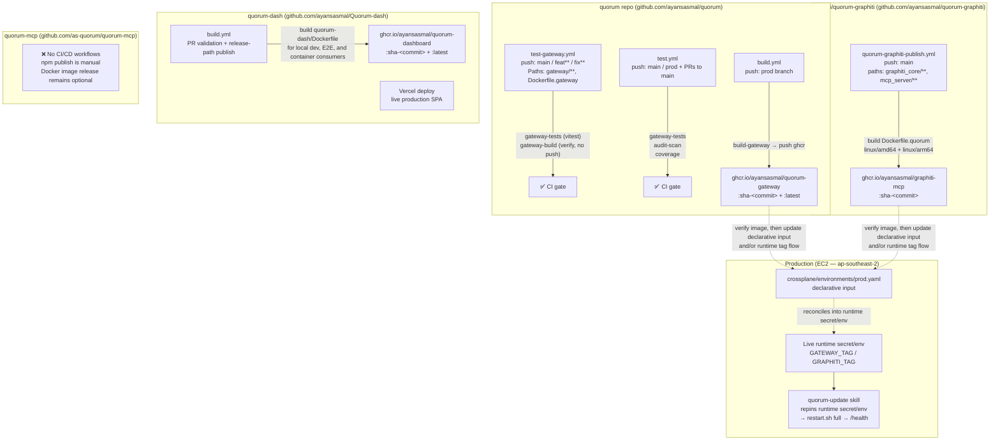
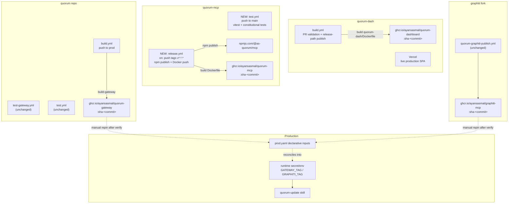
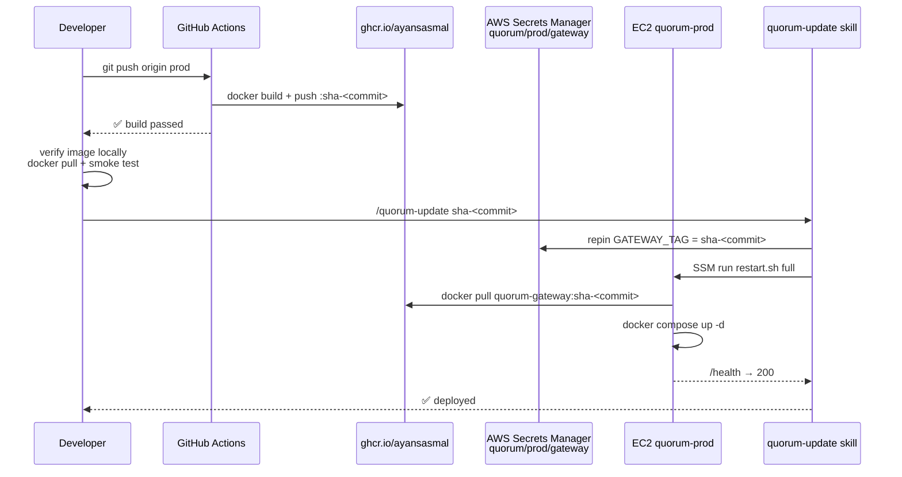
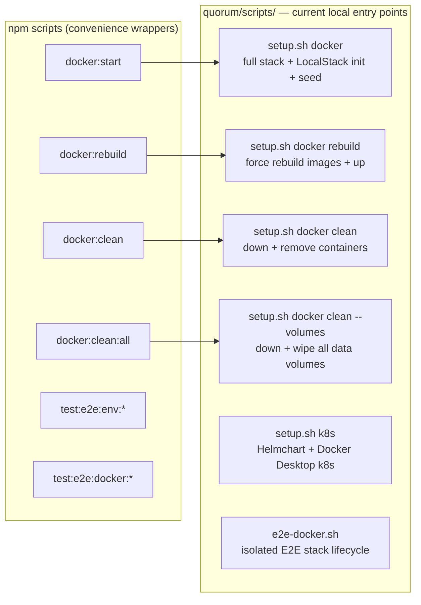
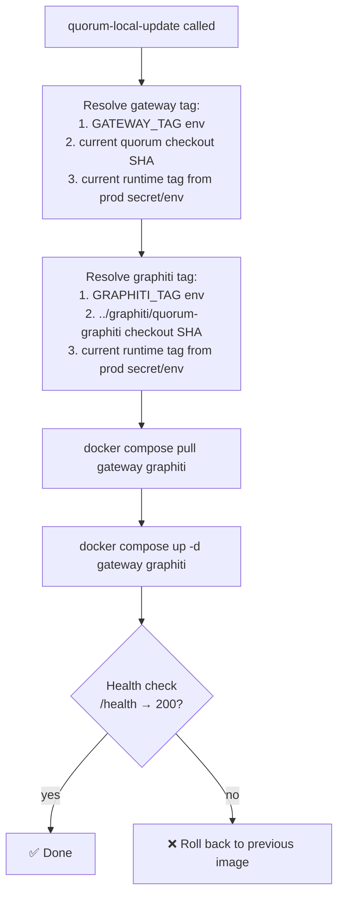

# Quorum — CI/CD & Deployment Reference

Date: 2026-06-30

> This document covers the full build, publish, and deployment picture for every Quorum component.
> For the production AWS setup see [DEPLOYMENT-AWS.md](DEPLOYMENT-AWS.md).
> For the Graphiti image unification plan see [local-graphiti-image-analysis-2026-06-29.md](local-graphiti-image-analysis-2026-06-29.md).

---

## Component Map

```mermaid
graph TD
    subgraph artifacts["Artifacts produced by this project"]
        GW["quorum-gateway\nDocker image\nghcr.io/ayansasmal/quorum-gateway"]
        GR["graphiti-mcp\nDocker image\nghcr.io/ayansasmal/graphiti-mcp"]
        DASH["quorum-dashboard\nDocker image\nghcr.io/ayansasmal/quorum-dashboard"]
        MCP["@as-quorum/mcp\nnpm package\nnpmjs.com/@as-quorum/mcp"]
    end

    subgraph infra["Third-party infrastructure images (pulled, not built)"]
        LS["localstack/localstack:latest\nS3 + DynamoDB emulation"]
        FDB["falkordb/falkordb:latest\nGraph database"]
        PG["postgres:16-alpine\nAudit store"]
        RD["redis:7-alpine\nConfig + profile cache"]
    end

    subgraph testonly["Test-only images (local builds, never published)"]
        MO["mock-openai\nDeterministic LLM mock\nbuilt from mock-openai/Dockerfile"]
        E2E["quorum-e2e\nPlaywright test runner\nbuilt from Dockerfile.e2e"]
    end

    subgraph consumers["Consumers"]
        DEV["Local dev\ndocker compose up"]
        PROD["Production EC2\ndocker-compose.aws.yml"]
        CI_E2E["CI E2E suite\ndocker-compose.e2e.yml"]
    end

    GW --> DEV & PROD
    GR --> DEV & PROD
    DASH --> DEV & CI_E2E
    LS & FDB & PG & RD --> DEV & PROD & CI_E2E
    MO & E2E --> CI_E2E
```



---

## Current CI/CD State

### What's published

| Component | Registry | Tag strategy | Workflow | Trigger |
|-----------|----------|-------------|---------|---------|
| **quorum-gateway** | `ghcr.io/ayansasmal/quorum-gateway` | `sha-<commit>` + `latest` | `quorum/.github/workflows/build.yml` → `build-gateway` | push to `prod` branch |
| **quorum-dashboard** | `ghcr.io/ayansasmal/quorum-dashboard` | `sha-<commit>` + `latest` | `quorum-dash/.github/workflows/build.yml` | PR build validation + publish on release paths |
| **graphiti-mcp** | `ghcr.io/ayansasmal/graphiti-mcp` | `sha-<commit>` | `quorum-graphiti-publish.yml` | push to `main` in fork repo |
| **@as-quorum/mcp** | npmjs.com | semver (`0.x.x`) | manual `npm publish` | manual only |

### What is NOT yet published (gaps)

| Component | Why it matters | What exists | What's missing |
|-----------|---------------|-------------|----------------|
| **@as-quorum/mcp (npm auto-release)** | Engineers install via `npm install -g @as-quorum/mcp` | `commit-and-tag-version` config, `release` script | CI workflow to run `npm publish` on git tag |
| **quorum-mcp (Docker)** | Optional container delivery path for engineers who prefer containers | `quorum-mcp/Dockerfile` (exists, builds from npm) | A dedicated release workflow in the `quorum-mcp` repo, if that delivery path is revived |

### What was optimised (2026-06-29)

| Change | Files | Saving |
|--------|-------|--------|
| Test jobs run in `node:24-alpine` container — `setup-node` step removed | `test.yml`, `test-gateway.yml` | ~25 s per test job |
| `Dockerfile.quorum` upgraded to Python 3.12 + `uv` replaces `pip` | `graphiti/quorum-graphiti/mcp_server/docker/Dockerfile.quorum` | ~80 s per graphiti image build |

> **Runner rule:** test jobs use `container: node:24-alpine`. Build/push jobs stay on bare `ubuntu-latest` — Docker buildx requires kernel features (binfmt_misc, user namespaces) that are unavailable inside Alpine containers.

### What should be removed

| Artifact | Reason |
|----------|--------|
| `Dockerfile.graphiti` | Builds from upstream `getzep/graphiti`, not the fork. Obsolete once GHCR pull is unified. |
| `build-graphiti` job in `build.yml` | Verifies `Dockerfile.graphiti` — will be meaningless once the file is removed. |

---

## Full CI/CD Pipeline — Current State



---

## Full CI/CD Pipeline — Proposed State



---

## Dockerfile Inventory

| File | Stage | Base | Built by | Pushed | Retain? |
|------|-------|------|----------|--------|---------|
| `Dockerfile.gateway` | Multi-stage (builder + runtime) | `node:24-alpine` | `build.yml` `build-gateway` | GHCR | ✅ Yes |
| `Dockerfile` | Single | `node:24-alpine` (runs npm install) | No active workflow in `quorum`; future release work belongs in `quorum-mcp` | Not yet | ✅ Yes — enable there after npm publish |
| `Dockerfile.e2e` | Single | `node:24-alpine` + system Chromium | `e2e-docker.sh` | Never | ✅ Yes — test runner |
| `Dockerfile.graphiti` | Single | `python:3.11-slim` (sparse-clone upstream) | `build.yml` `build-graphiti` (verify-only) | Never | ❌ Remove — superseded by GHCR pull |
| `mock-openai/Dockerfile` | Single | `node:24-alpine` | `docker-compose.e2e.yml` inline | Never | ✅ Yes — E2E-only |
| `quorum-dash/Dockerfile` | Multi-stage (builder + nginx) | `node:24-alpine` + `nginx:alpine` | `quorum-dash/.github/workflows/build.yml` | GHCR | ✅ Yes — used for local dev, E2E, and other container consumers |
| `quorum-mcp/Dockerfile.mcp-test` | Single | `node:24-alpine` | `docker-compose.e2e.yml` mcp-test-runner | Never | ✅ Yes — integration test runner |

---

## Image Tag Strategy

All Quorum-owned images use the same immutable commit-SHA convention:

```
ghcr.io/ayansasmal/<image-name>:sha-<40-char-hex-commit>
```

No `latest` in production. `latest` is acceptable on the `prod`/`main` branch in GHCR as a convenience alias for local pulls, but the EC2 stack always pins an explicit SHA.

| Image | Current prod tag | Tag source repo |
|-------|-----------------|----------------|
| quorum-gateway | `0.4.12` (semver — legacy) | quorum repo |
| graphiti-mcp | `sha-d99abda...` | quorum-graphiti fork |
| quorum-dashboard | Vercel remains the live production path; GHCR image supports local/E2E/container flows | quorum-dash repo |

> **Action:** migrate the declarative `gatewayTag` input from `0.4.12` to `sha-<commit>` to be consistent with graphiti, and keep the runtime `GATEWAY_TAG` flow aligned with that input.

---

## Production Deployment Flow



**Key files:**
- `crossplane/environments/prod.yaml` — declarative deployment input, not the host's direct runtime pin
- `crossplane/bootstrap/docker-compose.aws.yml` — EC2 runtime compose
- `.claude/skills/quorum-update` — repin + re-converge skill
- `crossplane/ops/quorum-restart.sh` — SSM-driven bounce script

---

## Local Deployment — Current State

Local stack startup is spread across shell scripts with no Claude skill wrapper. The equivalent of the production skills does not exist for local dev.



**Dashboard local options (as of 2026-06-29):**
- `npm run docker:start:dash` — build + start at `http://localhost:3002` (nginx, no hot-reload)
- `cd quorum-dash && npm run dev` — Vite dev server with full hot-reload at `http://localhost:3002`
- Use Docker for "just runs" reliability; use Vite dev for active React work

**Remaining pain points:**
- No single "status" command for the local stack
- No skill equivalent — everything requires terminal navigation and remembering npm script names
- Graphiti still built locally from upstream (see separate analysis)
- No GHCR pull path — any image change requires a full local rebuild

---

## Local Deployment — Proposed Skills

Modelled exactly on the production skills (`quorum-resume`, `quorum-suspend`, `quorum-restart`, `quorum-update`). Each wraps a single well-defined operation with a mandatory confirmation gate before touching the running stack.

### Skill: `quorum-local-start`

**Purpose:** Start the full local Quorum stack (or restart if already running).  
**Wraps:** `scripts/setup.sh docker`  
**Options:** `dev` (default — bind-mount src for hot reload), `prod` (pull GHCR images, no bind mount)  
**Checks before:**
- Docker daemon running
- `.env` exists with `OPENAI_API_KEY` set
- Port conflicts (3001, 4566, 5432, 6379, 6380, 8001)

**Example invocation:**
```
/quorum-local-start
/quorum-local-start dev     ← hot-reload gateway src
/quorum-local-start prod    ← run exact GHCR images (no local build)
```

### Skill: `quorum-local-stop`

**Purpose:** Stop all containers without wiping data.  
**Wraps:** `docker compose down` (no `--volumes`)  
**Confirmation:** Show running containers before stopping.

### Skill: `quorum-local-reset`

**Purpose:** Full wipe — stop containers + delete all named volumes (postgres_data, falkordb_data, localstack_data).  
**Wraps:** `scripts/setup.sh docker clean --volumes`  
**Confirmation gate:** Mandatory — names volumes that will be destroyed and asks for explicit approval. Data loss is irreversible.

### Skill: `quorum-local-update`

**Purpose:** Pull the latest GHCR images for gateway and graphiti, then restart the running stack.  
**Resolves tags independently per image:** explicit env override first (`GATEWAY_TAG`, `GRAPHITI_TAG`), then a local component SHA when that component's checkout is present, then the currently configured runtime tag from the production secret/env chain if no local override is available.  
**Wraps:** `docker compose pull gateway graphiti && docker compose up -d gateway graphiti`  
**Confirmation:** Show current vs. new image SHAs before pulling.



### Skill: `quorum-local-logs`

**Purpose:** Tail logs for one or more services.  
**Wraps:** `docker compose logs -f <service>`  
**Default:** gateway + graphiti  
**Options:** `gateway`, `graphiti`, `postgresql`, `falkordb`, `redis`, `localstack`, `all`

### Skill: `quorum-local-status`

**Purpose:** Show health of all local stack services in one view.  
**Wraps:** Calls `/health` on gateway, checks `docker compose ps`, checks LocalStack.  
**Output:**

```
Service       Container       Status     Port
─────────     ───────────     ──────     ────
gateway       quorum-gateway  healthy    :3001
graphiti      quorum-graphi…  healthy    :8001
postgresql    quorum-postgr…  healthy    :5432
falkordb      quorum-falkord  healthy    :6379
redis         quorum-redis    healthy    :6380
localstack    quorum-locals…  healthy    :4566
```

### Skill: `quorum-local-seed`

**Purpose:** Re-seed LocalStack (S3 configs + DDB membership) without restarting the stack.  
**Wraps:** `scripts/init-localstack.sh`  
**Useful when:** LocalStack data was lost after a volume wipe or after adding a new `configs/*.quorum.json` file.

---

## Skill Files to Create

All skills live in `.claude/skills/` following the same pattern as the existing prod skills.

| Skill file | Wraps | Production analogue |
|---|---|---|
| `quorum-local-start.md` | `setup.sh docker [dev\|prod]` | `quorum-resume` |
| `quorum-local-stop.md` | `docker compose down` | `quorum-suspend` (no snapshot) |
| `quorum-local-reset.md` | `setup.sh docker clean --volumes` | `quorum-suspend` + `quorum-resume` fresh |
| `quorum-local-update.md` | `docker compose pull + up` | `quorum-update` |
| `quorum-local-logs.md` | `docker compose logs -f` | (no prod analogue — SSM has its own logging) |
| `quorum-local-status.md` | `docker compose ps` + `/health` | (no prod analogue — use CloudWatch) |
| `quorum-local-seed.md` | `scripts/init-localstack.sh` | (no prod analogue — prod uses real AWS) |

---

## Dashboard CI/CD Ownership

The dashboard (`quorum-dash`) now owns its GitHub Actions workflow and GHCR image publishing. That image is for local development, browser E2E/container flows, and any other non-Vercel container consumers. The live production dashboard remains the Vercel SPA.

### `quorum-dash/.github/workflows/build.yml`

Current responsibilities of that workflow:

- Validate dashboard container builds on pull requests.
- Publish `ghcr.io/ayansasmal/quorum-dashboard` only on the intended release paths.
- Produce the nginx-based dashboard image used by local dev, Docker E2E, and other container consumers.

If Quorum later chooses to add an EC2-consumed dashboard image, that should be treated as a separate future decision. It is not a current production prerequisite.

---

## MCP npm Publish Automation Plan

### Proposed `quorum-mcp/.github/workflows/release.yml`

```yaml
name: Publish @as-quorum/mcp

on:
  push:
    tags: ['v*.*.*']

permissions:
  contents: read
  packages: write
  id-token: write   # for npm provenance

jobs:
  publish:
    runs-on: ubuntu-latest
    steps:
      - uses: actions/checkout@v4
      - uses: actions/setup-node@v4
        with:
          node-version: 24
          registry-url: https://registry.npmjs.org

      - run: npm ci
      - run: npm run build:all

      - run: npm publish --provenance --access public
        env:
          NODE_AUTH_TOKEN: ${{ secrets.NPM_TOKEN }}

      - name: Build and push Docker image
        uses: docker/build-push-action@v6
        with:
          context: .
          push: true
          tags: |
            ghcr.io/ayansasmal/quorum-mcp:sha-${{ github.sha }}
            ghcr.io/ayansasmal/quorum-mcp:latest
          platforms: linux/amd64,linux/arm64
```

**Required secret:** `NPM_TOKEN` (npm automation token from npmjs.com account settings → Access Tokens → Automation)

---

## Docker Compose Simplification Plan

### Problem: Two parallel paths for local dev

Currently:
- `docker:start` builds ALL images from local Dockerfiles (slow, upstream Graphiti)
- No way to run "pull published GHCR images + start" without rebuilding everything

### Proposed: `docker-compose.pull.yml` overlay

A new overlay that overrides image sources to pull from GHCR instead of building:

```yaml
# docker-compose.pull.yml — use published GHCR images (no local build)
services:
  gateway:
    image: ghcr.io/ayansasmal/quorum-gateway:${GATEWAY_TAG:-latest}
    build: !reset  # discard the build: block from base compose

  graphiti:
    image: ghcr.io/ayansasmal/graphiti-mcp:${GRAPHITI_TAG:-latest}
    build: !reset
```

Usage:
```bash
# Pull mode (fast, uses published images — good for product engineers)
COMPOSE_FILE="docker-compose.yml:docker-compose.pull.yml" docker compose up -d

# Build mode (rebuilds from source — good for active gateway/graphiti dev)
docker compose up -d --build
```

The `quorum-local-start prod` skill uses the pull overlay. `quorum-local-start dev` uses the default (build) path but with the `docker-compose.dev.yml` hot-reload overlay.

---

## Summary: Action Items

| # | Action | Status | Who | Effort |
|---|--------|--------|-----|--------|
| 1 | Dashboard local Docker service (`profiles: dashboard`) + 4 npm scripts | ✅ Done | — | — |
| 2 | `quorum-dash/Dockerfile` — three-stage build, BuildKit cache, non-root nginx (:8080) | ✅ Done | — | — |
| 3 | `quorum-dash/.dockerignore` — excludes node_modules, dist, tests, e2e tooling | ✅ Done | — | — |
| 4 | `docker-compose.dash-dev.yml` — hot-reload Vite overlay (bind-mount source) | ✅ Done | — | — |
| 5 | GHA test jobs use `node:24-alpine` container (removed `setup-node`) | ✅ Done | — | — |
| 6 | `Dockerfile.quorum` → Python 3.12 + `uv` replaces `pip` | ✅ Done | — | — |
| 7 | `quorum-dash/Dockerfile.e2e` + `docker-compose.e2e.yml` + `scripts/e2e-docker.sh` — fully isolated browser E2E Docker run (joins `quorum-e2e_e2e` external network) | ✅ Done | — | — |
| 8 | `quorum-dash/.github/workflows/build.yml` publishes the dashboard image to GHCR | ✅ Done | — | — |
| 9 | Optional: add `dashboardTag` to `prod.yaml`, update EC2 compose to consume the dashboard image | ⬜ Future option | Codex | 30m |
| 10 | Add `quorum-mcp/.github/workflows/release.yml`, set `NPM_TOKEN` secret | ⬜ Todo | Codex | 1h |
| 11 | If the Docker delivery path returns, add its release workflow in `quorum-mcp` rather than `quorum/.github/workflows/build.yml` | ⬜ Future option | Codex | 15m |
| 12 | Add `docker-compose.pull.yml` overlay (GHCR pull mode) | ⬜ Todo | Codex | 1h |
| 13 | Remove `Dockerfile.graphiti` + `build-graphiti` CI job (post GHCR unification) | ⬜ Todo | Codex | 30m |
| 14 | Migrate `gatewayTag` from `0.4.12` to `sha-*` in `prod.yaml` | ⬜ Todo | Codex | 15m |
| 15 | Create 7 `quorum-local-*` skills in `.claude/skills/` | ⬜ Todo | Codex | 3h |
| 16 | Document `GRAPHITI_TAG` / `GATEWAY_TAG` in `.env.example` | ⬜ Todo | Codex | 30m |

---

## Reference: Service Port Map

| Service | Host port | Container port | Protocol | Notes |
|---------|-----------|----------------|----------|-------|
| gateway | 3001 | 3001 | HTTP | Central BFF API |
| graphiti | 8001 | 8000 | HTTP (streamable-http JSON-RPC) | Semantic memory sidecar |
| falkordb | 6379 | 6379 | Redis protocol | Graph DB |
| falkordb UI | 3000 | 3000 | HTTP | Browser graph explorer |
| postgresql | 5432 | 5432 | PostgreSQL | Audit + versions |
| redis | 6380 | 6379 | Redis protocol | Config + profile cache |
| localstack | 4566 | 4566 | HTTP | S3 + DynamoDB |
| dashboard (nginx) | 3002 | 8080 | HTTP (nginx) | Built SPA; nginx proxies /api/* → gateway; non-root |
| dashboard (Vite) | 3002 | — | HTTP (Vite) | Hot-reload dev server; run from quorum-dash repo |
| mock-openai | 3003 | 3003 | HTTP | E2E-only LLM mock |
