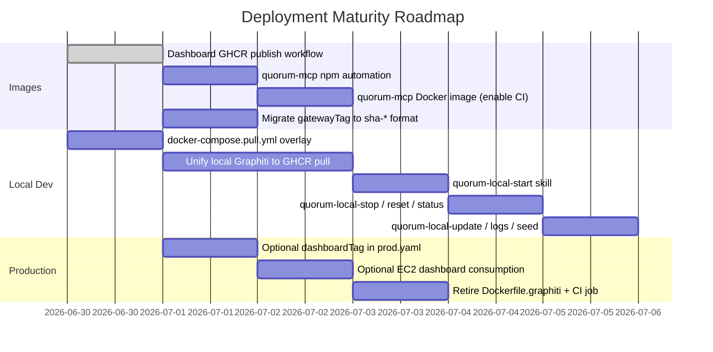

# Quorum — Deployment Guide

> This document is the authoritative deployment reference — current state, options, and roadmap.
> For CI/CD pipelines and image publishing see [CICD-DEPLOYMENT.md](CICD-DEPLOYMENT.md).
> For the production AWS Crossplane setup see [DEPLOYMENT-AWS.md](DEPLOYMENT-AWS.md).

---

## Current Deployment State (2026-06-30)

| Component | Where it runs | How it's deployed | Status |
|-----------|--------------|------------------|--------|
| **Gateway** | EC2 `quorum-prod` (ap-southeast-2) | Docker Compose via Crossplane SSM | ✅ Live |
| **Graphiti MCP** | EC2 `quorum-prod` (sidecar) | Docker Compose via Crossplane SSM | ✅ Live |
| **PostgreSQL** | RDS `quorum-prod` | Crossplane-managed | ✅ Live |
| **FalkorDB** | EC2 `quorum-prod` (container) | Docker Compose | ✅ Live |
| **Redis** | EC2 `quorum-prod` (container) | Docker Compose | ✅ Live |
| **Dashboard SPA** | Vercel | Git push to main | ✅ Live at [quorum-dashboard.ayansasmal.work](https://quorum-dashboard.ayansasmal.work) |
| **LocalStack** | Local dev only | Docker Compose | ✅ Dev-only |
| **MCP Server** | Engineer machines | `npm install -g @as-quorum/mcp` | ✅ Published to npm |

**Declarative image tag inputs** (tracked in `crossplane/environments/prod.yaml` and typically mirrored into the live production secret/env as `GATEWAY_TAG` and `GRAPHITI_TAG`):
```
gatewayTag:  0.4.12   ← semver (migrate to sha-* — see roadmap)
graphitiTag: sha-d99abda38b1181d1f56198f1565510de9564f79b
```

The host runtime source of truth is the production secret/env consumed by the EC2 Docker Compose stack. `prod.yaml` is a declarative Crossplane input to the broader deployment system, not the direct runtime pin on the host.

The dashboard image now publishes from `quorum-dash`, but that GHCR artifact is for local development, browser E2E, and other containerised flows. The live production dashboard remains Vercel.

**Claude skills for production operations:**

| Skill | Does |
|-------|------|
| `/quorum-resume` | Start RDS → EC2 → wait for `/health` |
| `/quorum-suspend` | SSM snapshot → stop EC2 + RDS |
| `/quorum-restart` | SSM bounce: `restart \| recreate \| full` |
| `/quorum-update sha-<commit>` | Repin `GATEWAY_TAG` secret → re-converge → verify `/health` |

---

## Deployment Roadmap



### Action Items

| # | Action | Status | Effort | Docs |
|---|--------|--------|--------|------|
| 1 | Dashboard local Docker service + npm scripts | ✅ Done | — | This doc |
| 2 | GHA test jobs on `node:24-alpine` | ✅ Done | — | [CICD-DEPLOYMENT.md](CICD-DEPLOYMENT.md) |
| 3 | `Dockerfile.quorum` → Python 3.12 + uv | ✅ Done | — | [CICD-DEPLOYMENT.md](CICD-DEPLOYMENT.md) |
| 4 | `quorum-dash` GitHub Actions build + push to GHCR | ✅ Done | — | [CICD-DEPLOYMENT.md](CICD-DEPLOYMENT.md#dashboard-cicd-ownership) |
| 5 | Optional: add `dashboardTag` to `prod.yaml`, update EC2 compose | ⬜ Future option | 30m | [CICD-DEPLOYMENT.md](CICD-DEPLOYMENT.md) |
| 6 | `quorum-mcp` release workflow for npm + Docker | ⬜ Todo | 1h | [CICD-DEPLOYMENT.md](CICD-DEPLOYMENT.md#mcp-npm-publish-automation-plan) |
| 7 | `docker-compose.pull.yml` overlay (GHCR pull mode) | ⬜ Todo | 1h | [CICD-DEPLOYMENT.md](CICD-DEPLOYMENT.md#docker-compose-simplification-plan) |
| 8 | Unify local Graphiti to GHCR pull (remove `Dockerfile.graphiti`) | ⬜ Todo | 2h | [local-graphiti-image-analysis-2026-06-29.md](local-graphiti-image-analysis-2026-06-29.md) |
| 9 | Migrate `gatewayTag` from `0.4.12` to `sha-*` in `prod.yaml` | ⬜ Todo | 15m | — |
| 10 | Create 7 `quorum-local-*` Claude skills | ⬜ Todo | 3h | [CICD-DEPLOYMENT.md](CICD-DEPLOYMENT.md#local-deployment--proposed-skills) |

---

## Architecture: Two Parties, One Stack

Quorum has a clear split between who runs what:

```
Platform Team                          Engineers
─────────────────────────────────      ─────────────────────────────────────
Runs the central Quorum stack:         Connect from their local machine:

  gateway       :3001                    npm install -g @as-quorum/mcp
  dashboard     :3002 †                  quorum install   ← one-time setup
  postgresql    :5432                    quorum init      ← connect to project
  graphiti      :8001
  falkordb      :6379                  Claude Code auto-starts the MCP each
  localstack    :4566 (local/S3)       session. Engineers never touch infra.
```

> † The dashboard (:3002) ships from its own repo —
> [`quorum-dash`](https://github.com/ayansasmal/Quorum-dash) — with its own image
> publishing workflow. Vercel remains the live production path; this repo's chart
> provisions the gateway + backing stores only.

The MCP server runs **locally on each engineer's machine** — not in the platform stack.
It talks to the central gateway over HTTP. Engineers never need database credentials,
Graphiti URLs, or any infrastructure config.

---

## Security Model

All traffic flows through a single path: **MCP → Gateway → Graphiti / PostgreSQL**.

```
Engineer's machine                     Platform stack
──────────────────                     ──────────────────────────────────
Claude Code (MCP client)
  └─ @as-quorum/mcp
       └─ GatewayClient ──── HTTPS ──► Gateway :3001
                  JWT + X-Quorum-Project   ├─ JWT-gated proxy ──► Graphiti :8001
                                           ├─ REST API ──────────► PostgreSQL :5432
                                           ├─ Profile/config cache ► Redis :6379
                                           └─ Config + admin ────► S3 (LocalStack in dev)
```

**Key properties:**

- The MCP never holds database credentials or raw Graphiti URLs
- `OPENAI_API_KEY` lives only on the gateway — the MCP never touches it
- `group_id` is **unconditionally injected** by the gateway from the `X-Quorum-Project` header (v0.3); any caller-supplied value in the request body is silently discarded (BL-01 fix)
- Active project is set via `X-Quorum-Project` request header — JWT is "pure identity" (`sub + is_admin` only); role and ownership are resolved per-request from the Redis profile cache
- Identity chain: GitHub OAuth → ES256 JWT (1h TTL) → `req.user.project` on every request

### Engineer Authentication Flow (OAuth 2.1 + PKCE)

Engineers authenticate once per session via the `authenticate()` MCP tool:

```
1. Claude Code calls authenticate()
2. MCP discovers /.well-known/oauth-authorization-server on gateway
3. MCP registers dynamically via POST /oauth/register → gets client_id
4. MCP generates PKCE code_verifier (32 random bytes) + code_challenge (SHA256/S256)
5. Browser opens → engineer logs in with GitHub
6. Gateway issues ES256 JWT → stored in MCP memory (cleared on restart)
7. All subsequent tool calls use: Authorization: Bearer <jwt>
```

Zero env vars needed for MCP authentication. The SDLC hooks trigger `authenticate()`
automatically at session start when the token is missing or expired.

---

## Option 1 — Docker Compose (recommended for local dev)

### What Runs

```
┌─────────────────────────────────────────────────┐
│  Platform Stack (docker-compose.yml)            │
│                                                 │
│  localstack       → S3 emulation  :4566         │
│  falkordb         → graph DB      :6379, :3000  │
│  postgresql       → audit store   :5432         │
│  graphiti         → LLM sidecar   :8001         │
│  gateway          → central API   :3001         │
│                                                 │
│  dashboard        → nginx SPA     :3002   *opt* │
│  (profile: dashboard — requires ../quorum-dash) │
└─────────────────────────────────────────────────┘

Note: The MCP server is NOT in this stack.
      It runs locally on each engineer's machine via Claude Code.

Dashboard options:
  Docker nginx (opt-in):  npm run docker:start:dash  → http://localhost:3002
  Vite dev server (hot-reload): cd quorum-dash && npm run dev → http://localhost:3002
```

### Prerequisites

```bash
# Docker Desktop
docker --version

# Node.js 20+ (for the MCP server on engineer machines)
node --version   # v20.x.x

# awscli-local (for LocalStack S3 setup)
pip install awscli-local
```

### Setup (Platform Team)

```bash
git clone https://github.com/ayansasmal/quorum
cd quorum

# Copy environment file and fill in your OpenAI key
cp .env.example .env
# Edit .env: set OPENAI_API_KEY, GITHUB_CLIENT_ID, GITHUB_CLIENT_SECRET

# One-command setup: starts stack + creates S3 bucket + uploads configs
./scripts/setup.sh docker

# Verify all components healthy
curl http://localhost:3001/health
# {"status":"healthy","components":{"postgresql":"connected","graphiti":"connected",...}}
```

### Key Environment Variables

```env
# ─────────────────────────────────────────────────────────────
# LLM — used by BOTH Gateway (governance endpoints) and Graphiti
# ─────────────────────────────────────────────────────────────
OPENAI_API_KEY=sk-...
LLM_MODEL_NAME=gpt-4o-mini
EMBEDDER_MODEL_NAME=text-embedding-3-small   # Graphiti only

# PRODUCTION ALTERNATIVE: AWS Bedrock (no API keys needed)
# AWS_ACCESS_KEY_ID=...
# AWS_SECRET_ACCESS_KEY=...
# AWS_REGION=ap-southeast-2
# LLM_MODEL_NAME=anthropic.claude-sonnet-4-5
# EMBEDDER_MODEL_NAME=amazon.titan-embed-text-v2

# ─────────────────────────────────────────────────────────────
# Gateway
# ─────────────────────────────────────────────────────────────
QUORUM_GATEWAY_PORT=3001
POSTGRES_HOST=postgresql
POSTGRES_PORT=5432
POSTGRES_DB=quorum_audit
POSTGRES_USER=quorum
POSTGRES_PASSWORD=quorum_local
GRAPHITI_URL=http://graphiti:8001
FALKORDB_HOST=falkordb
FALKORDB_PORT=6379
QUORUM_CONFIG_BUCKET=quorum-configs
QUORUM_DDB_USER_PROJECTS_TABLE=quorum-user-projects
QUORUM_SYNC_SECRET=                         # EventBridge sync token (optional)
QUORUM_FIRST_ADMIN=                         # GitHub username(s), comma-separated — seeded into configs/.quorum (see "Bootstrapping the first platform admin")

# Redis (config + profile + admin cache, v0.3)
REDIS_URL=redis://redis:6379
QUORUM_CONFIG_CACHE_TTL=300
QUORUM_PROFILE_CACHE_TTL=300
QUORUM_ADMIN_CACHE_TTL=300

# GitHub OAuth (for engineer authentication)
GITHUB_CLIENT_ID=...
GITHUB_CLIENT_SECRET=...

# LocalStack / AWS S3 + DynamoDB
AWS_ENDPOINT_URL=http://localstack:4566
AWS_ACCESS_KEY_ID=test
AWS_SECRET_ACCESS_KEY=test
AWS_REGION=us-east-1

# ─────────────────────────────────────────────────────────────
# MCP Server (set on engineer's machine, not in platform stack)
# ─────────────────────────────────────────────────────────────
# QUORUM_GATEWAY_URL=http://localhost:3001   ← default; change for remote gateway
# QUORUM_AUTHOR=username                     ← optional identity override
```

### Bootstrapping the first platform admin

The platform admin list lives in S3 at `s3://${QUORUM_CONFIG_BUCKET}/configs/.quorum`. Self-serve onboarding needs at least one admin to exist so the first sign-ins can be governed — **with zero admins, no one can promote, manage members, or resolve conflicts.**

Two ways to seed it:

1. **Gateway boot-seed (automatic).** Set `QUORUM_FIRST_ADMIN` (comma-separated for multiple) in the gateway env. On startup `ensureAdminConfig()` writes `configs/.quorum` once, atomically, only if it does not already exist. **If `QUORUM_FIRST_ADMIN` is unset the boot-seed silently does nothing** — this is the most common way to end up with zero admins.

2. **Run-once seed script (explicit, recommended for a fresh real-AWS deploy).** Seed yourself before/independently of the gateway boot:

   ```bash
   # interactive — suggests your `gh` login as the default
   QUORUM_CONFIG_BUCKET=quorum-prod-config AWS_REGION=ap-southeast-2 npm run seed:admin

   # non-interactive (single or comma-separated)
   QUORUM_CONFIG_BUCKET=quorum-prod-config QUORUM_FIRST_ADMIN=octocat,alice \
     AWS_REGION=ap-southeast-2 npm run seed:admin

   # overwrite an existing config
   npm run seed:admin -- --bucket quorum-prod-config --region ap-southeast-2 --force
   ```

   The script writes the same object shape the boot-seed produces, so it is forward-compatible: a later gateway boot finds the config present and no-ops. It is idempotent (skips an existing config unless `--force`). For **LocalStack/dev**, admin seeding is handled automatically by `scripts/init-localstack.sh` (uses `awslocal`) — use `seed:admin` only for real AWS.

   > `github_username` must be the user's **GitHub login** (the value in their OAuth identity), not their display name — a mismatch silently grants no admin rights.

### Engineer Onboarding (one-time)

```bash
# Install the MCP server globally
npm install -g @as-quorum/mcp

# Install Claude Code hooks + skill (run once per machine)
quorum install

# Connect to a project
quorum init
# → prompts for gateway URL + project ID
# → writes .quorum file in the project root

# Done. Claude Code auto-starts the MCP on every session.
# Run authenticate() in Claude Code to log in via GitHub.
```

### Useful Commands

```bash
# Start full stack (gateway + graphiti + postgres + falkordb + redis + localstack)
./scripts/setup.sh docker

# Start dashboard alongside the stack (builds nginx image from ../quorum-dash)
npm run docker:start:dash       # → http://localhost:3002

# Rebuild dashboard image after React code changes, then restart
npm run docker:rebuild:dash

# Stop dashboard only (leaves gateway stack running)
npm run docker:stop:dash

# OR: use Vite dev server for hot-reload during active frontend work
cd ../quorum-dash && npm run dev   # → http://localhost:3002 (hot-reload)

# Stop everything
docker compose down

# Stop and wipe all data
docker compose down -v

# View gateway logs
docker compose logs -f gateway

# Run ops audit CLI (requires QUORUM_GATEWAY_URL + valid JWT)
node scripts/audit-cli.js stats
node scripts/audit-cli.js verify
node scripts/audit-cli.js export > audit.jsonl

# Confidence decay (run on a schedule — weekly recommended)
node scripts/decay-confidence.js
```

---

## Option 2 — Local Kubernetes (Docker Desktop)

> **Note:** This is **not the current production path**. Production uses EC2 Docker Compose
> via Crossplane (see [DEPLOYMENT-AWS.md](DEPLOYMENT-AWS.md)). Use this option only when
> specifically testing the Helm chart or Kubernetes configuration changes.

Full Helm chart deployment. Good for testing the Helm chart itself or Kubernetes-specific
configuration changes.

### Docker Desktop Setup

```
Docker Desktop → Settings → Resources:
  CPUs:    4 minimum (6-8 recommended)
  Memory:  see sizing guide below
  Swap:    1 GB
  Disk:    64 GB+

Docker Desktop → Settings → Kubernetes:
  ✅ Enable Kubernetes
  Click "Apply & Restart"
```

### RAM Sizing Guide

```
16GB Mac:
  Allocate to Docker Desktop: 8GB
  FalkorDB limit:  2GB
  Gateway limit:   512MB
  PostgreSQL:      512MB
  Redis limit:     256MB (maxmemory-policy: allkeys-lru)
  → Workable, close other heavy apps while running

32GB Mac:
  Allocate to Docker Desktop: 16GB
  FalkorDB limit:  4GB
  Redis limit:     256MB
  → Comfortable, no constraints
```

> **Production note (v0.3+):** Redis is a required infrastructure dependency alongside PostgreSQL, FalkorDB, and S3. Use AWS ElastiCache (Redis OSS) or equivalent managed Redis in production deployments. Configure `REDIS_URL` in the gateway environment. Recommended: `maxmemory 512mb` with `allkeys-lru` policy for production workloads.

### Verify Cluster

```bash
kubectl cluster-info
kubectl get nodes
# NAME             STATUS   ROLES           AGE   VERSION
# docker-desktop   Ready    control-plane   ...   v1.x.x
```

### Install Local Path Provisioner

```bash
kubectl apply -f https://raw.githubusercontent.com/rancher/local-path-provisioner/master/deploy/local-path-storage.yaml

kubectl patch storageclass local-path \
  -p '{"metadata": {"annotations":{"storageclass.kubernetes.io/is-default-class":"true"}}}'
```

### Create Namespace and Secrets

```bash
kubectl create namespace quorum

kubectl create secret generic quorum-secrets \
  --namespace quorum \
  --from-literal=openai-api-key=$OPENAI_API_KEY \
  --from-literal=github-client-id=$GITHUB_CLIENT_ID \
  --from-literal=github-client-secret=$GITHUB_CLIENT_SECRET \
  --from-literal=postgres-password=quorum_local
```

### Helm Chart Structure

```
helm/quorum/
  Chart.yaml
  values.yaml           ← production defaults
  values-local.yaml     ← local overrides (lower resources)
  templates/
    gateway/
      deployment.yaml
      service.yaml
      configmap.yaml
    graphiti/
      deployment.yaml
      service.yaml
    falkordb/
      statefulset.yaml
      service.yaml
      pvc.yaml
    postgresql/
      statefulset.yaml
      service.yaml
      pvc.yaml
    ingress.yaml
    _helpers.tpl
```

### Build and Deploy

```bash
# Install via Helm
helm install quorum ./helm/quorum \
  --namespace quorum \
  --values helm/quorum/values-local.yaml \
  --set secrets.existingSecret=quorum-secrets

# Watch pods come up
kubectl get pods -n quorum --watch

# Health check
kubectl port-forward -n quorum service/gateway 3001:3001 &
curl http://localhost:3001/health
```

### Useful K8s Commands

```bash
kubectl get all -n quorum
kubectl logs -n quorum deployment/gateway -f
kubectl logs -n quorum statefulset/falkordb -f

# Restart gateway after config change
kubectl rollout restart -n quorum deployment/gateway

# Upgrade Helm release
helm upgrade quorum ./helm/quorum \
  --namespace quorum \
  --values helm/quorum/values-local.yaml

# Uninstall (keeps PVCs)
helm uninstall quorum --namespace quorum

# Wipe all data
helm uninstall quorum --namespace quorum
kubectl delete pvc --all -n quorum
```

---

## Production — Current Architecture (AWS)

> The production deployment runs on EC2 Docker Compose managed by Crossplane. See
> [DEPLOYMENT-AWS.md](DEPLOYMENT-AWS.md) for the full Crossplane IaC setup and
> operator runbook. This section summarises the deployed topology.

### Current AWS topology

```
                    ┌─────────────────────────────────────────────────────┐
                    │  EC2 quorum-prod (ap-southeast-2)                   │
                    │                                                     │
                    │  docker-compose.aws.yml                             │
                    │  ┌──────────┐  ┌──────────┐  ┌──────────────────┐  │
                    │  │ gateway  │  │ graphiti │  │ falkordb + redis │  │
Caddy on EC2        │  │ :3001    │  │ :8000    │  │ :6379 / :6380   │  │
──────────────────► │  └──────────┘  └──────────┘  └──────────────────┘  │
HTTPS :443          │        │                                            │
                    └────────┼────────────────────────────────────────────┘
                             │
                    ┌────────▼───────────────────────────────────────────┐
                    │  AWS Managed                                        │
                    │  RDS PostgreSQL (quorum-prod)                      │
                    │  S3 (quorum-prod-config)                           │
                    │  DynamoDB (quorum-user-projects)                   │
                    │  Secrets Manager (quorum/prod/gateway)             │
                    └────────────────────────────────────────────────────┘

Dashboard (SPA):    Vercel → quorum-dashboard.ayansasmal.work
                    Static React app — calls gateway API via HTTPS
```

### Deploying a new gateway version

```bash
# 1. Push changes to prod branch → GitHub Actions builds + pushes to GHCR
git push origin prod

# 2. Verify the image
docker pull ghcr.io/ayansasmal/quorum-gateway:sha-<commit>

# 3. Deploy via Claude skill
# In Claude Code:
/quorum-update sha-<commit>
```

### Crossplane control plane (local)

```bash
# Crossplane runs on local Docker Desktop — it is the control plane only
# It manages AWS infrastructure (VPC, RDS, EC2, S3, DDB, Secrets)
# It does NOT deploy the gateway container — that happens via SSM + restart.sh

kubectl get xquorumenvironments   # check environment status
kubectl describe xquorumenvironment quorum-prod   # inspect
```

### Future options (post v1.0, not the current production path)

```
Kubernetes (EKS):
  → Same Helm chart, values-production.yaml
  → RDS PostgreSQL (managed backups)
  → ElastiCache Redis
  → ALB Ingress + ACM
  → External Secrets Operator → Secrets Manager
  → HPA for gateway pods

ECS Fargate:
  → Gateway + Graphiti as Fargate tasks
  → RDS PostgreSQL
  → EFS for FalkorDB persistence
  → ALB for TLS termination
```

### Production Sizing (Reference for future non-EC2 targets)

```
Small team (< 20 engineers):
  FalkorDB:   2GB RAM, 1 CPU
  Gateway:    512MB RAM, 0.5 CPU, 2 replicas
  PostgreSQL: 1GB RAM, 0.5 CPU

Medium team (20-100 engineers):
  FalkorDB:   4GB RAM, 2 CPU
  Gateway:    1GB RAM, 1 CPU, 3 replicas
  PostgreSQL: 2GB RAM, 1 CPU

Large org (100+ engineers, multiple teams):
  FalkorDB:   8GB RAM, 4 CPU, primary + replica
  Gateway:    2GB RAM, 2 CPU, 5+ replicas
  PostgreSQL: 4GB RAM, 2 CPU (or RDS)
```

---

## Secrets Management

> **Current production path:** the live EC2 deployment uses AWS Secrets Manager plus bootstrap/runtime env files. The runtime tags the host actually pulls come from `GATEWAY_TAG` and `GRAPHITI_TAG` in that production secret/env chain. The examples below are optional references for future Kubernetes-style targets unless a subsection explicitly says "current production".

`.env` files are fine for local development. In production, secrets must come from
a secrets manager — never baked into a container image or committed to git.

### What lives where

| Secret | Current EC2 production | Future Kubernetes-style targets |
|--------|-------------------------|---------------------------------|
| `OPENAI_API_KEY` | Production secret/env consumed by gateway container | Gateway pod only (via Secrets Manager / K8s Secret) |
| `GITHUB_CLIENT_ID` / `GITHUB_CLIENT_SECRET` | Production secret/env consumed by gateway container | Gateway pod only |
| `QUORUM_JWT_PRIVATE_KEY` | Production secret/env consumed by gateway container | Gateway pod only |
| `QUORUM_JWT_PUBLIC_KEY` | Production secret/env consumed by gateway container (also served at `/.well-known/jwks.json`) | Gateway pod |
| `POSTGRES_PASSWORD` | Runtime env refreshed from AWS-managed secret flow | Gateway pod + PostgreSQL StatefulSet |
| `GATEWAY_TAG` / `GRAPHITI_TAG` | Live runtime image tags on the EC2 host | N/A unless a future platform adopts the same env contract |
| `QUORUM_GATEWAY_URL` | Engineer's machine `.quorum` file (not a secret) | Engineer's machine `.quorum` file (not a secret) |

### Current production — AWS Secrets Manager + runtime env

Current production uses the `quorum/prod/gateway` secret plus bootstrap/runtime env materialisation on the EC2 host. Crossplane config feeds that workflow, but the host ultimately reads its runtime values from the generated env/secret chain rather than directly from `prod.yaml`.

### Future option — AWS Secrets Manager for Kubernetes/EKS

```bash
aws secretsmanager create-secret \
  --name "quorum/production/gateway" \
  --secret-string '{
    "POSTGRES_PASSWORD": "...",
    "QUORUM_JWT_PRIVATE_KEY": "...",
    "QUORUM_JWT_PUBLIC_KEY": "...",
    "OPENAI_API_KEY": "...",
    "GITHUB_CLIENT_ID": "...",
    "GITHUB_CLIENT_SECRET": "..."
  }'
```

Use the AWS Secrets Store CSI Driver to mount as environment variables. The gateway
pod's IRSA role needs `secretsmanager:GetSecretValue` scoped to
`arn:aws:iam::<account>:secret:quorum/production/*`.

### Future option — Kubernetes Secrets

```bash
kubectl create secret generic quorum-gateway-secrets \
  --namespace quorum \
  --from-literal=POSTGRES_PASSWORD='...' \
  --from-literal=QUORUM_JWT_PRIVATE_KEY='...' \
  --from-literal=QUORUM_JWT_PUBLIC_KEY='...' \
  --from-literal=OPENAI_API_KEY='...' \
  --from-literal=GITHUB_CLIENT_ID='...' \
  --from-literal=GITHUB_CLIENT_SECRET='...'
```

Enable KMS envelope encryption on etcd to encrypt K8s Secrets at rest.

### What never goes in git

```
.env
*.pem
*_private_key*
```

---

## TLS / HTTPS

The gateway serves plain HTTP on port 3001. TLS is terminated at the layer in front.

### Current production — direct EC2 with Caddy

Current production does **not** use an ALB or Kubernetes ingress. Caddy terminates TLS on the EC2 instance and forwards to the internal gateway container in the backend-only Docker Compose stack.

Traffic flow:
```
Engineer → HTTPS :443 → Caddy on EC2 → HTTP :3001 → Gateway container
```

### Future option — AWS ALB / Kubernetes ingress

```yaml
# helm/quorum/values-aws.yaml
gateway:
  ingress:
    enabled: true
    className: alb
    annotations:
      alb.ingress.kubernetes.io/scheme: internet-facing
      alb.ingress.kubernetes.io/certificate-arn: "arn:aws:acm:..."
      alb.ingress.kubernetes.io/listen-ports: '[{"HTTPS": 443}]'
      alb.ingress.kubernetes.io/ssl-redirect: "443"
    hosts:
      - host: quorum.your-company.internal
        paths: [{ path: /, pathType: Prefix }]
```

Traffic flow:
```
Engineer → HTTPS :443 → ALB (TLS termination) → HTTP :3001 → Gateway pod
```

### Local dev — Caddy reverse proxy

```bash
brew install caddy

cat > Caddyfile <<'EOF'
quorum.localhost {
  reverse_proxy localhost:3001
}
EOF

caddy run
# Gateway now at https://quorum.localhost
```

Update `.quorum`:
```json
{
  "gateway_url": "https://quorum.localhost",
  "project_id": "your-project"
}
```

### Production TLS checklist

- [ ] For current EC2 production: TLS terminated by Caddy on the instance
- [ ] For future Kubernetes-style targets: TLS terminated at ALB (ACM cert) or ingress controller (cert-manager)
- [ ] Gateway container or pod only listens on HTTP internally
- [ ] `QUORUM_GATEWAY_URL` in all `.quorum` files uses `https://`
- [ ] `POSTGRES_SSL=true` in gateway environment (enables `ssl: { rejectUnauthorized: true }`)
- [ ] HTTP → HTTPS redirect enforced at the load balancer

---

## Multi-team Isolation

Quorum uses `group_id` to namespace every Graphiti operation to a specific project.

**Enforcement chain:**

1. `POST /auth/token` / `POST /oauth/token` — embeds the canonical `group_id` from the
   S3 project config as the `project` claim in the signed ES256 JWT.
2. `verifyJwt` middleware — attaches `req.user.project` from the verified JWT claim.
3. `/graphiti/*` proxy — **unconditionally overwrites** `body.params.group_id` with
   `req.user.project` before forwarding. Any caller-supplied value is discarded (BL-01).

An engineer with a JWT for `project-A` cannot read or write data belonging to `project-B`,
even if they construct a request body with `"group_id": "project-B"`.

---

## Local Deployment Skills (Planned)

Modelled on the production skills. Once created, all local stack operations become
single-invocation Claude commands instead of terminal commands.

> **Status:** Planned. See [CICD-DEPLOYMENT.md](CICD-DEPLOYMENT.md#local-deployment--proposed-skills) for the full spec.

| Skill | Does | Analogue |
|-------|------|---------|
| `/quorum-local-start [dev\|prod]` | Start full stack; `dev` hot-reloads gateway src; `prod` pulls GHCR images | `/quorum-resume` |
| `/quorum-local-stop` | Stop containers without wiping volumes | `/quorum-suspend` (no snapshot) |
| `/quorum-local-reset` | Stop + wipe all data volumes (with explicit confirmation) | — |
| `/quorum-local-update` | Pull latest GHCR images + restart gateway + graphiti | `/quorum-update` |
| `/quorum-local-status` | Show health of all 6 services in one table | — |
| `/quorum-local-logs [service]` | Tail logs for one or more services | — |
| `/quorum-local-seed` | Re-seed LocalStack S3 + DDB without restart | — |

---

## Troubleshooting

### Stack not starting

```bash
# Check all component logs
docker compose logs gateway
docker compose logs graphiti
docker compose logs falkordb

# Wipe and restart clean
docker compose down -v
./scripts/setup.sh docker
```

### Gateway health degraded

```bash
curl http://localhost:3001/health | jq .
# {"status":"degraded","components":{"graphiti":"unavailable: ...","postgresql":"connected",...}}
# Each component reports its own status with the actual error message
```

### MCP not connecting

```bash
# Check the .quorum file in your project root
cat .quorum
# {"gateway_url":"http://localhost:3001","project_id":"..."}

# Verify gateway is reachable from your machine
curl http://localhost:3001/health

# Re-run quorum install if hooks are missing
quorum install

# Re-authenticate if JWT is expired
# In Claude Code: call authenticate()
```

### Audit chain

```bash
# Verify chain integrity via gateway (no direct DB access needed)
node scripts/audit-cli.js verify
# ✅ Chain verified: 247 entries, no tampering detected

node scripts/audit-cli.js stats
node scripts/audit-cli.js export > audit.jsonl
```

### FalkorDB

```bash
# Check FalkorDB directly (local dev only)
redis-cli -p 6379 ping          # PONG
redis-cli -p 6379 GRAPH.LIST    # list graphs
redis-cli -p 6379 INFO memory   # memory usage (expect < 200MB in dev)

# FalkorDB browser UI (local dev)
open http://localhost:3000
```
