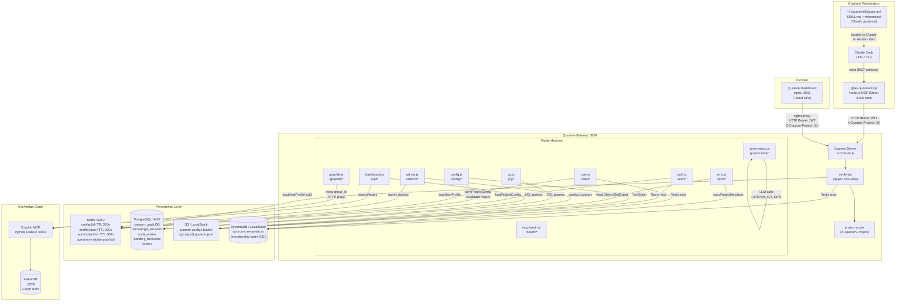
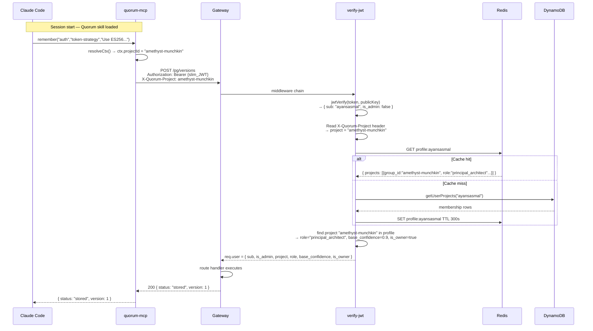
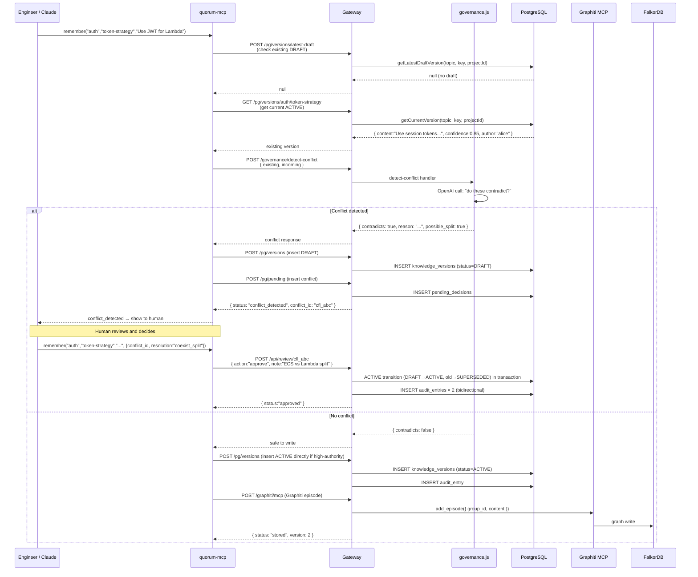
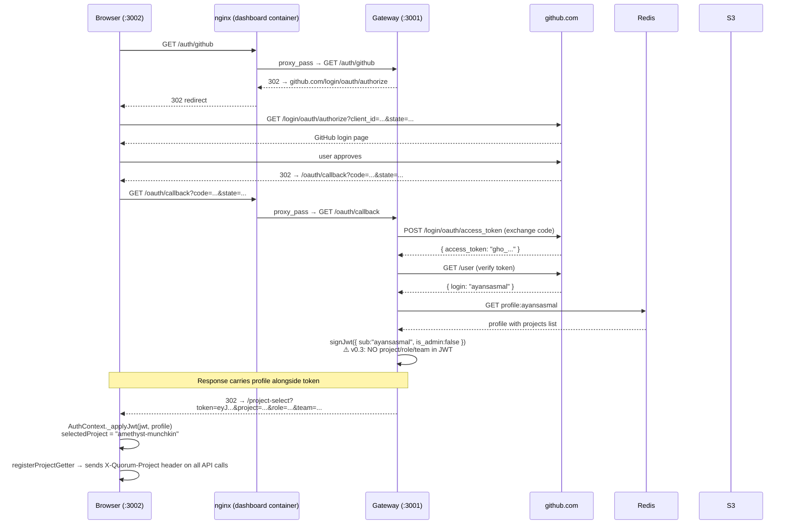
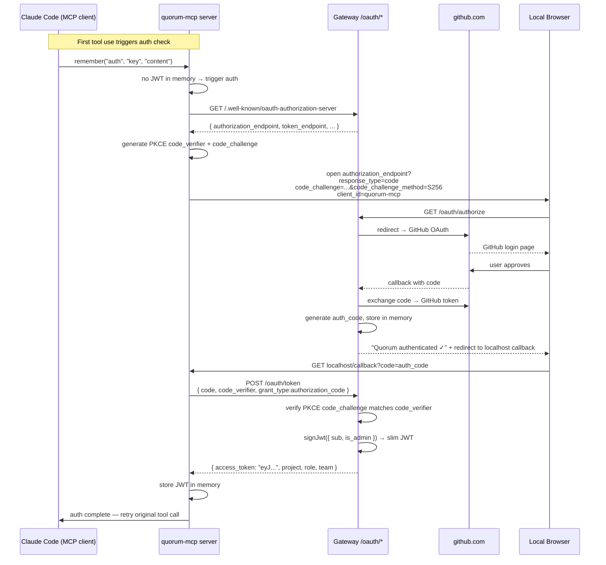
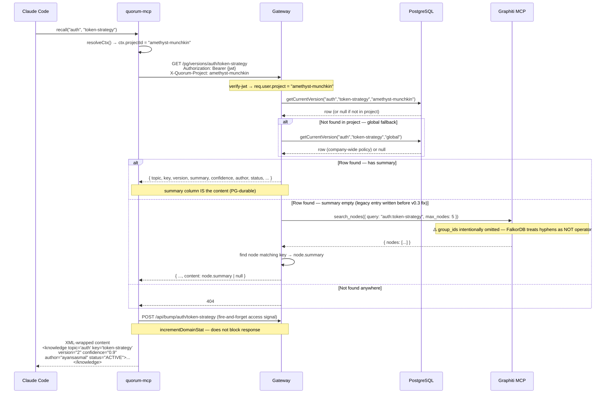
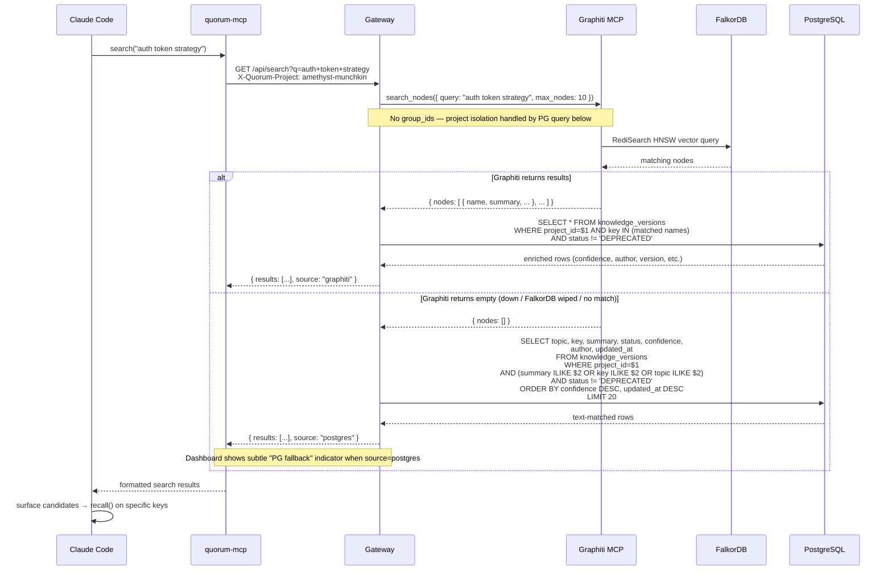
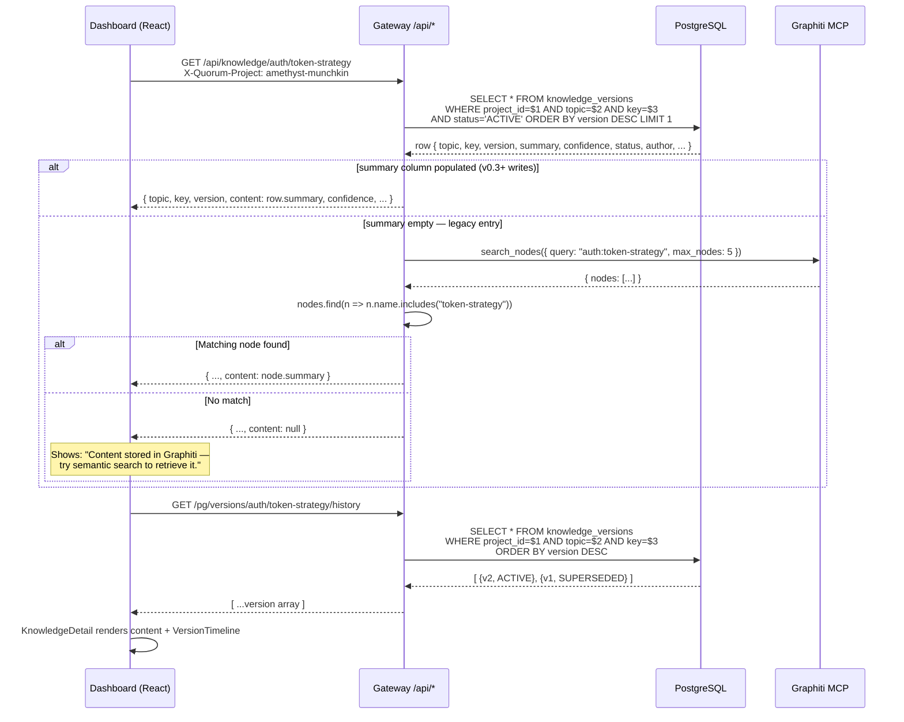
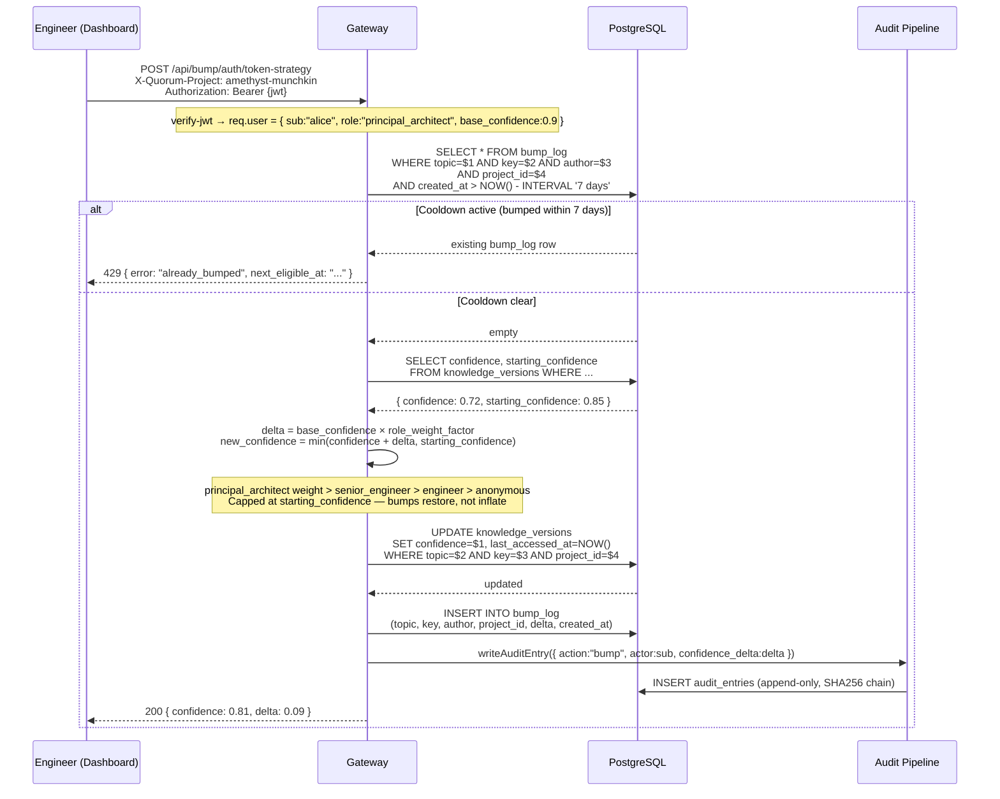
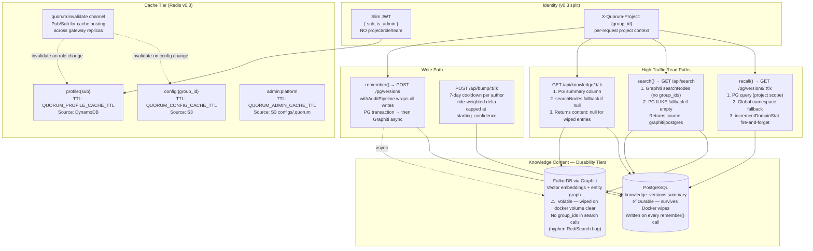

# Quorum System Diagrams

Architecture, data flows, and common use-case sequences for Quorum v0.3.

---

## Component Diagram



---

## v0.3 JWT + Header Identity Flow



---

## Full Knowledge Write Flow (remember → conflict check → review)



---

## GitHub OAuth → JWT Flow (dashboard login)



---

## MCP OAuth 2.1 PKCE Flow (Claude Code → Gateway)



---

## Flowchart: Session-Start Knowledge Load

```mermaid
flowchart TD
    START([New Claude Code session]) --> CHECK_QUORUM{ls .quorum}
    CHECK_QUORUM -->|Not found| ASK_ONBOARD[Ask: onboard to Quorum?]
    CHECK_QUORUM -->|Found| CHECK_AUTH{QUORUM_GATEWAY_URL set?}

    CHECK_AUTH -->|Yes — gateway mode| AUTHENTICATE[authenticate()]
    CHECK_AUTH -->|No — direct mode| PENDING

    AUTHENTICATE -->|already_authenticated| PENDING
    AUTHENTICATE -->|browser flow| BROWSER_OAUTH[Open browser → GitHub login]
    BROWSER_OAUTH --> PENDING

    PENDING[pending()]
    PENDING -->|conflict_briefs exist| BLOCK_ON_CONFLICT[🚫 Block: Present conflicts\nGet human decision before writing code]
    PENDING -->|draft_reviews only| NOTE_DRAFTS[📝 Note: N DRAFTs await review\nat :3002/pending]
    PENDING -->|empty| LOAD_CONTEXT

    BLOCK_ON_CONFLICT --> RESOLVE[resolve via remember + conflict_id]
    RESOLVE --> LOAD_CONTEXT

    NOTE_DRAFTS --> LOAD_CONTEXT

    LOAD_CONTEXT[search relevant domains\nbased on task] --> IMPLEMENT

    IMPLEMENT[Execute task] --> MID_CONSTRAINT{Discover constraint\nmid-task?}
    MID_CONSTRAINT -->|Yes| REMEMBER_NOW[remember() immediately\ndo not wait for reflect]
    MID_CONSTRAINT -->|No| COMPLETE

    REMEMBER_NOW --> COMPLETE
    COMPLETE{Task finished?} -->|Abandoned| SKIP_REFLECT[Skip reflect]
    COMPLETE -->|Completed| REFLECT[reflect() once]
    REFLECT --> REVIEW_PENDING[Tell human: N entries\npending at :3002/pending]
```

---

## Flowchart: Confidence + Authority System

```mermaid
flowchart TD
    WRITE[Engineer writes knowledge\nconfidence C] --> FLOOR{C < role base_confidence?}
    FLOOR -->|Yes — raise to floor| ADJUST[confidence = base_confidence]
    FLOOR -->|No| CHECK_EXISTING

    ADJUST --> CHECK_EXISTING

    CHECK_EXISTING{ACTIVE entry\nexists for topic:key?} -->|No| STORE_ACTIVE[Store ACTIVE]
    CHECK_EXISTING -->|Yes| CONFLICT_CHECK[POST /governance/detect-conflict]

    CONFLICT_CHECK -->|contradicts: false| AUTH_CHECK{authority_delta >\nauthority_threshold?}
    CONFLICT_CHECK -->|contradicts: true| PENDING_QUEUE[Store DRAFT\nInsert pending_decision\n→ human review required]

    AUTH_CHECK -->|Yes — high authority| AUTO_SUPERSEDE[Auto-supersede existing\nNo human needed]
    AUTH_CHECK -->|No — low delta| DRAFT_QUEUE[Store DRAFT\n→ human review]

    STORE_ACTIVE --> GRAPHITI[Write Graphiti episode\n+ FalkorDB graph]
    AUTO_SUPERSEDE --> GRAPHITI
    GRAPHITI --> AUDIT[Write audit_entry\nSHA256 tamper-evident chain]

    PENDING_QUEUE --> DASHBOARD[Dashboard /pending\nconflict_briefs]
    DRAFT_QUEUE --> DASHBOARD

    BUMP[POST /api/bump/:topic/:key\n(engineer signals trust)] --> DECAY_UP[confidence += delta × role_weight\ncapped at starting_confidence]
    DECAY_UP --> AUDIT

    DECAY[Scheduled decay script\nscripts/decay-confidence.js] --> DECAY_DOWN[confidence -= decay_rate\nper day since last_accessed_at]
    DECAY_DOWN --> LOW_CONF{confidence < 0.60?}
    LOW_CONF -->|Yes| FLAG[Mark stale_warning\nin dashboard]
```

---

## Component Interaction Matrix

| From | To | Channel | Auth | Notes |
|------|-----|---------|------|-------|
| Claude Code | quorum-mcp | stdio (MCP) | None | Same process tree |
| quorum-mcp | Gateway | HTTP Bearer JWT + X-Quorum-Project | ES256 JWT | All 10 tools route here |
| Dashboard (nginx) | Gateway | HTTP Bearer JWT + X-Quorum-Project | ES256 JWT | nginx resolver 127.0.0.11 re-resolves after rebuilds |
| Gateway verify-jwt | Redis | TCP | None | profile:{sub} cache, 300s TTL |
| Gateway config routes | S3 | HTTPS (LocalStack in dev) | AWS IAM | Primary config store |
| Gateway auth.js | DynamoDB | HTTPS (LocalStack in dev) | AWS IAM | Membership index (GSI) |
| Gateway graphiti.js | Graphiti MCP | HTTP (Docker network) | None (internal) | group_id injected; bearer stripped |
| Graphiti MCP | FalkorDB | Redis protocol | None (internal) | Graph + vector store |
| quorum-mcp | Gateway PKCE | HTTP (MCP OAuth 2.1) | PKCE + GitHub OAuth | auth_code → slim JWT |
| EventBridge / CI | Gateway /sync | HTTP Bearer sync token | Static `QUORUM_SYNC_SECRET` | S3→DDB full config sync |

---

## Sequence: recall() — Knowledge Read Path

The most frequent gateway operation. Every Claude Code session issues multiple `recall()` calls
before making implementation decisions. Note the global namespace fallback — this is what enables
company-wide policies to be visible across all project graphs.



---

## Sequence: search() — Semantic + Fallback Read Path

`search()` is the entry point when the exact key is unknown. It tries Graphiti semantic search
first; if that returns empty (Graphiti down, FalkorDB wiped, or hyphenated group_id issues),
it falls back to PostgreSQL ILIKE against the `summary` column.



---

## Sequence: GET /api/knowledge/:topic/:key — Dashboard Detail Panel

The dashboard Knowledge Browser calls this when a user clicks a row. This is also the same
path the MCP recall tool uses under the hood.



---

## Sequence: POST /api/bump/:topic/:key — Confidence Endorsement

The bump endpoint is how engineers signal trust in a knowledge entry without superseding it.
It applies a role-weighted delta capped at `starting_confidence`, enforces a 7-day cooldown
per author, and feeds the same audit pipeline as writes.



---

## Flowchart: Redis Cache Hit/Miss — verify-jwt Profile Resolution

Every authenticated request passes through `verify-jwt`. Redis is the primary store for
user profiles; DynamoDB is the source of truth on a cache miss. This diagram shows why
cold-start latency (first request after Redis TTL expires) is higher than steady state.

```mermaid
flowchart TD
    REQ([Incoming request with Bearer JWT]) --> VERIFY[jwtVerify token\nwith ES256 public key]
    VERIFY -->|invalid / expired| REJECT[401 Unauthorized]
    VERIFY -->|valid| DECODE[Extract sub, is_admin\nRead X-Quorum-Project header]

    DECODE --> REDIS_GET["GET profile:{sub} from Redis"]

    REDIS_GET -->|HIT| PROFILE_FOUND[profile = cached value]
    REDIS_GET -->|MISS| DDB_QUERY["getUserProjects(sub) from DynamoDB"]
    DDB_QUERY -->|found| REDIS_WRITE["SET profile:{sub} TTL 300s\n(write-back)"]
    DDB_QUERY -->|not found| NO_PROJECTS[profile = { projects: [] }]
    REDIS_WRITE --> PROFILE_FOUND
    NO_PROJECTS --> PROFILE_FOUND

    PROFILE_FOUND --> FIND_PROJECT{project header set?\nAND project in profile?}
    FIND_PROJECT -->|Yes| ATTACH_FULL["req.user = { sub, is_admin,\n  project, role, base_confidence, is_owner }"]
    FIND_PROJECT -->|Header missing| ATTACH_NULL["req.user = { sub, is_admin,\n  project: null, role: null }"]
    FIND_PROJECT -->|Header set but not member| ATTACH_NULL

    ATTACH_FULL --> ROUTE[Route handler executes]
    ATTACH_NULL --> GUARD{Route requires project?}
    GUARD -->|Yes| FOUR_HUNDRED[400 X-Quorum-Project header required]
    GUARD -->|No — auth/well-known routes| ROUTE

    ROUTE -->|Config change or role update| INVALIDATE["invalidateProfile(sub)\nDEL profile:{sub} from Redis\nPublish quorum:invalidate"]
    INVALIDATE -->|Next request| REDIS_GET
```

---

## Flowchart: Dual-Store Audit Write Pipeline

Every knowledge write — `remember()`, `review()`, `forget()` — goes through `withAuditPipeline`.
This wrapper guarantees that PostgreSQL audit entries and knowledge_version records are written
atomically and with bidirectional references before any Graphiti call is made.

```mermaid
flowchart TD
    WRITE_CALL([remember / review / forget\ncalled in quorum-mcp]) --> GATEWAY["POST /pg/versions or /api/review\nvia gateway HTTP"]

    GATEWAY --> AUDIT_PIPELINE["withAuditPipeline(pg, ctx, operation)"]

    AUDIT_PIPELINE --> CONSTITUTION[Constitutional check\nenforceReason ≥ 10 chars\nenforceNoSelfApproval\nverify triggered_by set]
    CONSTITUTION -->|Violation| THROW[Throw ConstitutionalViolation\n→ 422 to caller]
    CONSTITUTION -->|Pass| BEGIN_TX[BEGIN TRANSACTION]

    BEGIN_TX --> INSERT_AUDIT["INSERT audit_entries\n(append-only)\ncreated_by: sub\naction: store / supersede / deprecate\nversion_impact: { versions_created, versions_superseded }"]
    INSERT_AUDIT --> INSERT_VERSION["INSERT knowledge_versions\n(summary = content text)\n(content_hash = SHA256)\n(created_by_audit = audit_entry.id)"]

    INSERT_VERSION -->|Superseding| TRANSITION["UPDATE knowledge_versions\nSET status='SUPERSEDED'\nsuperseded_by_version=$newV\nsuperseded_by_author=$author\nsuperseded_at=NOW()\nWHERE topic=$t AND key=$k AND version=$oldV"]

    INSERT_VERSION --> COMMIT_TX[COMMIT TRANSACTION\nbidirectional refs guaranteed]
    TRANSITION --> COMMIT_TX

    COMMIT_TX -->|Async, non-blocking| GRAPHITI_WRITE["addEpisode / addSupersedingEpisode\n(Graphiti MCP via /graphiti/* proxy)\ngroup_id injected from req.user.project"]
    GRAPHITI_WRITE -->|Success| DONE([Return to caller])
    GRAPHITI_WRITE -->|Graphiti down — ignored| DONE
    Note right of GRAPHITI_WRITE: Graphiti failure never rolls back PG.\nPG summary is the durable content store.
```

---

## Updated Component Diagram — v0.3 Data Flows

This diagram extends the top-level component diagram to show v0.3-specific data paths:
the `summary` column as durable content store, `group_ids` omitted from all Graphiti searches,
and the slim JWT + `X-Quorum-Project` identity split.


