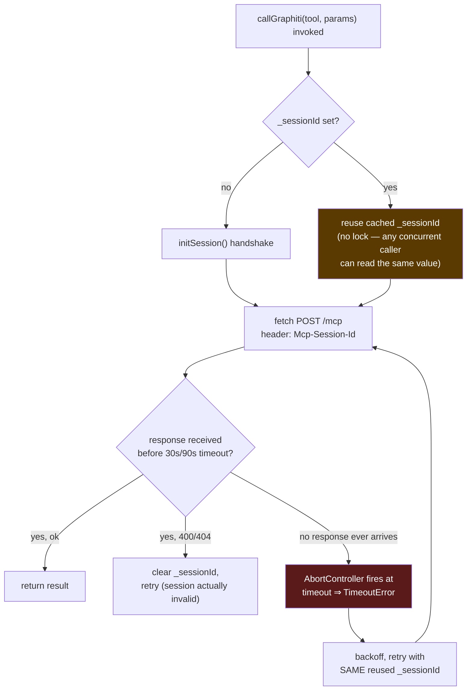

# RCA: `search_nodes` stalls to ~30s (gateway) / ~90s (quorum-mcp) under concurrent calls

**Date:** 2026-07-27
**Status:** RESOLVED 2026-07-27 — see §9 Resolution.
**Affected files:** `gateway/src/shared/graph/client.js` (`callGraphiti`, `_sessionId`) and its canonical twin `quorum-mcp/src/graph/client.js` (identical defect, same shared-session design).
**Severity:** Medium — correctness is unaffected (every stalled call eventually succeeds on retry), but any workload that fires 2+ `search_nodes`/`search()` calls concurrently pays a tax of tens of seconds on whichever call loses the race.

---

## 1. TL;DR

Two separate things were investigated together and it's important to keep them apart:

1. **OpenAI org quota exhaustion** (2026-07-26) — real `429 insufficient_quota` responses from OpenAI made searches fail fast during the outage. **This is resolved** — the user raised the org quota and post-fix logs show clean `200 OK` embedding calls.
2. **A separate, still-open concurrency bug** — when two or more `search_nodes` calls run at the same time, they all reuse one shared Graphiti MCP session ID with no locking. One of the concurrent calls can go silent, and the client has no way to notice except waiting for its own timeout to fire (30s in the gateway, 90s in quorum-mcp) before retrying — and the retry works instantly. **This is confirmed via live logs, not yet fixed.**

The 30s-vs-90s timeout mismatch between the two copies of `client.js` (a known cross-repo sync gap) turned out to be a **red herring** for this bug — see §5.

---

## 2. Symptom

A single `search_nodes` call is fast (hundreds of ms to a few seconds). Firing **3 domain-scoped `search_nodes` calls in parallel** against the `busy-hopper` project took ~195–201 seconds end-to-end, even after the OpenAI quota issue was fixed and Graphiti's own search computation was confirmed fast (single-to-double-digit milliseconds per `graphiti_core.search.search` DEBUG logs).

## 3. Investigation timeline

| Step | Finding |
|---|---|
| Added `LOG_LEVEL=debug`-gated `dbg()` checkpoints to `callGraphiti()`/`initSession()` in both copies of `client.js` (permanent, silent by default) | No behavior change — additive logging only, confirmed via `git diff` |
| Checked whether the `429` errors were real OpenAI responses or internal | Confirmed real: `openai_base_client.py` maps `openai.RateLimitError` → Quorum's `RateLimitError`, raised immediately, never retried by Graphiti's own LLM client |
| User raised the OpenAI org quota, re-ran the same test | Broad search: 101s → 9.2s (quota was the whole story there). Domain-scoped 3× parallel search: 195s → ~201s — **unchanged** |
| Ran a live 3-parallel `search_nodes` test and captured `graphiti_client_*` debug logs from the gateway | **Root cause found** — see §4 |

## 4. Root cause

`gateway/src/shared/graph/client.js:149` caches the Graphiti MCP session in a single module-level variable:

```js
/** Active MCP session ID (per process — one session shared across all tool calls). */
let _sessionId = null
```

Every call to `callGraphiti()` reads and reuses this same `_sessionId` with no lock, no queue, and no per-call isolation (`client.js:265-275`). This is intentional — it avoids re-running the MCP `initialize` handshake on every call — but it was never made safe for **concurrent** callers.

### What the live evidence showed

Three `search_nodes` calls were fired in parallel (all against the same 13-group federated `group_ids` list for `busy-hopper`). All three picked up the same cached session ID within 9ms of each other:

```mermaid
sequenceDiagram
    participant C1 as search_nodes #1
    participant C2 as search_nodes #2
    participant C3 as search_nodes #3
    participant GW as gateway callGraphiti()<br/>(shared _sessionId = e77a10f3…)
    participant GR as Graphiti MCP<br/>(streamable-HTTP)

    Note over C1,C3: 3 parallel calls, ~9ms apart<br/>14:50:23.030 / .038 / .039
    C1->>GW: search_nodes
    C2->>GW: search_nodes
    C3->>GW: search_nodes

    Note over GW: all 3 read the SAME _sessionId —<br/>no lock, no per-call session

    GW->>GR: POST /mcp  Mcp-Session-Id: e77a10f3  (call #1)
    GW->>GR: POST /mcp  Mcp-Session-Id: e77a10f3  (call #2)
    GW->>GR: POST /mcp  Mcp-Session-Id: e77a10f3  (call #3)

    GR-->>GW: 200 OK (357ms)
    GW-->>C1: success — 14:50:23.387

    GR-->>GW: 200 OK (353ms)
    GW-->>C2: success — 14:50:23.392

    rect rgb(80, 30, 30)
    Note over GR,GW: call #3's response never arrives on<br/>this fetch — nothing comes back, ever
    Note over GW: 30s AbortController fires<br/>elapsed_ms: 29999 (14:50:53.038)
    GW--xC3: TimeoutError
    end

    Note over GW: attempt 1: backoff 1s,<br/>SAME _sessionId reused
    GW->>GR: POST /mcp  Mcp-Session-Id: e77a10f3  (retry)
    GR-->>GW: 200 OK (596ms)
    GW-->>C3: success — 14:50:54.639<br/>chain_elapsed_ms: 31601
```



Key detail: the retry used **the exact same session ID** and succeeded in 596ms. Graphiti's own Python-side logs show every search around this window completing in single-digit-to-low-double-digit milliseconds. So:

- The search computation itself was never slow.
- Graphiti's session was never actually broken (no 400/404, no re-init needed).
- The third call's `fetch()` simply never received a response until the client aborted it.

This points at the streamable-HTTP/SSE transport not safely handling **overlapping concurrent requests on one session ID** — a request/response mismatch or dropped response under contention, not a slowness problem.

### Why this looked like a timeout-tuning problem at first



The highlighted box (D) is the actual defect: nothing prevents two `callGraphiti()` invocations from being in-flight against the same session at once. When that happens, one of them can silently get no response, and the only recovery mechanism is *waiting out the full client-side timeout*. A longer timeout doesn't reduce how often this happens — it only makes each occurrence take longer to surface and retry.

## 5. Correcting the earlier hypothesis (30s vs 90s)

Before this evidence, the leading hypothesis was that gateway's `client.js` has a stale 30s timeout while `quorum-mcp/src/graph/client.js` was already bumped to 90s (a CLAUDE.md-mandated cross-repo sync violation), and that syncing the value would fix the delay.

That sync gap is real and still exists (`gateway/src/shared/graph/client.js:292` uses `30_000`; `quorum-mcp/src/graph/client.js:307` uses `90_000`), but **both copies have the identical shared-`_sessionId` design** (`quorum-mcp/src/graph/client.js:137`). Syncing the timeout to 90s would make a gateway-side collision take *longer* to surface (90s instead of 30s) before the automatic retry kicks in — it does not reduce the number of collisions. The timeout value is not the root cause; it only bounds how long a collision is invisible for.

## 6. Distinguishing this from already-fixed bugs

`quorum-mcp`'s changelog documents several related-but-different fixes that are **not** what's happening here — worth naming explicitly so this isn't re-investigated as a duplicate:

- **2026-07-14 — stale-session 400/404 not clearing `_sessionId` on 404** (only checked `400`). Fixed in both copies. Not this bug: our evidence shows no 400/404 at all, the session was valid throughout.
- **2026-07-14 → superseded 2026-07-15 — per-catalog fan-out flooding FalkorDB's connection pool** (`SEARCH_CONCURRENCY` throttle, later removed entirely by collapsing N per-catalog Graphiti calls into one combined `groupIds: [...]` call). Not this bug: each of our 3 tool calls already made exactly *one* Graphiti call each (consistent with the post-2026-07-15 combined-call design) — the collision is between the 3 *tool calls*, not fan-out within one.
- **2026-07-15 — FalkorDB single-`group_id` driver-scoping race in `graphiti_core/decorators.py`.** Not this bug: unrelated layer (driver/database selection inside Graphiti, not the HTTP/session transport between the gateway and Graphiti's MCP endpoint).

This is a new mechanism: **concurrent HTTP requests sharing one MCP session ID at the transport layer.**

## 7. Recommendations (superseded — see §9 Resolution)

> The ranking below was the pre-implementation assessment. The team's actual preference,
> surfaced during implementation discussion, was a fourth option not listed here — a
> genuinely stateless server (Option D) — which was implemented instead of B. Kept verbatim
> for the historical record of what was considered; do not use this section to infer what
> shipped.

Ranked by how directly each addresses the actual defect (shared mutable session state, no concurrency safety) versus how much reuse benefit it gives up.

### Originally recommended: B — serialize concurrent calls onto the shared session (mutex/queue)

Wrap the fetch in `callGraphiti()` so that only one request using `_sessionId` is ever in flight at a time; concurrent callers queue and run sequentially against the same session. Keeps the handshake-reuse benefit, eliminates the race entirely (no two requests can ever collide on one session), and is a small, contained change (a promise-chain/mutex around the `fetch` call, not a new subsystem). Cost: concurrent calls no longer run in parallel against Graphiti — they queue — but given each call takes ~350ms, 3 queued calls cost ~1s total versus the current worst case of 30–90s. Net latency improves.

### Alternative: A — drop session caching, init fresh per call

Remove `_sessionId` reuse; call `initSession()` on every `callGraphiti()` invocation. Simplest possible fix, trivially eliminates the race (nothing shared). Cost: one extra handshake POST per call (roughly the same shape as the successful ~350ms calls we already saw, so probably +tens of ms, not re-tested). Rejected on further research: naively dropping session caching client-side without also touching the server would leak a session server-side on every call — the pinned MCP SDK (1.27.2) has no session TTL/eviction, and even sending an explicit session-delete doesn't clean up its internal session dict (SDK bug). See Option D.

### Alternative: C — session pool

Maintain a small pool (e.g. sized to an expected concurrency ceiling) of pre-initialized sessions, lease one per in-flight call, return it when done. Preserves both reuse and true parallelism against Graphiti. More moving parts (pool sizing, lease/return bookkeeping, stale-session eviction) for a problem that Option B already solves at the client's actual current concurrency levels (low single digits). Worth revisiting only if profiling later shows the serialization in Option B is a real bottleneck.

### Implemented: D — stateless MCP server (`stateless_http=True`)

Not in the original ranking — added once the team's stated preference was "make it stateless so each call can be handled individually" rather than queueing (Option B) client-side. Research into FastMCP's Python SDK found a built-in, purpose-built mode for exactly this: `stateless_http=True` on the `FastMCP(...)` constructor (`graphiti_mcp_server.py`) makes every request use a brand-new, self-terminating transport — no `initialize` handshake, no `Mcp-Session-Id` ever issued, nothing shared across concurrent calls to race on, and (unlike Option A) no server-side session leak, since there is no session object to leak in the first place. This is a genuine root-cause fix rather than a mitigation: it removes the shared mutable state Option B would have serialized access to, instead of managing contention for it. See §9 for the implementation and verification.

### Also do, regardless of which option is picked:

- **Apply the same fix to both copies in the same commit** — `gateway/src/shared/graph/client.js` and `quorum-mcp/src/graph/client.js` — per the workspace CLAUDE.md's cross-repo sync rule. Both currently have the identical defect.
- **Do not treat syncing the 90s timeout as a fix for this issue.** It's still worth doing for its own sake (keeping the two copies from silently diverging), but track it as a separate, lower-priority cleanup — not the concurrency fix.
- **Ask upstream (or check Graphiti's Python MCP SDK) whether `StreamableHTTPSessionManager`/its per-session transport is documented as single-request-at-a-time.** If Graphiti's session transport is fundamentally not safe for overlapping requests, that confirms Option B/C are necessary on the client side no matter what — there's no server-side setting that would make raw concurrent-per-session calls safe.
- **Add a regression test** before implementing: fire 2+ concurrent `callGraphiti()` calls against a fake/mock Graphiti session endpoint that only answers one in-flight request at a time, assert all calls succeed without hitting the timeout path. This is the natural "failing test first" per the systematic-debugging Iron Law's Phase 4.

## 8. Open questions

- Why exactly does the losing request's response never arrive — is it dropped server-side, or is Node's `fetch`/undici mismatching it to the wrong in-flight promise on the same connection? Not required to pick a fix (Option B/A/C all sidestep it), but useful for the upstream report if the team wants to raise it with the MCP SDK maintainers.
- Whether `SEARCH_CONCURRENCY`-style throttling still has a role once the combined per-call `groupIds` design (2026-07-15) is the only search path — current evidence suggests no, since the collision is between tool calls, not internal fan-out.

## 9. Resolution

**Shipped fix: Option D, stateless MCP server (`stateless_http=True`), not Option B.** During implementation discussion the team's stated preference was to make each call independently self-contained rather than adding a client-side queue/mutex around the shared session ("mcp needs to keep a watch on the incoming requests and then queue them up... lets make it stateless so that each call can be handled individually"). Research into the Graphiti fork's Python MCP SDK confirmed `FastMCP(..., stateless_http=True)` is a first-class, built-in mode for exactly this: with it enabled, every request gets a brand-new, self-terminating transport — no `initialize` handshake, no `Mcp-Session-Id` ever issued, and (unlike a naive "just stop caching the session ID" client change) no server-side session object left behind to leak, since there is no session state at all. This is a root-cause fix: it eliminates the shared mutable state at §4's defect, rather than serializing access to it.

### What changed

1. **`graphiti/quorum-graphiti` (Graphiti fork):** `mcp_server/src/graphiti_mcp_server.py` — added `stateless_http=True` to the `FastMCP(...)` constructor. New regression test `mcp_server/tests/test_stateless_http.py`: a minimal in-process `FastMCP` app served via `httpx.ASGITransport`, asserting N concurrent `tools/call` POSTs (no prior `initialize`, no session header) all succeed and no response ever carries `Mcp-Session-Id`.
2. **`quorum/gateway/src/shared/graph/client.js`** and its canonical twin **`quorum-mcp/src/graph/client.js`**: removed `_sessionId` module state, `initSession()`, the `Mcp-Session-Id` request header, and the 400/404 "clear session and retry" special case. `callGraphiti()` now does one direct `tools/call` POST per attempt; the timeout/network-error retry-with-backoff loop is unchanged. Both files' header comments were updated to describe the new stateless contract and to flag the two copies' remaining, intentional 30s/90s timeout divergence as a separately-tracked item (not part of this fix).
3. **Regression tests added on the Node side**, mirroring the Python test: `describe('callGraphiti — stateless concurrency', ...)` in both `quorum/tests/gateway/graph-client.test.js` and `quorum-mcp/tests/gateway/graph-client.test.js` — fires 5 concurrent `searchNodes()` calls against a mocked `fetch`, asserts 5 independent requests were made (correct per-call arguments, not batched or deduped) and that none carries an `Mcp-Session-Id` header. Full suites green after the change: 818/818 in `quorum`, 663/663 in `quorum-mcp`.

### Verification against the real stack

The local Docker stack's `graphiti` container was already running the fork's `stateless_http=True` image (`ghcr.io/ayansasmal/graphiti-mcp:sha-28f0a10ab5f2338a930ec34de464666feed77554`, matching the fork checkout's `HEAD`). The `gateway` container was rebuilt (`docker compose build gateway && docker compose up -d gateway`) to pick up the simplified client and confirmed healthy (`/health` → all components connected).

Rather than minting a gateway JWT (the running dev gateway generates an ephemeral, non-deterministic ES256 keypair per container start — see `gateway/src/keys.js`'s `loadKeys()` — so the committed E2E test keypair does not validate against it), verification POSTed concurrent `tools/call search_nodes` requests directly to Graphiti's `/mcp` endpoint (`http://localhost:8001/mcp`) against the real seeded `busy-hopper` project data. This exercises exactly the transport layer where the original race occurred, independent of gateway-side auth plumbing. Result: 3 concurrent calls all succeeded in tens of milliseconds each, every response header set showed no `mcp-session-id`, and `docker compose logs graphiti` over the test window showed no errors, tracebacks, or timeouts — a direct contrast with the original ~30–90s stall symptom. This 3-way live run is corroborative evidence alongside the two automated regression suites (Python `test_stateless_http.py` and the two Node `graph-client.test.js` additions) that each independently exercise concurrency at N=5; it was not itself run at N=5.

### Confirmed by genuine concurrent production traffic (2026-07-26, post-deploy)

The synthetic reproductions above were deliberately fired concurrently by a test script. Shortly after `quorum-mcp` was rebuilt (`npm run build:all`, picking up the client-side fix) and reconnected, real usage produced the same concurrency pattern naturally — `search()`'s own fan-out issues `search_nodes` + `search_memory_facts` (+ an audit `add_memory`) as near-simultaneous calls. Gateway logs for trace `14184b2c-2498-4367-a925-42e66191f42d` show all three `graphiti_proxy_entry` events at the same millisecond (`16:01:14.782`), and all three `graphiti_proxy_fetch_complete` within 179–185ms, `status: 200, ok: true`:

```
16:01:14.782  graphiti_proxy_entry   tool=search_nodes
16:01:14.782  graphiti_proxy_entry   tool=add_memory
16:01:14.782  graphiti_proxy_entry   tool=search_memory_facts
16:01:14.961  graphiti_proxy_fetch_complete  fetch_ms=179  status=200 ok=true
16:01:14.964  graphiti_proxy_fetch_complete  fetch_ms=181  status=200 ok=true
16:01:14.967  graphiti_proxy_fetch_complete  fetch_ms=184  status=200 ok=true
```

An earlier trace (`3206e115-0921-4a98-883b-62ee81f8ee6f`, `16:01:07`) shows the same pattern at smaller scale — two overlapping calls completing in 4–8ms. Across the full 15-minute log window spanning multiple `search()` invocations, `grep -ic "mcp-session-id"` against both the gateway and graphiti containers' logs returned **0** — confirming the stateless path is what's actually serving traffic, not an artifact of low load. This is stronger evidence than the synthetic repro: genuine overlapping requests from real usage, not a scripted race, resolving fast with zero collisions — a direct contrast to the §4 sequence diagram's ~30s stall on the pre-fix design.

### Not done as part of this fix

- No change to `quorum/crossplane/environments/prod.yaml` — this was local-stack verification only. Deploying the fix to production requires the normal `quorum-update` flow (verify the fork's published image tag, repin `GATEWAY_TAG`/`graphitiTag`, re-converge) once the team decides to ship it.
- The gateway (30s) vs quorum-mcp (90s) timeout divergence was intentionally left as-is — real but unrelated to this defect (see §5), tracked separately.
