# Quorum — Product Feature Diagrams

> **Derived from the E2E test suite.** Every diagram below reflects only what the tests assert — not aspirational features. When a journey changes, update the corresponding diagram.

---

## Diagram Index

| Diagram | Source journey(s) |
|---------|------------------|
| [1. MCP Tool Coverage Map](#1-mcp-tool-coverage-map) | All journeys |
| [2. Knowledge Status State Machine](#2-knowledge-status-state-machine) | S-12, S-02.x |
| [3. Conflict Detection & Resolution Flow](#3-conflict-detection--resolution-flow) | S-02.2 – S-02.8, S-06, S-17 |
| [4. Deprecation Workflow](#4-deprecation-workflow) | S-03, S-05.3, S-05.5 |
| [5. Deviation Governance Lifecycle](#5-deviation-governance-lifecycle) | S-04, S-05.5, S-07 |
| [6. Conformance Scoring Model](#6-conformance-scoring-model) | S-07, S-04 |
| [7. RBAC Authority Boundaries](#7-rbac-authority-boundaries) | S-05.1 – S-05.6 |
| [8. Federation & Global Catalog Flow](#8-federation--global-catalog-flow) | S-01, S-05.4, S-11 |
| [9. Audit Chain Model](#9-audit-chain-model) | S-10, S-02.3 |
| [10. Authentication Lifecycle](#10-authentication-lifecycle) | S-19 |
| [11. Governance Edge Cases](#11-governance-edge-cases) | S-17 |

---

## 1. MCP Tool Coverage Map

Shows all 14 MCP tools and their E2E test coverage status.

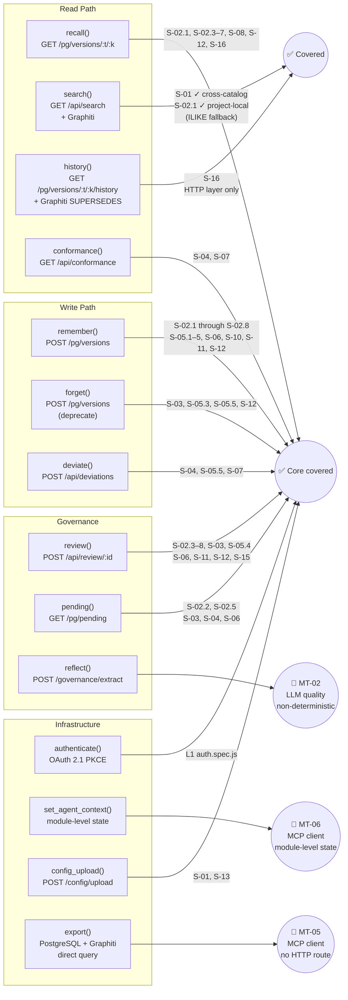

---

## 2. Knowledge Status State Machine

Source: S-12 (Parts 1–G). Every valid, invalid, and coexistence transition tested.

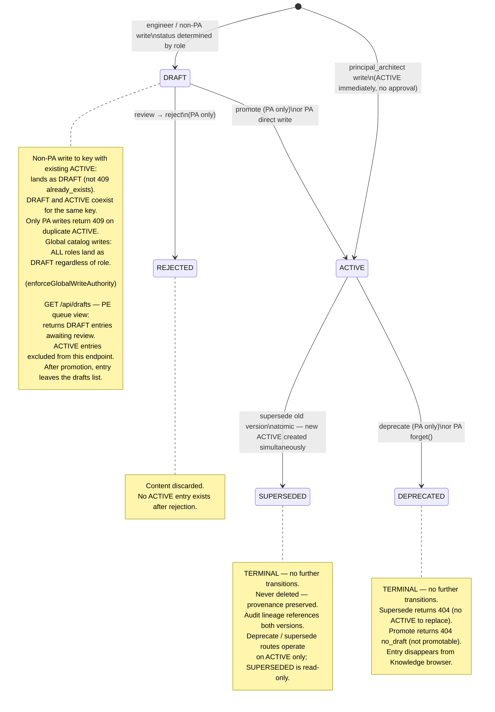

---

## 3. Conflict Detection & Resolution Flow

Source: S-02.2 (detection), S-02.3–S-02.7 (resolution types), S-02.8 (dashboard), S-06 (multi-user).

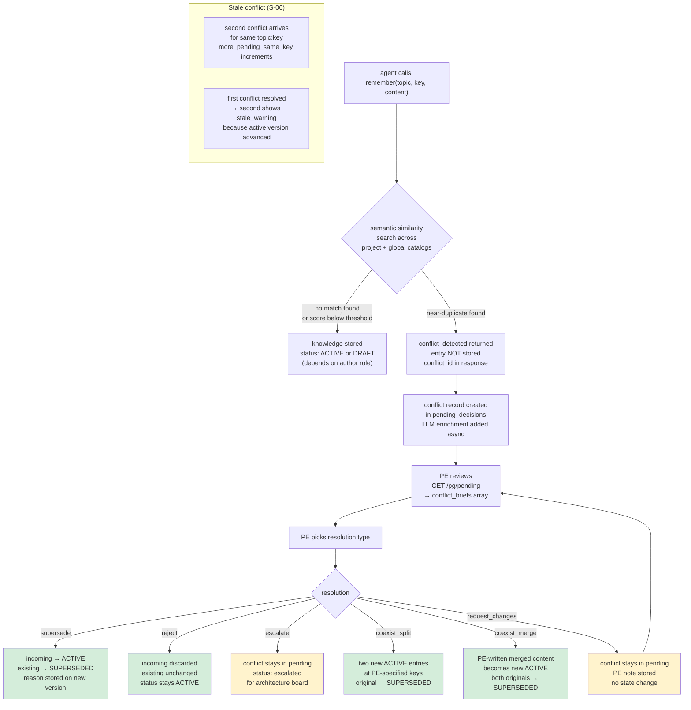

---

## 4. Deprecation Workflow

Source: S-03 (full lifecycle), S-05.3 (RBAC: direct deprecate), S-05.5 (forget branching by role).

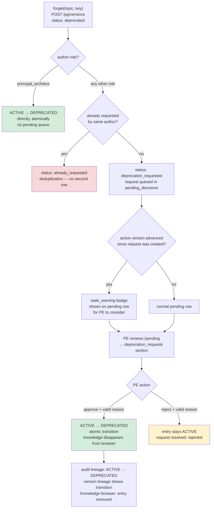

---

## 5. Deviation Governance Lifecycle

Source: S-04 (full lifecycle), S-05.5 (RBAC), S-07 (conformance impact).

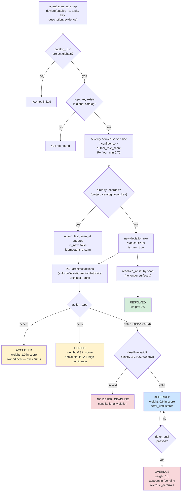

---

## 6. Conformance Scoring Model

Source: S-07 (UNCERTIFIED → CERTIFIED lifecycle), S-04 (deviation status weights).

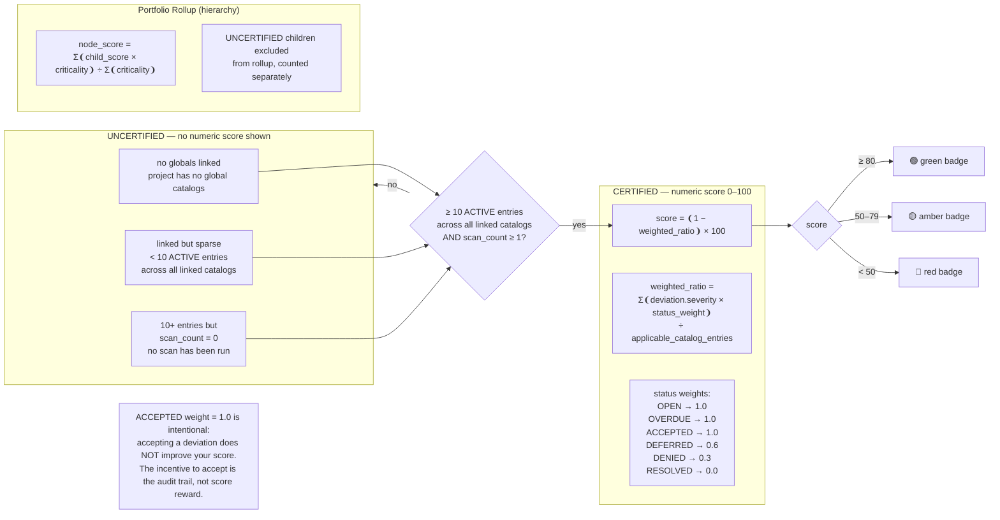

---

## 7. RBAC Authority Boundaries

Source: S-05.1–S-05.6. The complete role × operation matrix that the tests enforce.

```mermaid
graph TB
    subgraph ROLES["Role Tiers (authority.js)"]
        PA["principal_architect\nscore: 1.00 / tier 4"]
        PE_EQUIV["architect / product_owner\ncompliance_officer\nscore: 0.80–0.90 / tier 3"]
        ENG["senior_engineer / engineer\nscore: 0.55–0.70 / tier 2"]
        EXEC["director / vp_engineering\ngroup_executive\nscore: 0.70–0.75 / tier 3\nread-only governance"]
        ADMIN["is_admin: true\nplatform admin\nnot a role — a flag"]
    end

    subgraph KNOWLEDGE_WRITE["Knowledge Write (S-05.1)"]
        KW1["All roles: POST /api/knowledge\n→ 200 OK"]
        KW2["PA → status: ACTIVE immediately"]
        KW3["All others → status: DRAFT"]
    end

    subgraph GOVERNANCE["Governance Actions (S-05.2, S-05.3, S-05.4)"]
        G1["promote / supersede / deprecate\nbulk-deprecate / conflict-review\n→ PA only\nAll others: 403 forbidden"]
    end

    subgraph GLOBAL_WRITE["Global Catalog Writes (S-05.4)"]
        GW1["engineer / senior_engineer\ndirector / vp_engineering\n→ 403 GLOBAL_WRITE_AUTHORITY"]
        GW2["architect / product_owner\ncompliance_officer\n→ 200 DRAFT\n(needs PA approval)"]
        GW3["principal_architect\n→ 200 ACTIVE directly"]
    end

    subgraph DEVIATION_ACTION["Deviation Actions (S-05.5)"]
        DA1["engineer / senior_engineer\ndirector / vp_engineering\n→ 403 DEVIATION_ACTION_AUTHORITY"]
        DA2["architect / principal_architect\nproduct_owner / compliance_officer\n→ 200 OK"]
    end

    subgraph PORTFOLIO["Portfolio Access (S-05.6)"]
        PF1["engineer / senior_engineer\narchitect\nproduct_owner / compliance_officer\n→ 403"]
        PF2["principal_architect\ndirector / vp_engineering\n→ 200 OK"]
    end

    subgraph FORGET_BRANCH["forget() Branching (S-05.5, S-03)"]
        FB1["PA → deprecated directly"]
        FB2["All others → deprecation_requested\n(queued for PE review)"]
    end

    PA --> KW2
    PA --> G1
    PA --> GW3
    PA --> DA2
    PA --> PF2
    PA --> FB1

    PE_EQUIV --> KW3
    PE_EQUIV --> GW2
    PE_EQUIV --> DA2
    PE_EQUIV --> FB2

    ENG --> KW3
    ENG --> GW1
    ENG --> DA1
    ENG --> FB2

    EXEC --> KW3
    EXEC --> GW1
    EXEC --> DA1
    EXEC --> PF2
    EXEC --> FB2

    ADMIN --> |"GET /admin/config\nPOST /admin/users\nis_admin flag only\nno role equivalent"| ADMIN_ROUTES["Admin routes\n403 for all non-admin JWTs"]
```

---

## 8. Federation & Global Catalog Flow

Source: S-01 (setup + cross-catalog reads), S-05.4 (write authority), S-11 (global writes always DRAFT).

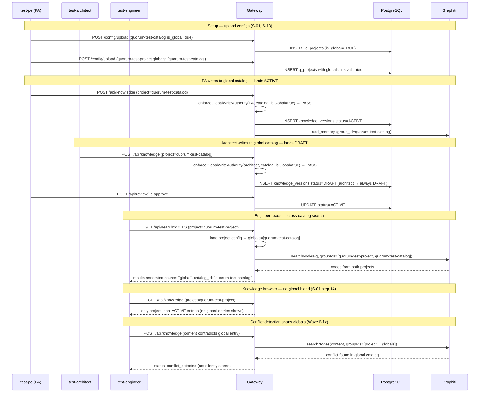

---

## 9. Audit Chain Model

Source: S-10 (Parts A–C: chain integrity, append-only, BLOCKED_METHODS), S-02.3 (lineage after supersede).

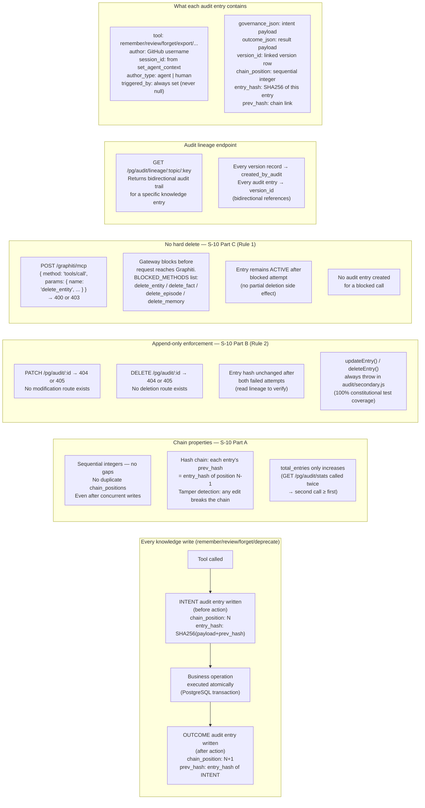

---

## 10. Authentication Lifecycle

Source: S-19. Automated boundary testing for JWT, JWKS, project scoping, token refresh, and PAT.

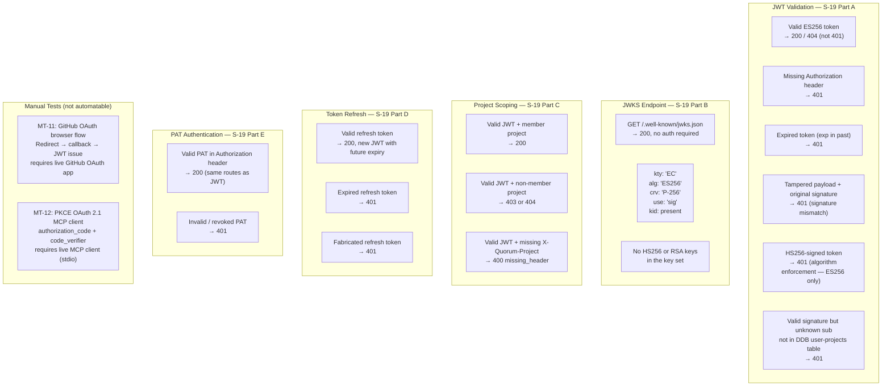

---

## 11. Governance Edge Cases

Source: S-17 (Parts A–D). Auto-supersede, PENDING_CONFLICT_CHECK fallback, cross-catalog conflict, enrichment shape.

```mermaid
flowchart TD
    subgraph AUTO_SUPERSEDE["Auto-Supersede — S-17 Part A (GV-1)"]
        AS1["PA writes entry\nconfidence: 0.50 → ACTIVE v1"]
        AS2["PA writes same key again\nconfidence: 0.95\nshouldAutoSupersede() fires\n(authority delta > AUTHORITY_THRESHOLD)"]
        AS3["supersede() called directly\nNO pending_decision created\nNO human review step"]
        AS4["v1 → SUPERSEDED\nv2 → ACTIVE\naudit: conflict_resolution='auto_supersede'\nno reviewer field"]
        AS5["GET /pg/pending: no new decision\nfor this topic:key (auto-resolved)"]
        AS1 --> AS2 --> AS3 --> AS4 --> AS5
    end

    subgraph PENDING_CC["PENDING_CONFLICT_CHECK — S-17 Part B (GV-2)"]
        PC1["Graphiti service unavailable\n(docker pause or unreachable URL)"]
        PC2["remember() call still succeeds\nentry stored with\nstatus: 'PENDING_CONFLICT_CHECK'\n(write must never fail due to\nGraphiti outage)"]
        PC3["Graphiti service resumed"]
        PC4["GET /pg/pending shows entry\nwith status: 'PENDING_CONFLICT_CHECK'\nfor PE to manually review"]
        PC1 --> PC2 --> PC3 --> PC4
    end

    subgraph CROSS_CATALOG["Cross-Catalog Conflict — S-17 Part C (Wave B fix)"]
        CC1["Global catalog has ACTIVE entry\n(security:tls-minimum-version)\nindexed in Graphiti"]
        CC2["graphitiSettle() — wait for indexing"]
        CC3["Project write: content contradicts\nthe global catalog entry\n(project linked via globals: [quorum-test-catalog])"]
        CC4["detectConflict() searches\ngroupIds: [project, quorum-test-catalog]\n→ match found in global catalog"]
        CC5["status: 'conflict_detected'\nconflicting entry has\nsource: 'global'\ncatalog_id: 'quorum-test-catalog'"]
        CC1 --> CC2 --> CC3 --> CC4 --> CC5
    end

    subgraph ENRICHMENT["Enrichment Shape — S-17 Part D (GV-4)"]
        EN1["POST /api/review/:id (conflict action)\nLLM enrichment triggered async"]
        EN2["GET /pg/pending — conflict entry\nenrichment object shape:"]
        EN3["enrichment.analysis: non-empty string\nenrichment.risks_if_approved: Array (2–4 items)\nenrichment.questions_for_reviewer: Array (2–3 items)"]
        EN1 --> EN2 --> EN3
    end

    subgraph WEBHOOK["MT-08 — fireWebhookAsync (manual)"]
        WH1["Conflict detected → async webhook fired\nNon-blocking: response does NOT wait\nConfigure QUORUM_WEBHOOK_URL\nVerify payload: { event: 'conflict_detected',\ntopic, key, conflict_brief }"]
    end
```

---

## Appendix: Suite Weight Summary

| Tier | Scenarios | Weight | Notes |
|------|-----------|--------|-------|
| F4 — core agent workflow | S-02.1–8, S-11 | 156 | every interaction |
| F3 — daily governance/security | S-05.1–6, S-06, S-15, S-19 | 423 | governance + auth lifecycle |
| F2 — weekly operational | S-03, S-04, S-07, S-08, S-12, S-17 | 264 | deviations, deprecations, scoring, conflict edge cases |
| F1.5 — periodic | S-10, S-14, S-16, S-18 | 79.5 | audits, visual, history, governance routes |
| F1 — one-time / rare | S-01, S-09, S-13 | 49 | setup, admin, config |

**Total suite weight: 1107 | 10% gate: 110.7 | Max single blast radius: 7.1% (S-05.1)**

> Suite total recalculated after adding J17 (32), J18 (18), J19 (45) and extending J04 (+4), J09 (+2), J10 (+10.5), J12 (+22), J13 (+4), J15 (+12).
> See [RISK_WEIGHTED_TEST_PLAN.md](../RISK_WEIGHTED_TEST_PLAN.md) for the full binary tree and gate derivation.
