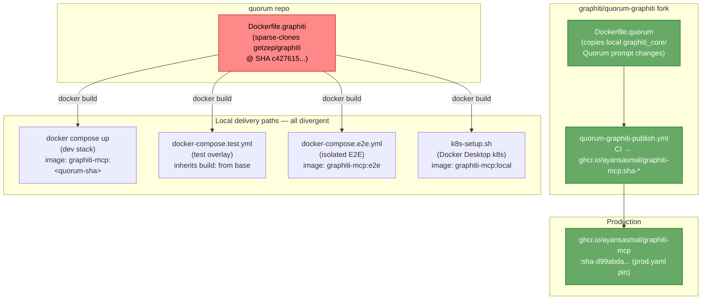
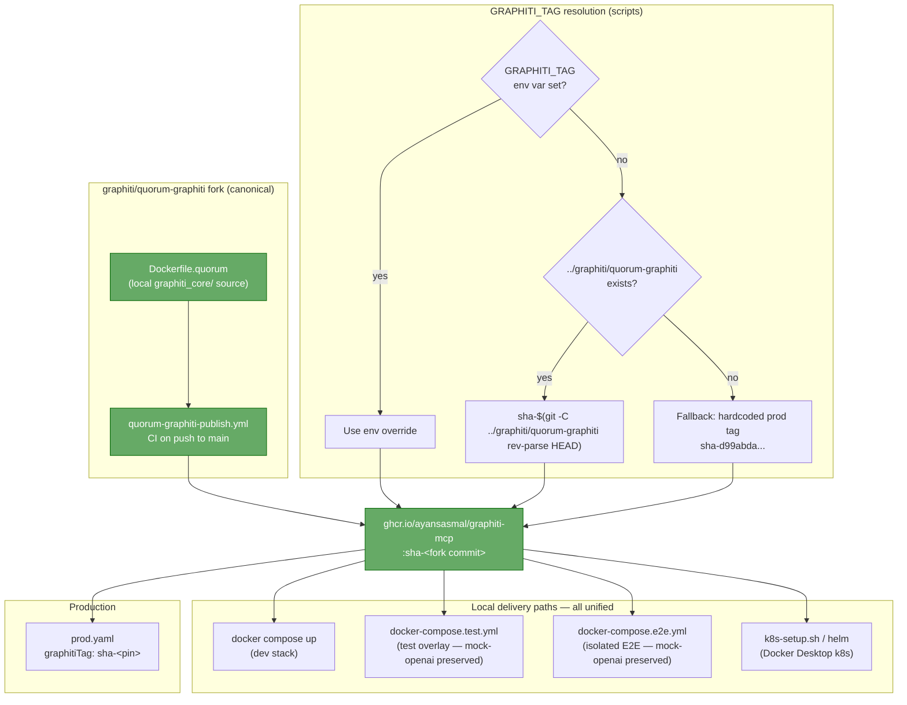
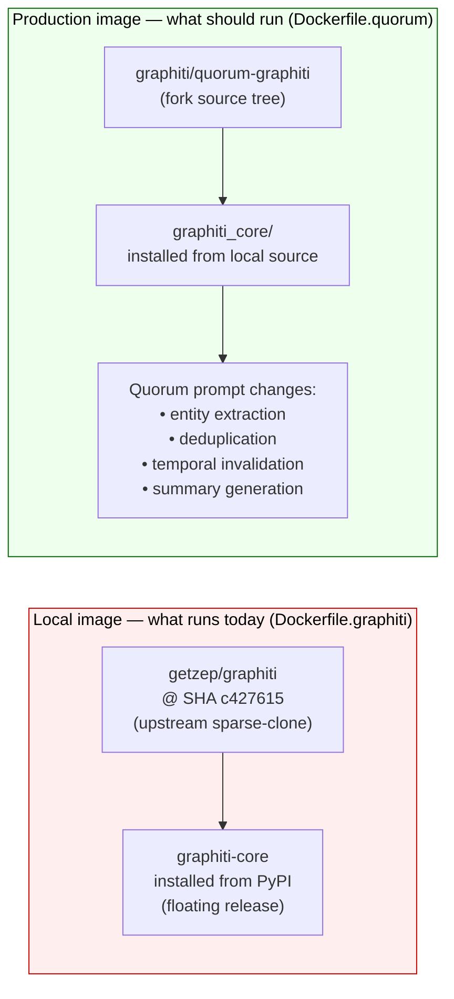

# Local Graphiti Image Analysis

Date: 2026-06-29  
Updated: 2026-06-29 (revised — upstream vs fork distinction, GHCR auth, sibling checkout fallback, CI job removal)

## Goal

Unify local Quorum environments so they pull the published Graphiti GHCR image that is already built from the local `graphiti/quorum-graphiti` checkout, instead of rebuilding `Dockerfile.graphiti` inside the `quorum` repo. The problem is not only build duplication — it is **semantic divergence**: the Quorum-specific prompt improvements in the fork are never exercised locally.

---

## Current State — Divergent Local Paths (Diagram)



> **Red = wrong source.** All 4 local paths build from the upstream getzep/graphiti, not the Quorum fork. Production alone runs the fork image.

---

## Proposed State — Unified GHCR Contract (Diagram)



---

## Root Cause: Upstream vs. Fork

This is the most important distinction and it was missing from the original analysis.

`quorum/Dockerfile.graphiti` sparse-clones from the **upstream** repo:

```
https://github.com/getzep/graphiti.git
```

at a pinned SHA (`c427615044678f4bde026745d8d28a16504868c5`). That is the original `getzep/graphiti` project, **not** the Quorum fork.

The upstream version installs `graphiti-core` from PyPI — a floating release that does not include any of Quorum's prompt changes.

The fork (`graphiti/quorum-graphiti`) uses a different Dockerfile (`mcp_server/docker/Dockerfile.quorum`) that copies the local `graphiti_core/` source tree directly into the image. That source tree contains all Quorum-specific entity, edge, deduplication, invalidation, and summary prompt changes.



**Consequence:** local dev, the test overlay, the isolated E2E environment, and Kubernetes all run code that is semantically different from production. Prompt regressions in the fork can pass undetected locally and only surface in production.

The fix is not just a build efficiency improvement — it closes a **semantic correctness gap**.

---

## Current Local Paths

### 1. Docker Compose dev stack

Entry point:

- `quorum/scripts/setup.sh docker`
- `npm run docker:start`

Current behavior:

- `quorum/docker-compose.yml` defines `graphiti.image` as `graphiti-mcp:${IMAGE_TAG:-latest}`.
- The same service also has a local `build:` block pointing at `quorum/Dockerfile.graphiti`.
- `setup.sh` derives `IMAGE_TAG` from the **Quorum** git short SHA via `git rev-parse --short HEAD`, then runs `docker compose up -d`.
- `IMAGE_TAG` is a Quorum repo commit hash and has no relationship to any graphiti fork commit.
- Result: the image is rebuilt from the upstream getzep repo at a pinned SHA that is unrelated to any production graphiti image.

### 2. Docker Compose test overlay

Entry point:

- `npm run test:e2e:env:up`
- `npm run test:e2e:env:setup`

Current behavior:

- `docker-compose.test.yml` overlays the base `docker-compose.yml`.
- It redirects Graphiti's OpenAI calls to the `mock-openai` service via `OPENAI_API_KEY=test-key-e2e` and `OPENAI_BASE_URL=http://mock-openai:3003`, but does not override the Graphiti image itself.
- The test overlay therefore inherits the base Graphiti local build path — the same upstream-based image.
- LocalStack is expected to run **outside** this test stack on the host Docker daemon and is reached via `host.docker.internal:4566`.

### 3. Fully isolated E2E Docker stack

Entry point:

- `npm run test:e2e:docker`
- `quorum/scripts/e2e-docker.sh`

Current behavior:

- `quorum/docker-compose.e2e.yml` defines `graphiti.image: graphiti-mcp:e2e`.
- The same service also has a local `build:` block pointing at `quorum/Dockerfile.graphiti`.
- `e2e-docker.sh` runs `docker compose build` before `up`, so Graphiti is rebuilt locally here too.
- The mock-openai service is wired directly at the compose level (`OPENAI_BASE_URL=http://mock-openai:3003`).

### 4. Docker Desktop Kubernetes local stack

Entry point:

- `quorum/scripts/setup.sh k8s`
- `quorum/scripts/k8s-setup.sh`

Current behavior:

- `k8s-setup.sh` hard-codes `GRAPHITI_IMAGE="graphiti-mcp:local"` and builds it via `docker build -f "$PROJECT_ROOT/Dockerfile.graphiti"`.
- `helm/quorum/values.yaml` defaults `graphiti.image.repository` to `graphiti-mcp` and `tag` to `local`.
- Result: local k8s has a fourth independent Graphiti delivery path, also from the upstream repo.

---

## Existing Graphiti Source Of Truth

The Quorum fork owns the correct image contract:

- Repo: `graphiti/quorum-graphiti`
- Dockerfile: `graphiti/quorum-graphiti/mcp_server/docker/Dockerfile.quorum`
- Publish workflow: `graphiti/quorum-graphiti/.github/workflows/quorum-graphiti-publish.yml`
- Published image: `ghcr.io/ayansasmal/graphiti-mcp:sha-<full-40-char-commit>`

The fork CI tags images using the full 40-character commit hash:

```bash
sha_tag=sha-$(git rev-parse HEAD)
# published as: ghcr.io/ayansasmal/graphiti-mcp:sha-<40-char-commit>
```

The current production pin is `sha-d99abda38b1181d1f56198f1565510de9564f79b` (from `quorum/crossplane/environments/prod.yaml`).

The fork CI triggers on pushes to `main` in the graphiti fork repo, builds multi-platform images (`linux/amd64` + `linux/arm64`), and uses Depot for fast multi-platform builds. Publishing does not auto-deploy. Production must be explicitly repinned in `quorum/crossplane/environments/prod.yaml`.

---

## Why The Current Local Setup Is Wrong

The local build divergence exists because:

- the dev stack predates the Quorum-owned Graphiti GHCR workflow,
- `Dockerfile.graphiti` was written when the fork did not yet exist and the upstream SHA was the only pinning mechanism,
- the E2E stacks copied the same local Dockerfile pattern,
- the local k8s path was built around Docker Desktop's shared daemon rather than the later GHCR runtime contract.

One logical Graphiti runtime currently comes from four different Dockerfiles and tag conventions depending on how Quorum is started locally. None of them are the same image that runs in production.

---

## Mock-OpenAI Is Not Affected

`mock-openai/` is a zero-dependency Node.js HTTP mock service internal to Quorum's test infrastructure:

- `POST /v1/embeddings` returns deterministic SHA-256-based 1536-dim unit-normalised vectors.
- `POST /v1/chat/completions` returns stable canned JSON content.
- Graphiti's Python SDK respects `OPENAI_BASE_URL` and routes all OpenAI calls to this service in test environments.

This service is wired at the Docker Compose **environment variable** level (`OPENAI_BASE_URL=http://mock-openai:3003`), not inside the Graphiti image. The switch from a locally-built image to the GHCR image does not change mock-openai behaviour. The test overlay and isolated E2E environment will continue to redirect Graphiti's OpenAI calls to mock-openai exactly as they do today.

---

## Recommended Local Contract

Use one Graphiti image contract everywhere locally:

- Repository: `ghcr.io/ayansasmal/graphiti-mcp`
- Tag: `sha-<full 40-char commit from the graphiti fork>`

The default tag should be derived from the sibling checkout when it exists:

```bash
sha-$(git -C ../graphiti/quorum-graphiti rev-parse HEAD)
```

Allow override via env vars:

- `GRAPHITI_IMAGE_REPOSITORY` (default: `ghcr.io/ayansasmal/graphiti-mcp`)
- `GRAPHITI_TAG` (default: derived from sibling checkout; see fallback strategy below)

---

## Sibling Checkout Assumption and Fallback

The sibling checkout approach (`../graphiti/quorum-graphiti`) assumes the graphiti fork has been cloned alongside the quorum repo. On a fresh developer machine that has only cloned `qc`, this path does not exist.

Fallback strategy for scripts (in priority order):

1. If `GRAPHITI_TAG` is set in the environment, use it directly.
2. If `../graphiti/quorum-graphiti` exists and is a git repo, derive the tag: `sha-$(git -C ../graphiti/quorum-graphiti rev-parse HEAD)`.
3. Otherwise, fall back to the current production tag hard-coded in the script as a safe known-good value (`sha-d99abda38b1181d1f56198f1565510de9564f79b`).

This means a developer without the fork checked out gets a working stack using the same image as production, rather than an error or an incorrect upstream-based image.

The `.env.example` should document `GRAPHITI_TAG` as the escape hatch so developers understand how to pin a specific image for testing.

---

## GHCR Authentication Requirement

Pulling `ghcr.io/ayansasmal/graphiti-mcp` requires authentication against the GitHub Container Registry.

**Locally:** run `docker login ghcr.io` with a GitHub Personal Access Token that has `read:packages` scope before starting any stack. This is a one-time operation per developer machine. Without it, `docker compose up` will fail on the Graphiti image pull with a 401.

**CI:** any CI job that runs `docker compose up` with the updated compose files will need a `GHCR_TOKEN` secret (or the built-in `GITHUB_TOKEN` with `packages: read` permission). The existing `build.yml` does not currently pull the Graphiti image, but it will after the compose files are updated.

The `.env.example` and developer setup documentation (`QUICKSTART.md`, `AGENTS.md`) should note the `docker login ghcr.io` prerequisite.

---

## CI Build Job Removal

`quorum/.github/workflows/build.yml` contains a `build-graphiti` job:

```yaml
build-graphiti:
  name: Verify Graphiti Image Builds
  runs-on: ubuntu-latest
  permissions:
    contents: read
  steps:
    - name: Build Graphiti image (verify only — no push)
      uses: docker/build-push-action@v6
      with:
        context: .
        file: Dockerfile.graphiti
        push: false
```

After the change, this job no longer serves any purpose. `Dockerfile.graphiti` will be obsolete, and verification that the Graphiti image builds correctly belongs entirely to the fork's own CI (`quorum-graphiti-publish.yml`). Keeping the job creates false confidence that the Dockerfile still matters and adds CI time for a file that is no longer used in any runtime path.

The `build-graphiti` job should be removed from `quorum/.github/workflows/build.yml` as part of this change.

---

## Deployment Context

This analysis covers **local dev only**. The table below shows the full image lifecycle across all environments:

| Environment | Image source today | Image source after fix | Config file |
|---|---|---|---|
| Docker Compose dev | `Dockerfile.graphiti` (upstream) | `ghcr.io/ayansasmal/graphiti-mcp:sha-*` | `docker-compose.yml` |
| Docker Compose test | inherited from dev | `ghcr.io/ayansasmal/graphiti-mcp:sha-*` | `docker-compose.test.yml` |
| Isolated E2E | `Dockerfile.graphiti` (upstream) | `ghcr.io/ayansasmal/graphiti-mcp:sha-*` | `docker-compose.e2e.yml` |
| Local k8s | `Dockerfile.graphiti` (upstream) | `ghcr.io/ayansasmal/graphiti-mcp:sha-*` | `helm/quorum/values.yaml` |
| **Production (AWS)** | ✅ already correct | `ghcr.io/ayansasmal/graphiti-mcp:sha-d99abda...` | `crossplane/environments/prod.yaml` |

Production runs the EC2 Docker Compose backend (not Kubernetes) as documented in [DEPLOYMENT.md](DEPLOYMENT.md) and [DEPLOYMENT-AWS.md](DEPLOYMENT-AWS.md). The Crossplane-managed `graphitiTag` in `prod.yaml` is the authoritative production pin and is not changed by this work.

```mermaid
sequenceDiagram
    participant Dev as Developer machine
    participant GHCR as ghcr.io/ayansasmal
    participant Stack as Local stack

    Note over Dev: Prerequisites
    Dev->>GHCR: docker login ghcr.io (once per machine,<br/>GitHub PAT with read:packages)
    GHCR-->>Dev: authenticated

    Note over Dev: Stack startup
    Dev->>Dev: setup.sh docker<br/>resolve GRAPHITI_TAG via fallback chain
    Dev->>GHCR: docker pull graphiti-mcp:sha-&lt;tag&gt;
    GHCR-->>Dev: image layers (cached on repeat)
    Dev->>Stack: docker compose up
    Stack-->>Dev: gateway + graphiti + postgres + redis + falkordb ready
```

---

## Change Surface

Files grouped by concern:

**Compose files** — remove `build:` block, update image reference:
- `quorum/docker-compose.yml`
- `quorum/docker-compose.e2e.yml`

**Scripts** — update image derivation logic with sibling-checkout + fallback:
- `quorum/scripts/setup.sh`
- `quorum/scripts/e2e-docker.sh`
- `quorum/scripts/k8s-setup.sh`

**Helm chart** — update image repository and tag defaults:
- `quorum/helm/quorum/values.yaml`

**CI** — remove obsolete build-graphiti job:
- `quorum/.github/workflows/build.yml`

**Developer config and documentation** — add GHCR auth prerequisite, document override env vars:
- `quorum/.env.example`
- `quorum/package.json` (update any npm scripts that pass image-related args)
- `quorum/AGENTS.md`

---

## LocalStack Note

The test overlay flow assumes LocalStack runs outside the test stack on the host Docker daemon:

- endpoint: `http://host.docker.internal:4566`
- bootstrap: `npm run test:e2e:env:init`

This Graphiti image change does not alter that LocalStack topology. It only changes how the Graphiti container image is selected.

---

## Verification Targets

After implementation, local verification should prove:

1. `docker-compose.yml` Graphiti service image references `ghcr.io/ayansasmal/graphiti-mcp` and the `build:` block is absent.
2. `docker-compose.e2e.yml` Graphiti service image references `ghcr.io/ayansasmal/graphiti-mcp` and the `build:` block is absent.
3. Local k8s setup no longer calls `docker build` on `Dockerfile.graphiti` and passes `ghcr.io/ayansasmal/graphiti-mcp` to helm.
4. Local scripts resolve a GHCR SHA tag from `../graphiti/quorum-graphiti` by default, fall back to the prod tag when the sibling checkout is absent, and respect the `GRAPHITI_TAG` env override.
5. The `build-graphiti` job no longer exists in `quorum/.github/workflows/build.yml`.
6. E2E overlay and isolated E2E still redirect Graphiti's OpenAI calls to the mock-openai service via `OPENAI_BASE_URL`.
7. External LocalStack flow still points at `host.docker.internal:4566` for the test overlay.
8. `docker login ghcr.io` with `read:packages` succeeds and `docker compose up` completes without a 401 on the Graphiti image pull.
9. The existing failing test `tests/scripts/local-graphiti-image.test.js` passes after the compose file and values.yaml changes are applied.

---

## Current Worktree Status

At the time of writing:

- one new failing test file exists: `tests/scripts/local-graphiti-image.test.js`
- no local runtime wiring has been changed yet
- a broader patch was attempted but stopped before applying because the `.env.example` patch context did not match
