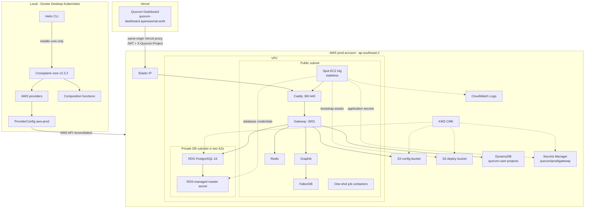
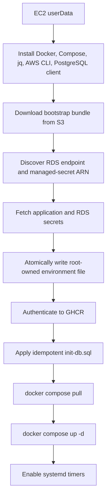

# Quorum on AWS via Crossplane - Deployment Design

**Status:** Approved design, implementation not started
**Date:** 2026-06-11
**Last revised:** 2026-06-11
**Scope:** Production-only AWS backend infrastructure and gateway deployment
**Dashboard:** Vercel at <https://quorum-dashboard.ayansasmal.work>

---

## 1. Executive Summary

Quorum uses the local Docker Desktop Kubernetes cluster as a permanent Crossplane control plane.
Crossplane provisions the production AWS infrastructure, while a stateless spot EC2 instance runs the
backend application stack with Docker Compose.

The dashboard is not part of the AWS workload. It lives in the separate
[`ayansasmal/Quorum-dash`](https://github.com/ayansasmal/Quorum-dash) repository and deploys to Vercel.
Vercel proxies gateway-owned paths to the AWS gateway using its production
`QUORUM_GATEWAY_URL` environment variable.

The production delivery chain is:

```text
Helm
  -> installs Crossplane core into Docker Desktop Kubernetes

Crossplane
  -> provisions AWS resources

EC2 userData + S3 bootstrap assets
  -> installs and starts Docker Compose

Docker Compose
  -> runs Caddy, gateway, Graphiti, FalkorDB, Redis, and scheduled jobs

Vercel
  -> serves the dashboard and proxies authenticated requests to the gateway
```

Helm does **not** deploy the Quorum gateway in this architecture. `provider-helm` is not required.
The existing `helm/quorum` chart remains available for optional Kubernetes deployments, but it is not
part of this AWS production path.

No AWS resources are to be created until the implementation has been reviewed and an explicit deployment
request is made.

---

## 2. Current State

As of June 11, 2026:

- Docker Desktop Kubernetes is the selected local control plane.
- Crossplane core `v2.3.2` is installed in `crossplane-system`.
- The Crossplane and RBAC manager deployments are healthy.
- No AWS providers have been installed for this production design.
- `provider-helm` is not installed.
- No Crossplane XR, AWS managed resource, or Quorum Helm release has been applied.
- The dashboard repository has been extracted with history and linked to Vercel.
- Dashboard production URL: <https://quorum-dashboard.ayansasmal.work>.
- Vercel has a placeholder `QUORUM_GATEWAY_URL`; it will be replaced after the AWS gateway is online.

---

## 3. Locked Decisions

| # | Decision | Choice |
|---|----------|--------|
| 1 | Environment model | One production environment named `prod`; no separate non-production AWS environment |
| 2 | Control plane | Local Docker Desktop Kubernetes |
| 3 | Crossplane core | Pin `v2.3.2` |
| 4 | Crossplane installation | Helm installs Crossplane core only |
| 5 | Application deployment | EC2 bootstrap plus Docker Compose; no application Helm release |
| 6 | Helm provider | Do not install `provider-helm` for this topology |
| 7 | Compute | Single stateless Graviton spot EC2 instance |
| 8 | Durable database | RDS PostgreSQL; the source of truth must survive EC2 replacement |
| 9 | Disposable services | Redis and FalkorDB run on EC2 and may be rebuilt |
| 10 | Dashboard | Separate GitHub repository deployed to Vercel |
| 11 | Gateway exposure | Public HTTPS domain pointing to the EC2 Elastic IP |
| 12 | TLS | Caddy on EC2 obtains and renews a trusted ACME certificate |
| 13 | DNS | Existing DNS provider by default; Route 53 remains optional |
| 14 | Images | Gateway and Graphiti images in GHCR; no dashboard image in AWS |
| 15 | AWS authentication | EC2 instance profile; no static AWS credentials on EC2 |
| 16 | Database credentials | RDS generates and manages the master password in Secrets Manager |
| 17 | Application secrets | AWS Secrets Manager secret containing JWT, OAuth, GHCR, and OpenAI values |
| 18 | Instance access | SSM Session Manager; no inbound SSH |
| 19 | Recurring jobs | systemd timers launch one-shot Docker Compose services |
| 20 | Deployment trigger | Implementation and offline validation only until explicitly approved |

---

## 4. Architecture



### Trust boundary

The AWS gateway remains the sole authentication and authorization authority:

- Browser requests carry `Authorization: Bearer <Quorum JWT>`.
- Browser requests carry `X-Quorum-Project: <group_id>`.
- Vercel forwards those headers but grants no access itself.
- The gateway validates the ES256 JWT.
- The gateway resolves membership and role server-side from Redis and DynamoDB.
- Route and constitutional guards enforce operation-specific authorization.

---

## 5. What Runs Where

| Component | Location | Delivery mechanism |
|-----------|----------|--------------------|
| Crossplane core | Docker Desktop Kubernetes | Helm chart `crossplane-stable/crossplane` |
| AWS providers and functions | Docker Desktop Kubernetes | Crossplane package resources |
| VPC, EC2, RDS, IAM, S3, DynamoDB, Secrets, KMS, logs | AWS | Crossplane Composition |
| Caddy | EC2 | Docker Compose |
| Gateway | EC2 | Docker Compose, image from GHCR |
| Graphiti | EC2 | Docker Compose, image from GHCR |
| FalkorDB | EC2 | Docker Compose |
| Redis | EC2 | Docker Compose |
| Decay/archive/recheck jobs | EC2 | systemd timers plus one-shot Compose services |
| Dashboard | Vercel | Git integration from `Quorum-dash` |

### Explicit exclusions

- No EKS.
- No application Helm release.
- No `provider-helm`.
- No dashboard container on EC2.
- No dashboard image in GHCR for this deployment.
- No ALB or ACM.
- No mandatory Route 53 hosted zone.
- No ElastiCache or Neptune in the first production footprint.
- No database password in Git, XR manifests, Kubernetes Secrets, or the application secret.

---

## 6. Crossplane API

The environment is represented by one namespaced `QuorumEnvironment` XR backed by a cluster-scoped
`XQuorumEnvironment` XRD.

```yaml
apiVersion: platform.quorum.io/v1alpha1
kind: QuorumEnvironment
metadata:
  name: quorum-prod
  namespace: quorum-system
spec:
  crossplane:
    compositionRef:
      name: xquorumenvironment
  environment: prod
  region: ap-southeast-2
  domainName: api.example.com
  dashboardUrl: https://quorum-dashboard.ayansasmal.work
  network:
    vpcCidr: 10.20.0.0/16
  compute:
    instanceType: t4g.large
    capacityType: spot
    spotMaxPrice: "0.04"
    rootVolumeGiB: 30
    arch: arm64
  database:
    engineVersion: "16"
    instanceClass: db.t4g.micro
    allocatedStorageGiB: 20
    masterUsername: quorum
    manageMasterUserPassword: true
    multiAz: false
    deletionProtection: false
    backupRetentionDays: 7
  llm:
    provider: openai
    model: gpt-4o-mini
    embedModel: text-embedding-3-small
    embedDim: 1536
  tls:
    mode: acme
    acmeEmail: operator@example.com
  dns:
    manageRoute53: false
    hostedZoneId: ""
  images:
    registry: ghcr.io/ayansasmal
    gatewayTag: "0.4.12"
    graphitiTag: "0.4.x"
    applySchema: true
```

`domainName` and `acmeEmail` remain operator inputs. The actual gateway domain must be selected before
deployment, but it is not required for authoring or rendering the manifests.

The Composition creates a `quorum-prod-connection` Secret in `quorum-system` for operator-visible,
non-credential outputs:

- Elastic IP
- EC2 instance ID
- RDS endpoint and port
- configured gateway domain
- dashboard URL

The RDS password is not copied into this Secret.

---

## 7. Crossplane Package Layout

The production implementation will coexist with the existing LocalStack manifests:

```text
crossplane/
  apis/environment/
    definition.yaml
    composition.yaml
  environments/
    prod.yaml
  providers/
    providers.yaml
    functions.yaml
    providerconfig-aws-prod.yaml
    providerconfig-aws-local.yaml
  bootstrap/
    ec2-userdata.sh
    start.sh
    refresh-rds-credentials.sh
    docker-compose.aws.yml
    Caddyfile
    systemd/
      quorum.service
      quorum-credential-refresh.service
      quorum-credential-refresh.timer
      quorum-decay.service
      quorum-decay.timer
      quorum-archive.service
      quorum-archive.timer
      quorum-recheck.service
      quorum-recheck.timer
    init-db.sql
```

The existing lowercase singular directories (`provider/`, `rds/`, `redis/`, and so on) remain the
LocalStack reference until a later cleanup. Production files use explicit `aws-prod` names to avoid
accidentally targeting LocalStack.

---

## 8. AWS Resources

### 8.1 Network

- VPC using the XR CIDR.
- One public subnet for EC2.
- Two private subnets in different AZs for the RDS subnet group.
- Internet Gateway and public route table.
- App security group:
  - inbound TCP 80 from the internet for ACME and HTTPS redirect;
  - inbound TCP 443 from the internet;
  - no inbound TCP 22.
- Database security group:
  - inbound TCP 5432 only from the app security group.

No NAT Gateway is required.

### 8.2 Compute

- Graviton-compatible Amazon Linux 2023 AMI.
- Spot instance using the requested instance type and maximum price.
- Instance profile attached before boot.
- Elastic IP and association.
- Disposable encrypted gp3 root volume.
- SSM agent and `AmazonSSMManagedInstanceCore`.
- Minimal `userData` that downloads the versioned bootstrap entrypoint from S3.

EC2 contains no durable governed knowledge.

### 8.3 Database

- RDS PostgreSQL 16.
- Single-AZ `db.t4g.micro` initially.
- Encrypted storage using the environment KMS key.
- Not publicly accessible.
- Seven-day automated backup retention.
- `manageMasterUserPassword: true`.
- RDS-managed master credential secret.
- Final snapshot on controlled teardown.

RDS is the durable source of truth. Redis and FalkorDB may be destroyed and rebuilt.

### 8.4 Storage and index

- Versioned, encrypted S3 config bucket.
- Versioned, encrypted S3 deploy bucket.
- DynamoDB `quorum-user-projects` table with the existing membership GSI.
- No retired `quorum-configs` DynamoDB table.

### 8.5 IAM

The EC2 instance role receives only the permissions required to:

- read and write the config bucket;
- read bootstrap files from the deploy bucket;
- read and write the membership table;
- read `quorum/prod/*` application secrets;
- discover the RDS endpoint and managed-secret ARN;
- read the matching RDS-managed secret;
- decrypt with the environment KMS key;
- publish CloudWatch logs;
- register with SSM.

GHCR authentication uses a read-only package token from Secrets Manager, not an AWS registry permission.

---

## 9. Secrets and OAuth

### Application secret

`quorum/prod/gateway` contains:

- `QUORUM_JWT_PRIVATE_KEY`
- `QUORUM_JWT_PUBLIC_KEY`
- `GITHUB_CLIENT_ID`
- `GITHUB_CLIENT_SECRET`
- `OPENAI_API_KEY`
- `GHCR_TOKEN`

It does not contain the RDS password.

### Database secret

RDS creates and owns the master-user secret. At boot, the instance:

1. calls `DescribeDBInstances`;
2. reads the database endpoint and `MasterUserSecret.SecretArn`;
3. retrieves the RDS secret;
4. creates root-owned PostgreSQL environment variables;
5. applies `init-db.sql`;
6. starts or recreates the gateway.

### GitHub OAuth values

After the gateway domain is selected:

```env
DASHBOARD_URL=https://quorum-dashboard.ayansasmal.work
GITHUB_CALLBACK_URL=https://<gateway-domain>/oauth/callback
QUORUM_GATEWAY_URL=https://<gateway-domain>
```

GitHub OAuth App settings:

- Homepage URL: `https://quorum-dashboard.ayansasmal.work`
- Authorization callback URL: `https://<gateway-domain>/oauth/callback`

The GitHub OAuth client secret remains in AWS Secrets Manager. It is never stored in Vercel.

Vercel's production `QUORUM_GATEWAY_URL` is updated only after the HTTPS gateway health check succeeds,
followed by a production Vercel redeployment.

---

## 10. EC2 Application Stack

`docker-compose.aws.yml` contains:

- `caddy`
- `gateway`
- `graphiti`
- `falkordb`
- `redis`
- `decay-job`
- `archive-job`
- `recheck-job`

It does not contain the dashboard.

Caddy:

- listens on ports 80 and 443;
- redirects HTTP to HTTPS;
- obtains and renews an ACME certificate;
- proxies all traffic to `gateway:3001`;
- persists its certificate state on the disposable root disk;
- can reacquire a certificate after replacement because the EIP and domain remain stable.

Gateway and Graphiti images are built for `linux/arm64` and published to GHCR. FalkorDB, Redis, and Caddy
use pinned compatible public images.

### Bootstrap sequence



### RDS credential rotation

A 15-minute systemd timer:

1. retrieves the current RDS secret version;
2. compares it with the last successfully applied version;
3. writes a complete temporary environment file;
4. atomically replaces the active file;
5. recreates the gateway;
6. waits for gateway health;
7. records the new version only after success.

---

## 11. Deployment Workflow

Implementation must keep preparation separate from execution.

### Safe implementation and validation commands

These do not create AWS resources:

- `helm template`
- `crossplane beta render`
- YAML and JSON schema validation
- `shellcheck`
- `bash -n`
- Docker Compose configuration validation
- unit tests for bootstrap rendering and scripts
- container image builds without pushes

### Deployment commands requiring explicit approval

Do not run these during implementation:

- applying AWS providers or functions;
- creating the production ProviderConfig;
- applying the XRD, Composition, or production XR;
- seeding AWS Secrets Manager;
- pushing production images;
- creating or changing DNS;
- changing the GitHub OAuth callback;
- replacing Vercel's gateway placeholder;
- destroying any AWS resource.

### Approved future deployment order

1. Verify local Crossplane core.
2. Install pinned AWS providers and composition functions.
3. Configure the production AWS ProviderConfig.
4. Build and push arm64 gateway and Graphiti images.
5. Seed the application secret.
6. Apply XRD and Composition.
7. Apply `environments/prod.yaml`.
8. Wait for the AWS resources and output Secret.
9. Point the gateway DNS record at the EIP.
10. Wait for Caddy TLS and verify gateway health.
11. Update the GitHub OAuth App callback.
12. Replace Vercel `QUORUM_GATEWAY_URL` and redeploy production.
13. Verify dashboard login and authorized API access.

---

## 12. Observability and Operations

- Docker `awslogs` driver sends gateway, Graphiti, Caddy, and job output to CloudWatch.
- CloudWatch alarms cover EC2 status checks, disk pressure, and RDS storage/CPU/connections.
- SSM Session Manager is the normal shell access path.
- Application updates use a new GHCR tag plus `docker compose pull` and service recreation.
- Dashboard updates remain independent through Vercel Git deployment.

Recommended initial schedules:

| Job | Command | Cadence |
|-----|---------|---------|
| Confidence decay | `npm run job:decay` | Daily |
| Audit archival | `npm run job:archive` | Daily |
| Conflict recheck | `npm run job:recheck` | Hourly |
| RDS credential refresh | bootstrap script | Every 15 minutes |

---

## 13. Teardown and Retention

| Resource | Controlled teardown behavior |
|----------|-----------------------------|
| RDS | Final snapshot required before deletion |
| RDS-managed secret | Lifecycle follows RDS |
| Config S3 bucket | Empty object versions before deletion |
| Deploy S3 bucket | Empty object versions before deletion |
| DynamoDB | Delete; membership index is rebuildable from S3 configs |
| Application secret | Use recovery window |
| KMS key | Schedule deletion using AWS minimum waiting period |
| EC2 root volume | Delete with instance |
| EIP | Release after instance teardown |
| VPC resources | Delete after dependants |
| Vercel dashboard | Independent; not deleted with AWS XR |

Deleting the XR must never imply deleting Vercel or the dashboard repository.

---

## 14. Implementation Deliverables

The implementation phase must produce:

1. Crossplane v2 XRD and namespaced XR schema.
2. Flat pipeline Composition with pinned providers and functions.
3. Production ProviderConfig template with no committed credentials.
4. AWS network, compute, IAM, RDS, S3, DynamoDB, KMS, Secrets Manager, and CloudWatch resources.
5. EC2 bootstrap scripts and versioned S3 objects.
6. Backend-only Docker Compose stack.
7. Caddy gateway configuration.
8. systemd units and timers.
9. RDS credential-refresh logic.
10. Offline manifest rendering and script tests.
11. Updated operator documentation.
12. A deployment script whose mutating operations require an explicit `apply` command.

---

## 15. Success Criteria

### Implementation readiness

- All manifests render without contacting AWS.
- The XR schema rejects invalid production inputs.
- Bootstrap scripts pass `shellcheck` and syntax checks.
- Docker Compose validates and contains no dashboard service.
- No Helm release manifest exists for the AWS gateway.
- No production secret value is committed.
- No deployment command runs as part of tests or validation.

### Future deployment readiness

- The XR converges the declared AWS resources.
- EC2 starts the backend-only Compose stack.
- Gateway health reports RDS, Graphiti, and Redis connectivity.
- RDS credentials never pass through local Kubernetes etcd.
- The gateway serves trusted HTTPS.
- Vercel proxies authenticated dashboard traffic to the gateway.
- GitHub OAuth redirects back to `https://quorum-dashboard.ayansasmal.work`.
- Replacing the spot instance loses no governed knowledge.

---

## 16. Deferred Upgrades

The following are not part of the first production footprint:

- Multi-AZ RDS.
- ElastiCache.
- Amazon Neptune.
- ALB plus ACM.
- EKS.
- `provider-helm`.
- Kubernetes application deployment.
- multi-region failover.

Each may be introduced later if availability, scale, or organizational requirements justify its cost.
