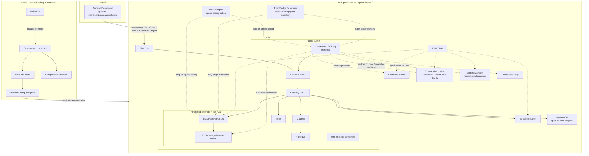
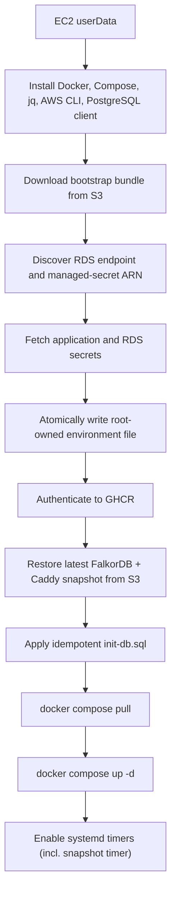

# Quorum on AWS via Crossplane - Deployment Design

**Status:** Approved design, implementation not started
**Date:** 2026-06-11
**Last revised:** 2026-06-11
**Scope:** Production-named, demo-purpose AWS backend infrastructure and gateway deployment
**Dashboard:** Vercel at <https://quorum-dashboard.ayansasmal.work>

---

## 1. Executive Summary

Quorum uses the local Docker Desktop Kubernetes cluster as its Crossplane control plane.
Crossplane provisions the production AWS infrastructure, while a stateless on-demand EC2 instance runs the
backend application stack with Docker Compose. To keep the demo cheap, the instance and its RDS database
are stopped on a schedule (EventBridge Scheduler) and brought back up on demand by the operator during
the build phase, with an AWS Budgets action as a spend ceiling — see
[§13](#13-observability-operations-and-cost-control). The instance is
fully disposable — it holds no durable state on its own disk. The two pieces of state that are expensive
to rebuild live off-instance:
**PostgreSQL (the source of truth) on managed RDS**, and **FalkorDB's derived graph/embeddings plus
Caddy's TLS material as versioned snapshots in S3** that a replacement instance restores on boot. A
replacement can pull the latest snapshot and normally resume without a full re-embedding or Let's
Encrypt re-issue.

The dashboard is not part of the AWS workload. It lives in the separate
[`ayansasmal/Quorum-dash`](https://github.com/ayansasmal/Quorum-dash) repository and deploys to Vercel.
Vercel proxies gateway-owned paths to the AWS gateway using its production
`QUORUM_GATEWAY_URL` environment variable.

The production delivery chain is:

```text
Helm
  -> installs Crossplane core into Docker Desktop Kubernetes

Crossplane
  -> provisions AWS resources

EC2 userData + S3 bootstrap assets
  -> installs and starts Docker Compose

Docker Compose
  -> runs Caddy, gateway, Graphiti, FalkorDB, Redis, and scheduled jobs

Vercel
  -> serves the dashboard and proxies authenticated requests to the gateway
```

> **Considered:** Crossplane's `provider-helm` could deploy the gateway into Kubernetes, and the
> repository's `helm/quorum` chart still supports optional Kubernetes deployments. This design runs the
> backend on EC2 via Docker Compose instead, so Helm's only role is installing Crossplane core.

No AWS resources are to be created until the implementation has been reviewed and an explicit deployment
request is made.

---

## 2. Current State

As of June 11, 2026:

- Docker Desktop Kubernetes is the selected local control plane.
- Crossplane core `v2.3.2` is installed in `crossplane-system`.
- The Crossplane and RBAC manager deployments are healthy.
- No AWS providers have been installed for this production design.
- `provider-helm` is not installed.
- No Crossplane XR, AWS managed resource, or Quorum Helm release has been applied.
- Crossplane's AWS ProviderConfig credentials are already configured locally and verified to work. Their
  values remain outside Git and are not managed by this design.
- The dashboard repository has been extracted with history and linked to Vercel.
- Dashboard production URL: <https://quorum-dashboard.ayansasmal.work>.
- Vercel has a placeholder `QUORUM_GATEWAY_URL`; it will be replaced after the AWS gateway is online.

---

## 3. Locked Decisions

| # | Decision | Choice |
|---|----------|--------|
| 1 | Environment model | One production environment named `prod`; no separate non-production AWS environment |
| 2 | Control plane | Local Docker Desktop Kubernetes |
| 3 | Crossplane core | Pin `v2.3.2` |
| 4 | Crossplane installation | Helm installs Crossplane core only |
| 5 | Application deployment | EC2 bootstrap plus Docker Compose |
| 6 | Compute | Single stateless Graviton on-demand EC2 instance; auto-stopped daily for cost control and resumed on demand |
| 7 | Durable database | RDS PostgreSQL; the source of truth must survive EC2 replacement |
| 8 | Disposable services | Redis is fully disposable; FalkorDB's derived state is snapshotted to versioned S3 and restored on boot |
| 9 | Dashboard | Separate GitHub repository deployed to Vercel |
| 10 | Gateway exposure | Public HTTPS at `quorum-gateway.ayansasmal.work`, pointing to the EC2 Elastic IP |
| 11 | TLS | Caddy on EC2 obtains and renews a trusted Let's Encrypt certificate via the ACME HTTP-01 challenge; cert/account state is snapshotted to S3 so replacement avoids re-issue |
| 12 | DNS | Vercel-managed DNS for `ayansasmal.work`: a single A record (`quorum-gateway`) points at the EC2 Elastic IP. No Route 53 / AWS DNS — Vercel hosts the record but does not proxy traffic |
| 13 | Images | Gateway and Graphiti images in GHCR |
| 14 | AWS authentication | EC2 instance profile; no static AWS credentials on EC2 |
| 15 | Database credentials | RDS generates and manages the master password in Secrets Manager |
| 16 | Application secrets | AWS Secrets Manager secret containing JWT, OAuth, GHCR, and OpenAI values |
| 17 | Instance access | SSM Session Manager; no inbound SSH |
| 18 | Recurring jobs | systemd timers launch one-shot Docker Compose services |
| 19 | Deployment trigger | Implementation and offline validation only until explicitly approved |
| 20 | Service level | Demo workload; brief downtime and manual recovery are acceptable |
| 21 | Crossplane credentials | Existing local AWS ProviderConfig credentials are reused and remain outside Git |
| 22 | Cost control | Daily EventBridge auto-stop of EC2 + RDS at 10:00 and 23:00 Sydney (scheduled auto-start disabled for the build phase — resume on demand via scripts), plus on-demand resume/suspend scripts and an AWS Budget (email alert at ~60 AUD, hard stop action at ~90 AUD); AWS-native and independent of the local Crossplane control plane |

---

## 4. Demo Risk Acceptance

This deployment is production-named because it has only one environment, but it is intended for a
demonstration rather than a highly available production service. The following limitations are
deliberately accepted:

- The Crossplane control plane runs on a local Docker Desktop Kubernetes cluster. If that machine or
  cluster is offline, reconciliation pauses until it returns.
- The instance is a single standalone on-demand EC2 instance with no Auto Scaling Group. If it fails an
  instance status check, Crossplane or manual intervention replaces it; there is no automatic failover.
- During the build phase the stack is offline by default: scheduled auto-start is disabled, so the demo
  is available only after the operator brings it up with `quorum-resume.sh`. The scheduled auto-stop runs
  every day at 10:00 and 23:00 (Sydney) as a cost safety net, so any manual resume — weekday, weekend, or
  after-hours — is automatically stopped at the next 10:00 or 23:00 and never runs unattended for long.
  Clock-based resume can be re-enabled later by flipping `schedule.autoStart.enabled`.
- RDS is stopped on the same schedule. AWS automatically restarts a stopped RDS instance after seven
  days. The operator accepts this: the schedule's daily start normally pre-empts it, and a stray
  auto-restart only costs idle RDS hours until the next scheduled stop.
- The Elastic IP continues to bill its small hourly charge while the instance is stopped, because the
  address is allocated but not associated with a running instance.
- FalkorDB may restore from a snapshot that is up to one snapshot interval old. PostgreSQL remains the
  governed source of truth; full graph reconciliation is a manual recovery option for the demo.
- RDS is Single-AZ with seven-day backups, `deletionProtection: false`, and no Crossplane orphan policy.
  The operator accepts the increased deletion and availability risk for the demo.
- The EC2 workload uses one public subnet. Cross-AZ compute failover is not a requirement.
- Crossplane AWS credentials have already been configured and tested locally. Credential bootstrapping,
  rotation, and migration to workload identity are outside this implementation.

These are conscious cost and complexity trade-offs, not recommendations for a durable customer-facing
production deployment.

---

## 5. Architecture



### Trust boundary

The AWS gateway remains the sole authentication and authorization authority:

- Browser requests carry `Authorization: Bearer <Quorum JWT>`.
- Browser requests carry `X-Quorum-Project: <group_id>`.
- Vercel forwards those headers but grants no access itself.
- The gateway validates the ES256 JWT.
- The gateway resolves membership and role server-side from Redis and DynamoDB.
- Route and constitutional guards enforce operation-specific authorization.

---

## 6. What Runs Where

| Component | Location | Delivery mechanism |
|-----------|----------|--------------------|
| Crossplane core | Docker Desktop Kubernetes | Helm chart `crossplane-stable/crossplane` |
| AWS providers and functions | Docker Desktop Kubernetes | Crossplane package resources |
| VPC, EC2, RDS, IAM, S3, DynamoDB, KMS, logs | AWS | Crossplane Composition |
| EventBridge Scheduler stop/start schedules, AWS Budget + budget action | AWS | Crossplane Composition |
| Gateway application secret | AWS Secrets Manager | Operator-created and seeded before the production XR |
| Caddy | EC2 | Docker Compose |
| Gateway | EC2 | Docker Compose, image from GHCR |
| Graphiti | EC2 | Docker Compose, image from GHCR |
| FalkorDB | EC2 | Docker Compose |
| Redis | EC2 | Docker Compose |
| Decay/archive/recheck jobs | EC2 | systemd timers plus one-shot Compose services |
| FalkorDB + Caddy snapshot | EC2 | systemd timer running `snapshot-save.sh` to S3 |
| Dashboard | Vercel | Git integration from `Quorum-dash` |

---

## 7. Crossplane API

The environment is represented by one namespaced `QuorumEnvironment` XR backed by a cluster-scoped
`XQuorumEnvironment` XRD.

```yaml
apiVersion: platform.quorum.io/v1alpha1
kind: QuorumEnvironment
metadata:
  name: quorum-prod
  namespace: quorum-system
spec:
  crossplane:
    compositionRef:
      name: xquorumenvironment
  environment: prod
  region: ap-southeast-2
  domainName: quorum-gateway.ayansasmal.work   # confirmed; DNS A record managed in Vercel, points at the EIP
  dashboardUrl: https://quorum-dashboard.ayansasmal.work
  network:
    vpcCidr: 10.20.0.0/16
  compute:
    instanceType: t4g.large
    capacityType: on-demand           # so the instance can be stopped/started on a schedule
    rootVolumeGiB: 30
    arch: arm64
  schedule:
    timezone: Australia/Sydney
    autoStop:
      enabled: true                           # cost safety net - runs every day, never leaves the stack up
      cron: "cron(0 10,23 * * ? *)"           # 10:00 and 23:00 DAILY (incl. weekends) - snapshot, then stop EC2 and RDS
    autoStart:
      enabled: false                          # DISABLED for the build phase - bring the stack up on demand
      cron: "cron(0 5,16 ? * MON-FRI *)"      # retained but inactive; weekday windows for when clock resume is restored
  budget:
    monthlyLimitUSD: 40                     # ~60 AUD - the alert target; expected spend sits near here
    alertThresholdPercent: 100              # email at 100% of the limit (~60 AUD) - notify, do not stop
    actionThresholdPercent: 150             # hard stop EC2 + RDS only at ~90 AUD, well above normal spend
    notifyEmail: operator@example.com
  snapshot:
    bucketSuffix: snapshots             # versioned S3 bucket for FalkorDB + Caddy state
    intervalMinutes: 60                 # BGSAVE + upload cadence
    restoreOnBoot: true                 # pull latest snapshot before starting falkordb/caddy
  database:
    engineVersion: "16"
    instanceClass: db.t4g.micro
    allocatedStorageGiB: 20
    masterUsername: quorum
    manageMasterUserPassword: true
    multiAz: false
    deletionProtection: false
    backupRetentionDays: 7
  llm:
    provider: openai
    model: gpt-4o-mini
    embedModel: text-embedding-3-small
    embedDim: 1536
  tls:
    mode: acme
    acmeEmail: operator@example.com
  dns:
    provider: vercel-external           # DNS for ayansasmal.work lives in Vercel; AWS manages no DNS
    manageRoute53: false                # AWS DNS is never used for this stack
    hostedZoneId: ""                    # unused
  images:
    registry: ghcr.io/ayansasmal
    gatewayTag: "0.4.12"
    graphitiTag: "0.4.x"
    applySchema: true
```

`domainName` and `acmeEmail` remain operator inputs. The gateway domain is **confirmed** as
`quorum-gateway.ayansasmal.work`. DNS for `ayansasmal.work` is hosted in **Vercel**, not AWS: the
operator adds a single **A record** (`quorum-gateway` → the Elastic IP) in the Vercel dashboard. Vercel
serves the record but does not proxy the traffic, so the connection reaches Caddy directly and Caddy's
ACME HTTP-01 challenge succeeds. AWS manages no DNS — there is no Route 53 hosted zone, no ACM
certificate, and `dns.manageRoute53` stays `false`. The only deploy-time coupling is that the A record
must point at the EIP before Caddy can complete its first certificate issuance; until then the manifests
still render and validate.

The Composition creates a `quorum-prod-connection` Secret in `quorum-system` for operator-visible,
non-credential outputs:

- Elastic IP
- EC2 instance ID
- RDS endpoint and port
- configured gateway domain
- snapshot bucket name
- dashboard URL

The RDS password is not copied into this Secret.

---

## 8. Crossplane Package Layout

The production implementation will coexist with the existing LocalStack manifests:

```text
crossplane/
  apis/environment/
    definition.yaml
    composition.yaml
  environments/
    prod.yaml
  ops/
    quorum-resume.sh           # operator-run from laptop: start RDS then EC2, poll gateway health
    quorum-suspend.sh          # operator-run from laptop: snapshot via SSM, then stop EC2 + RDS
  providers/
    providers.yaml
    functions.yaml
    providerconfig-aws-prod.yaml
    providerconfig-aws-local.yaml
  bootstrap/
    ec2-userdata.sh
    start.sh
    refresh-rds-credentials.sh
    snapshot-save.sh           # BGSAVE FalkorDB + tar Caddy state -> upload to S3
    snapshot-restore.sh        # download latest snapshot from S3 -> seed volumes before compose up
    docker-compose.aws.yml
    Caddyfile
    systemd/
      quorum.service
      quorum-credential-refresh.service
      quorum-credential-refresh.timer
      quorum-snapshot.service
      quorum-snapshot.timer
      quorum-decay.service
      quorum-decay.timer
      quorum-archive.service
      quorum-archive.timer
      quorum-recheck.service
      quorum-recheck.timer
    init-db.sql
```

The `bootstrap/` assets run *on the instance* (delivered via S3 and `userData`); the `ops/` scripts run
*from the operator's laptop* with the AWS CLI and never get installed on the instance — that separation
keeps the on-demand suspend/resume controls independent of the running stack.

The existing lowercase singular directories (`provider/`, `rds/`, `redis/`, and so on) remain the
LocalStack reference until a later cleanup. Production files use explicit `aws-prod` names to avoid
accidentally targeting LocalStack.

---

## 9. AWS Resources

### 9.1 Network

- VPC using the XR CIDR.
- One public subnet for EC2.
- Two private subnets in different AZs for the RDS subnet group.
- Internet Gateway and public route table.
- App security group:
  - inbound TCP 80 from the internet for ACME and HTTPS redirect;
  - inbound TCP 443 from the internet;
  - no inbound TCP 22.
- Database security group:
  - inbound TCP 5432 only from the app security group.

No NAT Gateway is required.

### 9.2 Compute

- Graviton-compatible Amazon Linux 2023 AMI.
- On-demand instance of the requested instance type.
- Instance profile attached before boot.
- Elastic IP and association.
- Disposable encrypted gp3 root volume (EBS-backed, so a stop preserves the volume while compute billing
  pauses; the bootstrap is idempotent and re-runs cleanly on every start).
- SSM agent and `AmazonSSMManagedInstanceCore`.
- Minimal `userData` that downloads the versioned bootstrap entrypoint from S3.
- On boot, restores the latest FalkorDB and Caddy snapshot from S3 before the Compose stack starts. The
  same boot path runs on an on-demand resume as on a fresh replacement.

EC2 contains no durable governed knowledge and pins no data to its disk. All
expensive-to-rebuild state lives in RDS (source of truth) and the versioned S3 snapshot bucket.

> **Considered:** Spot would lower compute cost further, but a stopped Spot instance can only be
> restarted by EC2 when capacity frees up, which would make the scheduled start unreliable. On-demand is
> chosen so the stop/start schedule is deterministic — and the schedule already brings cost down to
> roughly Spot levels.

### 9.3 Database

- RDS PostgreSQL 16.
- Single-AZ `db.t4g.micro` initially.
- Encrypted storage using the environment KMS key.
- Not publicly accessible.
- Seven-day automated backup retention.
- `manageMasterUserPassword: true`.
- RDS-managed master credential secret.
- Final snapshot on controlled teardown.

RDS is the durable source of truth. Redis and FalkorDB may be destroyed and rebuilt.
For this demo, the operator explicitly accepts Single-AZ availability, disabled deletion protection,
and Crossplane's normal delete lifecycle. A future durable production deployment must revisit those
settings.

### 9.4 Storage and index

- Versioned, encrypted S3 config bucket.
- Versioned, encrypted S3 deploy bucket.
- Versioned, encrypted S3 snapshot bucket for FalkorDB `dump.rdb` and Caddy TLS state. S3 versioning
  retains a point-in-time history; a lifecycle rule expires non-current versions after a fixed window
  (for example 14 days) to bound cost.
- DynamoDB `quorum-user-projects` table with the existing membership GSI.
- No retired `quorum-configs` DynamoDB table.

### 9.5 IAM

The EC2 instance role receives only the permissions required to:

- read and write the config bucket;
- read bootstrap files from the deploy bucket;
- read and write the snapshot bucket (restore on boot, upload on the snapshot timer);
- read and write the membership table;
- read `quorum/prod/*` application secrets;
- discover the RDS endpoint and managed-secret ARN;
- read the matching RDS-managed secret;
- decrypt with the environment KMS key;
- publish CloudWatch logs;
- register with SSM.

GHCR authentication uses a read-only package token from Secrets Manager, not an AWS registry permission.

### 9.6 Cost-control resources

These resources implement the scheduled stop/start and the budget ceiling. They are all AWS-native and
keep running whether or not the local Crossplane control plane is online; Crossplane only creates them.

- **EventBridge Scheduler — stop schedule.** Enabled (`schedule.autoStop.enabled: true`). Fires on
  `schedule.autoStop.cron` (default 10:00 and 23:00 **every day, including weekends** — a single
  comma-list cron covers both times). Uses the universal target to call `ec2:StopInstances` on the
  instance and `rds:StopDBInstance` on the database. The gateway is drained by the OS shutdown; the
  FalkorDB/Caddy snapshot runs just before stop (see [§13](#13-observability-operations-and-cost-control)).
  This is the cost safety net — it always runs, regardless of how or when the stack was started, so no
  manual resume is ever left running past the next 10:00 or 23:00.
- **EventBridge Scheduler — start schedule.** Created but **disabled for the build phase**
  (`schedule.autoStart.enabled: false`), so the schedule object exists in a `DISABLED` state and never
  fires. Its `schedule.autoStart.cron` (default 05:00 and 16:00 on weekdays) and `rds:StartDBInstance`
  → delay → `ec2:StartInstances` ordering are retained for when clock-based resume is re-enabled. While
  disabled, the operator brings the stack up on demand with `quorum-resume.sh`
  (see [§13](#13-observability-operations-and-cost-control)).
- **Scheduler execution role.** An IAM role assumed by EventBridge Scheduler, scoped to
  `ec2:StopInstances`/`ec2:StartInstances` and `rds:StopDBInstance`/`rds:StartDBInstance` on the two
  specific resource ARNs. No Lambda is involved.
- **AWS Budget + budget action.** A monthly cost budget at `budget.monthlyLimitUSD` (~60 AUD, the alert
  target that expected spend sits near). At `budget.alertThresholdPercent` it emails `budget.notifyEmail`
  — notify only, no stop. At the higher `budget.actionThresholdPercent` (~90 AUD, above normal spend) a
  budget action stops the EC2 instance and the RDS instance as a hard ceiling, independent of the
  time-of-day schedule. The gap between the two thresholds keeps an ordinary month from being
  force-stopped while still capping a runaway bill.
- **Budget action role.** An IAM role the AWS Budgets service assumes to perform the stop action, scoped
  to the same two resource ARNs.

The scheduler and budget roles are separate from the EC2 instance role: the instance never needs
permission to stop or start itself or the database.

These resources are composed inside the single `XQuorumEnvironment` Composition — they are **not** a
separate XRD. They require two AWS provider-family subpackages beyond the ec2/rds/s3/iam/dynamodb/kms
set, added to `providers/providers.yaml` and pinned to the same provider-family v2 line:

- `upbound/provider-aws-scheduler` — the `Schedule` resource (`scheduler.aws.upbound.io`).
- `upbound/provider-aws-budgets` — the `Budget` and `BudgetAction` resources (`budgets.aws.upbound.io`).

The Composition wires the two schedules' and the budget action's resource ARNs to the EC2 instance and
RDS instance it already creates, and references the scheduler/budget IAM roles for `assumeRole`.

---

## 10. Secrets and OAuth

### Application secret

`quorum/prod/gateway` contains:

- `QUORUM_JWT_PRIVATE_KEY`
- `QUORUM_JWT_PUBLIC_KEY`
- `GITHUB_CLIENT_ID`
- `GITHUB_CLIENT_SECRET`
- `OPENAI_API_KEY`
- `GHCR_TOKEN`

It does not contain the RDS password.

The application secret is distinct from the RDS-managed database secret. The operator creates and seeds
it directly in AWS Secrets Manager before applying the production XR. Crossplane does not own this
secret; it only grants the EC2 instance role permission to read the known secret name. This keeps the
application values out of Kubernetes etcd and makes the populated secret a compute bootstrap
prerequisite.

### Database secret

RDS creates and owns the master-user secret. At boot, the instance:

1. calls `DescribeDBInstances`;
2. reads the database endpoint and `MasterUserSecret.SecretArn`;
3. retrieves the RDS secret;
4. creates root-owned PostgreSQL environment variables;
5. applies `init-db.sql`;
6. starts or recreates the gateway.

The RDS password is never manually seeded into `quorum/prod/gateway`. EC2 retrieves the RDS-managed
secret at runtime through its IAM instance profile, so the password never passes through Git,
Crossplane manifests, the local Kubernetes API, or Vercel.

### GitHub OAuth values

The gateway domain is confirmed, so these are final:

```env
DASHBOARD_URL=https://quorum-dashboard.ayansasmal.work
GITHUB_CALLBACK_URL=https://quorum-gateway.ayansasmal.work/oauth/callback
QUORUM_GATEWAY_URL=https://quorum-gateway.ayansasmal.work
```

GitHub OAuth App settings:

- Homepage URL: `https://quorum-dashboard.ayansasmal.work`
- Authorization callback URL: `https://quorum-gateway.ayansasmal.work/oauth/callback`

The single callback path `/oauth/callback` is served by the gateway (`gateway/src/routes/mcp-oauth.js`)
and handles both the dashboard JWT flow and the MCP OAuth authorization-code flow. The `redirect_uri`
sent to GitHub is derived from `QUORUM_GATEWAY_URL`, so that value must equal the registered callback's
origin exactly. These values can be entered in the GitHub OAuth App now; only the Vercel A record needs
the real EIP before the first login will succeed end-to-end.

The GitHub OAuth client secret remains in AWS Secrets Manager. It is never stored in Vercel.

Vercel's production `QUORUM_GATEWAY_URL` is updated only after the HTTPS gateway health check succeeds,
followed by a production Vercel redeployment.

---

## 11. EC2 Application Stack

`docker-compose.aws.yml` contains:

- `caddy`
- `gateway`
- `graphiti`
- `falkordb`
- `redis`
- `decay-job`
- `archive-job`
- `recheck-job`

Caddy:

- listens on ports 80 and 443;
- redirects HTTP to HTTPS;
- obtains and renews an ACME certificate;
- proxies all traffic to `gateway:3001`;
- has its certificate and ACME account state captured into the S3 snapshot and restored on boot, so a
  replacement instance reuses the existing certificate instead of re-issuing;
- the stable EIP and domain mean a re-issue is still possible as a fallback if no snapshot exists.

Gateway and Graphiti images are built for `linux/arm64` and published to GHCR. FalkorDB, Redis, and Caddy
use pinned compatible public images.

### Bootstrap sequence



### FalkorDB and Caddy snapshots

FalkorDB is a Redis-module process: its entire keyspace — graph nodes, `SUPERSEDES` edges, and the
1536-dim OpenAI embeddings — serialises to a single `/data/dump.rdb` file. Because the graph is a
**derived index** rebuildable from PostgreSQL, the snapshot does not need millisecond consistency with
RDS; it only needs to be recent enough to avoid a costly re-embed.

**Capture** — `snapshot-save.sh`, run by a `quorum-snapshot.timer` on the configured interval
(default 60 minutes):

1. issues `BGSAVE` to FalkorDB and waits for the background save to finish;
2. uploads `dump.rdb` to the versioned snapshot bucket;
3. tars Caddy's `/data` (certificate + ACME account state) and uploads it alongside;
4. relies on S3 versioning to retain prior point-in-time snapshots.

**Restore** — `snapshot-restore.sh`, run once during boot before `docker compose up`:

1. downloads the latest `dump.rdb` into the FalkorDB data volume location;
2. downloads and untars the Caddy state into its volume;
3. if no snapshot exists (first-ever boot), proceeds with empty volumes — FalkorDB starts clean and
   Caddy issues a fresh certificate.

This makes the instance disposable within the demo topology: the worst-case snapshot lag is one
snapshot interval of derived graph state, all of which remains re-derivable from PostgreSQL.

### RDS credential rotation

A 15-minute systemd timer:

1. retrieves the current RDS secret version;
2. compares it with the last successfully applied version;
3. writes a complete temporary environment file;
4. atomically replaces the active file;
5. recreates the gateway;
6. waits for gateway health;
7. records the new version only after success.

---

## 12. Deployment Workflow

Implementation must keep preparation separate from execution.

### Hard prerequisites before a real deployment

The domain is already owned: `ayansasmal.work` is registered and its DNS is hosted in Vercel. The only
deploy-time DNS action is pointing the **`quorum-gateway` A record at the EC2 Elastic IP** once the EIP
exists (workflow item 9) — a placeholder record (`quorum-gateway` → `127.0.0.1`) is already in place and
gets edited to the real IP. Caddy's ACME HTTP-01 issuance and the GitHub OAuth callback both then resolve
against `https://quorum-gateway.ayansasmal.work`. The GitHub OAuth App can be configured with the final
callback URL ahead of time; it only starts working once the A record carries the real EIP. The other
prerequisite is the seeded `quorum/prod/gateway` application secret (workflow item 6). Neither blocks
authoring or offline validation.

### Safe implementation and validation commands

These do not create AWS resources:

- `helm template`
- `crossplane render` (GA in Crossplane v2; the older `crossplane beta render` is deprecated)
- YAML and JSON schema validation
- `shellcheck`
- `bash -n`
- Docker Compose configuration validation
- unit tests for bootstrap rendering and scripts
- container image builds without pushes

### Deployment commands requiring explicit approval

Do not run these during implementation:

- applying AWS providers or functions;
- creating the production ProviderConfig;
- applying the XRD, Composition, or production XR;
- seeding AWS Secrets Manager;
- pushing production images;
- editing the Vercel `quorum-gateway` A record to the real EIP;
- changing the GitHub OAuth callback;
- replacing Vercel's gateway placeholder;
- destroying any AWS resource.

### Approved future deployment order

1. Verify local Crossplane core.
2. Install pinned AWS providers and composition functions.
3. Verify the already-configured production AWS ProviderConfig and credentials.
4. Build and push arm64 gateway and Graphiti images.
5. Apply the XRD and Composition definitions without creating the production XR.
6. Create `quorum/prod/gateway` and seed its application values directly in AWS Secrets Manager.
7. Apply `environments/prod.yaml` only after the application secret has a current value.
8. Wait for the AWS resources and output Secret. RDS independently creates its managed master-user
   secret, which EC2 discovers through IAM at runtime.
9. Edit the Vercel `quorum-gateway` A record (currently `127.0.0.1`) to the provisioned Elastic IP.
10. Wait for Caddy TLS and verify gateway health.
11. Update the GitHub OAuth App callback.
12. Replace Vercel `QUORUM_GATEWAY_URL` and redeploy production.
13. Verify dashboard login and authorized API access.

---

## 13. Observability, Operations, and Cost Control

### Observability

- Docker `awslogs` driver sends gateway, Graphiti, Caddy, and job output to CloudWatch.
- CloudWatch alarms cover EC2 status checks, disk pressure, and RDS storage/CPU/connections.
- SSM Session Manager is the normal shell access path.
- Application updates use a new GHCR tag plus `docker compose pull` and service recreation.
- Dashboard updates remain independent through Vercel Git deployment.

### Recommended initial schedules

These are in-instance systemd timers (they only run while the instance is up):

| Job | Command | Cadence |
|-----|---------|---------|
| Confidence decay | `npm run job:decay` | Daily |
| Audit archival | `npm run job:archive` | Daily |
| Conflict recheck | `npm run job:recheck` | Hourly |
| FalkorDB + Caddy snapshot | `snapshot-save.sh` | Every 60 minutes |
| RDS credential refresh | bootstrap script | Every 15 minutes |

### Scheduled suspend (auto-stop)

The single largest demo cost is paying for compute and database hours the demo is not using. During the
build phase only the **auto-stop** half of the schedule runs: it stops the stack every day at 10:00 and
23:00 as a cost safety net, while **auto-start is disabled** — the operator brings the stack up on demand instead
(see *On-demand suspend and resume* below). Stopping is the EC2 "stop" operation: an EBS-backed instance
keeps its root volume while compute billing pauses, and the disposable-instance design already starts
cleanly from a stop via snapshot-restore-on-boot.

The mechanism is **AWS-native and independent of the local Crossplane control plane** — it keeps working
when the laptop running Docker Desktop Kubernetes is off. An **EventBridge Scheduler** schedule
(defined in [§9.6](#96-cost-control-resources)) drives it through a universal target and a scoped IAM
role; no Lambda is involved. A comma-list cron covers both daily stop times:

| Schedule | State | Trigger | Action |
|----------|-------|---------|--------|
| Stop | Enabled | `schedule.autoStop.cron` (default `cron(0 10,23 * * ? *)` — 10:00 + 23:00 daily, Sydney) | `ec2:StopInstances` + `rds:StopDBInstance` |
| Start | Disabled (build phase) | `schedule.autoStart.cron` (default `cron(0 5,16 ? * MON-FRI *)`, Sydney) | `rds:StartDBInstance`, then `ec2:StartInstances` — created but inactive |

Ordering and interactions:

1. **Snapshot before stop.** The hourly `snapshot-save.sh` already captures FalkorDB + Caddy state; the
   most a scheduled stop can lose is one snapshot interval of *derived* graph state, which is
   re-derivable from PostgreSQL. (The implementation may additionally trigger a final snapshot in the
   instance's shutdown path for tighter freshness.)
2. **Auto-stop, manual start.** With auto-start disabled, the stack only runs when the operator resumes
   it — but the 10:00 and 23:00 stops fire **every day**, so any resume (weekday, weekend, or
   after-hours) is automatically stopped at the next stop time and never runs unattended for more than a
   few hours. The operator's longest unattended exposure is one stop-to-stop gap.
3. **Re-enabling clock resume.** When the build phase ends, flipping `schedule.autoStart.enabled` to
   `true` restores the two-window weekday behaviour (start RDS first, then EC2 a short delay later so the
   gateway's boot health check finds the database reachable).
4. **RDS seven-day auto-restart.** AWS auto-starts a stopped RDS instance after seven days. With
   auto-start disabled this is the one path that can wake RDS on its own; it only adds idle RDS hours
   until the next daily stop, and a manual resume normally pre-empts it.

### On-demand suspend and resume

With scheduled auto-start disabled, resuming the stack is entirely on demand — this is the primary way it
comes up during the build phase. Two operator-run scripts give that manual control:

| Script | Action |
|--------|--------|
| `quorum-resume.sh` | `rds:StartDBInstance`, wait for available, then `ec2:StartInstances`; poll gateway health |
| `quorum-suspend.sh` | trigger a final FalkorDB/Caddy snapshot (via SSM), then `ec2:StopInstances` + `rds:StopDBInstance` |

The scripts run from the operator's machine with their own AWS credentials and use only the AWS CLI — they
do not depend on the local Crossplane control plane and need nothing installed on the instance beyond the
SSM agent. They are idempotent: resuming an already-running stack or suspending an already-stopped one is a
no-op. Because scheduled auto-start is disabled during the build phase, `quorum-resume.sh` is the normal
way the stack comes up — not just a fallback.

### Budget backstop

Independently of the daily auto-stop, an **AWS Budget** (monthly limit `budget.monthlyLimitUSD`,
~60 AUD) provides two-stage protection. With manual resume the operator controls how many hours the stack
runs, but a normal working month lands near that limit, so the two thresholds are deliberately split:

| Threshold | At | Effect |
|-----------|----|--------|
| Alert | `budget.alertThresholdPercent` (100% ≈ 60 AUD) | Email `budget.notifyEmail` — no stop |
| Action | `budget.actionThresholdPercent` (150% ≈ 90 AUD) | Stop EC2 + RDS as a hard ceiling |

The alert lands at normal monthly spend so the operator simply sees "you've used your budget"; the stop
action sits well above it, so an ordinary month is never force-stopped, but a runaway bill — for example
an instance left running after a manual `quorum-resume.sh` — is still capped. The schedule controls
*normal* cost; the alert *informs*; the action caps *worst-case* cost.

Two limits on what this budget guarantees:

- **AWS-only scope.** The budget covers AWS spend, not OpenAI. Embedding (`text-embedding-3-small`) and
  LLM (`gpt-4o-mini`) calls bill to OpenAI on a separate invoice that AWS Budgets cannot see, so "under
  ~60 AUD" is the AWS bill alone. Cap OpenAI independently with an org-level monthly usage limit in the
  OpenAI dashboard so both major cost levers have a guardrail.
- **Not real-time.** AWS Budgets refresh actual-cost data only a few times a day, so the stop action can
  lag the true spend by hours. At this footprint that is at most a few dollars of overrun — the action is
  insurance against a forgotten instance, not a real-time circuit breaker. The daily auto-stop, not the
  budget, is what actually keeps cost down.

---

## 14. Teardown and Retention

| Resource | Controlled teardown behavior |
|----------|-----------------------------|
| RDS | Final snapshot required before deletion |
| RDS-managed secret | Lifecycle follows RDS |
| Config S3 bucket | Empty object versions before deletion |
| Deploy S3 bucket | Empty object versions before deletion |
| Snapshot S3 bucket | Optionally retain the final snapshot for DR; empty object versions before deletion |
| DynamoDB | Delete; membership index is rebuildable from S3 configs |
| Application secret | Use recovery window |
| KMS key | Schedule deletion using AWS minimum waiting period |
| EC2 root volume | Delete with instance |
| EIP | Release after instance teardown |
| EventBridge stop/start schedules | Delete with the XR |
| AWS Budget + budget action | Delete with the XR |
| Scheduler and budget IAM roles | Delete with the XR |
| VPC resources | Delete after dependants |
| Vercel dashboard | Independent; not deleted with AWS XR |

Deleting the XR must never imply deleting Vercel or the dashboard repository.

---

## 15. Implementation Deliverables

The implementation phase must produce:

1. Crossplane v2 XRD and namespaced XR schema.
2. Flat pipeline Composition with pinned providers and functions.
3. Production ProviderConfig reference compatible with the existing working local credentials, with no
   credential values committed.
4. AWS network, compute, IAM, RDS, S3, DynamoDB, KMS, and CloudWatch resources.
5. EC2 bootstrap scripts and versioned S3 objects.
6. Backend-only Docker Compose stack.
7. Caddy gateway configuration.
8. systemd units and timers.
9. RDS credential-refresh logic.
10. FalkorDB and Caddy snapshot save/restore scripts and their systemd timer.
11. EventBridge Scheduler stop/start schedules, the AWS Budget plus budget action, and their scoped
    scheduler and budget IAM roles.
12. Operator-run `quorum-resume.sh` and `quorum-suspend.sh` on-demand control scripts (AWS CLI only,
    idempotent, no control-plane dependency).
13. Offline manifest rendering and script tests.
14. Updated operator documentation.
15. A deployment script whose mutating operations require an explicit `apply` command.

---

## 16. Success Criteria

### Implementation readiness

- All manifests render without contacting AWS.
- The XR schema rejects invalid production inputs.
- Bootstrap scripts pass `shellcheck` and syntax checks.
- Docker Compose validates and contains no dashboard service.
- No Helm release manifest exists for the AWS gateway.
- No production secret value is committed.
- No deployment command runs as part of tests or validation.
- The externally managed application secret exists with a current value before the production XR creates
  compute.

### Future deployment readiness

- The XR converges the declared AWS resources.
- EC2 starts the backend-only Compose stack.
- Gateway health reports RDS, Graphiti, and Redis connectivity.
- RDS credentials never pass through local Kubernetes etcd.
- The gateway serves trusted HTTPS.
- Vercel proxies authenticated dashboard traffic to the gateway.
- GitHub OAuth redirects back to `https://quorum-dashboard.ayansasmal.work`.
- A replacement instance restores the latest FalkorDB and Caddy snapshot from S3 on boot when the
  local Crossplane control plane is available or the operator replaces it manually.
- Replacing the instance loses no governed knowledge — PostgreSQL is unaffected and FalkorDB's
  derived index is restored from snapshot (or, worst case, re-derivable from PostgreSQL).
- A replacement instance reuses the existing TLS certificate without triggering a Let's Encrypt re-issue.
- The EventBridge auto-stop schedule stops both EC2 and RDS at 10:00 and 23:00 daily, and the auto-start
  schedule is created in a `DISABLED` state so it never fires during the build phase; enabling it makes a
  scheduled start bring them back (RDS first, then EC2) with the gateway healthy.
- A scheduled or manual stop loses no governed knowledge — the next resume reuses the same EBS volume (or
  restores from S3 on a replacement), and a snapshot bounds any derived-state loss to one snapshot interval.
- The AWS Budget emails the operator at the ~60 AUD alert threshold without stopping anything, and the
  budget action stops EC2 and RDS only at the higher ~90 AUD ceiling, independent of the time-of-day
  schedule.
- `quorum-resume.sh` brings the stack up (RDS then EC2, gateway healthy) and `quorum-suspend.sh` snapshots
  and stops it on demand, both idempotently, whenever the operator needs the stack up during the build phase.
- Both the schedule and the budget action operate with the local Crossplane control plane offline.

---

## 17. Deferred Upgrades

The following are not part of the first production footprint:

- Multi-AZ RDS.
- ElastiCache.
- Amazon Neptune.
- ALB plus ACM.
- EKS.
- `provider-helm`.
- Kubernetes application deployment.
- multi-region failover.
- Auto Scaling Group or other AWS-native automatic instance replacement.
- Idle/wake-on-request (scale-to-zero) — starting the stack on the first inbound request rather than on a
  fixed clock schedule.
- A continuously available Crossplane control plane.
- RDS deletion protection and Crossplane orphan-on-delete lifecycle.
- Automated post-restore FalkorDB reconciliation from PostgreSQL.

Each may be introduced later if availability, scale, or organizational requirements justify its cost.
