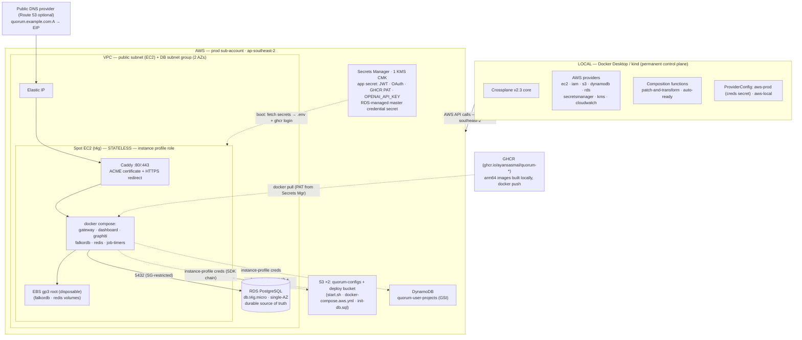
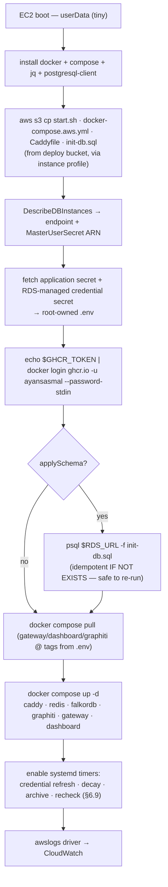
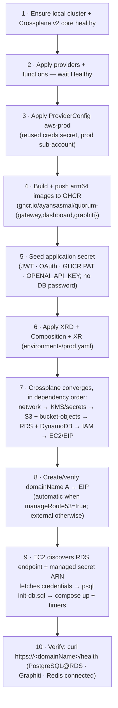

# Quorum on AWS via Crossplane — Deployment Design

**Status:** Approved design (pre-implementation)
**Date:** 2026-06-11
**Author:** ayansasmal
**Scope:** Provision and run the entire Quorum platform on AWS from a single Crossplane control plane.
A **stateless spot EC2 instance running Docker Compose** carries the application containers; **PostgreSQL
— the durable source of truth — runs on managed RDS**. The cost-optimised demo pattern, hardened so a
spot reclaim can never destroy governed knowledge.

---

## 1. Goal

Deploy the full Quorum stack to AWS using **Crossplane as the only AWS IaC tool**, driven by a single
declarative resource. One `kubectl apply` of a **namespaced `QuorumEnvironment` composite resource (XR)**
converges the AWS environment: network, a spot EC2 host, **managed RDS PostgreSQL**, IAM (instance profile),
S3, DynamoDB, Secrets Manager, KMS, CloudWatch — and bootstraps the Quorum **docker-compose** stack onto
the instance, pulling its images from **GHCR**. A real domain points directly to the EIP, and on-box Caddy
obtains and renews a publicly trusted ACME certificate. The DNS A record is either composed in Route 53
when enabled or managed through the domain's existing external DNS provider after the EIP is allocated.

This extends the existing LocalStack-targeted Crossplane setup in [`crossplane/`](../../../crossplane/)
to a real-AWS footprint. It follows the reference project's **single-spot-EC2 + Docker** topology
(`/Users/ayan/Desktop/Work/vscode/low-carb-diet-app/backend/k8s/crossplane`) — **not** EKS, which is
~$130–160+/mo of overkill for a demo. The LLM/embedding provider stays **OpenAI** (Graphiti has no AWS
Bedrock client — see §7); the OpenAI key is held in Secrets Manager and fetched at boot, never committed.

### What changed after the first review (2026-06-11)

An external review (codex) caught eight issues in the original draft. The corrected design:

- targets **Crossplane v2.3** (namespaced XRs; Claims are removed in v2) — §5;
- moves **PostgreSQL to managed RDS** so the durable source of truth survives spot reclaim/teardown — §6.4;
- makes the **EC2 instance stateless/disposable** — only Redis + FalkorDB (both rebuildable) live on it — §6.2;
- **terminates publicly trusted TLS on-box** (Caddy + ACME) and wires the real OAuth
  callback/dashboard URLs — §6.6;
- removes the **deploy-ordering cycle** by managing bootstrap artifacts as composed S3 objects — §9;
- replaces the **non-existent `gateway migrate`** with applying the real `init-db.sql` to RDS — §6.7;
- schedules the **operational jobs** (decay / archive / recheck) via systemd timers — §6.9;
- drops the **retired second DynamoDB table** (`quorum-configs`) — §6.4;
- adds an explicit **teardown & retention matrix** — §11.

### Non-goals

- **EKS / Kubernetes.** Deliberately rejected for cost (see §8). The app runs as Docker containers on
  one EC2 host, exactly like the reference.
- **Managed Redis (ElastiCache) / managed graph (Neptune).** Redis and FalkorDB run as containers on the
  instance — both are disposable (Redis is a cache; FalkorDB embeddings rebuild from PostgreSQL). Only
  **PostgreSQL is managed (RDS)** because it is the durable source of truth.
- **Multi-region / HA.** Single instance, single-AZ RDS, single region (`ap-southeast-2`). (Two subnets
  in two AZs exist only because an RDS DB subnet group requires them — §6.1.)
- **Route 53 / ACM as mandatory dependencies.** A real domain is required, but its registrar and
  authoritative DNS provider may be outside AWS. Route 53 is optional; ACM is unnecessary because Caddy
  terminates TLS directly on the EC2 host.
- **Migrating the existing LocalStack dev path.** Kept as-is under the `aws-local` ProviderConfig.

---

## 2. Decisions (locked)

| # | Decision | Choice |
|---|----------|--------|
| 1 | **Compute platform** | **Single spot EC2 + Docker Compose** (reference pattern). No EKS. The instance is **stateless** — it can be replaced without data loss |
| 2 | **Scope** Crossplane owns | VPC (2 subnets/2 AZs), EC2 (spot) + EIP, **RDS PostgreSQL**, IAM instance profile, S3 ×2, DynamoDB ×1, Secrets Manager, KMS, CloudWatch, and optionally a Route 53 A record. **No ECR, ALB, or ACM** |
| 3 | **Stateful data services** | **PostgreSQL → managed RDS** (durable source of truth). **Redis + FalkorDB → Docker** on the instance (disposable; Redis is a cache, FalkorDB rebuilds from `knowledge_versions.summary`). S3 + DynamoDB are real AWS services |
| 4 | **Control plane location** | Local (Docker Desktop / kind), permanent — provisions into real AWS |
| 5 | **IaC structure** | **Crossplane v2.3**: one cluster-scoped XRD + one **namespaced `QuorumEnvironment` XR** (no Claim). Flat-composition-first (one Composition, fenced sections). Outputs surfaced via a **composed Secret** (XR-level connection details are removed in v2) |
| 6 | **App delivery** | `userData` bootstrap → pulls `start` script + `docker-compose.aws.yml` from S3 → fetch secrets → `docker login ghcr.io` → `docker compose pull` → `docker compose up`. Per-service update/rollback by pushing a new GHCR tag + `docker compose pull <svc>` + `up -d <svc>` |
| 7 | **Environment** | **One** environment named `prod`, its own AWS sub-account. Demo/test footprint |
| 8 | **Exposure** | Public, via a real domain whose **A record points directly to the Elastic IP**. URL not broadly advertised — demo/test only |
| 9 | **DNS / TLS** | **Publicly trusted TLS on first cut** — on-box **Caddy** obtains and renews an ACME certificate (Let's Encrypt by default) and redirects HTTP to HTTPS. DNS may remain with the domain registrar or any external provider. **Route 53 is optional**; if used, budget `$0.50/hosted-zone/month` plus `$0.40/million` standard queries. **No ALB or ACM** |
| 10 | **Container images** | Built **locally** (arm64 — see §6.7), `docker push`ed to **GHCR** (`ghcr.io/ayansasmal/quorum-*`). Instance pulls with a GitHub PAT held in Secrets Manager. **No ECR** |
| 11 | **DB schema / migrations** | The **real `init-db.sql`** (already the dev source of schema) is shipped to S3 and applied to RDS by `start.sh` via `psql` on boot. It is **idempotent** (`CREATE TABLE / ADD COLUMN IF NOT EXISTS`), so re-running is safe. A migration tool (e.g. node-pg-migrate) is a noted future upgrade |
| 12 | **Cost posture** | Cheapest viable: one **spot** instance in a **public subnet (no NAT)**, graviton burstable; single-AZ `db.t4g.micro` RDS. Slower is acceptable |
| 13 | **IAM model** | **EC2 instance profile** — the app uses the SDK default credential chain. No static AWS keys, no IRSA. RDS password auth uses an **RDS-managed Secrets Manager secret**, fetched at runtime |
| 14 | **Access** | **SSM Session Manager** (no bastion / no inbound SSH). Key pair retained for break-glass |
| 15 | **KMS** | One CMK per environment (encrypts S3, DynamoDB, Secrets Manager, **RDS storage**) |
| 16 | **Secret rotation** | RDS manages and rotates its master-user secret. A systemd credential-refresh timer detects secret-version changes, atomically rewrites the DB variables in `.env`, and recreates the gateway container. Application secrets use rotate-by-redeploy |
| 17 | **Operational jobs** | `job:decay` / `job:archive` / `job:recheck` run on the instance via **systemd timers** (one-shot containers) — §6.9 |
| 18 | **FalkorDB / graph backend** | Container on the instance (disposable). **Amazon Neptune** is the planned later backend (Graphiti supports it) |

### Conventions adopted from the reference project

(`/Users/ayan/Desktop/Work/vscode/low-carb-diet-app/backend/k8s/crossplane`)

- Upbound AWS providers (`*.aws.upbound.io`); **label-selector cross-references** between MRs.
- `writeConnectionSecretToRef` on **managed resources** (RDS endpoint, EIP, instance id) — MRs retain
  this in Crossplane v2; the Composition assembles them into one output Secret (§5).
- `ProviderConfig` switching: `aws-prod` vs `aws-local`. **The `aws-prod` Crossplane identity is reused
  from the reference project** — its static-key secret must target the Quorum `prod` sub-account.
- Tiny `userDataBase64` bootstrap; real setup/`start` scripts live in S3 so app/infra changes don't
  require an instance rebuild.
- A `scripts/deploy-aws.sh` orchestrator with a checksums drift file; default region `ap-southeast-2`;
  Docker `awslogs` driver → CloudWatch.

---

## 3. Topology



**Why the control plane stays local:** matches the operator's prior working pattern (local k8s +
Crossplane → real AWS via a Crossplane identity), avoids an always-on management cluster, and keeps the
bootstrap on a laptop/CI runner that already holds AWS credentials. Crossplane reconciliation is
desired-state: if the local cluster is down, the running footprint is unaffected; only new changes pause.

**Why the instance is now disposable:** the only durable state (PostgreSQL) lives in RDS. A spot reclaim
re-launches the instance, which re-pulls images and reconnects to the same RDS endpoint and the same S3 /
DynamoDB / Secrets — no governed knowledge is on the box.

---

## 4. The XR API (Crossplane v2.3)

A **namespaced `QuorumEnvironment` composite resource**, backed by a cluster-scoped
`XQuorumEnvironment` XRD. Crossplane v2 removes Claims — the XR itself is namespaced and applied
directly. One XR file per environment under `crossplane/environments/`.

```yaml
apiVersion: platform.quorum.io/v1alpha1
kind: QuorumEnvironment              # namespaced composite resource (v2) — there is NO Claim
metadata:
  name: quorum-prod
  namespace: quorum-system
spec:
  crossplane:
    compositionRef:
      name: xquorumenvironment       # the Composition (§5)
  # ── parameters ──────────────────────────────────────────────────────────────
  environment: prod                  # single environment for this demo footprint
  region: ap-southeast-2
  domainName: quorum.example.com      # required; public A record points to the EIP (§6.6)
  network:
    vpcCidr: 10.20.0.0/16            # public subnet (EC2) + 2-AZ DB subnet group (RDS)
  compute:
    instanceType: t4g.large          # 2 vCPU / 8 GB graviton; bump to t4g.xlarge if memory-tight
    capacityType: spot               # cheapest; on-demand if spot interruptions bite
    spotMaxPrice: "0.04"             # per-hour ceiling
    rootVolumeGiB: 30                # gp3, disposable — only redis + falkordb volumes
    arch: arm64                      # images must be arm64 (§6.7)
  database:                          # managed RDS PostgreSQL (durable source of truth)
    engineVersion: "16"
    instanceClass: db.t4g.micro      # cheapest graviton; single-AZ
    allocatedStorageGiB: 20
    masterUsername: quorum
    manageMasterUserPassword: true   # RDS generates and manages the password in Secrets Manager
    multiAz: false                   # demo posture; flip to true for HA later
    deletionProtection: false        # demo; see teardown matrix (§11)
    backupRetentionDays: 7           # automated daily snapshots
  llm:
    provider: openai                 # Graphiti has no Bedrock client (§7)
    model: gpt-4o-mini
    embedModel: text-embedding-3-small
    embedDim: 1536                   # unchanged → no FalkorDB re-embed
    # OPENAI_API_KEY is NOT here — held in Secrets Manager, fetched at boot (§6.5)
  tls:
    mode: acme                       # Caddy automatic HTTPS; publicly trusted certificate
    acmeEmail: operator@example.com  # expiry/error notices from the ACME CA
  dns:
    manageRoute53: false             # default: manage the A record with any external DNS provider
    hostedZoneId: ""                 # required only when manageRoute53=true
  images:
    registry: ghcr.io/ayansasmal     # GHCR — images pushed here from the dev machine (§6.7)
    applySchema: true                # start.sh applies init-db.sql to RDS before the gateway serves (§6.7)
    gatewayTag: "0.4.12"             # bump + restart to deploy gateway alone
    dashboardTag: "0.4.12"           # bump + restart to deploy dashboard alone
    backingTag: "0.4.x"              # graphiti / falkordb / redis (updated together)
```

The Composition writes a **composed Secret** `quorum-prod-connection` in `quorum-system` carrying the
resolved EIP, configured domain name, instance id, and RDS endpoint (v2 has no XR-level
`writeConnectionSecretToRef`, so the Composition builds this Secret explicitly — §5).
`kubectl apply -f environments/prod.yaml`
converges the whole environment. Sizing above is the deliberately-cheap demo posture (decision 12).

---

## 5. Composition structure (Crossplane v2.3)

**Flat-composition-first.** One `Composition` (`xquorumenvironment`) using the
`function-patch-and-transform` pipeline, holding all composed resources grouped into clearly fenced
sections (§6). One cluster-scoped **XRD** (`XQuorumEnvironment`) whose `spec.scope: Namespaced` yields a
namespaced XR — **no `claimNames`** (Claims are gone in v2). Sections are authored so they lift cleanly
into nested XRDs (`XNetwork`, `XCompute`, `XStorage`, `XDatabase`, `XIam`) later if reuse justifies it.

**Output Secret (replaces XR connection details).** Crossplane v2 removes native XR connection details.
The Composition therefore composes an explicit `Secret` from MR-level `writeConnectionSecretToRef`
outputs (RDS endpoint, EIP, instance id) and the consumer reads `quorum-prod-connection`. Managed
resources still support `writeConnectionSecretToRef`, so the RDS instance writes its endpoint/port/user
to a per-MR secret that the Composition aggregates.

```
crossplane/
  apis/environment/
    definition.yaml          # XRD: XQuorumEnvironment (spec.scope: Namespaced — no claimNames)
    composition.yaml         # Composition: pipeline of fenced sections (below)
  environments/
    prod.yaml                # the namespaced QuorumEnvironment XR (one sub-account)
  providers/
    providers.yaml           # provider packages (ec2, iam, s3, dynamodb, rds, secretsmanager, kms, cloudwatch; route53 optional)
    functions.yaml           # function-patch-and-transform, function-auto-ready
    providerconfig-aws-prod.yaml   # reused identity from the reference project (prod sub-account)
    providerconfig-aws-local.yaml  # existing LocalStack path, retained
  bootstrap/
    ec2-userdata.sh          # tiny: install docker+compose+jq+postgresql-client, fetch start.sh from S3
    start.sh                 # full: fetch secrets→.env, ghcr login, apply init-db.sql to RDS, compose up
    docker-compose.aws.yml   # the AWS compose file (gateway/dashboard/graphiti/falkordb/redis/caddy/jobs)
    Caddyfile                # public ACME TLS termination → gateway:3001 / dashboard
    init-db.sql              # COPIED from quorum/scripts/init-db.sql (single source of schema)
  # existing bucket/ dynamodb/ rds/ redis/ remain as the aws-local dev reference
scripts/
  deploy-aws.sh              # orchestrator (see §9)
```

> **Provider note (v2.3):** pin the provider family and `function-patch-and-transform` /
> `function-auto-ready` versions in `providers.yaml` / `functions.yaml`; the Crossplane core must be
> **v2.x** for the namespaced-XR model (open item §12.3).

---

## 6. Composed layers (sections of the Composition)

Crossplane resolves creation order from references; sections below are logical groupings.

### 6.1 Network
VPC, **one public subnet** (the EC2 host), **plus a second subnet in a different AZ** so the RDS **DB
subnet group** is valid (RDS requires subnets in ≥2 AZs even for a single-AZ instance). Internet Gateway,
route table + association, and two security groups:

- **App SG** (EC2): inbound **443** (Caddy/TLS) and **80** (optional HTTP→HTTPS redirect) from the
  internet; nothing else — shell access is via SSM (§6.6), not SSH.
- **DB SG** (RDS): inbound **5432 only from the App SG** — RDS is **not publicly accessible**.

**No NAT gateway** (the instance sits in the public subnet with an Elastic IP — the single biggest cost
saving; RDS needs no NAT).

### 6.2 Compute (stateless)
- **Spot EC2 instance** (`instanceType`/`capacityType` from the XR, arm64 AMI — Amazon Linux 2023).
- **Key pair** (break-glass only) + **Elastic IP** + EIP association (re-associates after spot replacement).
- Root **EBS gp3** volume (small, `rootVolumeGiB`) — holds only the **disposable** Docker volumes for
  Redis + FalkorDB. `deleteOnTermination: true` is acceptable because **none of this is a source of truth**.
- Tiny `userDataBase64` bootstrap (from `bootstrap/ec2-userdata.sh`): installs Docker + compose plugin +
  jq + `postgresql-client` (for `init-db.sql`), then pulls and runs `start.sh` from the deploy bucket.

> The instance carries **no durable data**. On spot reclaim it is re-launched, re-pulls images, re-applies
> the (idempotent) schema, and reconnects to the same RDS — governed knowledge is never at risk.

### 6.3 IAM (instance profile)
A single EC2 role + instance profile (the app uses the SDK default credential chain — no static keys):
- **S3** RW on the configs + deploy buckets.
- **DynamoDB** RW on `quorum-user-projects`.
- **Secrets Manager** `GetSecretValue` on `quorum/prod/*` and the RDS-managed secret namespace;
  **RDS** `DescribeDBInstances` for endpoint and master-secret ARN discovery; **KMS** decrypt on the env CMK.
- **CloudWatch Logs** (Docker `awslogs` driver); **SSM** core (`AmazonSSMManagedInstanceCore`).

> No `rds-db:connect` permission is needed — PostgreSQL uses **password auth**, not IAM database
> authentication. The instance does need read-only `rds:DescribeDBInstances` to discover
> `MasterUserSecret.SecretArn` and `Endpoint.Address`. No image-registry policy is needed — GHCR is not an
> AWS service; the instance authenticates with a GitHub PAT (`read:packages`) held in the
> `quorum/prod/gateway` application secret (§6.5).

### 6.4 Storage & state
- **RDS PostgreSQL** (`db.t4g.micro`, single-AZ, storage SSE-KMS, 7-day automated backups, **final
  snapshot on delete** — §11) — **the durable source of truth** (`knowledge_versions.summary` and the
  whole governance schema). `ManageMasterUserPassword` is enabled: RDS generates a strong master password,
  stores it in an RDS-managed Secrets Manager secret encrypted by the environment CMK, and rotates it
  without placing the password in Git, the XR, or local Kubernetes etcd. The exact Upbound YAML field
  names must be verified against the pinned provider CRD during implementation; the authoritative AWS API
  fields are `ManageMasterUserPassword` and `MasterUserSecretKmsKeyId`. See
  [RDS password management with Secrets Manager](https://docs.aws.amazon.com/AmazonRDS/latest/UserGuide/rds-secrets-manager.html).
- **No ECR.** Images live in **GHCR** (`ghcr.io/ayansasmal/quorum-*`), pushed from the dev machine.
- **S3** `quorum-configs` (app config) + a **deploy bucket** (holds `start.sh`, `docker-compose.aws.yml`,
  `Caddyfile`, `init-db.sql`) — both versioned, SSE-KMS, public-access blocked.
- **DynamoDB** `quorum-user-projects` (with GSI) — PITR + SSE-KMS. *(The former `quorum-configs` table is
  **retired** — Redis serves that role now, per `gateway/src/ddb.js`. Only one table is provisioned.)*
- **KMS** one CMK per environment (decision 15) encrypts S3, DynamoDB, Secrets Manager, and RDS storage.
- **Redis + FalkorDB** are **not** AWS resources — they are disposable compose services on the EBS root.

### 6.5 Secrets
There are **two distinct secret lifecycles**:

1. **Application secret** `quorum/prod/gateway`: `QUORUM_JWT_PRIVATE_KEY`,
   `QUORUM_JWT_PUBLIC_KEY`, `GITHUB_CLIENT_ID`, `GITHUB_CLIENT_SECRET`, `OPENAI_API_KEY`, and
   `GHCR_TOKEN`. These values are seeded out-of-band and rotated by updating the secret and re-running
   `start.sh`.
2. **RDS-managed master credential secret:** RDS creates this automatically when
   `ManageMasterUserPassword=true`. It contains the generated database username/password and is encrypted
   with the environment CMK. The database password is **not copied** into `quorum/prod/gateway`.

At boot, `start.sh` uses the instance profile to call `DescribeDBInstances`, reads
`MasterUserSecret.SecretArn`, fetches that secret with `GetSecretValue`, and writes `POSTGRES_HOST`,
`POSTGRES_PORT`, `POSTGRES_USER`, and `POSTGRES_PASSWORD` into a root-owned `.env`. It separately fetches
the application secret and writes the non-database values. Neither secret touches Git or local Kubernetes
etcd. **No ESO** (no application Kubernetes cluster).

The instance IAM policy scopes application-secret access to `quorum/prod/*`. For the AWS-generated RDS
secret, use the narrowest policy supported by the pinned provider and composition outputs: prefer the
observed secret ARN; otherwise restrict access to the account/region's `rds!db-*` secret namespace plus
the environment CMK rather than granting unrestricted Secrets Manager access.

> **Two distinct GitHub credentials — don't conflate them.** `GITHUB_CLIENT_ID` / `GITHUB_CLIENT_SECRET`
> are the app's GitHub **OAuth** login (dashboard sign-in). `GHCR_TOKEN` is a separate GitHub **PAT** with
> only `read:packages` scope, used at boot to `docker login ghcr.io` and pull the private Quorum images.

### 6.6 Access, DNS & TLS
- **SSM Session Manager** for shell access (`aws ssm start-session`) — no inbound SSH, no bastion.
- **Exposure** is `https://<domainName>` (decision 8). The domain's public **A record points directly to
  the Elastic IP**. The EIP and configured domain are surfaced via the output Secret.
- **DNS provider is independent.** The A record may stay with the registrar or any authoritative DNS
  provider. Route 53 is an optional convenience, not a platform dependency. If selected, current AWS
  pricing is `$0.50` per hosted zone per month for the first 25 zones and `$0.40` per million standard
  queries; demo traffic makes query cost negligible. Domain registration is separate and varies by TLD.
  See [Amazon Route 53 pricing](https://aws.amazon.com/route53/pricing/).
- **TLS on-box (Caddy).** A `caddy:2-alpine` sidecar terminates **HTTPS on :443**, redirects port 80 to
  HTTPS, and reverse-proxies the gateway (`:3001`) and dashboard. Caddy automatically obtains and renews
  a publicly trusted certificate from an ACME CA (Let's Encrypt by default). The domain's A record must
  resolve to the EIP before certificate issuance succeeds, ports 80/443 must be reachable, and Caddy's
  `/data` volume must be writable and persistent across container restarts. Caddy retries issuance with
  backoff while an external DNS change propagates. A replacement spot instance may reacquire the
  certificate because the EIP and domain remain stable. `Caddyfile` ships in the deploy bucket. See
  [Caddy Automatic HTTPS](https://caddyserver.com/docs/automatic-https).
- **OAuth wiring.** The operator registers the GitHub OAuth App's **Authorization callback URL** as
  `https://<domainName>/oauth/callback`. The boot writes
  `GITHUB_CALLBACK_URL=https://<domainName>/oauth/callback`,
  `DASHBOARD_URL=https://<domainName>`, and `QUORUM_GATEWAY_URL=https://<domainName>` into `.env`.
- **No ACM or load balancer.** ACM-managed certificates are not used because TLS terminates directly on
  EC2. An ALB + ACM remains a later option only if load balancing or managed edge termination is needed.

### 6.7 App delivery & bootstrap

No Kubernetes, no Helm. Delivery mirrors the reference: a tiny `userData` bootstrap hands off to an
S3-hosted `start.sh`, so **app/infra changes go to S3, not an instance rebuild**.



**Schema application (replaces the fictional `gateway migrate`).** There is no `migrate` npm script; in
dev, `init-db.sql` is mounted into Postgres's entrypoint. On RDS there is no such mount, so `start.sh`
applies the **same `init-db.sql`** with `psql` before the gateway serves. The file is idempotent
(`CREATE TABLE … IF NOT EXISTS`, `ADD COLUMN IF NOT EXISTS`), so every boot re-asserts the schema safely.
`init-db.sql` is copied verbatim from `quorum/scripts/init-db.sql` into the bootstrap bundle — one source
of schema truth. (A real migration tool is a future upgrade — §12.)

**Per-service update/rollback (decision 6).** Push a new image to GHCR, bump its tag in the instance
`.env`, and `docker compose pull gateway && docker compose up -d gateway` (or `dashboard`) — only that
container is recreated; the others keep running. Rollback = re-pin the previous tag and `pull`/`up -d`
again. This preserves gateway/dashboard independent-deployability via compose + GHCR tags rather than Helm
releases. The backing services (graphiti/falkordb/redis) are updated together.

> **arm64 note:** `t4g` is Graviton/arm64, so images must be built `linux/arm64`. The operator builds
> locally on Apple Silicon, which is arm64-native — so `docker build` + `docker push` to GHCR Just Works
> (use `docker buildx --platform linux/arm64` if ever building on x86 CI).

### 6.8 Connection wiring (no cross-cluster propagation)
The app containers run on one host: Redis and FalkorDB are reachable at compose service names; **PostgreSQL
is reached at the endpoint returned by `DescribeDBInstances`**, over the DB SG on 5432. The same response
provides the RDS-managed master secret ARN; `GetSecretValue` supplies the current username/password. AWS
access uses the instance profile and secrets arrive as a local `.env`. The local Crossplane output Secret
is for operator visibility only — EC2 does not depend on a Kubernetes-to-instance secret projection.

### 6.9 Operational jobs (scheduler)
Quorum ships three recurring jobs that the deployment must run (the review flagged their absence):

| Job | Command | Cadence (suggested) |
|-----|---------|---------------------|
| Confidence decay | `npm run job:decay` (`scripts/decay-confidence.js`) | daily |
| Audit archival to S3 | `npm run job:archive` (`scripts/archive-audit.js`) | daily/weekly |
| Conflict recheck | `npm run job:recheck` (`scripts/recheck-conflicts.js`) | hourly |

They run as **systemd timers** on the instance, each launching a **one-shot container** off the gateway
image (`docker compose run --rm <job>`), sharing the same `.env` (RDS + Secrets). systemd timers (not the
gateway process) own scheduling so a gateway restart never double-fires a job, and `awslogs` captures
their output. (Alternative: a small cron container in the compose file — systemd is preferred for
visibility and `OnFailure` handling.)

An additional **credential-refresh timer** runs every 15 minutes. It retrieves the current RDS secret
version, compares a stored checksum/version ID, and when the credentials change:

1. writes a complete replacement `.env` to a root-only temporary file;
2. atomically renames it over the active `.env`;
3. runs `docker compose up -d --force-recreate gateway`;
4. records the applied secret version only after the gateway health check succeeds.

Scheduled jobs are one-shot containers and therefore read the latest `.env` each time they start. This
keeps the Compose deployment compatible with RDS-managed rotation without embedding credentials in images
or requiring application code changes.

---

## 7. LLM / embeddings — OpenAI (no Bedrock)

**Why not Bedrock:** verified against Graphiti's current clients (`graphiti_core`) — the supported
LLM/embedder backends are OpenAI, Azure OpenAI, Anthropic (direct Anthropic API), Google Gemini, Groq,
and OpenAI-generic (Ollama/local). **There is no AWS Bedrock client.** Rather than fork Graphiti or split
providers, both consumers stay on OpenAI:
- **Gateway** governance endpoints (conflict detection, enrichment, extract) → OpenAI.
- **Graphiti** container → OpenAI LLM (entity extraction) + OpenAI embedder.

Configuration (key fetched from Secrets Manager into `.env` at boot, never committed):

```env
OPENAI_API_KEY=<from quorum/prod/gateway secret>
LLM_MODEL_NAME=gpt-4o-mini
EMBEDDER_MODEL_NAME=text-embedding-3-small   # 1536-dim — no FalkorDB re-embed
```

### Notes
- **No embedding-dimension change** — staying on `text-embedding-3-small` (1536-dim) keeps existing
  FalkorDB embeddings valid.
- **No LLM IAM** — OpenAI is reached over HTTPS with the key; the instance profile grants no LLM access.
- **Bedrock remains a future option** if/when Graphiti ships a Bedrock client (would also pair with the
  Neptune graph upgrade, decision 18).

---

## 8. Why single-EC2 + Docker (not EKS)

The reference project runs on a single spot EC2 with Docker for **~$2.50/mo** of compute. EKS would add a
**~$73/mo control-plane charge** plus NAT (~$32/mo) plus worker nodes — **$130–160+/mo** — for a demo that
serves one operator. Quorum already ships a working **docker-compose** stack (`npm run docker:start`), so
the reference pattern transfers directly; only the instance size grows (`t4g.large` vs `t4g.micro`) to fit
graphiti + falkordb. We keep the Crossplane Composition/XRD/XR abstraction (decision 5) so the whole
footprint is still one declarative `kubectl apply`. EKS/provider-helm remains a clean later evolution if
Quorum ever needs multi-node HA, autoscaling, or per-service Helm lifecycle.

**Cost delta from the RDS decision:** a single-AZ `db.t4g.micro` adds roughly **~$12–15/mo** (instance +
20 GB gp3 + backups). That is the deliberate price of not losing the governed source of truth on a spot
reclaim — the one place the demo refuses to be cheap.

---

## 9. Deployment flow (`scripts/deploy-aws.sh`)

The original draft uploaded bootstrap files to the deploy bucket **before** the Composition created it —
an impossible first run. Fixed by **managing the bootstrap artifacts as composed S3 objects** inside the
Composition: the bucket and its objects (`start.sh`, `docker-compose.aws.yml`, `Caddyfile`, `init-db.sql`)
are part of the same `kubectl apply`, and the EC2 instance references them, so Crossplane orders
bucket → objects → EC2 automatically. No out-of-band upload step, no cycle.



A checksums file (mirroring `.crossplane-checksums` in the reference) guards against unintended manifest
drift. Because the bootstrap artifacts are composed S3 objects, the GHCR images (step 4) and the seeded
secrets (step 5) are the only true prerequisites before the single `apply` in step 6. With
`manageRoute53=true`, Crossplane also composes the A record. With external DNS, the deploy script pauses
after EIP allocation and prints the exact A record to create; Caddy continues retrying ACME issuance until
the record propagates.

> **Fallback if inlining `init-db.sql` as a composed object is impractical** (size/templating): a two-phase
> apply — first converge the bucket, then `aws s3 cp` the artifacts, then apply the EC2-bearing
> Composition — preserves correct ordering. The composed-object approach is preferred (fully declarative).

---

## 10. Observability (CloudWatch)

Docker `awslogs` log driver ships gateway/graphiti/dashboard/caddy/job container logs to CloudWatch log
groups (per the reference). Minimal alarms: EC2 instance status-check failed, disk/memory (CloudWatch
agent), and **RDS** free-storage / CPU / connection-count. Optional SNS email subscription. Scoped as part
of the Composition's observability section; can be trimmed for the first deploy.

---

## 11. Teardown & retention matrix

"Delete the XR" does **not** uniformly destroy everything — retained/durable resources and AWS recovery
windows mean teardown is per-resource. Each managed resource carries an explicit Crossplane
`deletionPolicy` and provider-level retention:

| Resource | On XR delete | Rationale |
|----------|-------------|-----------|
| **RDS PostgreSQL** | `deletionPolicy: Delete` **with a final snapshot** (`finalDBSnapshotIdentifier`); `deletionProtection:false` for demo | Source of truth — never delete without a snapshot; restore-able |
| **S3 buckets (×2)** | `deletionPolicy: Delete` — but **versioned, non-empty buckets must be emptied first** (lifecycle/force) | Crossplane delete fails on a non-empty bucket; script empties or sets a lifecycle expiry |
| **DynamoDB** | `deletionPolicy: Delete` (PITR enables point-in-time restore within window) | Membership index — rebuildable from S3 configs via `/sync/configs` |
| **KMS CMK** | `deletionPolicy: Delete` → enters a **7–30 day pending-deletion window** (not immediate) | AWS-enforced; cannot hard-delete instantly |
| **Application secret** | Deleted with a **recovery window** (7–30 days) unless `--force-delete` | AWS-enforced; avoids accidental loss |
| **RDS-managed credential secret** | Lifecycle follows the RDS instance; RDS deletes the managed secret when the DB instance is deleted | Do not duplicate or independently manage the database password |
| **EBS root** | Deleted with the instance (`deleteOnTermination:true`) | Disposable (Redis/FalkorDB only) |
| **EC2 / EIP** | Instance terminated; **EIP released** (else it bills while idle) | Stateless compute |
| **VPC / subnets / SGs / IGW** | Deleted | No state |

The deploy script's `down` path documents this order (empty S3 → delete XR → confirm RDS final snapshot →
optionally `--force-delete` secrets / schedule KMS deletion). "Clean teardown" therefore means *the
footprint is removed and the durable data is captured in a final RDS snapshot* — not that every byte
vanishes immediately.

---

## 12. Open items to resolve during implementation

1. **Instance sizing** — confirm `t4g.large` (8 GB) holds gateway + dashboard + graphiti + falkordb +
   redis + caddy under demo load (Postgres is now off-box on RDS), or step to `t4g.xlarge`.
2. **RDS sizing** — confirm `db.t4g.micro` (1 GB) suffices for the demo, or step to `db.t4g.small`.
3. **Pin versions** — Crossplane **v2.x** core, provider family packages, and composition function
   versions (`function-patch-and-transform`, `function-auto-ready`).
4. **Application-secret seeding** — finalise how JWT/OAuth/GHCR/OpenAI values are put into
   `quorum/prod/gateway` (manual `aws secretsmanager put-secret-value`, sourcing `OPENAI_API_KEY` from the
   existing `.env`) — out of git. The RDS password is not part of this step.
5. **Composed S3 objects vs two-phase upload** (§9) — confirm `init-db.sql` is small enough to manage as a
   composed object, else adopt the two-phase fallback.
6. **Domain and DNS provider** — select `domainName`, create its A record to the EIP, and decide whether
   the existing registrar/DNS provider manages it or Crossplane optionally creates a Route 53 hosted-zone
   record. Route 53 is not required for certificate issuance.
7. **Migration tooling** — `init-db.sql` idempotency is sufficient now; decide when to adopt a real
   migration tool (e.g. node-pg-migrate) for ordered, versioned changes.
8. **Later upgrades — adopt when the budget justifies it:** Multi-AZ RDS + ElastiCache for HA, Amazon
   Neptune for the graph (decision 18), ALB + ACM if managed edge TLS/load balancing becomes useful, and
   EKS/provider-helm if multi-node HA/autoscaling is ever needed. Each is an additive change to the same
   Composition + XR — the demo footprint graduates in place rather than being rebuilt.

---

## 13. Success criteria

- `kubectl apply -f environments/prod.yaml` converges a namespaced `QuorumEnvironment` XR to Ready, with
  all AWS resources present (VPC + 2 subnets, EC2+EIP, **RDS PostgreSQL**, IAM profile, S3 ×2, DynamoDB ×1,
  Secrets Manager, KMS, CloudWatch). No Claim, no ECR.
- The EC2 instance boots, runs `start.sh`, logs in to GHCR with the PAT from Secrets Manager, **applies
  `init-db.sql` to RDS**, and `docker compose up` brings the full stack (incl. Caddy TLS) online.
- RDS generates the master password, stores it only in its managed Secrets Manager secret, and EC2
  discovers/fetches the current credentials through the instance profile. No database password appears in
  Git, XR manifests, the application secret, or local Kubernetes etcd.
- Rotating the RDS-managed secret updates the database and causes the credential-refresh timer to
  atomically refresh `.env` and recreate a healthy gateway without manual password synchronization.
- The configured domain resolves to the EIP, Caddy obtains a **publicly trusted ACME certificate**, and
  `curl https://<domainName>/health` returns healthy with **PostgreSQL (on RDS)**, Graphiti, and Redis all
  connected.
- GitHub OAuth sign-in completes against `GITHUB_CALLBACK_URL=https://<domainName>/oauth/callback`
  without a browser certificate warning.
- Gateway and Graphiti perform LLM/embedding operations via OpenAI, with `OPENAI_API_KEY` fetched only from
  Secrets Manager into the instance `.env` — never committed, never in the local control plane.
- The app authenticates to S3/DynamoDB/Secrets via the **instance profile** (no static keys on the box).
- The three **operational jobs** (decay/archive/recheck) are scheduled via systemd timers and log to
  CloudWatch.
- **A spot reclaim loses no governed knowledge** — the replacement instance reconnects to the same RDS and
  re-applies the idempotent schema.
- **Gateway and dashboard update independently** — pushing a new image tag and `docker compose up -d <svc>`
  recreates only that container; rollback by re-pinning the prior tag.
- **Teardown** removes the footprint and captures the durable data in a **final RDS snapshot**, per the
  retention matrix (§11).
