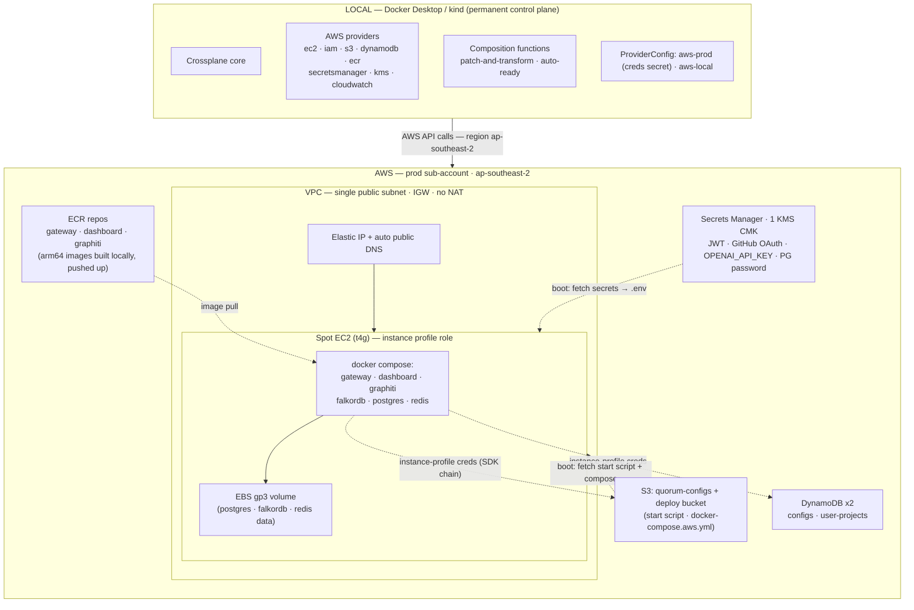
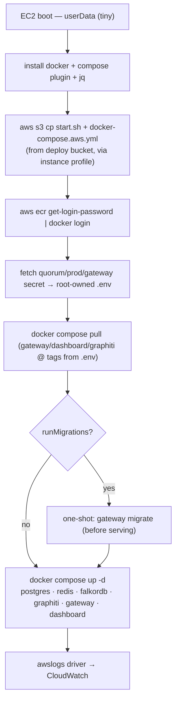
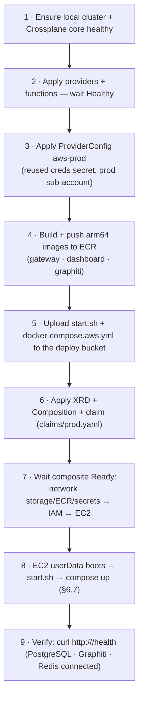

# Quorum on AWS via Crossplane — Deployment Design

**Status:** Approved design (pre-implementation)
**Date:** 2026-06-11
**Author:** ayansasmal
**Scope:** Provision and run the entire Quorum platform on AWS from a single Crossplane control plane,
on a **single spot EC2 instance running Docker Compose** — the cost-optimised demo pattern proven by
the reference project.

---

## 1. Goal

Deploy the full Quorum stack to AWS using **Crossplane as the only IaC tool**, driven by a single
declarative `Claim`. One `kubectl apply` of a `QuorumEnvironment` claim converges the complete
environment: network, a spot EC2 host, IAM (instance profile), ECR, S3, DynamoDB, Secrets Manager,
KMS, CloudWatch — and bootstraps the Quorum **docker-compose** stack onto the instance.

This extends the existing LocalStack-targeted Crossplane setup in [`crossplane/`](../../../crossplane/)
to a real-AWS footprint. It follows the reference project's **single-spot-EC2 + Docker** topology
(`/Users/ayan/Desktop/Work/vscode/low-carb-diet-app/backend/k8s/crossplane`) — **not** EKS, which is
~$130–160+/mo of overkill for a demo. The LLM/embedding provider stays **OpenAI** (Graphiti has no AWS
Bedrock client — see §7); the OpenAI key is held in Secrets Manager and fetched at boot, never committed.

### Non-goals

- **EKS / Kubernetes.** Deliberately rejected for cost (see §8). The app runs as Docker containers on
  one EC2 host, exactly like the reference.
- **Managed RDS / ElastiCache.** Postgres, Redis, and FalkorDB run as containers on the instance
  (self-hosted, decision 3). Managed services are a later upgrade.
- **Multi-region / HA / multi-AZ.** Single instance, single AZ, single region (`ap-southeast-2`).
- **Custom domain / Route53 / ACM.** Exposure is the instance's auto-generated public DNS (decision 9).
- **Migrating the existing LocalStack dev path.** Kept as-is under the `aws-local` ProviderConfig.

---

## 2. Decisions (locked)

| # | Decision | Choice |
|---|----------|--------|
| 1 | **Compute platform** | **Single spot EC2 + Docker Compose** (reference pattern). No EKS |
| 2 | **Scope** Crossplane owns | VPC, EC2 (spot) + EIP, IAM instance profile, ECR, S3, DynamoDB ×2, Secrets Manager, KMS, CloudWatch |
| 3 | **Stateful data services** | **Self-hosted** as containers on the instance (Postgres + Redis + FalkorDB). Only S3 + DynamoDB are real AWS services |
| 4 | **Control plane location** | Local (Docker Desktop / kind), permanent — provisions into real AWS |
| 5 | **IaC structure** | Compositions + XRDs, one `Claim` per environment; flat-composition-first (one Composition, fenced sections) |
| 6 | **App delivery** | `userData` bootstrap → pulls setup/`start` script + `docker-compose.aws.yml` from S3 → pulls images from **ECR** → `docker compose up`. Per-service update/rollback via image-tag pinning + `docker compose up -d <svc>` |
| 7 | **Environment** | **One** environment named `prod`, its own AWS sub-account. Demo/test footprint |
| 8 | **Exposure** | Public, via the instance **Elastic IP + auto-generated public DNS**. URL not shared publicly — demo/test only |
| 9 | **DNS / TLS** | **Auto-generated** (`ec2-*.compute.amazonaws.com` / EIP). No Route53/custom domain/ACM in first cut |
| 10 | **Container images** | Built **locally** (arm64 — see §6.7), pushed to **ECR**. Instance pulls via its instance-profile ECR read policy |
| 11 | **DB migrations** | Run by the `start` script on the instance (compose one-shot / entrypoint), before the gateway starts serving |
| 12 | **Cost posture** | Cheapest viable: one **spot** instance in a **public subnet (no NAT)**, graviton burstable, self-hosted data on an EBS volume. Slower is acceptable |
| 13 | **IAM model** | **EC2 instance profile** (role attached to the instance) — the app uses the SDK default credential chain. No static keys, no IRSA |
| 14 | **Access** | **SSM Session Manager** (no bastion / no inbound SSH). Key pair retained for break-glass |
| 15 | **KMS** | One CMK per environment |
| 16 | **Secret rotation** | Rotate-by-redeploy: re-run the `start` script to re-fetch Secrets Manager values into the instance `.env` |
| 17 | **FalkorDB storage** | Container on the instance's EBS volume. **Amazon Neptune** is the planned later backend (Graphiti supports it) |

### Conventions adopted from the reference project

(`/Users/ayan/Desktop/Work/vscode/low-carb-diet-app/backend/k8s/crossplane`)

- Upbound AWS providers (`*.aws.upbound.io`); **label-selector cross-references** between MRs.
- `writeConnectionSecretToRef` to surface resolved values (EIP, instance id).
- `ProviderConfig` switching: `aws-prod` vs `aws-local`. **The `aws-prod` Crossplane identity is reused
  from the reference project** — its static-key secret must target the Quorum `prod` sub-account.
- Tiny `userDataBase64` bootstrap; real setup/`start` scripts live in S3 so app/infra changes don't
  require an instance rebuild.
- A `scripts/deploy-aws.sh` orchestrator with a checksums drift file; default region `ap-southeast-2`;
  Docker `awslogs` driver → CloudWatch.

---

## 3. Topology



**Why the control plane stays local:** matches the operator's prior working pattern (local k8s +
Crossplane → real AWS via a Crossplane identity), avoids an always-on management cluster, and keeps the
bootstrap on a laptop/CI runner that already holds AWS credentials. Crossplane reconciliation is
desired-state: if the local cluster is down, the running EC2 footprint is unaffected; only new changes pause.

---

## 4. The Claim API

A namespaced `QuorumEnvironment` claim, backed by a cluster-scoped `XQuorumEnvironment` XRD. One claim
file per environment under `crossplane/claims/`.

```yaml
apiVersion: platform.quorum.io/v1alpha1
kind: QuorumEnvironment
metadata:
  name: quorum-prod
  namespace: quorum-system
spec:
  parameters:
    environment: prod                      # single environment for this demo footprint
    region: ap-southeast-2
    # No domainName/hostedZoneId — exposure is the instance's auto-generated public DNS (§6.6)
    network:
      vpcCidr: 10.20.0.0/16                 # single public subnet, IGW, no NAT
    compute:
      instanceType: t4g.large              # 2 vCPU / 8 GB graviton; bump to t4g.xlarge if memory-tight
      capacityType: spot                   # cheapest; on-demand if spot interruptions bite
      spotMaxPrice: "0.04"                  # per-hour ceiling
      rootVolumeGiB: 50                     # gp3, holds docker volumes (postgres/falkordb/redis)
      arch: arm64                           # images must be arm64 (§6.7)
    llm:
      provider: openai                     # Graphiti has no Bedrock client (§7)
      model: gpt-4o-mini
      embedModel: text-embedding-3-small
      embedDim: 1536                        # unchanged → no FalkorDB re-embed
      # OPENAI_API_KEY is NOT here — held in Secrets Manager, fetched at boot (§6.5)
    images:
      registry: <acct>.dkr.ecr.ap-southeast-2.amazonaws.com   # ECR (Composition-provisioned)
      runMigrations: true                  # start script runs migrations before gateway serves (§6.7)
      gatewayTag: "0.4.12"                 # bump + restart to deploy gateway alone
      dashboardTag: "0.4.12"              # bump + restart to deploy dashboard alone
      backingTag: "0.4.x"                  # graphiti / falkordb / postgres / redis (updated together)
  compositionRef:
    name: xquorumenvironment
  writeConnectionSecretToRef:
    name: quorum-prod-connection           # surfaces EIP, public DNS, instance id
    namespace: quorum-system
```

Every value is overridable on the claim. `kubectl apply -f claims/prod.yaml` converges the whole
environment. Sizing above is the deliberately-cheap demo posture (decision 12).

---

## 5. Composition structure

**Flat-composition-first.** One `Composition` (`xquorumenvironment`) using the
`function-patch-and-transform` pipeline, holding all composed resources grouped into clearly fenced
sections (§6). One XRD, one Claim. Sections are authored so they lift cleanly into nested XRDs
(`XNetwork`, `XCompute`, `XStorage`, `XIam`) later if reuse justifies it.

```
crossplane/
  apis/environment/
    definition.yaml          # XRD: XQuorumEnvironment (+ claim QuorumEnvironment)
    composition.yaml         # Composition: pipeline of fenced sections (below)
  claims/
    prod.yaml                # single environment (one sub-account); add more later if needed
  providers/
    providers.yaml           # provider packages (ec2, iam, s3, dynamodb, ecr, secretsmanager, kms, cloudwatch)
    functions.yaml           # function-patch-and-transform, function-auto-ready
    providerconfig-aws-prod.yaml   # reused identity from the reference project (prod sub-account)
    providerconfig-aws-local.yaml  # existing LocalStack path, retained
  bootstrap/
    ec2-userdata.sh          # tiny: install docker+compose+jq, fetch start script from S3
    start.sh                 # full: ECR login, fetch secrets→.env, compose pull, migrate, compose up
    docker-compose.aws.yml   # the AWS compose file (uploaded to the deploy bucket)
  # existing bucket/ dynamodb/ rds/ redis/ remain as the aws-local dev reference
scripts/
  deploy-aws.sh              # orchestrator (see §9)
```

---

## 6. Composed layers (sections of the Composition)

Crossplane resolves creation order from references; sections below are logical groupings.

### 6.1 Network
VPC, **one public subnet**, Internet Gateway, route table + association, and a security group. **No NAT
gateway** (the instance sits in the public subnet with an Elastic IP — the single biggest cost saving).
Security group inbound: 80/443 from the internet (app), nothing else — access is via SSM (§6.6), not SSH.

### 6.2 Compute
- **Spot EC2 instance** (`instanceType`/`capacityType` from claim, arm64 AMI — Amazon Linux 2023).
- **Key pair** (break-glass only) + **Elastic IP** + EIP association.
- Root **EBS gp3** volume sized from the claim — holds the Docker volumes for Postgres, FalkorDB, Redis.
- Tiny `userDataBase64` bootstrap (from `bootstrap/ec2-userdata.sh`): installs Docker + compose plugin +
  jq, then pulls and runs `start.sh` from the deploy bucket.

### 6.3 IAM (instance profile)
A single EC2 role + instance profile (the app uses the SDK default credential chain — no static keys):
- **S3** RW on the configs + deploy buckets.
- **DynamoDB** RW on both tables (`quorum-configs`, `quorum-user-projects`).
- **Secrets Manager** `GetSecretValue` on `quorum/prod/*`; **KMS** decrypt on the env CMK.
- **ECR** pull (`GetAuthorizationToken`, `BatchGetImage`, `GetDownloadUrlForLayer`).
- **CloudWatch Logs** (Docker `awslogs` driver); **SSM** core (`AmazonSSMManagedInstanceCore`).

### 6.4 Storage & state
- **ECR** repositories: `quorum-gateway`, `quorum-dashboard`, `quorum-graphiti` (scan-on-push, lifecycle
  policy to expire untagged).
- **S3** `quorum-configs` (app config) + a **deploy bucket** (holds `start.sh` + `docker-compose.aws.yml`)
  — both versioned, SSE-KMS, public-access blocked.
- **DynamoDB** `quorum-configs` + `quorum-user-projects` (with GSI) — PITR + SSE-KMS.
- **KMS** one CMK per environment (decision 15) for S3/DynamoDB/Secrets encryption.
- Postgres / FalkorDB / Redis are **not** AWS resources — they are compose services on the EBS volume.

### 6.5 Secrets
Secrets Manager secret `quorum/prod/gateway` holding `QUORUM_JWT_PRIVATE_KEY`, `QUORUM_JWT_PUBLIC_KEY`,
`GITHUB_CLIENT_ID`, `GITHUB_CLIENT_SECRET`, `POSTGRES_PASSWORD`, `OPENAI_API_KEY`. Values are seeded
out-of-band (not in git; `OPENAI_API_KEY` comes from the existing `.env`). At boot, `start.sh` fetches
the secret via the instance profile and writes a root-owned `.env` that docker-compose reads — the
secret never touches git and never lands in the local control plane's etcd. **No ESO** (no Kubernetes).

### 6.6 Access & DNS
- **SSM Session Manager** for shell access (`aws ssm start-session`) — no inbound SSH, no bastion.
- **Exposure** is the instance's **auto-generated public DNS** / Elastic IP (decision 9). The EIP and
  public DNS are surfaced via `writeConnectionSecretToRef`. A custom domain + Route53 + ACM/HTTPS is a
  clean later add; for the demo, the app is reached on the EIP (HTTP, or self-signed/caddy TLS on-box).

### 6.7 App delivery & bootstrap

No Kubernetes, no Helm. Delivery mirrors the reference: a tiny `userData` bootstrap hands off to an
S3-hosted `start.sh`, so **app/infra changes go to S3, not an instance rebuild**.



**Per-service update/rollback (decision 6).** Push a new image to ECR, bump its tag in the instance
`.env`, and `docker compose up -d gateway` (or `dashboard`) — only that container is recreated; the
others keep running. Rollback = re-pin the previous tag and `up -d` again. This preserves the
gateway/dashboard independent-deployability we wanted, via compose + ECR tags rather than Helm releases.
The backing services (graphiti/falkordb/postgres/redis) are updated together.

> **arm64 note:** `t4g` is Graviton/arm64, so images must be built `linux/arm64`. The operator builds
> locally on Apple Silicon, which is arm64-native — so `docker build` + `docker push` to ECR Just Works
> (use `docker buildx --platform linux/arm64` if ever building on x86 CI).

### 6.8 Why no connection-detail propagation problem
Because everything runs on one host, there is no cross-cluster endpoint/secret projection to solve.
Postgres/Redis/FalkorDB are reachable at compose service names; AWS access uses the instance profile;
secrets arrive as a local `.env`. (Under the earlier EKS design this needed `provider-kubernetes` +
ESO — all removed.)

---

## 7. LLM / embeddings — OpenAI (no Bedrock)

**Why not Bedrock:** verified against Graphiti's current clients (`graphiti_core`) — the supported
LLM/embedder backends are OpenAI, Azure OpenAI, Anthropic (direct Anthropic API), Google Gemini, Groq,
and OpenAI-generic (Ollama/local). **There is no AWS Bedrock client.** Rather than fork Graphiti or
split providers, both consumers stay on OpenAI:
- **Gateway** governance endpoints (conflict detection, enrichment, extract) → OpenAI.
- **Graphiti** container → OpenAI LLM (entity extraction) + OpenAI embedder.

Configuration (key fetched from Secrets Manager into `.env` at boot, never committed):

```env
OPENAI_API_KEY=<from quorum/prod/gateway secret>
LLM_MODEL_NAME=gpt-4o-mini
EMBEDDER_MODEL_NAME=text-embedding-3-small   # 1536-dim — no FalkorDB re-embed
```

### Notes
- **No embedding-dimension change** — staying on `text-embedding-3-small` (1536-dim) keeps existing
  FalkorDB embeddings valid.
- **No LLM IAM** — OpenAI is reached over HTTPS with the key; the instance profile grants no LLM access.
- **Bedrock remains a future option** if/when Graphiti ships a Bedrock client (would also pair with the
  Neptune graph upgrade, decision 17).

---

## 8. Why single-EC2 + Docker (not EKS)

The reference project runs on a single spot EC2 with Docker for **~$2.50/mo** of compute. EKS would add
a **~$73/mo control-plane charge** plus NAT (~$32/mo) plus worker nodes — **$130–160+/mo** — for a demo
that serves one operator. Quorum already ships a working **docker-compose** stack (`npm run docker:start`),
so the reference pattern transfers directly; only the instance size grows (`t4g.large` vs `t4g.micro`)
to fit graphiti + falkordb. We keep the Crossplane Composition/XRD/Claim abstraction (decision 5) so the
whole footprint is still one declarative `kubectl apply`. EKS/provider-helm remains a clean later
evolution if Quorum ever needs multi-node HA, autoscaling, or per-service Helm lifecycle.

---

## 9. Deployment flow (`scripts/deploy-aws.sh`)



A checksums file (mirroring `.crossplane-checksums` in the reference) guards against unintended
manifest drift. Note ECR repos + deploy bucket must exist (steps 6→7) before images/scripts are
consumed at boot (step 8); the script ordering and Crossplane readiness gates enforce this.

---

## 10. Observability (CloudWatch)

Docker `awslogs` log driver ships gateway/graphiti/dashboard container logs to CloudWatch log groups
(per the reference). Minimal alarms (instance status-check failed, CloudWatch agent disk/memory) with an
optional SNS email subscription. Scoped as part of the Composition's observability section; can be
trimmed for the first deploy.

---

## 11. Open items to resolve during implementation

1. **Instance sizing** — confirm `t4g.large` (8 GB) holds gateway + dashboard + graphiti + falkordb +
   postgres + redis under demo load, or step to `t4g.xlarge` (16 GB).
2. Spot interruption handling — accept restart-on-reclaim (EIP re-associates, compose volumes persist on
   the root EBS) vs persistent spot request vs fall back to on-demand.
3. Choose composition function versions and pin provider package versions.
4. Where secret values are seeded from (manual `aws secretsmanager put-secret-value`, sourcing
   `OPENAI_API_KEY` from the existing `.env`) — out of git either way.
5. Backups — EBS snapshot schedule for the Postgres/FalkorDB volume (durability now rests on the volume,
   decision 3) vs accepting demo-grade ephemerality.
6. TLS on the EIP — plain HTTP for the demo vs an on-box caddy/nginx with a self-signed or Let's Encrypt
   cert (the latter needs a domain → defer to the Route53/ACM upgrade).
7. **Later upgrades — adopt when the budget justifies it** (this design is the cheap demo tier):
   managed RDS/ElastiCache for durable/HA data, Amazon Neptune for the graph (decision 17), custom
   domain + Route53 + ACM/HTTPS, and EKS/provider-helm if multi-node HA/autoscaling is ever needed.
   Each is an additive change to the same Composition + Claim — the demo footprint graduates in place
   rather than being rebuilt.

---

## 12. Success criteria

- `kubectl apply -f claims/prod.yaml` converges to a Ready composite with all AWS resources present
  (VPC, EC2+EIP, IAM profile, ECR, S3 ×2, DynamoDB ×2, Secrets Manager, KMS, CloudWatch).
- The EC2 instance boots, runs `start.sh`, and `docker compose up` brings the full stack online.
- `curl http://<EIP>/health` returns healthy with PostgreSQL, Graphiti, and Redis all connected.
- Gateway and Graphiti perform LLM/embedding operations via OpenAI, with `OPENAI_API_KEY` fetched only
  from Secrets Manager into the instance `.env` — never committed, never in the local control plane.
- The app authenticates to S3/DynamoDB/Secrets via the **instance profile** (no static keys on the box).
- **Gateway and dashboard update independently** — pushing a new image tag and
  `docker compose up -d <svc>` recreates only that container; rollback by re-pinning the prior tag.
- Tearing down the claim removes the AWS footprint cleanly.
```