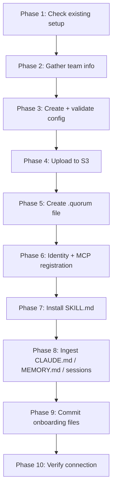

# Project Onboarding Protocol

Full 10-phase protocol for connecting a project to Quorum. Execute each phase using
your available tools (Bash, Read, Write). Only ask the human when explicitly noted.

---

## Phase 1 — Check for existing setup

```bash
ls -la .quorum quorum.config.json .claude/skills/quorum.md 2>/dev/null
```

If `.quorum` already exists → confirm with human before continuing. The `project_id`
in that file is the active namespace; re-onboarding overwrites the config in S3.

---

## Phase 2 — Gather team information

Ask the human in **one prompt**:

> "To onboard this project I need:
> 1. **Project ID** — short slug e.g. `platform-team` (default: current directory name)
> 2. **Team members** — for each: name, GitHub username, git email, role
>    (`principal_architect` | `senior_engineer` | `engineer` | `junior`)
> 3. **Key domains** — any domain needing stricter governance e.g. `auth`, `payments`
>    (optional — standard thresholds apply otherwise)
> 4. **Gateway URL** — where Quorum gateway is running (default: `http://localhost:3001`)"

Do not proceed until you have at least a project ID and one team member.

---

## Phase 3 — Create and validate config

Write `quorum.config.json`:

```json
{
  "project": "<project_id>",
  "group_id": "<project_id>",
  "members": [
    {
      "name": "<name>",
      "team": "<team>",
      "role": "<role>",
      "github_username": "<github_username>",
      "git_email": "<git_email>"
    }
  ],
  "roles": {
    "principal_architect": { "base_confidence": 0.90 },
    "senior_engineer":     { "base_confidence": 0.80 },
    "engineer":            { "base_confidence": 0.70 },
    "junior":              { "base_confidence": 0.60 }
  },
  "domains": {},
  "thresholds": {
    "conflict_threshold": 0.85,
    "authority_threshold": 0.20
  }
}
```

Add domain overrides if provided:
```json
"auth": { "conflict_threshold": 0.90, "required_reviewer_teams": ["platform"] }
```

Validate before uploading:
```bash
GATEWAY_URL="${QUORUM_GATEWAY_URL:-http://localhost:3001}"
curl -s -X POST "$GATEWAY_URL/config/validate" \
  -H "Content-Type: application/json" \
  -d @quorum.config.json
```

If `"valid": false` → fix errors in the response, re-validate. Do not continue until `"valid": true`.

---

## Phase 4 — Upload config to S3

```bash
PROJECT_ID=$(node -e "console.log(require('./quorum.config.json').project)")

# Local dev (LocalStack)
awslocal s3 cp quorum.config.json \
  "s3://quorum-configs/${PROJECT_ID}/config.json" \
  --endpoint-url http://localhost:4566

# Verify
awslocal s3 ls "s3://quorum-configs/${PROJECT_ID}/" --endpoint-url http://localhost:4566
```

For production (real S3) omit `awslocal` and `--endpoint-url`:
```bash
aws s3 cp quorum.config.json "s3://quorum-configs/${PROJECT_ID}/config.json"
```

---

## Phase 5 — Create the `.quorum` discovery file

```bash
node /path/to/quorum/cli.js init \
  --gateway-url "${QUORUM_GATEWAY_URL:-http://localhost:3001}" \
  --project-id "$PROJECT_ID" \
  --yes
```

This writes `.quorum` to the current directory. The MCP server auto-discovers it
by walking up the directory tree — no manual env vars needed.

---

## Phase 6 — Identity and MCP registration

Tell the human what to set in their shell profile:

```bash
# Most authoritative — verifies via GitHub API
export QUORUM_GITHUB_TOKEN=ghp_...

# CI contexts only (no PAT available)
# export QUORUM_AUTHOR=your-username
```

Then register the MCP server:
```bash
claude mcp add quorum -- node /path/to/quorum/src/server.js
```

Verify auth:
```bash
curl -s -X POST "${QUORUM_GATEWAY_URL:-http://localhost:3001}/auth/token" \
  -H "Content-Type: application/json" \
  -d "{\"github_token\":\"$QUORUM_GITHUB_TOKEN\",\"project_id\":\"$PROJECT_ID\"}"
# Expected: { "token": "eyJ...", "sub": "<github_username>", "project": "...", "role": "..." }
```

---

## Phase 7 — Install the Quorum skill

```bash
mkdir -p .claude/skills
cp /path/to/quorum/skill/SKILL.md .claude/skills/quorum.md
```

---

## Phase 8 — Ingest existing project knowledge

This is the highest-value step. CLAUDE.md, MEMORY.md, and session transcripts contain
institutional knowledge that should be governed — not just living in flat files.

**8a — CLAUDE.md**

```bash
cat CLAUDE.md 2>/dev/null || cat .claude/CLAUDE.md 2>/dev/null
```

Extract every statement that is a decision, constraint, pattern, or named convention.
Call `remember()` for each — classify by domain and key:

```javascript
remember("api", "error-standards",
  "All API errors follow RFC 7807 Problem Detail: type, title, status, detail", {
  confidence: 0.75,
  tags: ["api", "errors", "conventions"]
})
```

All entries enter as `DRAFT` with `triggered_by: onboard`.

**8b — MEMORY.md**

```bash
# Claude Code auto-memory location
cat ~/.claude/projects/$(echo $PWD | tr '/' '-')/memory/MEMORY.md 2>/dev/null
cat .claude/memory/MEMORY.md 2>/dev/null
```

Extract architecture choices, technology decisions, and constraints.

**8c — Recent session transcripts** (ask human first)

> "I can extract knowledge from your recent Claude Code session transcripts.
> Want me to do that? (I'll only read sessions from this project directory.)"

```bash
# Find recent sessions
ls -lt ~/.claude/projects/$(echo $PWD | tr '/' '-')/*.jsonl 2>/dev/null | head -5
```

Read the most recent 1–3 sessions. Look for decisions made with stated rationale.
Call `search()` first for each candidate — do not re-ingest what is already in Quorum.

---

## Phase 9 — Commit onboarding files

```bash
git add quorum.config.json .quorum .claude/skills/quorum.md
git commit -m "chore: onboard project to Quorum governed memory

- quorum.config.json: team members, roles, domain thresholds
- .quorum: gateway auto-discovery (walks up directory tree)
- .claude/skills/quorum.md: Quorum session skill for Claude Code"
```

Do not commit `.env` or files containing tokens.

---

## Phase 10 — Verify connection

Start a fresh Claude Code session in the project directory and run:

> "What pending Quorum decisions are there?"

Expected: `pending()` returns DRAFT entries from Phase 8, or "No pending items."

If Quorum is unreachable:
```bash
curl http://localhost:3001/health
# Expected: { "status": "healthy", "components": { "postgresql": "connected",
#   "graphiti": "connected", "falkordb": "connected", "s3": "connected" } }
```

---

## Summary


